# 了解 ResNet 及其变体

> 原文：<https://towardsdatascience.com/understanding-resnet-and-its-variants-719e5b8d2298?source=collection_archive---------36----------------------->

## 计算机视觉/深度学习社区中最具突破性的工作概述— ResNets

自从高计算单元的可用性以来，机器学习社区已经见证了向深度学习实践的范式转变，以实现更好的结果，特别是在计算机视觉领域。一种有前途的方法是卷积神经网络。CNN 是传统神经网络的改进版本，它保持了空间维度的完整性。

在图像分类、目标检测等方面，CNN 已经超越了其他各种框架。因此是研究人员非常感兴趣的。为了使这种学习越来越准确，研究人员已经开始实现越来越深的卷积网络。

为训练选择正确的层数的话题已经讨论了很长时间，事实证明，建立一个更深的网络不会提高精度，反而会降低精度。是的，你没听错，当你在网络中堆积越来越多的单元时，网络的学习能力就饱和了，过了一个阈值，它就下降了。

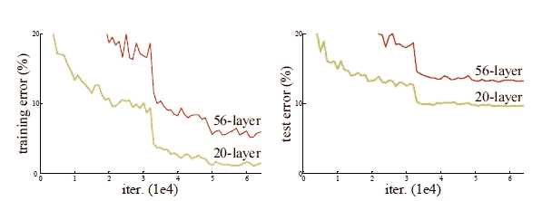

src: [用于图像识别的深度残差学习](https://arxiv.org/pdf/1512.03385.pdf)，测试和训练“普通”网络的错误

这种网络的精度下降而不是上升的两个基本原因是:

1.  消失/爆炸渐变
2.  退化问题

然而，第一个问题由标准化初始化和中间标准化层解决，这使得具有数十层的网络能够开始收敛于具有反向传播的随机梯度下降(SGD)。

但是当更深层次的网络开始融合时，他们观察到了退化问题。随着网络深度的增加，精度达到饱和，然后迅速下降。有助于消除这种退化问题的一种方法是添加带有身份映射的附加层。

**ResNet** [1]介绍了这些跳过一层或多层的**【身份映射】**或**【跳过连接】**，如图所示:

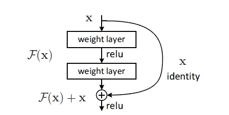

src: [用于图像识别的深度残差学习](https://arxiv.org/pdf/1512.03385.pdf)，具有身份映射的残差块

这个想法是，我们不只是将额外的层堆叠到网络中，而是将它们添加为剩余块(具有身份映射)。为了实现该方案中的结果，该工作的作者调整了底层映射，并使非线性层学习该映射:

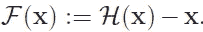

src: [用于图像识别的深度残差学习](https://arxiv.org/pdf/1512.03385.pdf)

代替传统的映射 H(x ),并且原始映射被重铸为:

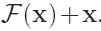

src: [用于图像识别的深度残差学习](https://arxiv.org/pdf/1512.03385.pdf)

引入这些快捷连接的另一个好处是，它们不会添加任何额外的参数，也不会增加计算复杂度，因为它们被用作身份映射。然而，它们确保了较深的网络和较浅的网络表现一样好。

最初提议的 ResNet 结构如下:

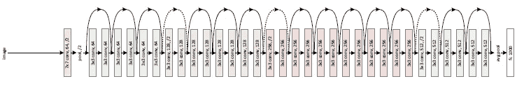

src: [用于图像识别的深度残差学习](https://arxiv.org/pdf/1512.03385.pdf)，最初提出 ResNet

这里需要注意的一点是那些虚线，表示线性投影。理想情况下，为了执行身份映射，F(x)和 X 的维数必须相同，但是当情况不是这样时，我们使用投影向量 Ws 来帮助匹配维数。

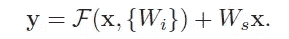

src: [用于图像识别的深度残差学习](https://arxiv.org/pdf/1512.03385.pdf)

另一项研究旨在确定何时应该引入这些“跳过连接”!

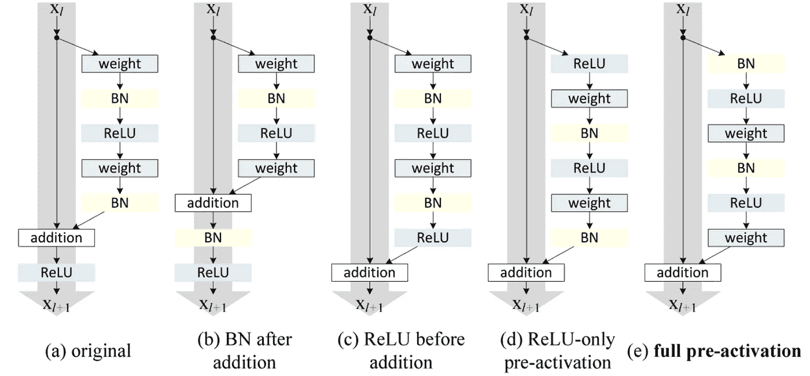

src: [深度剩余网络中的身份映射](https://arxiv.org/pdf/1603.05027.pdf)，各种风格的 ResNet 块

在得到具有完全预激活的剩余块的最终版本，即上图中的(e)之前，测试和尝试了每种可能的组合。

由于其引人注目的结果，ResNet 很快成为各种计算机视觉任务中最受欢迎的架构之一。

# **resnet 的流行变种**

随着 ResNets 越来越受欢迎，人们对其架构进行了大量研究，研究人员提出了最初提出的工作的不同变体。

## ResNeXt

在原始工作的基础上，提出了一个名为**ResNeXt**【2】的替代方案，其构建模块如下:

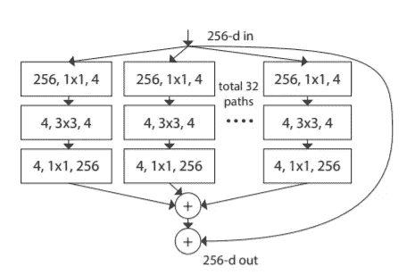

src: [深度神经网络的聚合残差变换](https://arxiv.org/pdf/1611.05431.pdf)

该模型采用了重复层的重组策略，同时以一种简单、可扩展的方式结合了拆分-转换-合并策略。该块可能看起来类似于 Inception network [3]，其中我们执行各种不同的转换(1x1 Conv、3x3 Conv、5x5 Conv、MaxPooling)并将它们堆叠在一起，而这里我们通过将它们相加来合并不同的转换。

这种类型的块引入了另一个维度**基数**——独立路径的数量，以及现有的高度和深度维度。该维度的重要性已被其作者通过实验证明，“增加基数是比更深或更宽更有效的获得准确性的方式”，尤其是当深度和宽度开始给现有模型带来收益递减时。

提议的构件有三种可能的变化:

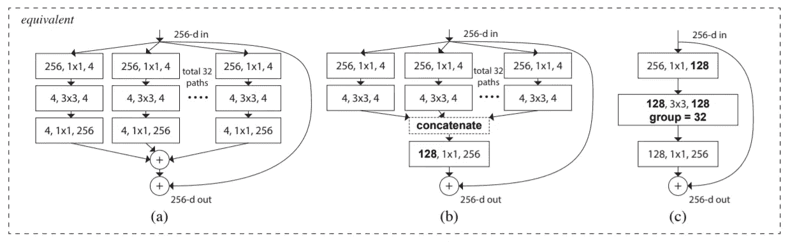

src: [深度神经网络的聚合残差变换](https://arxiv.org/pdf/1611.05431.pdf)，ResNeXt 的等效块

作者还指出，该模型比不同数据集上的 Inception [3]网络更容易训练，因为它只有一个超参数要调整，而不像 Inception 中有更多的超参数要调整。

## DenseNet

ResNet 的另一个流行变体是**dense net**【4】，作者试图通过建立额外的连接来解决渐变消失的问题。在 DenseNet 中，它们通过将所有层直接相互连接来确保网络中各层之间的最大信息流。为了保持前馈性质，每一层从所有前面的层获得额外的输入，并将它自己的特征映射传递给所有后面的层。该模型如下所示:

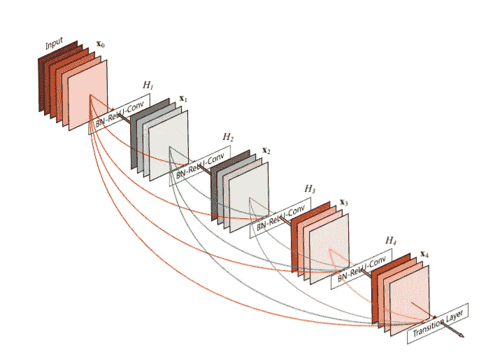

src: [密集连接的卷积网络](https://arxiv.org/pdf/1608.06993.pdf)，相互连接的 DenseNet 层

除了处理消失梯度，作者还认为，这种实现方式可以实现要素重用，使网络具有很高的参数效率。在传统模型中，每一层都充当一个状态，它从前一个状态读取数据，并写入下一层。它改变了状态，但也传递了需要保存的信息。

DenseNet 架构明确区分添加到网络中的信息和保留的信息，最终分类器基于网络中的所有特征图做出决定。除了更好的参数效率，DenseNet 还通过网络提供了改进的信息流和梯度，这使其易于训练。

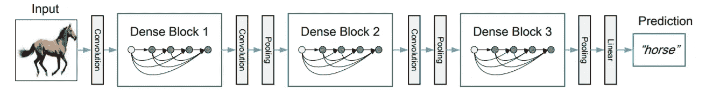

src: [密集连接卷积网络](https://arxiv.org/pdf/1608.06993.pdf)，三个密集块的深度 DenseNet。

第 *l* 层接收来自其所有先前层的特征图作为输入:

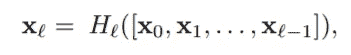

src: [密集连接的卷积网络](https://arxiv.org/pdf/1608.06993.pdf)

其中[..]表示连接操作。为了便于在网络中进行缩减采样，它被划分为多个部分，如上所示，中间有过渡图层。过渡层由批量标准化层、卷积层和最大池层组成。

由于其紧凑的内部表示和减少的特征冗余，DenseNets 可能是基于卷积特征的各种计算机视觉任务的良好特征提取器。

我希望它能帮助读者加深对这部开创性作品的理解。

这篇文章的所有图表都取自参考文献中的原文。

# 参考资料:

[1].贺国强，张晓霞，任世荣，孙军。用于图像识别的深度残差学习。arXiv 预印本 arXiv:1512.03385，2015。

[2].谢，吉希克，杜鹏，涂振宇和何国光。深度神经网络的聚合残差变换。arXiv 预印本 arXiv:1611.05431v1，2016。

[3].塞格迪、刘华清、贾庆林、塞尔马内、里德、安盖洛夫、埃汉、万霍克和拉宾诺维奇。用回旋越走越深。IEEE 计算机视觉和模式识别会议论文集，第 1–9 页，2015。

[4].黄，刘，温伯格，马腾。密集连接的卷积网络。arXiv:1608.06993v3，2016。