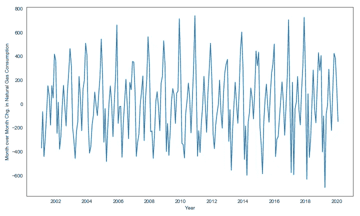
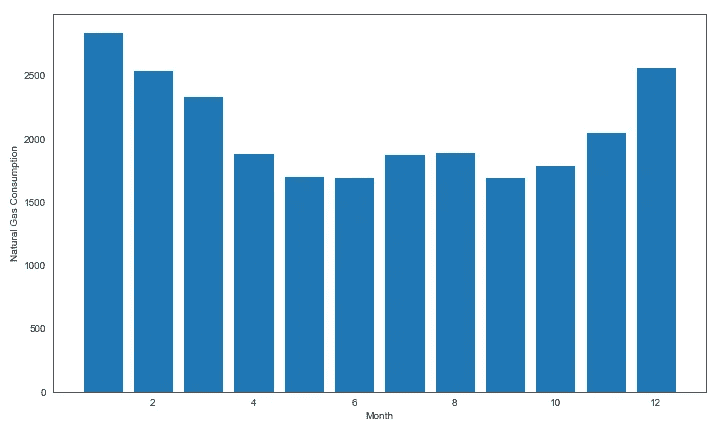
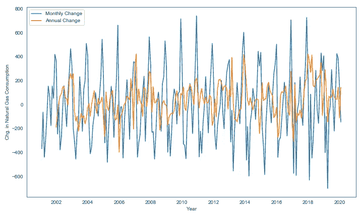
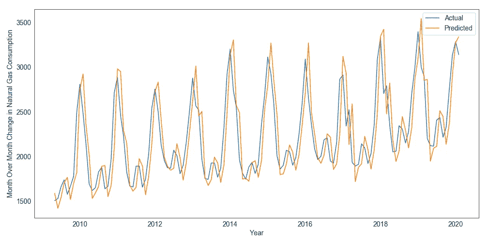
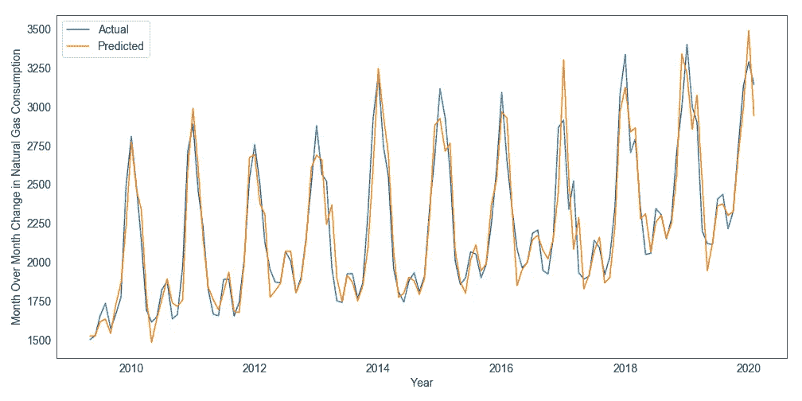
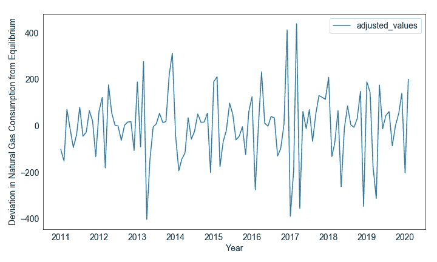

# 了解 SARIMA(更多时间序列建模)

> 原文：<https://towardsdatascience.com/understanding-sarima-955fe217bc77?source=collection_archive---------7----------------------->


[Mak](https://unsplash.com/@mak_jp?utm_source=medium&utm_medium=referral) 在 [Unsplash](https://unsplash.com?utm_source=medium&utm_medium=referral) 上拍照

## 我们调查了 ARIMA 的老大哥萨里玛是如何提高我们预测的准确性的

何前途未卜。但仍有一些事情我们可以合理地确定——圣诞节和感恩节每年都会到来，夏天充满了阳光明媚的日子和度假的家庭(至少过去是这样),每年二月健忘的男朋友和丈夫们会争抢巧克力和最后一束长茎玫瑰。

在分析时间序列时，季节很重要。某些事件每年都会发生:

*   假日
*   暑假
*   返校周
*   节日和年会
*   重大体育赛事
*   年度奖金

有些每月发生一次:

*   租金或抵押付款
*   信用卡账单
*   我们的工资支票(有些是双月一次)

甚至每周一次:

*   星期五(是的，像星期五这样普通的日子在模型中可能是一个具有统计意义的因素)
*   玉米卷星期二(开玩笑)

**因此，如果我们知道某件事情可能会以固定的节奏发生，并且每次发生时都会以类似的方式影响我们的目标变量，那么我们应该在构建模型时将其考虑在内。**在时间序列中，这种有影响的事件以恒定的频率重复出现被称为**季节性**。

# ARIMA 进修

[上一次，我写了很多关于 **ARIMA** 车型的内容(请先阅读)](/understanding-arima-time-series-modeling-d99cd11be3f8)，所以今天我只从高层次上介绍一下:

*   **AR** 代表**自回归**，是指使用我们的目标变量的滞后值进行预测。例如，我们可能使用今天、昨天和前天的销售数字来预测明天的销售。这将是一个 AR(3)模型，因为它使用 3 个滞后值进行预测。
*   **I** 代表**集成**。这意味着我们不是采用原始目标值，而是对它们进行差分。例如，我们的销售预测模型将尝试预测明天的销售变化(即，明天的销售减去今天的销售)，而不仅仅是明天的销售。我们需要这样做的原因是，许多时间序列表现出一种趋势，使得原始值不稳定。取差值会使我们的 Y 变量更加稳定。
*   **MA** 代表**移动平均线**。移动平均模型将滞后预测误差作为输入。与其他参数不同，它不是一个可直接观察到的参数(并且它不是固定的，因为它随模型的其他参数一起变化)。在高层次上，将模型的误差反馈给它自己有助于将它推向正确的值(实际的 Y 值)。

# **S:季节性**

在简介中，我们提到了为什么季节性很重要——如果我们知道由于假期，每个冬季都会出现销售高峰，那么我们就应该考虑到这一点。在这种情况下，我们肯定不想在没有对这种系统性峰值进行调整的情况下，将 2020 年 Q1 的销售额与 2019 年第四季度的销售额进行比较——如果不考虑季节性，我们会错误地认为销售额已经下降(我们公司陷入了大麻烦)，而实际上这只是预期的节后宿醉。

让我们来看一个具有明显季节性的时间序列，天然气消耗量:


天然气消费(资料来源:圣路易斯美联储银行)

这些反复出现的峰值证明了明显的季节性。如果我们尝试绘制月与月之间的变化，我们会得到一个类似的图。同样，我们一遍又一遍地看到相同的近似序列。



天然气消耗量的逐月变化

它总是周期性的，很容易预测，这意味着我们应该超越周期性(换句话说，调整它)。对于那些不熟悉天然气的人来说，定期出现消费高峰和低谷的原因是因为天然气的主要用途之一是供暖，而供暖需求随季节而变化(冬季月份更多):



每月天然气消耗量；寒冷月份消耗更多

让我们花一点时间思考一下，为什么我说我们应该超越这种周期性。如果我们知道天然气消费在每年一月达到高峰，在每年六月达到低谷，这对于一个模型来说还不够吗？如果你正在建立一个非常简单的模型，那么也许。但如果你想真正了解天然气消费背后的因素，那么你需要比“天然气用量每月变化”更深入。

看看下面的情节。我将数据切片，只包含 6 月份的数据点，然后计算变化。因此，这是一个同比变化，但仅在 6 月份——这是一个快速调整季节性的方法(因为我们是在跨年度比较同一个月)。缺点是我们被迫计算 1 年时间范围内的变化，这相当粗略。


天然气消费的年度变化(根据季节性调整的 6 月数据)

上图中的波动可能比之前的更有趣。因为我们比较的只是六月，所以差异一定是由于除了季节变化之外的其他因素造成的，比如经济因素、价格冲击或者异常炎热或寒冷的六月。通过研究该图(或同样经过季节性调整的类似图)并将其涨落与外部因素相关联，我们可以**更好地理解天然气消费中*超出正常水平*变化**的关键驱动因素。

在下图中，我绘制了 1 个月和 12 个月的变化，这样我们就可以了解相对幅度。请记住，1 个月的变化包括季节性，而 12 个月的变化，如 6 月至 6 月的变化，不包括:



天然气消耗量 1 个月和 12 个月变化的比较

从前面的图中可以明显看出，橙色线(12 个月的变化)比蓝色线(1 个月的变化)波动性小得多。这是另一个明确的指标，说明季节性驱动了我们数据中观察到的大部分差异。

# 使用 SARIMA 控制季节性

我们通常希望查看更高频率的数据，如每周或每月的变化。年度变化对于建立长期预测模型非常重要，但使用它们可能会导致我们错过理解此时此地所必需的粒度。

因此，我们不需要将回归的 Y 变量转换为年度变化，而是可以通过将它作为一个特征(X 变量)包含在我们的模型中来直接控制季节性。萨里玛就是这么做的。SARIMA 代表季节性自回归综合移动平均线(相当拗口)。它很像 ARIMA，但更强大。

我们可以使用 statsmodels 对 SARIMA 的实现。SARIMAX 函数的 3 个关键参数是:

*   原始数据(存储在名为 gas_df 的数据帧中)。看起来是这样的:

```
 date  values
0 2001-01-01  2677.0
1 2001-02-01  2309.5
2 2001-03-01  2246.6
3 2001-04-01  1807.2
4 2001-05-01  1522.4
```

*   与 arIMA 相似，order 参数是一个元组，它告诉函数 AR 滞后的数量、计算差值的时间步长的数量以及要包含在回归中的 MA 滞后误差的数量(按照该确切顺序)。
*   参数 search _ order 类似于 order，只是它用于指定季节性。search _ order 中的前 3 个值与 order 中的值相同(AR、差异范围、MA)，但最后一个值指定了定义季节性周期的时间长度。因此，如果我们认为重复的模式在一年中发生(就像我们的情况一样，从六月到六月的差异消除了季节性)，我们会将其设置为 12(因为我们数据中的每个时间步长为 1 个月)。

因为这是一个展示 SARIMA 的玩具模型，所以我不做火车测试分割，也不做模型的任何样本外压力测试。

```
from statsmodels.tsa.statespace.sarimax import SARIMAXs_mod = SARIMAX(gas_df['values'], 
                order=(1,1,0), 
                seasonal_order=(0,0,0,1))
predictions = s_mod.fit().predict()
```

首先，让我们看看一个简单的 AR(1)模型是如何处理这些数据的(AR(1)意味着我们只使用 Y 变量的最新滞后值进行 Y 预测)。在前面的代码块中，我将 search _ order 中的最后一个值设置为 1(因此没有特殊的季节性时间步长)，这相当于一个 AR(1)模型，因为我删除了 MA 和季节性组件。

请注意预测值(橙色线)似乎总是比实际值(蓝色线)慢一步。这是 AR 模型的一个经典问题——当你只有过去可以继续时，趋势的根本转变几乎不可能预测。



AR(1)预测

既然我们观察到了天然气消费的常规年度周期，让我们看看是否加入季节性因素会有所改善。我们通过将 seasonal_order 参数更改为(1，0，0，12)来实现这一点，这为我们提供了一个季节性滞后，这意味着我们使用一年前的值(12 个滞后)来进行预测。请注意，为了隔离季节性的影响，我删除了订单参数中的 AR 滞后。

```
from statsmodels.tsa.statespace.sarimax import SARIMAXs_mod = SARIMAX(gas_df['values'], 
                order=(0,1,0), 
                seasonal_order=(1,0,0,12))
predictions = s_mod.fit().predict()
```

这是考虑了季节性因素的萨里玛预测。顺便说一下，相对于 statsmodels 中的 ARIMA，SARIMAX 的一个优点是 predict 方法的输出是目标变量本身的预测值。而对于 ARIMA，预测方法的输出是目标变量的预测变化(因此您需要做额外的调整来获得原始值)。



萨里玛预测

请注意更好的拟合。橙色线不再滞后；它现在紧紧地覆盖在蓝线上。太好了！

出于好奇，我们实际上可以用 AR(12)模型获得类似的结果。AR(12)包括足够的滞后来捕捉时间序列的季节性，但需要我们估计额外的 11 个 beta(滞后 1 到 11 的 beta ),所以它更容易过度拟合。

# 把所有的放在一起

酷，这些线重叠了(由于包含了季节性，这意味着我们的 SARIMA 预测覆盖了实际情况)。那又怎样？

我们可以做两件事之一。要么我们可以在 SARIMA 模型中加入其他因素来解释剩余(无法解释的)方差，要么我们可以创建一个季节性调整的序列，换句话说，一个新的 Y 变量。这两者在精神上是相似的，但我一般更倾向于第二种方式。喜欢绘图，看时间序列；这有助于我理解他们。

所以让我们采用后一种方法。我们可以通过从实际观察值中减去我们的 SARIMA 模型的输出(蓝线减去橙线)来创建天然气消费的季节性调整版本。

```
gas_df['adjusted_values'] = gas_df['values'] - predictions
```

这是可行的，因为我们的 SARIMA 模型的输出(其中唯一的因素是季节性)可以被认为是“天然气消费水平，其中季节性可以变化，但所有其他因素保持不变”。因此，任何偏离这一均衡季节性水平的现象都必定是由其他因素造成的。这是季节性调整后的情况:



实际非季节性平衡天然气消耗量

我们可以通过将调整后的值与我们知道相对不受季节性影响的时间序列(天然气消耗量的年度变化)进行比较来检验这一点。下表显示了 12 个月的变化、1 个月的变化(受季节性影响)和我们的调整值之间的相关性:

```
 gas_chg12       gas_chg1      adjusted_values
gas_chg12         1.000000       0.199713      0.506134
gas_chg1          **0.199713**       1.000000      0.511884
adjusted_values   **0.506134**       0.511884      1.000000
```

请注意调整值和 12 个月变化之间的相关性更高(0.5 比 0.2)。相关性不接近 1 是没问题的，因为 12 个月的变化对于季节性调整来说有点粗糙，所以我们不想精确地重现它。

酷，现在我们知道，如果我们在时间序列数据中发现重复的季节性模式，我们可以使用 SARIMA 来解释它。祝你好运预测！干杯！

[***如果你总体上喜欢这篇文章和我的写作，请考虑通过我在这里的推荐链接注册 Medium 来支持我的写作。谢谢！***](https://tonester524.medium.com/membership)