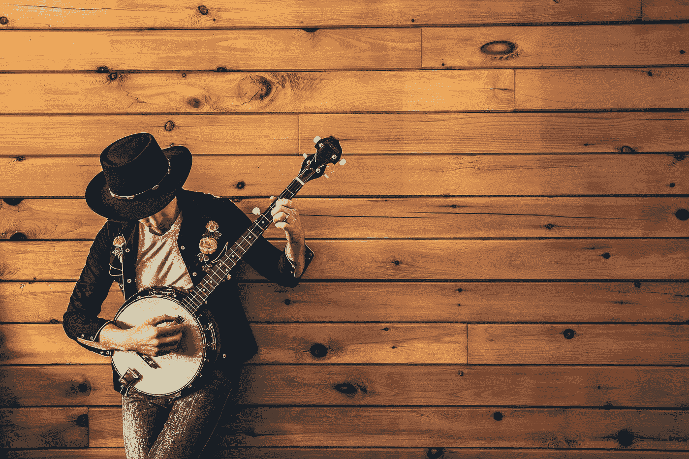
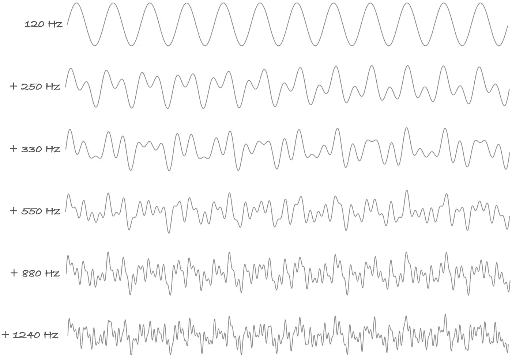
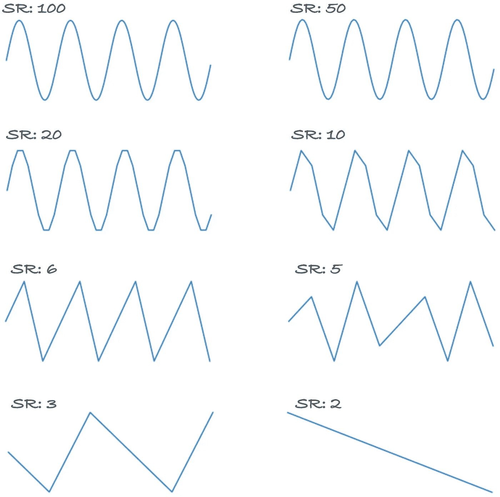
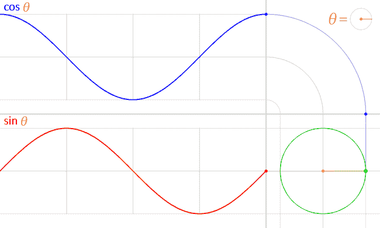
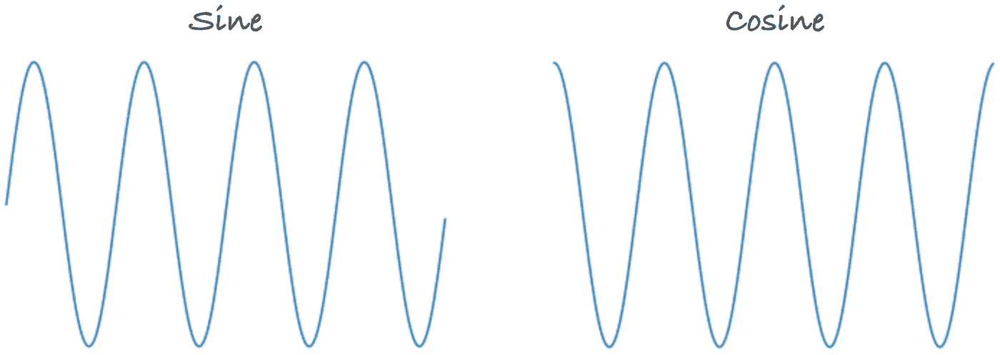
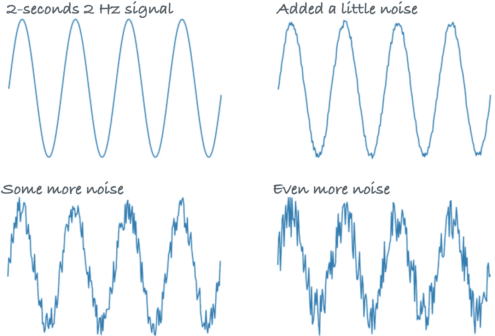

# 理解信号。没那么复杂。

> 原文：<https://towardsdatascience.com/understanding-signals-its-not-that-complicated-7f2b157da9c7?source=collection_archive---------23----------------------->

## 信号导论。为你的下一个机器学习项目产生信号。

图片由来自 [Pixabay](https://pixabay.com/?utm_source=link-attribution&utm_medium=referral&utm_campaign=image&utm_content=349790) 的 [Ryan McGuire](https://pixabay.com/users/RyanMcGuire-123690/?utm_source=link-attribution&utm_medium=referral&utm_campaign=image&utm_content=349790) 拍摄

即使对科学家来说，信号处理似乎也是极其复杂的事情。即使没有完全意识到它的潜在存在，信号处理也是我们日常生活的核心。本文将探讨什么是信号，我们如何生成信号，并在 Numpy 中存储信号以进行机器学习。

声音是一种波，由声波穿过的介质粒子的来回振动产生。这些声波由高压和低压区域的重复模式组成。它们也被称为压力波。

正弦波的一个例子。

当我们听到一些东西时，我们的大脑会将耳朵听到的这些空气分子的运动转化为我们可以识别的东西。无论是歌词还是音乐，鸟鸣声还是汽车喇叭声。

通常，当我们描述声音时，我们指的是它们的频率。我们以赫兹(Hz)为测量单位，通过每秒的周期数来测量这些波。

例如，这是一个 440 Hz 的声波，钢琴上中央 C 以上的 A 音符的声音:

MediaCollege 的 440 Hz 音频音调([右击并在新标签页中打开](https://www.mediacollege.com/audio/tone/files/440Hz_44100Hz_16bit_05sec.mp3))

如果我们测量这种声音，并将其转换成时间函数的数字信号。这是我们将得到的曲线图，一个 440 Hz 的正弦波。它在平衡时上下摆动，每秒钟摆动 440 次。

1/10 秒的 440 赫兹。

我们再来看另一个声波，250 Hz，听起来像这样:

MediaCollege 的 250 Hz 音频音调([右键单击并在新标签中打开](https://www.mediacollege.com/audio/tone/files/250Hz_44100Hz_16bit_05sec.mp3)

250 赫兹的音调比 440 赫兹的音调低。如果我们要绘制它，它将看起来类似于 440 Hz 波，但频率较低。它每秒振荡 250 次。

1/10 秒的 250 赫兹。

单个声波本身并不令人兴奋。但是当我们把几个频率组合起来，按正确的顺序演奏，我们就能产生音乐。我们用声带发出这些声波来说我们用来交流的话。

当我们将两个频率组合在一起播放时，新的声波就是两个声波之和。我们得到的是一个不是纯正弦波的新波。在某些点，峰值相加变得更高，而其他点相互抵消，结果为零。

合并两个正弦波产生一个新的波。

我们可以增加更多的声音频率；声波会越来越复杂。事实上，这些复杂的声波正是我们的麦克风所拾取的。我们的麦克风在任何时候都能拾取许多不同的频率；最终的录音是所有声音频率的总和。除了那些你实际上想要记录的声音，它还拾取背景噪声、回声，甚至一些电信号噪声。

随着频率的增加，波变得更加复杂。

尽管这些例子是关于声波的，但这些概念也适用于其他数字信号，如心电图和脑电图。了解我们如何在脑机接口应用中使用信号:

 [## 用机器学习和神经科学解码大脑信号

### 成为 X 教授，解开我们心灵的秘密

towardsdatascience.com](/decoding-brain-signals-with-machine-learning-and-neuroscience-bee288c1d585) 

# 那么我们如何以数字方式存储信号呢？

由于模拟信号在时间和幅度上都是连续的，我们需要将信号在时间和幅度上都简化为离散时间信号。这个信号减少过程就是呼叫采样。采样率定义了一秒钟内数据点的数量，也就是采样的速度。

采样率决定了信号的保真度。每个信号都有一个最小采样率，以保存信号中包含的信息。根据[奈奎斯特–香农采样定理](https://en.wikipedia.org/wiki/Nyquist%E2%80%93Shannon_sampling_theorem)，采样率必须至少是信号最大频率的两倍，才能完全呈现信号。这意味着，如果信号包含高频成分，我们将需要以更高的速率进行采样。

理论上，只要奈奎斯特极限(采样速率的一半)超过被采样信号的最高频率，原始模拟信号就可以无损重建。否则，信号信息可能不会被完全表示，其中一些原始信号频率可能会丢失。这将导致被称为“[混叠](https://en.wikipedia.org/wiki/Aliasing)的听觉假象，这是重构信号中不需要的成分。

让我们来看看当采样率太低时会发生什么。

持续 2 秒钟的 2 Hz 信号，具有不同的采样率(SR)

上图显示了持续 2 秒钟的 2 Hz 信号；它总共有四次振动，每秒两次。当采样率为 50 和 100 时，波形看起来非常好，因为有足够的数据点。我们开始在 10 和 20 采样速率下看到信号边沿，但仍能清楚地看到四个正峰值。当采样率低于 6 时，信号开始丢失一些信息。

因为人类可以听到 20-20，000 赫兹的范围；这就是为什么音频波形和早期专业音频设备制造商选择 44.1kHz 的采样速率，这是许多数字格式的“标准”采样速率。提高采样率通常会提高音质，但也会增加存储所需的磁盘空间。许多电话和对讲机信号在 8，000 Hz 上传输，以减小分组大小来改善传输。

对于机器学习，以更高的频率采样会产生更好的重构信号，从而产生更好的性能。然而，这需要更快的 CPU/GPU 来转换和处理信号，并且需要更大的 GPU 内存，因为随着输入的增加，它也会增加模型的大小。因此，我们必须权衡每个应用程序的优点和缺点，并了解其中的利弊。

到目前为止，我们已经看到了单通道信号。但实际应用中的信号可能有多个通道。例如，我们在音频中有两个声道，左声道和右声道。在脑电图和心电图中，我们可以有十个或更多的通道。Neuralink 旨在建立一个拥有数千个通道的一体化脑机接口平台。

# 生成一些信号(用 Python)

我们可以用三个参数生成信号，1)信号持续时间、采样率和频率。

因为我们将信号存储为数字序列，所以首先，我们需要信号的数据点数。这可以通过将信号持续时间乘以采样速率来实现。接下来，我们需要一个时间变量，一个随时间变化的函数，它允许我们为每个数据点生成波形。

我们可以用正弦/余弦周期函数产生正弦或余弦波。正弦函数跟踪围绕单位圆运动的点的 y 坐标，而余弦函数跟踪 x 坐标。

展示正弦函数和余弦函数如何被绘制到单位圆上的一点的动画。[摘自[维基百科](https://en.wikipedia.org/wiki/Sine)

使用任何一个函数都会产生一个相似但不同的波。

正弦波和余弦波。

为了创建更真实的信号，我们还可以通过向每个数据点添加随机值来给生成的信号添加噪声。这允许我们测试我们的模型从噪声数据集进行归纳和学习的能力。

具有不同噪声水平的 2 Hz 信号。

回顾前面的章节，一个点的值是所有频率的总和。如果我们想要产生一个包含多个频率的信号，我们可以简单地将每个产生的波形相加。下面是一些生成信号的例子；每一波都增加了前一波的频率:

将不同的频率添加到波形中。

最后，多声道信号的一个例子:

向多个通道添加不同的波形。

如果你打算生成一些信号，这里有来自[火炬信号](https://github.com/jinglescode/torchsignal)包的代码。

使用此代码，您可以生成自己的数据集，其中输入要素是原始信号(带噪声)，预测输出是频率。

由于我目前正在攻读博士学位，从事[脑机接口](https://jinglescode.github.io/2020/03/03/fascinating-relationship-between-ai-neuroscience/)的研究，我做了一个包含信号处理常用代码的 repo。该软件包包括清除信号和其他信号处理技术的功能。请随意检查并开始这个回购，火炬信号。

 [## 京乐码/火炬信号

github.com](https://github.com/jinglescode/torchsignal) 

寻找合作者来贡献新的特性、实用功能、错误修复和文档。目前，我一个人在做这个。如果您正在从事信号处理或脑机接口方面的工作，并且渴望构建一个高质量的包来将 PyTorch 应用于信号处理领域，那么请[联系我](https://www.linkedin.com/in/jingles/)。

生成信号有助于创建理想的数据集，以在“实验室环境”中测试模型的性能在下一篇文章中，我将介绍我们如何过滤和清理机器学习模型的信号。

