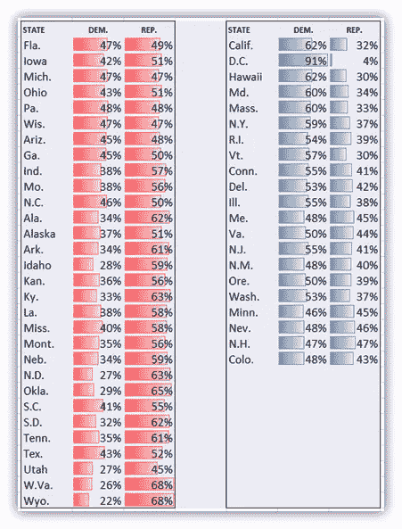
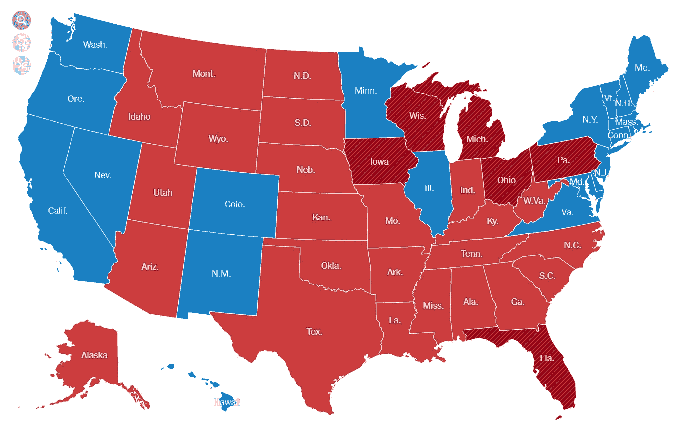

# 利用美国总统选举了解辛普森悖论

> 原文：<https://towardsdatascience.com/understanding-simpsons-paradox-using-2016-us-presidential-elections-8b7c093bb105?source=collection_archive---------23----------------------->

## 如果数据分析不正确，见解可能会产生误导

本·怀特在 [Unsplash](https://unsplash.com?utm_source=medium&utm_medium=referral) 上的照片

# 数据谬误

数据是决策的一大利器。但是，如果使用不当，它可能是一把双刃剑。从“抽样偏差”到“虚假因果关系”(相关性并不意味着因果关系)，有许多可能包含数据和分析的谬误。 [*【如何不犯错】*](https://www.barnesandnoble.com/w/how-not-to-be-wrong-jordan-ellenberg/1117225089)*[*【如何用统计数字撒谎】*](https://www.barnesandnoble.com/w/how-to-lie-with-statistics-darrell-huff/1122048199)[*【数理统计】*](https://www.barnesandnoble.com/w/innumeracy-paulos/1103166772) 都是教育我们认识这些谬误的好读物。解释数据时要注意这些。*

*考虑一下这个场景。这是一个星期五的晚上，你打算去看电影。归结为两部电影。电影 P 和电影 x。你决定查看评论。电影 P 说 90%的用户喜欢。电影 X 在同样的指标上有 82%。你决定看电影 P，因为，很明显！但是，如果你得到进一步的信息，电影 P 只有 10 个用户评价，而电影 X 有 10000 个用户评价，那该怎么办呢？这会改变你的决定吗？大概吧！例子还可以继续。关键是，在分析数据时，你需要小心这种不一致，即使是在简单的日常决定中，比如决定一部电影，或者做出更复杂的决定，比如选择什么职业或者搬到哪个城市。永远保持好奇心去深入挖掘！现在让我们试着理解这样一个谬误。*

# *辛普森悖论*

## *唐纳德·特朗普 vs 希拉里·克林顿*

*在我们进入辛普森悖论的技术定义之前，让我们回到 2016 年 11 月，试着回忆一下美国总统大选。你还记得唐纳德·j·特朗普是如何击败希拉里·克林顿赢得选举的吗？好吧。现在，让我们更深入地了解投票总数(大众投票)及其百分比份额。*

*请看下表，每一个州的民众投票的百分比。左侧列出的州是拥有较高共和党(REP)选票份额的州，右侧列出的州是拥有较高民主党(DEM)选票份额的州。如果我们看一下，我们会看到近 30 个州共和党占多数，约 20 个州民主党占多数。我们会得出结论，共和党人(红色)显然拥有更高的大众选票，对吗？不这么认为？继续滚动！*

**

*每个州和政党的民众投票(来源:[《纽约时报》](https://www.nytimes.com/elections/2016/results/president))*

*也许看看下面的地图会有帮助！红色的州是共和党占多数，蓝色的州是民主党占多数。多数票是根据该州较高的民众投票决定的。与上面的投票表一致，下面的地图加强了我们最初的信念，即共和党(红州)的投票份额更高。*

**

*2016 年选举结果图显示各州获胜者(来源:[《纽约时报》](https://www.nytimes.com/elections/2016/results/president))*

*现在，让我们来看看实际的总票数。*

***川普(共和党/红色):**6290 万 **(45.9%)***

***希拉里(民主党/蓝色):**6580 万 **(48%)***

*是的，希拉里·克林顿比唐纳德·特朗普更受欢迎。这种数据汇总时趋势反转的现象，基本上就是辛普森悖论。在分析中避免此类问题的关键是寻找不一致或缺失的数据。在这种情况下，每个州的投票人口(样本大小)。*

> ***辛普森悖论**，也有其他几个名字，是概率统计中的一种现象，一种趋势出现在几组不同的数据中，但当这些组组合在一起时就会消失或逆转。*
> 
> *来源:维基百科*

*唉！他们用“选举人票”而不是“大众票”来决定获胜者！*

*如果这引起了你的兴趣，在这篇[发表的论文](http://ftp.cs.ucla.edu/pub/stat_ser/r414.pdf)或斯坦福大学的哲学百科全书中阅读更多关于辛普森悖论的内容。我将在本文的后续部分写更多类似的谬误，敬请关注！*

*非常感谢您的阅读！我希望这能对你有所帮助。如果你有什么建议，请告诉我。请随时在 [LinkedIn](https://www.linkedin.com/in/suraj-malpani/) 或我的[网站](https://surajmalpani.github.io/)上与我联系。我将在数据科学中发布类似的数据谬误和有趣的趋势，敬请关注！*

***参考文献:***

* [## 2016 年总统选举结果:唐纳德·j·特朗普战胜希拉里·克林顿

### 直播总统选举结果和地图。

www.nytimes.com](https://www.nytimes.com/elections/2016/results/president)  [## 辛普森悖论

### 辛普森悖论，也有其他几个名字，是概率和统计中的一种现象，其中…

en.wikipedia.org](https://en.wikipedia.org/wiki/Simpson%27s_paradox)*