# 理解奇异值分解及其在数据科学中的应用

> 原文：<https://towardsdatascience.com/understanding-singular-value-decomposition-and-its-application-in-data-science-388a54be95d?source=collection_archive---------0----------------------->

## 了解奇异值分解背后的直觉

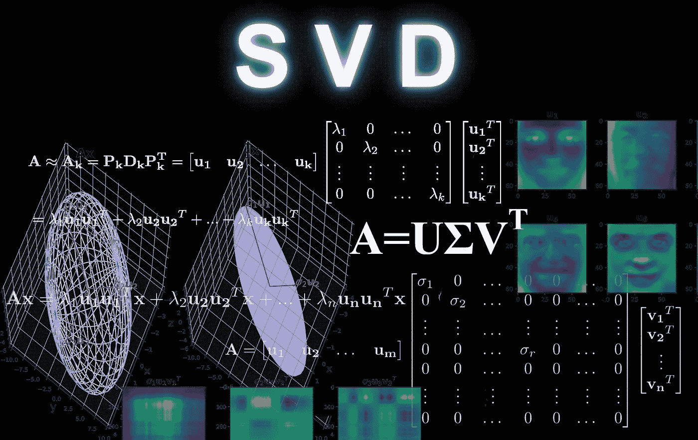

在线性代数中，矩阵的奇异值分解(SVD)是将该矩阵分解成三个矩阵。它有一些有趣的代数性质，传达了关于线性变换的重要几何和理论见解。它在数据科学中也有一些重要的应用。在本文中，我将尝试解释支持向量机背后的数学直觉及其几何意义。我将使用 Python 库来进行计算，而不是手动计算，稍后我将为您提供一些在数据科学应用程序中使用 SVD 的示例。本文中，粗体小写字母(如 **a** )指代向量。粗体大写字母(如 **A** )指矩阵，斜体小写字母(如 *a* )指标量。

要理解 SVD，我们需要首先理解矩阵的*特征值分解*。我们可以把矩阵 **A** 想象成一个[变换](https://en.wikipedia.org/wiki/Transformation_matrix)通过乘法作用于向量 **x** 产生一个新的向量 **Ax** 。我们用[ **A** ]ij 或 *aij* 来表示矩阵 **A** 在第 *i* 行和第 *j* 列的元素。若 **A** 为 *m×p* 基体， **B** 为 *p×n* 基体，则基体积 **C** = **AB** (为 *m×n 基体*)定义为:

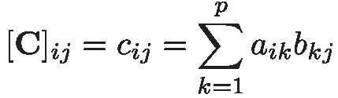

例如，二维空间中的旋转矩阵可以定义为:

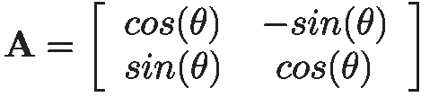

该矩阵将矢量绕原点旋转角度θ(正θ为逆时针旋转)。另一个例子是二维空间中的拉伸矩阵 **B** ，定义如下:

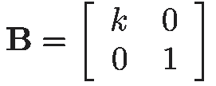

该矩阵以恒定的因子 *k* 沿 *x* 轴拉伸矢量，但在 *y* 方向上不影响矢量。同样，我们可以在 *y* 方向上有一个拉伸矩阵:

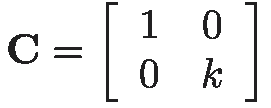

举个例子，如果我们有一个向量

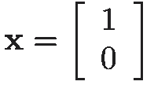

则 **y** = **Ax** 是 **x** 旋转θ后的矢量，而 **Bx** 是 **x** 在 *x* 方向上以恒定因子 *k 拉伸的矢量。*

清单 1 展示了如何将这些矩阵应用于 vector **x** 并在 Python 中可视化。我们可以用 NumPy 数组作为向量和矩阵。

这里，旋转矩阵是针对 *θ* =30⁰和拉伸矩阵 *k* =3 计算的。 **y** 是 **x** 的变换向量。为了绘制矢量，使用了`matplotlib`中的`quiver()`函数。图 1 显示了代码的输出。

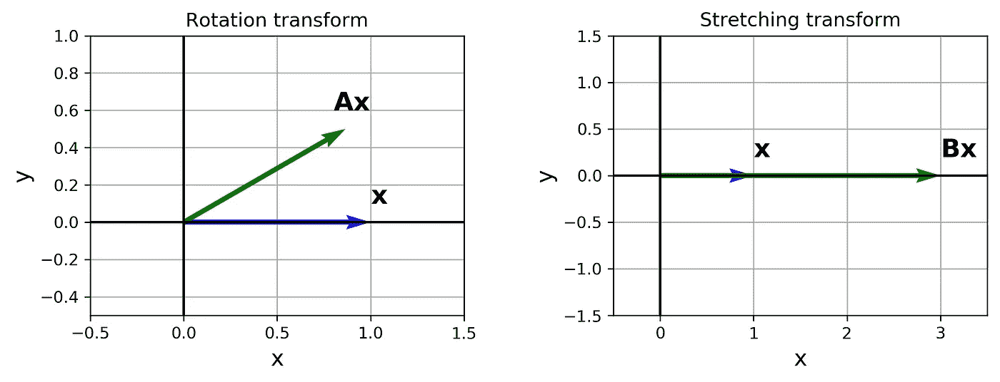

图 1

矩阵由 NumPy 中的二维数组表示。我们可以使用`np.matmul(a,b)`函数将矩阵`a`乘以`b`，然而，使用`@`操作符更容易做到这一点。向量可以用一个一维数组或一个二维数组来表示，其形状为行向量`(1,n)` 或列向量`(n,1)`。

现在我们要尝试一个不同的变换矩阵。假如

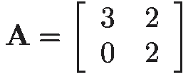

然而，我们不仅仅将它应用于一个向量。最初，我们有一个圆，包含所有距离原点一个单位的向量。这些向量的一般形式为

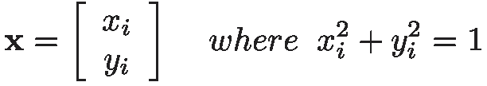

现在我们计算 **t** = **Ax** 。所以 **t** 是 **x** 中所有经过 **A** 变换的向量的**集合。清单 2 展示了如何在 Python 中实现这一点。**

图 2 显示了 **x** 和 **t** 的曲线图，以及在 **x** 中对两个样本向量 **x1** 和 **x2** 的变换效果。

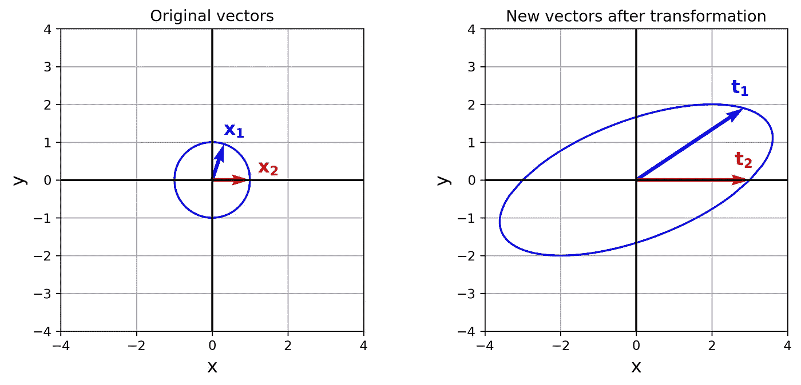

图 2

左边的初始向量( **x** )如前所述形成一个圆，但是变换矩阵不知何故改变了这个圆，把它变成了一个椭圆。

圆内的样本向量 **x1** 和 **x2** 分别转换为 **t1** 和 **t2** 。所以:

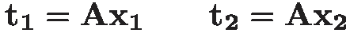

**特征值和特征向量**

矢量是既有大小又有方向的量。矩阵 **A** 对 **x** 中的向量的一般效果是旋转和拉伸的组合。例如，它改变向量 **x1** 的方向和大小，以给出变换后的向量 **t1** 。然而，对于矢量 **x2** 来说，变换后只有幅度发生变化。其实 **x2** 和 **t2** 方向一致。矩阵 **A** 只在同一个方向拉伸 **x2** 并给出幅度更大的向量 **t2** 。改变向量的大小而不改变其方向的唯一方法是将它乘以一个标量。因此，如果我们有一个矢量 **u** ，并且*λ* 是一个标量，那么 *λ* **u** 具有相同的方向和不同的大小。所以对于图 2 中的 **x2** 这样的向量，乘以 **A** 的效果就像是乘以 *λ这样的标量。*

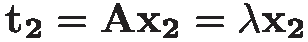

对于 **x** 中的所有矢量来说，情况并非如此。实际上，对于每个矩阵 **A，**只有部分向量具有这种性质。这些特殊向量称为 **A** 的特征向量，它们对应的标量λ称为该特征向量的 **A** 的特征值。因此一个 *n×n* 矩阵 **A** 的特征向量被定义为一个非零向量 **u** 使得:

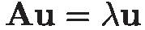

其中 *λ* 为标量，称为 **A** 的特征值， **u** 为 *λ* 对应的特征向量。此外，如果你有任何其他形式的向量*a*t【60】u 其中 *a* 是一个标量，那么通过把它放入前面的等式我们得到:

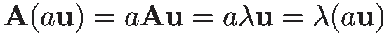

这意味着与特征向量 **u** 方向相同的任何向量(或者如果 *a* 为负，则方向相反)也是具有相同对应特征值的特征向量。

例如，的特征值


是 *λ1=-1* 和 *λ2=-2* ，它们对应的特征向量是:

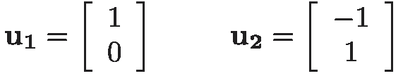

我们有:

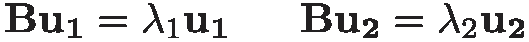

这意味着当我们将矩阵 **B** 应用于所有可能的向量时，它不会改变这两个向量(或任何具有相同或相反方向的向量)的方向，而只会拉伸它们。所以对于特征向量，矩阵乘法变成了简单的标量乘法。这里我不打算解释特征值和特征向量是如何用数学方法计算出来的。相反，我将向您展示如何在 Python 中获得它们。

我们可以使用 NumPy 中的`LA.eig()`函数来计算特征值和特征向量。它返回一个元组。这个元组的第一个元素是存储特征值的数组，第二个元素是存储相应的特征向量的 2-d 数组。事实上，在清单 3 中，`u[:,i]`列是特征值`lam[i]`对应的特征向量。现在，如果我们检查清单 3 的输出，我们会得到:

```
lam= [-1\. -2.]u= [[ 1\.     -0.7071]
    [ 0\.      0.7071]]
```

你可能已经注意到 *λ=-1* 的特征向量与 **u1** 的特征向量相同，但另一个不同。这是因为`LA.eig()`返回归一化的特征向量。归一化向量是长度为 1 的单位向量。但在解释如何计算长度之前，我们需要熟悉矩阵的转置和点积。

**转置**

列向量 **u (** 用 **u** 上标 t 表示)的转置是 **u** 的行向量(在本文中有时我表示为 **u** ^T).一个 *m×n* 矩阵 **A** 的转置是一个 *n×m* 矩阵，它的列由 **A** 的相应行组成。例如，如果我们有

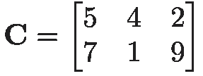

那么 **C** 的转置为:

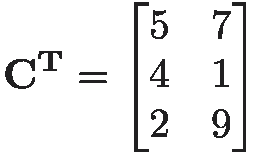

所以行向量的转置变成了具有相同元素的列向量，反之亦然。实际上，转置矩阵第 *i* 行第 *j* 列的元素等于原矩阵第**j 行第*I*列的元素。如此**


在 NumPy 中，你可以使用`transpose()`方法来计算转置。例如，为了计算矩阵`C`的转置，我们写`C.transpose().`我们也可以使用转置属性`T`，并写`C.T` 来得到它的转置。转置有一些重要的性质。一、 **A** 的转置的转置是 **A** 。所以:

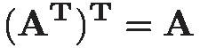

此外，产品的转座是逆序转座的产品。

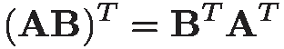

为了证明这一点，请记住矩阵乘法的定义:

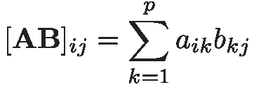

而根据矩阵转置的定义，左边是:

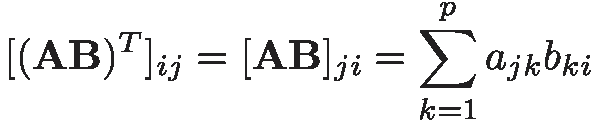

右边是

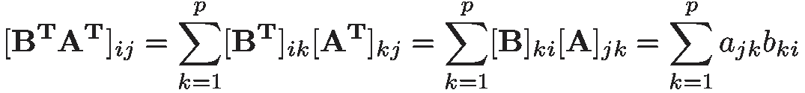

所以等式两边是相等的。

**点积**

如果我们有两个向量 **u** 和 **v** :

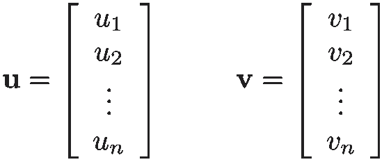

这些向量的点积(或内积)定义为 **u** 乘以 **v** 的转置:

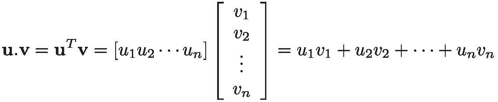

基于这个定义，点积是可交换的，所以:

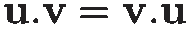

**分块矩阵**

当计算矩阵的转置时，将其显示为分块矩阵通常是有用的。例如，矩阵


也可以写成:

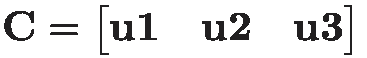

在哪里

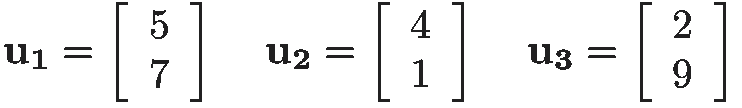

所以我们可以把 **C** 的每一列看成一个列向量， **C** 可以看成一个只有一行的矩阵。现在要写 **C** 的转置，我们可以简单地把这一行变成一列，类似于我们对一个行向量所做的。唯一的区别是 **C** 中的每个元素现在都是一个向量，也应该被转置。

现在我们知道了

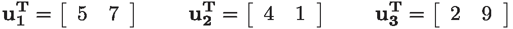

所以:

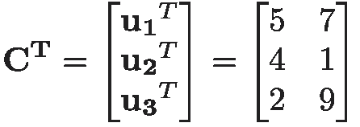

现在 **C** ^T 的每一行都是原矩阵 **C** 对应列的转置。

现在假设矩阵 **A** 是分块的列矩阵，矩阵 **B** 是分块的行矩阵:

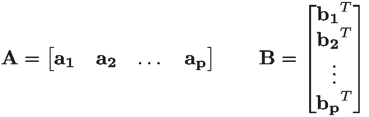

其中每列向量 **ai** 定义为 **A** 的第 *i* 列:

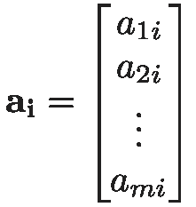

这里对于每个元素，第一个下标指的是行号，第二个下标指的是列号。所以 **A** 是一个 *m×p* 矩阵。另外， **B** 是一个 *p×n* 矩阵，其中 **bi** ^T 中的每一行向量是 **B** 的第 *i* 行:

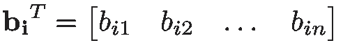

同样，第一个下标表示行号，第二个下标表示列号。请注意，通过对流，向量被写成列向量。所以要写一个行向量，我们把它写成列向量的转置。所以 **bi** 是一个列向量，它的转置是一个行向量，它捕获了 **B** 的第 *i* 行。现在我们可以计算 **AB** :

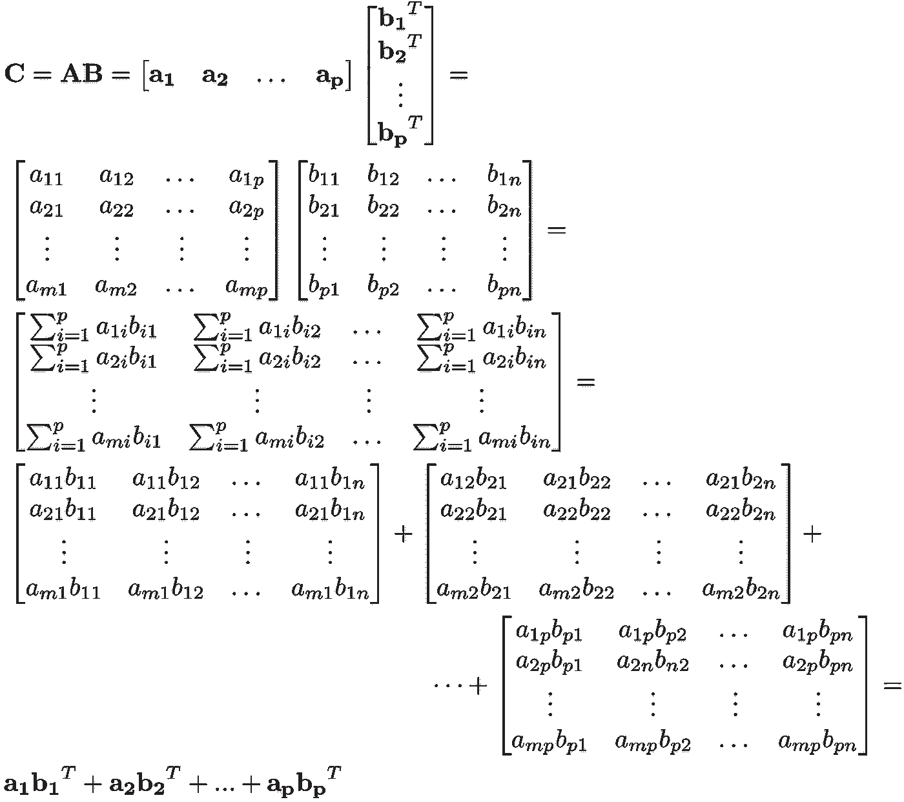

所以 **A** 的第 *i-* 第*列*和 **B** 的第 *i-* 行的乘积给出了一个 *m×n* 矩阵，所有这些矩阵相加得到 **AB** 也是一个 *m×n* 矩阵。事实上，我们可以简单地假设我们正在用一个行向量 **A** 乘以一个列向量 **B** 。作为特例，假设 **x** 是列向量。现在我们可以类似地计算 **Ax** :

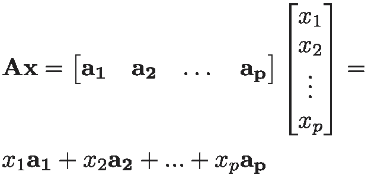

所以 **Ax** 只是 **A** 的列的线性组合。

要计算 NumPy 中两个向量`a`和`b`的点积，如果两者都是一维数组，我们可以写`np.dot(a,b)`，或者简单使用点积的定义，写`a.T @ b`。

现在我们已经熟悉了转置和点积，我们可以将向量 **u** 的长度(也称为 2 范数)定义为:

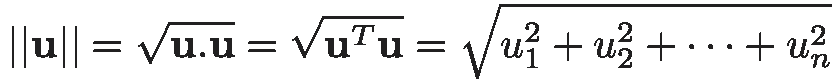

为了归一化一个向量 **u** ，我们简单地将它除以它的长度，得到归一化的向量 **n** :

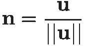

归一化向量 **n** 仍与 **u，**方向相同，但其长度为 1。现在我们可以归一化之前看到的 *λ=* -2 的特征向量:

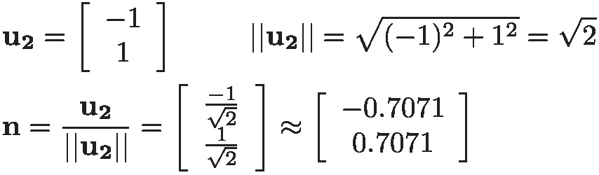

这与清单 3 的输出相同。如前所示，如果将一个特征向量乘以(或除以)一个常数，新向量仍然是同一特征值的特征向量，因此通过归一化对应于某个特征值的特征向量，您仍然有该特征值的特征向量。

但是为什么特征向量对我们很重要呢？如前所述，特征向量将矩阵乘法简化为标量乘法。此外，它们还有一些更有趣的性质。让我回到清单 2 中使用的矩阵 **A** 并计算它的特征向量:


正如您所记得的，这个矩阵将一组形成圆的向量转换成一组形成椭圆的新向量(图 2)。我们将使用`LA.eig()`来计算清单 4 中的特征向量。

输出是:

```
lam= [3\. 2.]
u= [[ 1\.     -0.8944]
    [ 0\.      0.4472]]
```

所以我们有两个特征向量:


相应的特征值为:

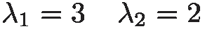

现在我们在变换后的向量上绘制特征向量:

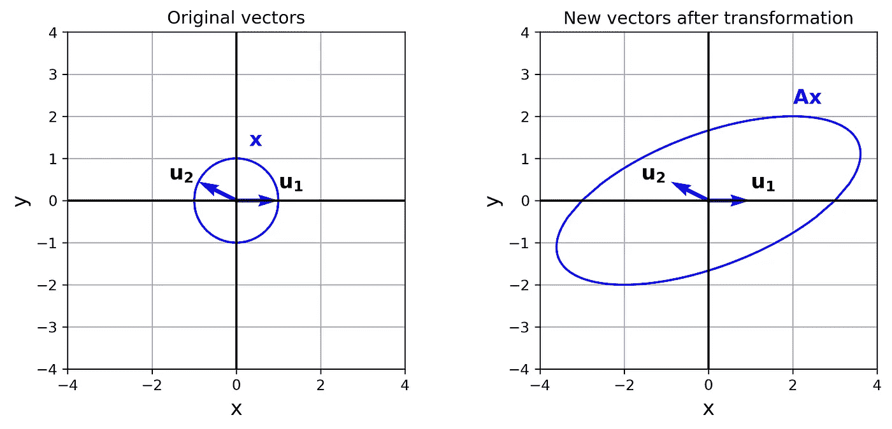

图 3

图 3 中的这些特征向量没有什么特别的。现在让我试试另一个矩阵:

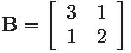

这里我们有两个特征向量:

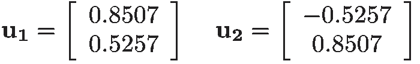

相应的特征值为:

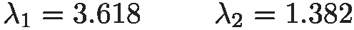

现在，我们可以通过替换清单 5 中的这个新矩阵，在转换后的向量上绘制特征向量。结果如图 4 所示。

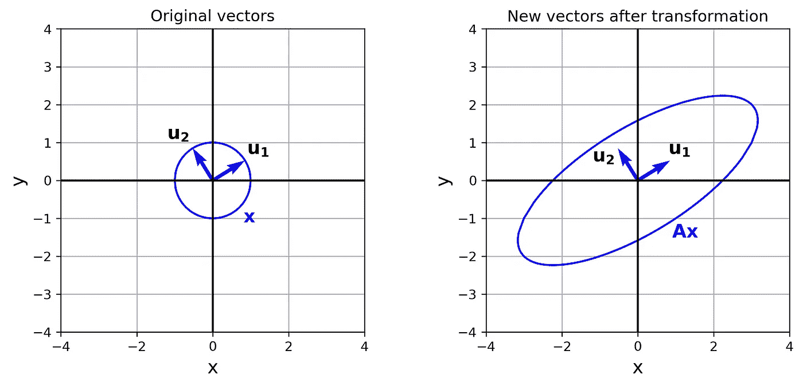

图 4

这次特征向量有一个有趣的性质。我们看到特征向量沿着椭圆的长轴和短轴(主轴)。椭圆可以被认为是一个沿其主轴拉伸或收缩的圆，如图 5 所示，矩阵 **B** 通过沿 **u1** 和**U2****B**的特征向量拉伸它来变换初始圆。

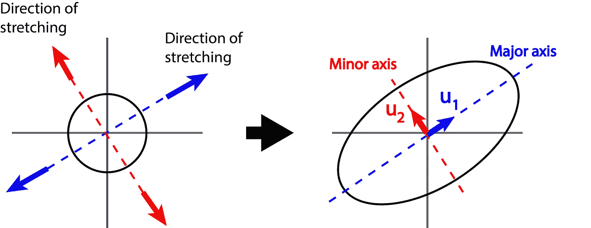

图 5

但是为什么 **A** 的特征向量没有这个性质呢？那是因为 **B** 是一个对称矩阵。[对称矩阵](https://en.wikipedia.org/wiki/Symmetric_matrix)是与其转置矩阵相等的矩阵。因此主对角线上的元素是任意的，但是对于其他元素，行 *i* 和列 *j* 上的每个元素等于行 *j* 和列 *i* 上的元素( *aij* = *aji* )。这是一个对称矩阵的例子:

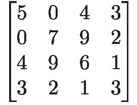

对称矩阵总是一个[方阵](https://en.wikipedia.org/wiki/Square_matrix) ( *n×n* )。你现在可以很容易地看到**和**是不对称的。对称矩阵通过沿向量的特征向量拉伸或收缩来变换向量。此外，我们知道所有的矩阵都通过将特征向量的长度(或幅度)乘以相应的特征值来转换特征向量。我们知道圆中的初始向量长度为 1，并且 **u1** 和 **u2** 都被归一化，所以它们是初始向量 **x** 的一部分。现在它们的变换向量是:


因此，沿着每个特征向量的拉伸或收缩量与相应的特征值成比例，如图 6 所示。

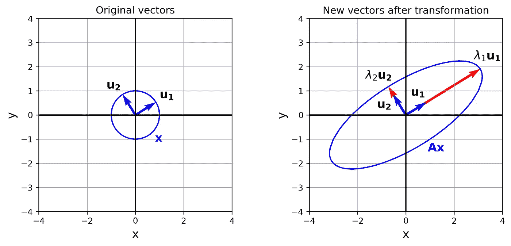

图 6

所以当你在一个特征向量的方向上有更多的拉伸，对应于那个特征向量的特征值会更大。实际上，如果一个特征值的绝对值大于 1，圆 **x** 就沿着它拉伸，如果绝对值小于 1，就沿着它收缩。让我试试这个矩阵:

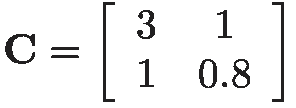

特征向量和相应的特征值是:

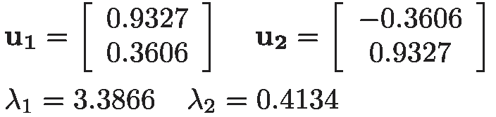

如果我们画出变换后的向量，我们会得到:

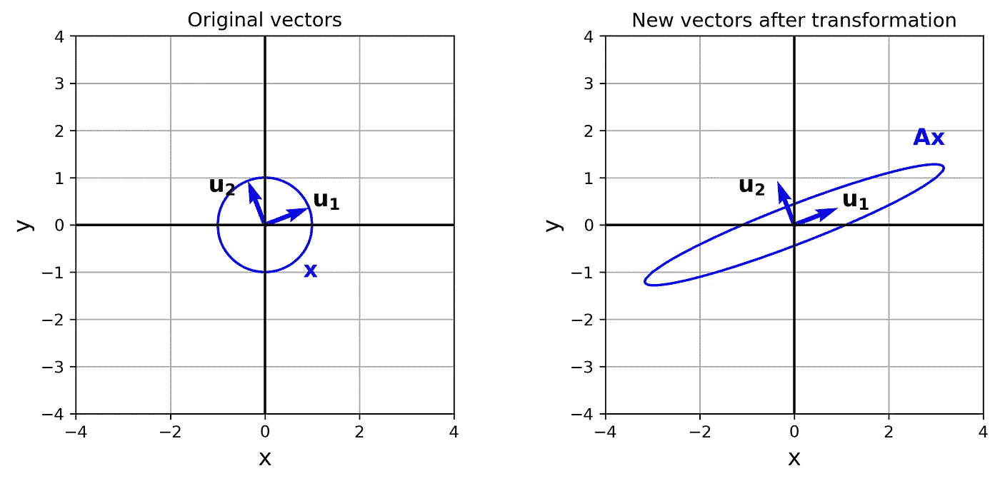

图 7

正如你现在看到的，我们沿着 **u1** 拉伸，沿着 **u2** 收缩。关于这些特征向量的另一件重要的事情是，它们可以形成向量空间的*基*。

**基础**

一组向量{ **v1** ， **v2** ， **v3** …， **vn}** 形成了一个[向量空间](http://mathworld.wolfram.com/VectorSpace.html) **V** 的基，如果它们是[线性无关](https://en.wikipedia.org/wiki/Linear_independence)和[跨度](http://mathworld.wolfram.com/VectorSpaceSpan.html) **V** 。向量空间是一组可以用标量相加或相乘的向量。这是一个封闭的集合，所以当向量与一个标量相加或相乘时，结果仍然属于这个集合。向量加法和标量乘法的运算必须满足某些要求，这里不讨论这些要求。欧几里得空间是向量空间的一个例子。

当一组向量线性无关时，这意味着该组向量中没有一个向量可以写成其他向量的线性组合。所以不可能写


当某些 *a1* 、 *a2* 、..、*和*都不为零。换句话说，这个集合中的 **vi** 矢量都不能用其他矢量来表示。如果空间中每隔一个向量可以写成一个生成集的线性组合，则一个向量集生成一个空间。所以 **V** 中的每个矢量 **s** 都可以写成:


一个向量空间 **V** 可以有许多不同的向量基，但是每个基总是有相同数量的基向量。向量空间 **V** 的基向量个数称为 **V** 的*维*。在欧几里得空间 **R** 中，向量:


是基的最简单的例子，因为它们是线性独立的，并且 **R** 中的每个向量都可以表示为它们的线性组合。它们被称为 **R** 的*标准依据*。因此 **R** 的尺寸为 2。它可以有其他的基，但是它们都有两个线性无关的向量，并且跨越它。例如，向量:


也可以构成 **R** 的基础。寻找向量空间的基的一个重要原因是要有一个坐标系统。如果向量组 *B* ={ **v1** ， **v2** ， **v3** …， **vn}** 形成了向量空间的基，那么该空间中的每个向量 **x** 可以使用这些基向量来唯一地指定:


现在 **x** 相对于此基准 *B* 的坐标为:


事实上，当我们在 **R** 中写向量的时候，我们已经在表达它相对于标准基的坐标了。那是因为任何矢量


可以写成


现在出现了一个问题。如果我们知道一个向量相对于标准基的坐标，我们如何找到它相对于一个新基的坐标？

等式:


也可以写成:


矩阵:


叫做坐标变换矩阵。这个矩阵的列是基 *B* 中的向量。方程式


如果知道 **x** 在 **R** ^n 中的坐标，则给出其在基准 *B* 中的坐标。如果我们需要相反的结果，我们可以将这个方程的两边乘以坐标变化矩阵的逆矩阵，得到:


现在，如果我们知道 **x** 在 **R** ^n 中的坐标(简单地说就是 **x** 本身)，我们可以将它乘以坐标变化矩阵的逆矩阵，从而得到它相对于基底 *B* 的坐标。例如，假设我们的基集 *B* 由向量构成:


我们有一个向量:


为了计算 *B* 中 **x** 的坐标，首先我们形成坐标变化矩阵:


现在 **x** 相对于 *B* 的坐标为:


清单 6 展示了如何在 NumPy 中进行计算。要计算矩阵的逆矩阵，可以使用函数`np.linalg.inv()`。

输出显示了 x 在 B 中的坐标:

```
x_B= [[4\.    ]
      [2.83]]
```

图 8 显示了改变基础的效果。


图 8

为了找到基准 *B* 中 **x** 的**u1**-坐标，我们可以从 **x** 画一条线，平行于 **u2** ，看它与 **u1** 轴相交的位置。**U2**-坐标的查找方法如图 8 所示。在一个 *n* 维空间中，为了找到 **ui** 的坐标，我们需要画一个从 **x** 穿过，平行于除 **ui** 之外的所有其他特征向量的超平面，并查看它与 **ui** 轴的交点。如图 8(左)所示，当特征向量正交时(像 **R** 中的 **i** 和 **j** ，我们只需要画一条穿过点 **x** 并垂直于我们想要求其坐标的轴的线。

**对称矩阵的性质**

如图 5-7 所示，对称矩阵的特征向量 **B** 和 **C** 相互垂直，形成[正交向量](https://en.wikipedia.org/wiki/Orthogonality)。这不是巧合，是对称矩阵的一个性质。

对称矩阵的一个重要性质是一个 *n×n* 对称矩阵有 *n 个*线性无关且正交的特征向量，并且它有 *n 个*实特征值对应于那些特征向量。重要的是要注意，这些特征值不一定彼此不同，其中一些可以相等。对称矩阵的另一个重要性质是它们可以正交对角化。

**特征分解**

对称矩阵是正交对角化的。这意味着如果我们有一个 *n×n* 对称矩阵 **A** ，我们可以把它分解为


其中 **D** 是由 **A** 的 *n* 个特征值组成的 *n×n* 对角矩阵。 **P** 也是一个 *n×n* 矩阵， **P** 的列是 **A** 的 *n* 线性无关特征向量分别对应**D**中的那些特征值。换句话说，如果 **u1** 、 **u2** 、 **u3** …、 **un** 是 **A** 的特征向量**、*λ1、λ2、…、λn* 分别是它们对应的特征值，那么 **A** 可以写成**


这也可以写成


你应该注意到每个 **ui** 被认为是一个列向量，它的转置是一个行向量。所以 **P** 的转置是根据 **P** 的列的转置写成的。**T51**A**的这种因式分解叫做 **A** 的本征分解。**

我举个例子来说明一下。假如


它有两个特征向量:


相应的特征值为:


所以 **D** 可以定义为


现在 **P** 的列是 **A** 的特征向量**分别对应**D**中的那些特征值。因此**


**P** 的转置为


所以**一个**可以写成


重要的是要注意，如果你在上面等式的右边做乘法，你不会精确地得到 **A** 。这是因为我们在 NumPy 中有舍入误差来计算通常出现在特征值和特征向量中的无理数，我们也在这里舍入了特征值和特征向量的值，但是，理论上，两边应该是相等的。但这意味着什么呢？为了更好地理解特征分解，我们可以看看它的几何解释。

**特征分解的几何解释**

为了更好地理解特征分解方程，我们需要首先简化它。如果我们假设每个特征向量 **ui** 是一个*n × 1* 列向量


那么 **ui** 的转置就是一个 *1 × n* 行向量


和它们的繁殖


变成了一个*n×n* 的矩阵。首先，我们计算 **DP** ^T 以简化特征分解方程:


现在，本征分解方程变为:


所以 *n×n* 矩阵 **A** 可以分解成形状相同的 *n* 矩阵( *n×n* )，这些矩阵中的每一个都有一个乘数等于对应的特征值 *λi* 。每个矩阵


被称为*投影矩阵*。想象我们有一个矢量 **x** 和一个单位矢量 **v** 。 **v** 和 **x** 的内积等于 **v** 。 **x=v^T x** 给出了 **x** 到 **v** 的标量投影(这是 **x** 到 **v** ) **、**的矢量投影的长度)，如果我们再乘以 **v** ，它给出了一个矢量，称为 **x** 到 **v** 的正交投影。这如图 9 所示。


图 9

所以当 **v** 是单位矢量时，乘


通过 **x** , 将 **x** 的正交投影到 **v** 上，这就是为什么它被称为投影矩阵。所以用 **ui ui** ^T 乘以 **x** ，我们得到 **x** 到 **ui** 的正交投影。

现在让我来计算前面提到的矩阵 **A** 的投影矩阵。


我们已经计算了 **A** 的特征值和特征向量。

使用清单 7 的输出，我们得到了特征分解方程中的第一项(这里我们称之为 **A1** ):


如你所见，它也是一个对称矩阵。实际上，特征分解方程中的所有投影矩阵都是对称的。这是因为每个矩阵的行 *m* 和列 *n* 中的元素


等于


并且行 *n* 和列 *m* 处的元素具有相同的值，这使其成为对称矩阵。这个投影矩阵有一些有趣的性质。首先，我们可以计算它的特征值和特征向量:

```
lam= [ 3.618  0\.   ]
u= [[ 0.8507 -0.5257]
    [ 0.5257  0.8507]]
```

如你所见，它有两个特征值(因为它是一个 2 *×* 2 对称矩阵)。其中一个为零，另一个等于原矩阵 **A** 的 *λ1* 。另外，特征向量与 **A** 的特征向量完全相同。这不是巧合。假设我们得到本征分解方程中的第 *i-* 项，乘以 **ui** 。


我们知道 **ui** 是一个特征向量，它是归一化的，所以它的长度和它与自身的内积都等于 1。所以:


如果你看特征向量的定义，这个方程意味着矩阵的一个特征值


是 *λi* 对应的特征向量是 **ui** 。但是这个矩阵是一个*n×n 对称*矩阵，应该有 *n 个*特征值和特征向量。现在我们可以将它乘以 **A** 的剩余 *(n-1)* 个特征值中的任何一个，得到:


其中 i ≠ j .我们知道 **A** 的特征值是正交的，这意味着它们中的每一对都是垂直的。两个垂直向量的内积为零(因为一个向量到另一个向量的标量投影应该为零)。所以 **ui** 和 **uj** 的内积为零，我们得到


这意味着 **uj** 也是一个特征向量，其对应的特征值为零。所以我们得出结论，每个矩阵


特征分解方程中是一个对称的 *n×n* 矩阵，具有 *n* 个特征向量*。*特征向量与原矩阵 **A** 相同，分别为 **u1，u2，… un** 。 **ui** 对应的特征值为*λi* (与 **A** 相同)，但其他特征值均为零。现在，记住对称矩阵是如何变换向量的。它会沿着向量的特征向量拉伸或收缩向量，拉伸或收缩的量与对应的特征值成正比。所以这个矩阵将沿着 **ui** 拉伸一个向量。但是因为其他特征值都是零，它会在那些方向上收缩到零。让我回到 matrix **A** 并使用清单 9 绘制出 **A1** 的转换效果。


图 10

如你所见，最初的圆沿着 **u1** 被拉伸，沿着 **u2 收缩到零。**所以这个变换的结果是一条直线，而不是一个椭圆。这与 **A1** 是一个投影矩阵，应该把一切都投影到 **u1** 上的事实是一致的，所以结果应该是沿着 **u1 的一条直线。**

**排名**

图 10 显示了一个有趣的例子，其中 2 *×* 2 矩阵**A1** 乘以一个二维矢量 **x** ，但是变换后的矢量 **Ax** 是一条直线。这是另一个例子。假设我们有一个矩阵:


图 11 显示了它如何转换单位向量 **x** 。


图 11

所以它作为一个投影矩阵，将 **x** 中的所有向量投影到直线 *y=* 2 *x* 上。这是因为 F 的列不是线性独立的。其实如果把 **F** 的列分别叫做 **f1** 和 **f2** ，那么我们就有了 **f1** = **2f2** 。记得我们把矩阵和向量的乘法写成:


所以不像 **x** 中的矢量需要两个坐标， **Fx** 只需要一个坐标，存在于一维空间中。一般来说， *m×n* 矩阵不一定将一个 *n* 维向量转换成另一个 *m* 维向量。如果矩阵的列不是线性独立的，则变换向量的维数可以更低。

矩阵 **A** 的*列空间*记为*Col*A 定义为 **A** 列的所有线性组合的集合，由于 **Ax** 也是 **A** 列的线性组合， *Col* **A** 是所有的集合*Col*A 的基矢个数或者*Col*A 的维数称为 **A** 的秩。所以 **A** 的等级就是 **Ax** 的尺寸。

**A** 的秩也是 **A** 的线性无关列的最大个数。这是因为我们可以把所有的相关列写成这些线性无关列的线性组合，而 **Ax** 也就是所有列的线性组合可以写成这些线性无关列的线性组合。于是它们跨越了 **Ax** 并形成了*col*A 的一个基，这些向量的个数就成为了 **A** 的 *col* 的维数或者 **A** 的秩。

在前面的例子中， **F** 的排名是 1。另外，在特征分解方程中，每个矩阵的秩


是 1。记住，它们只有一个非零特征值，这不是巧合。可以证明对称矩阵的秩等于其非零特征值的个数。

现在我们再次回到特征分解方程。假设我们将对称矩阵 **A** 应用于任意向量 **x** 。现在，本征分解方程变为:


每个特征向量 **ui** 都是归一化的，所以它们是单位向量。现在在特征分解方程的每一项中


给出一个新的矢量，它是 **x** 在 **ui** 上的正交投影。然后这个向量乘以 *λi* 。由于 *λi* 是一个标量，将其乘以一个矢量，只会改变该矢量的大小，而不会改变其方向。所以 *λi* 只改变的幅度


最后所有的 *n 个*向量


加在一起就是给**斧头**。这个过程如图 12 所示。


图 12

因此，本征分解从数学上解释了对称矩阵的一个重要性质，我们在之前的图中看到了。对称矩阵通过沿着向量的特征向量拉伸或收缩向量来变换向量，并且沿着每个特征向量的拉伸或收缩量与对应的特征值成比例。

此外，特征分解可以将一个 *n×n* 对称矩阵分解成形状相同的 *n* 个矩阵*(*n×n*)乘以其中一个特征值。特征值在这里起着重要的作用，因为它们可以被认为是一个乘数。投影矩阵只将 **x** 投影到每个 **ui** 上，但是特征值缩放了向量投影的长度( **ui ui^Tx** )。特征值越大，得到的向量( *λi* **ui ui^Tx** )的长度越大，赋予其对应矩阵的权重也越大( **ui ui^T** )。因此，我们可以通过对具有最高特征值的项求和来近似原始对称矩阵 **A** 。例如，如果我们假设特征值 *λi* 已经按降序排序，*

**

*那么我们只能取特征分解方程中的前 *k* 项来很好地近似原始矩阵:*

**

*其中 **Ak** 是 **A** 与*****k***的近似术语。如果我们只将前 *k* 个特征值和特征向量包含在原特征分解方程中，我们得到相同的结果:*******

**************

*******现在 **Dk** 是由*A 的*第一 *k* 特征值组成的 *k×k* 对角矩阵，Pk 是由*A 的*第一 *k* 特征向量组成的 *n×k* 矩阵，其转置成为 *k×n* 矩阵。所以他们的乘法仍然给出一个 *n×n* 矩阵，它与 **A** 的近似相同。*******

*****如果在原矩阵 **A** 中，我们略去的其他( *n-k)* 特征值都很小，接近于零，那么这个近似矩阵和原矩阵很相似，我们就有了很好的近似。[数]矩阵*****

**********

*****随着*****

**********

*****就是一个例子。这里 *λ2* 比较小。 *W* e 调用单位圆内的向量 **x** ，用原矩阵( **Cx** )绘制它们的变换。然后，我们用矩阵 **C** 的特征分解方程中的第一项来近似矩阵**C**,该方程为:*****

**********

*****并由此绘制出 **s** 的变换。如图 13 所示，近似矩阵的结果是一条直线，非常接近原始矩阵。*****

**********

*****图 13*****

*****为什么特征分解方程成立，为什么需要对称矩阵？记住对称矩阵的重要性质。假设 **x** 是一个 *n×1* 列向量。*T5 如果 **A** 是一个 *n×n* 对称矩阵，那么它有 *n 个*线性无关且正交的特征向量可以作为新的基。所以我们现在可以写出 **x** 相对于这个新基的坐标:******

**********

*****而基于基的定义，任何向量 **x** 都可以唯一地写成 **A** 的特征向量的线性组合。*****

**********

*****但是对称矩阵的特征向量也是正交的。所以要找到每个坐标 *ai* ，我们只需要通过点 **x** 画一条垂直于 **ui** 的轴的线，看它在哪里相交(参见图 8)。如前所述，这也可以使用投影矩阵来完成。所以每项 *ai* 等于 **x** 和 **ui** 的点积(参考图 9)，可以写成 **x*******

**********

*****所以我们需要一个对称矩阵将 **x** 表示为上式中特征向量的线性组合。现在，如果我们将 **A** 乘以 **x** ，，我们就可以分解出 *ai* 项，因为它们是标量。所以我们得到:*****

**********

*****由于 **ui** 向量是 **A** 的特征向量，我们最终得到:*****

**********

*****这就是特征分解方程。在乘以 **A** 后发生的任何事情对所有矩阵都成立，并且不需要对称矩阵。我们需要一个 *n×n* 对称矩阵，因为它有 *n 个*实特征值加上 *n 个*线性独立和正交的特征向量，可以作为 **x** 的新基。当你有一个非对称矩阵时，你就没有这样的组合。例如，假设您有一个非对称矩阵:*****

**********

*****如果你计算这个矩阵的特征值和特征向量，你得到:*****

```
*****lam= [2.5+0.866j 2.5-0.866j]
u= [[0.7071+0.j     0.7071-0.j    ]
    [0.3536-0.6124j 0.3536+0.6124j]]*****
```

*****这意味着你没有真正的特征值来做分解。另一个例子是:*****

**********

*****你会得到:*****

```
*****lam= [2\. 2.]
u= [[ 1\. -1.]
    [ 0\.  0.]]*****
```

*****这里，特征向量不是线性独立的。其实 **u1** = - **u2** 。所以你不能像图 11 一样只使用一个特征向量来重建 **A** 。此外，它没有显示如图 14 所示的该矩阵的拉伸方向。*****

**********

*****图 14*****

*****最后，请记住*****

**********

*****我们有:*****

```
*****lam= [ 7.8151 -2.8151]
u= [[ 0.639  -0.5667]
    [ 0.7692  0.8239]]*****
```

*****这里，特征向量是线性独立的，但它们不是正交的(参见图 3)，并且它们没有显示变换后该矩阵的正确拉伸方向。*****

*****特征分解法非常有用，但只对对称矩阵有效。对称矩阵总是正方形矩阵，所以如果你有一个矩阵不是正方形的，或者是正方形但非对称的矩阵，那么你就不能用特征分解法用其他矩阵来近似它。SVD 可以克服这个问题。*****

*******奇异值*******

*****在讨论 SVD 之前，我们应该找到一种方法来计算非对称矩阵的拉伸方向。假设 **A** 是一个不一定对称的 *m×n* 矩阵。那么可以证明*****

**********

*****是一个 *n×n* 对称*矩阵。记住乘积的转置是逆序转置的乘积。因此******

**********

*****所以**a^t**a 等于它的转置，而且是对称矩阵。我们想要计算非对称矩阵的拉伸方向。，但是我们如何从数学上定义拉伸方向呢？*****

*****到目前为止，我们只关注了二维空间中的向量，但是我们可以在二维空间中使用相同的概念。在这里，我集中在一个三维空间，以便能够形象化的概念。现在列向量有 3 个元素。最初，我们有一个球体，它包含所有距离原点一个单位的向量，如图 15 所示。如果我们称这些向量为 **x** ，那么|| **x** ||=1。现在如果我们把它们乘以一个 3 *×* 3 对称矩阵， **Ax** 就变成了一个三维椭圆。拉伸的第一方向可以被定义为在该椭圆中具有最大长度的向量的方向(图 15 中的 **Av1** )。实际上， **Av1** 是|| **Ax** ||在所有单位向量 **x** 上的最大值。这个矢量是 **A** 对矢量 **v1** 的变换。*****

**********

*****图 15*****

*****拉伸的第二方向是沿着向量 **Av2** 。 **Av2** 是|| **Ax** ||在 **x** 中垂直于 **v1** 的所有向量上的最大值。所以在 **x 中的所有向量中，**我们最大化|| **Ax** ||以此约束 **x** 垂直于 **v1** 。最后， **v3** 是垂直于 **v1** 和 **v2** 的向量，并且在这些约束条件下给出了 **Ax** 的最大长度。 **Av3** 的方向决定拉伸的第三个方向。所以一般在一个 *n* 维空间中，第 *i* 个拉伸方向是矢量 **Avi** 的方向，它具有最大的长度，并且垂直于前面的( *i* -1)个拉伸方向。*****

*****现在让 **A** 成为一个 *m×n* 矩阵。我们证明了 **A^T A** 是一个对称矩阵，所以它有 *n 个*实特征值和 *n 个*线性独立和正交的特征向量，这些特征向量可以构成它可以变换的 *n-* 元素向量的基础(在 **R^n** 空间中)。我们称这些特征向量为 **v1** ， **v2** ，… **vn** ，我们假设它们是归一化的。对于这些特征向量中的每一个，我们可以使用长度的定义和转置矩阵乘积的规则来得到:*****

**********

*****现在我们假设 **vi** 对应的特征值为 *λi******

**********

*****但是 vi 是归一化的，所以*****

**********

*****因此:*****

**********

*****这个结果表明所有的特征值都是正的。现在假设我们按降序给它们贴标签，那么:*****

**********

*****现在我们将 **A** 的奇异值定义为*λI*(**a^t a**的特征值)的平方根，我们用 *σi* 表示。*****

**********

*****所以 **A** 的奇异值就是向量 **Avi** 的长度。现在我们可以总结一个重要的结果，它构成了奇异值分解方法的基础。可以看出，|| **Ax** ||的最大值受到约束*****

**********

*****是 *σk* ，并且该最大值在 **vk** 处达到。对于约束条件，我们使用了这样的事实:当 **x** 垂直于 **vi** 时，它们的点积为零。*****

*****所以如果 **vi** 是**a^t**a 的特征向量(按其对应的奇异值排序)，并假设|| **x** ||=1，那么 **Avi** 为 **Ax** 呈现一个拉伸方向，对应的奇异值*σi* 给出了 **Avi** 的长度。*****

*****奇异值也可以决定 **A** 的秩。假设非零奇异值的个数为 *r* 。因为它们是正的，并按递减顺序标注，所以我们可以把它们写成*****

**********

*****这对应于*****

**********

*****并且每个 *λi* 都是 **vi** 对应的特征值。那么可以表明，秩 **A** 是形成 **Ax** 的基础的向量的数量，是 *r* 。还可以看出，集合{ **Av1** ， **Av2** ，…， **Avr** }是**Ax**(*Col***A**)的正交基。因此矢量 **Avi** 相互垂直，如图 15 所示。*****

*****现在我们回到非对称矩阵*****

**********

*****我们在图 3 中绘制了 **A** 的特征向量，并提到它们没有显示 **Ax** 的拉伸方向。在图 16 中，左侧绘制了 **A^T A** 的特征向量( **v1** 和 **v2** )。由于 **A^T A** 是对称矩阵，这些向量显示了它的拉伸方向。在右侧，画出了矢量 **Av1** 和 **Av2** ，很明显这些矢量显示了 **Ax** 的拉伸方向。*****

**********

*****图 16*****

*****因此 **Avi** 显示 **A** 的拉伸方向，无论 **A** 是否对称。*****

*****现在想象矩阵 **A** 是对称的，并且等于它的转置矩阵。另外，假设其第 *i* 个特征向量为 **ui** ，对应的特征值为 *λi* 。如果我们将 **A^T A** 乘以 **ui** ，我们得到:*****

**********

*****也就是说 **ui** 也是 **A^T A** ，的一个特征向量但是它对应的特征值是 *λi* 。所以当 **A** 对称时，不用计算 **Avi** (其中 **vi** 是 **A^T A 的特征向量)**我们可以简单地使用**ui**(**a**的特征向量)来得到拉伸的方向，这正是我们对特征分解过程所做的。既然我们知道了如何计算非对称矩阵的拉伸方向，我们就可以看 SVD 方程了。*****

*******奇异值分解*******

*****设 **A** 为 *m×n* 矩阵，秩 **A** = *r* 。所以 **A** 的非零奇异值个数为 *r* 。因为它们是正的，并按递减顺序标注，所以我们可以把它们写成*****

**********

*****在哪里*****

**********

*****我们知道每个奇异值 *σi* 是 *λi 的平方根( **A^TA** 的*特征值)，对应一个同阶的特征向量 **vi** 。现在我们可以把**的*奇异值分解*写成**:*****

**********

*****其中 **V** 是一个 *n×n* 矩阵，其列为 **vi** 。所以:*****

**********

*****我们称一组正交且归一化的向量为 [*正交*](https://en.wikipedia.org/wiki/Orthonormality) 集合。所以集合{ **vi** }是一个正交集合。列是正交集合的矩阵称为 [*正交矩阵*](https://en.wikipedia.org/wiki/Orthogonal_matrix) ，并且 **V** 是正交矩阵。*****

*******σ**是一个形式为 *m×n* 的对角矩阵:*****

**********

*****所以我们先做一个 *r × r* 对角矩阵，对角元素为 *σ1，σ2，…，σr* 。然后我们用零填充它，使它成为一个 *m × n* 矩阵。*****

*****我们还知道集合{ **Av1** ， **Av2** ，…， **Avr** }是 *Col* **A，**和*σI =*|**Avi**| |的正交基。因此，我们可以通过将向量除以它们的长度来标准化这些向量:*****

**********

*****现在我们有一个集合{ **u1** ， **u2** ，…， **ur** }它是 **Ax** 的正交基，Ax 是 *r* 维的。我们知道 **A** 是一个 *m × n* 矩阵， **A** 的秩最多可以是 *m* (当 **A** 的所有列线性无关时)。由于我们需要一个 **U** 的 *m×m* 矩阵，我们将***(m-r)***向量添加到 **ui** 集合中，使其成为一个 m 维空间**r**^m**的归一化基(有几种方法可以用于此目的。例如，我们可以使用*格拉姆-施密特过程。*然而，解释它超出了本文的范围)。所以现在我们有了一个标准正交基{ **u1** ， **u2** ，…， **um** }。这些向量将是正交矩阵 *m×m* 的 **U** 的列***********

**********

*****所以最后，我们可以将 **A** 分解为*****

**********

*****为了更好地理解这个等式，我们需要简化它:*****

**********

*****我们知道 *σi* 是标量；**ui** 是 m 维列向量， **vi** 是 n 维列向量。于是每个*σI***ui****VI**^t 是一个 *m×n* 矩阵，SVD 方程将矩阵 **A** 分解成形状相同的 *r* 矩阵( *m×n* )。*****

*****首先，让我来说明为什么这个等式是有效的。如果我们将 SVD 方程的两边乘以 **x** ，我们得到:*****

**********

*****我们知道集合{ **u1** ， **u2** ，…， **ur** }是 **Ax** 的一个正交基。所以向量 **Ax** 可以写成它们的线性组合。*****

**********

*****并且由于 **ui** 向量是正交的，每一项 *ai* 等于 **Ax** 和 **ui** (标量投影 **Ax** 到 **ui** )的点积:*****

**********

*****但是我们也知道*****

**********

*****因此，将它代入前面的等式，我们得到:*****

**********

*****我们还知道 **vi** 是 **A** ^T **A** 的特征向量，其对应的特征值 *λi* 是奇异值 *σi* 的平方*****

**********

*****但是点积是可交换的，所以*****

**********

*****注意， **vi^Tx** 给出了 **x** 到 **vi** 的标量投影，长度由奇异值缩放。现在，如果我们将 *ai* 值代入 **Ax** 、的方程，我们得到 SVD 方程:*****

**********

*****所以每个*ai*=*σI***VI****^tx**都是 **Ax** 到 **ui** 上的标量投影，如果乘以 **ui** ，结果就是一个向量，是 **Ax** 到 **ui** 上的正交投影。奇异值 *σi* 沿 **ui** 缩放该向量的长度。记住，在特征分解方程中，每个 **ui ui^T** 是一个投影矩阵，它给出了 **x** 到 **ui** 的正交投影。这里*σI***VI****^t**可以认为是一个取 **x** 的投影矩阵，但是将 **Ax** 投影到 **ui** 上。由于它将所有向量投影到 **ui** 上，所以它的秩是 1。图 17 总结了 SVD 所需的所有步骤。我们首先从所有长度为 1 的矢量中挑选一个随机的二维矢量 **x1** (图 17–1)。然后我们尝试使用 SVD 方法计算 **Ax1** 。*****

**********

*****图 17*****

*****首先我们计算 **A^TA** 的特征值( *λ1* 、 *λ2* )和特征向量( **v1** 、 **v2** )。我们知道奇异值是特征值的平方根( *σi* = *λi* )，如(Figure 17–2)所示。 **Av1** 和 **Av2** 表示 **Ax** 的拉伸方向， **u1** 和 **u2** 是 **Av1** 和 **Av2** 的单位矢量(图 17-4)。 **Ax1** 在 **u1** 和 **u2** 上的正交投影为*****

**********

*****分别(图 17-5)，简单地把它们加在一起，我们得到 **Ax1*******

**********

*****如所示(Figure 17–6)。*****

*****下面这个例子展示了如何用 Python 计算矩阵的 SVD。我们想找到的奇异值分解*****

**********

*****这是一个 2 *×* 3 的矩阵。所以**x** 是三维列向量，但是 **Ax** 不是三维向量， **x** 和 **Ax** 存在于不同的向量空间。首先，我们计算 **A^T A** 的特征值和特征向量。*****

*****输出是:*****

```
*****lam= [90.1167  0\.     12.8833]
v= [[ 0.9415  0.3228  0.0969]
    [ 0.3314 -0.9391 -0.0906]
    [-0.0617 -0.1174  0.9912]]*****
```

*****如你所见，第二特征值为零。由于 **A^T A** 是对称矩阵，有两个非零特征值，所以它的秩是 2。图 18 从不同角度显示了 **A^T 斧**的两幅图。由于 **A^TA** 的秩是 2，所以所有向量 **A^TAx** 都在一个平面上。*****

**********

*****图 18*****

*****清单 11 展示了如何构建矩阵**σ**和 **V** 。我们首先按降序排列特征值。 **V** 的列是对应的相同顺序的特征向量。*****

*****然后我们过滤非零特征值，取它们的平方根，得到非零奇异值。我们知道**σ**应该是一个 3 *×* 3 矩阵。因此，我们将两个非零奇异值放在一个 2 *×* 2 对角矩阵中，并用零填充它，得到一个 *3 × 3* 矩阵。输出是:*****

```
*****Sigma= [[9.493  0\.     0\.    ]
        [0\.     3.5893 0\.    ]]
V= [[ 0.9415  0.0969  0.3228]
    [ 0.3314 -0.0906 -0.9391]
    [-0.0617  0.9912 -0.1174]]*****
```

*****为了构造 **V** ，我们取与 **A** 的 *r* 非零奇异值对应的 **vi** 向量，并除以它们对应的奇异值。既然 **A** 是一个 2 *×* 3 矩阵， **U** 应该是一个 2 *×* 2 矩阵。我们有 2 个非零奇异值，所以 **A** 的秩是 2， *r* =2。因此，我们已经有足够多的 **vi** 向量来组成 **U** 。*****

*****输出是:*****

```
*****U= [[ 0.4121  0.9111]
    [ 0.9111 -0.4121]]*****
```

*****最后，我们得到一个对**的分解:*******

**********

*****我们真的不需要遵循所有这些步骤。NumPy 有一个名为`svd()`的函数可以为我们做同样的事情。清单 13 展示了我们如何使用这个函数轻松计算矩阵 **A** 的 SVD。*****

*****输出是:*****

```
*****U= [[-0.4121 -0.9111]
    [-0.9111  0.4121]]
s= [9.493  3.5893]
V [[-0.9415 -0.0969 -0.3228]
   [-0.3314  0.0906  0.9391]
   [ 0.0617 -0.9912  0.1174]]*****
```

*****您应该注意到输出中的一些事情。首先，这个函数返回一个奇异值数组，它位于**σ**的主对角线上，而不是矩阵**σ**上。另外，它返回 **V^T，**不是 **V** ，所以我打印了它返回的数组 **VT** 的转置。最后，`svd()`报告的 **ui** 和 **vi** 向量与清单 10-12 中计算的 **ui** 和 **vi** 向量符号相反。记住如果 **vi** 是某个特征值的特征向量，那么(-1) **vi** 也是同一特征值的特征向量，其长度也是相同的。所以如果 **vi** 归一化，(-1) **vi** 也归一化。事实上，在清单 10 中，我们用不同的方法计算了 **vi** ，而`svd()`只是报告(-1) **vi** ，这仍然是正确的。由于 **ui** = **Avi/** σi，`svd()`上报的 **ui** 的集合也会有相反的符号。*****

*****你可以很容易地构造矩阵**σ**并检查这些矩阵相乘是否得到 **A.*******

```
*****Reconstructed A= [[ 4\.  1\.  3.]
                  [ 8\.  3\. -2.]]*****
```

*****在图 19 中，你可以看到一个由 **x** 和 **Ax** 组成的图，前者是单位球体中的矢量，后者是由 **A** 产生的一组二维矢量。矢量 **u1** 和 **u2** 表示拉伸的方向。由 **Ax** 生成的椭圆不像我们之前看到的那样是空心的(例如在图 6 中)，变换后的矢量完全填充了它。*****

**********

*****图 19*****

*****类似于特征分解方法，我们可以通过对具有最高奇异值的项求和来近似我们的原始矩阵 **A** 。因此，我们可以使用 SVD 方程中的前 *k* 项，使用 *k* 最高奇异值，这意味着我们只包括分解方程中的 **U** 和 **V** 矩阵中的前 *k* 向量:*****

**********

*****我们知道集合{ **u1** 、 **u2** 、…、 **ur}** 构成了 **Ax** 的基础。所以当我们从这个集合中选取 *k* 向量时， **Ak x** 就写成了 **u1，u2，… uk** 的线性组合。因此它们跨越 **Ak x** ，并且由于它们是线性独立的，所以它们形成了 **Ak x** (或 *col* **A** )的基础。所以 **Ak** 的秩是 *k* ，通过挑选第一个 *k* 奇异值，我们用秩- *k* 矩阵来近似 **A** 。*****

*****举个例子，假设我们要计算矩阵的奇异值分解*****

**********

*****同样, **x** 是单位球中的矢量(图 19 左图)。奇异值为 *σ1=* 11.97， *σ2=* 5.57， *σ3=* 3.25， **A** 的秩为 3。因此 **Ax** 在三维空间中是一个椭球体，如图 20(左)所示。如果我们使用第一个奇异值对其进行近似，那么 **Ak** 的秩将是 1，并且 **Ak** 乘以 **x** 将是一条线(图 20 右侧)。如果只使用前两个奇异值， **Ak** 的秩将为 2， **Ak** 乘以 **x** 将为一个平面(图 20 中)。*****

**********

*****图 20*****

*****值得注意的是，如果我们有一个对称矩阵，SVD 方程简化为特征分解方程。假设对称矩阵 **A** 具有特征向量 **vi** 以及相应的特征值 *λi* 。所以我们*****

**********

*****我们已经表明，对于对称矩阵， **vi** 也是 **A^TA** 的特征向量，对应的特征值为 *λi .* 所以 **A** 的奇异值为 *λi* 和 *σi* = *λi* 的平方根。现在我们可以计算 **ui** :*****

**********

*****所以 **ui** 是 **A** 对应 *λi* (以及 *σi* )的特征向量。现在我们可以简化 SVD 方程，得到特征分解方程:*****

**********

*****最后，可以看出 SVD 是用秩- *k* 矩阵逼近 **A** 的最佳方式。一个 *m* × *n* 矩阵 **A** 的 [*Frobenius 范数*](http://mathworld.wolfram.com/FrobeniusNorm.html) 定义为其元素的绝对平方和的平方根:*****

**********

*****这就像矩阵向量长度的推广。现在如果矩阵*m*×*n*Ak 是由奇异值分解逼近的秩- *k* 矩阵，我们可以认为*****

**********

*****为 **A** 与 **Ak** 之间的距离。这个距离越小， **Ak** 越接近 **A** 越好。现在如果 **B** 是任意一个 *m* × *n* 秩- *k* 矩阵，可以看出*****

**********

*****换句话说，SVD 生成的 **A** 与其秩- *k* 逼近之差具有最小的 Frobenius 范数，没有其他秩- *k* 矩阵能够给出对 **A** 更好的逼近(就 Frobenius 范数而言距离更近)**。*******

*****现在我们已经熟悉了 SVD，我们可以看到它在数据科学中的一些应用。*****

# *****应用程序*****

*******降维*******

*****我们可以在矩阵中存储图像。每个图像由一组像素组成，这些像素是该图像的构建块。每个像素代表图像中特定位置的光的颜色或强度。在 [PNG 格式](https://fileinfo.com/extension/png)的灰度图像中，每个像素都有一个介于 0 和 1 之间的值，其中 0 对应黑色，1 对应白色。所以一个有 *m* × *n* 个像素的灰度图像可以存储在一个 *m* × *n* 矩阵或者 NumPy 数组中。这里我们使用`imread()`函数将 480 × 423 像素的爱因斯坦的灰度图像加载到一个二维数组中。然后我们用 SVD 分解矩阵，用前 30 个奇异值重构。*****

**********

*****图 21。[图像来源](https://pixabay.com/photos/albert-einstein-portrait-1933340/)*****

*****原始矩阵为 480×423。所以我们需要存储 480×423=203040 个值。在 SVD 之后，每个 **ui** 有 480 个元素，每个 **vi** 有 423 个元素。为了能够使用前 30 个奇异值重建图像，我们只需要保留前 30 个σi、 **ui** 和 **vi** ，这意味着存储 30×(1+480+423)=27120 个值。这大约是原始图像所需数值的 13%。因此，使用奇异值分解，我们可以很好地逼近原始图像，并节省大量内存。清单 16，并计算对应于前 6 个奇异值的矩阵。每个矩阵*σI***ui*****VI****^t**的秩为 1，行数和列数与原始矩阵相同。图 22 显示了结果。******

************

******图 22******

******请注意，与原始灰度图像不同，这些秩 1 矩阵的元素的值可以大于 1 或小于 0，并且它们不应被解释为灰度图像。所以我没有使用`cmap='gray'`，也没有将它们显示为灰度图像。当绘制它们时，我们不关心像素的绝对值。相反，我们关心他们相对于彼此的价值。******

******为了理解图像信息是如何存储在每个矩阵中的，我们可以研究一个简单得多的图像。在清单 17 中，我们读取了一个包含五个简单形状的二进制图像:一个矩形和四个圆形。结果如图 23 所示。******

************

******图 23******

******使用前 2、4 和 6 个奇异值重建图像。现在我们绘制对应于前 6 个奇异值的矩阵:******

************

******图 24******

******每个矩阵(*σI***ui*****VI****^t**)的秩为 1，这意味着它只有一个独立列，所有其他列都是该列的标量乘法。所以如果调用独立列 **c1** (或者它可以是其他任何一列)，这些列的一般形式为:*******

**************

*******其中 *ai* 是标量乘法器。另外，这个矩阵把所有的向量都投影到 **ui** 上，所以每一列也是 **ui** 的标量乘法。这可以在图 25 中看到。显示了矩阵的两列*σ2*t39】U2***v2^t**与 **u2** 。两列具有相同的 **u2** 模式，但值不同(列#300 的 *ai* 为负值)。********

************

******图 25******

******所以使用 **c1** 和 *ai* (或 **u2** 及其乘数)的值，每个矩阵捕捉原始图像的一些细节。在图 24 中，前两个矩阵可以捕获原始图像中左矩形的几乎所有信息。在图 24 的前两个矩阵中，这四个圆被粗略地捕捉为四个矩形，关于它们的更多细节被添加到后四个矩阵中。这也可以在图 23 中看到，当我们添加更多的奇异值时，重建图像中的圆变得更圆。这些秩为 1 的矩阵可能看起来很简单，但它们能够捕捉图像中重复模式的一些信息。例如，在图 26 中，我们有苏格兰国家纪念碑的图像，它有 6 根柱子(在图像中)，对应于第一个奇异值的矩阵可以捕捉原始图像中柱子的数量。******

************

******图 26。[图像来源](https://pixabay.com/photos/national-monument-of-scotland-1252932/)******

********特征脸********

******在本例中，我们将使用 Scikit-learn 库中的 Olivetti faces 数据集。该数据集包含 400 幅图像。这些照片拍摄于 1992 年 4 月至 1994 年 4 月间，地点是剑桥美国电话电报公司实验室。这些图像显示了 40 个不同主体的面部。对于一些受试者来说，这些照片是在不同的时间拍摄的，改变了光线、面部表情和面部细节。这些图像是灰度图像，每幅图像的像素为 64×64。每个像素的强度是区间[0，1]上的一个数。首先，我们加载数据集:******

******清单 1 中已经导入了`fetch_olivetti_faces()`函数。我们称之为读取数据并将图像存储在`imgs`数组中。这是一个(400，64，64)数组，包含 400 个灰度 64×64 的图像。我们可以在这里展示其中的一些例子:******

************

******图 27******

******在前面的例子中，我们将原始图像存储在一个矩阵中，然后使用 SVD 对其进行分解。这里我们采用另一种方法。我们知道我们有 400 张图片，所以我们给每张图片一个从 1 到 400 的标签。现在我们使用[一键编码](https://en.wikipedia.org/wiki/One-hot)通过一个向量来表示这些标签。我们使用一个有 400 个元素的列向量。对于每个标签 *k，*除了第 *k* 个元素外，所有元素都为零。因此标签 *k* 将由向量表示:******

************

******现在，我们将每个图像存储在一个列向量中。每个图像有 64 × 64 = 4096 个像素。因此，我们可以展平每个图像，并将像素值放入具有 4096 个元素的列向量 **f** 中，如图 28 所示:******

************

******图 28******

******所以每张标签为 *k* 的图片都会被存储在矢量 **fk** 中，我们需要 400 个 **fk** 矢量来保存所有的图片。现在我们定义一个变换矩阵 **M** ，它将标签向量 **ik** 变换为其对应的图像向量 **fk** 。向量 **fk** 将是矩阵 **M** 的列:******

************

******这个矩阵有 4096 行和 400 列。我们可以简单的用 **y=Mx** 找到每个标签对应的图像( **x** 可以是任意向量 **ik** ， **y** 会是对应的 **fk** )。例如，对于该数据集的第三幅图像，标签是 3，并且除了第三个元素是 1 之外， **i3** 的所有元素都是 0。现在，记住分块矩阵的乘法。当我们将 **M** 乘以 **i3** 时，除了第三列 **f3** 、之外， **M** 的所有列都乘以零，所以:******

************************

******清单 21 展示了我们如何构建 **M** 并使用它来显示数据集中的某个图像。******

******每个标签向量 **ik** 的长度是 1，并且这些标签向量形成 400 维空间的标准基础。在这个空间中，每个轴对应于一个标签，其值可以是零或一。向量 **fk** 存在于 4096 维空间中，其中每个轴对应图像的一个像素，矩阵 **M** 将 **ik** 映射到 **fk** 。现在我们可以用 SVD 分解 **M** 。请记住，当我们将 M**分解为 r 时********

************

******集合{ **u1** 、 **u2** 、…、 **ur** }是 **U** 的第一个 *r* 列，将作为 **Mx** 的基础。每个向量 **ui** 将有 4096 个元素。由于 **y** = **Mx** 是我们的图像向量所在的空间，向量 **ui** 形成了图像向量的基础，如图 29 所示。在这幅图中，我试图想象一个 n 维向量空间。这在 *n* ≥3 时当然是不可能的，但这只是一个虚构的图解，帮助你理解这个方法。******

************

******图 29******

******所以我们可以将 **ui** 重塑成一个 64 ×64 的像素阵列，并尝试像绘制图像一样绘制它。这些向量的元素值可以大于 1 或小于 0，并且当对它们进行整形时，它们不应该被解释为灰度图像。所以我在显示它们的时候没有使用`cmap='gray'`。******

******输出是:******

************

******图 30******

******您可以检查清单 22 中的数组`s`有 400 个元素，所以我们有 400 个非零奇异值，矩阵的秩是 400。因此，我们需要 **U** 的前 400 个向量来完全重构矩阵。我们可以使用基本向量轻松地重建其中一幅图像:******

******这里，我们采用图像#160，并使用不同数量的奇异值对其进行重建:******

************

******图 31******

******向量 **ui** 被称为*特征脸*，可以用于人脸识别。正如您在图 30 中看到的，每个特征脸捕获了图像向量的一些信息。比如 **u1** 大部分是关于眼睛的，或者 **u6** 抓住了鼻子的一部分。当重建图 31 中的图像时，第一个奇异值添加了眼睛，但是脸部的其余部分是模糊的。通过增加 *k，*鼻子、眉毛、胡须和眼镜被添加到脸上。有些人认为眼睛是你面部最重要的特征。似乎 SVD 同意他们的观点，因为具有最高奇异值的第一个特征脸捕获了眼睛。******

********降低噪音********

******奇异值分解可以用来降低图像中的噪声。清单 24 显示了一个例子:******

************

******图 32******

******这里，我们首先加载图像，并添加一些噪声。然后，我们使用前 20、55 和 200 个奇异值来重建图像。如图 32 所示，随着重构矩阵的秩增加，噪声量也会增加。因此，如果我们使用像 20 这样的较低等级，我们可以显著降低图像中的噪声。重要的是要理解为什么它在低级别工作得更好。******

******这里有一个简单的例子来说明 SVD 如何降低噪声。假设我们有清单 25 中定义的 3×15 矩阵:******

******该矩阵的颜色图如下所示:******

************

******图 33******

******矩阵列可以分为两类。在前 5 列中，只有第一个元素不为零，在后 10 列中，只有第一个元素为零。我们还有一个嘈杂的列(列#12 ),它应该属于第二类，但是它的第一个和最后一个元素没有正确的值。我们可以假设这两个元素包含一些噪声。现在我们用奇异值分解这个矩阵。矩阵的秩为 3，并且只有 3 个非零奇异值。现在我们用前两个和三个奇异值来重建它。******

************

******图 34******

******如图 34 所示，通过使用前两个奇异值，列#12 发生变化，并遵循第二类中列的相同模式。但是，现在它的元素的实际值要低一点。如果我们使用所有 3 个奇异值，我们得到原始的噪声列。图 35 显示了这些列在三维空间中的曲线图。******

************

******图 35******

******先看 SVD 生成的 **ui** 向量。 **u1** 显示第一类列向量的平均方向。类似地， **u2** 显示了第二类的平均方向。当然方向相反，但这不重要(记住如果 **vi** 是某个特征值的特征向量，那么(-1) **vi** 也是同一特征值的特征向量，并且由于**ui**=**Avi/***σI*，那么它的符号取决于 **vi** ) *。*重要的是拉伸方向，而不是矢量的符号。******

******噪声列由矢量 **n** 表示。不沿着 **u1** 和 **u2** 走。现在如果我们以 **ui** 为基础，就可以分解 **n** ，找到它在 **ui** 上的正交投影。如你所见，它有一个沿 **u3** (反方向)的分量，这是噪声方向。这个方向代表出现在 **n** 的第三个元素中的噪声。它具有最低的奇异值，这意味着 SVD 不认为它是一个重要的特征。当我们使用前两个奇异值重构 **n** 时，我们忽略这个方向，第三个元素中存在的噪声被消除。现在我们只有沿着 **u1** 和 **u2** 的矢量投影。但是沿着 **u1** 的标量投影具有高得多的值。这是因为矢量 **n** 更类似于第一类。******

******所以 **n** 在 **u1-u2** 平面的投影几乎是沿着 **u1** 的，利用前两个奇异值重构 **n** 给出了一个更类似于第一类的向量。重要的是要注意，由 **u2** 表示的第一元件中的噪声没有被消除。此外，尽管重构的 **n** 的方向几乎是正确的，但是与第一类中的向量相比，其幅度较小。事实上，在重构的矢量中，第二个元素(不包含噪声)现在具有比原始矢量更低的值(图 36)。******

************

******图 36******

******因此，SVD 将大部分噪声(但不是全部)分配给由较低奇异值表示的向量。如果我们重构一个低秩矩阵(忽略较低的奇异值)，噪声将会减少，然而，矩阵的正确部分也会改变。结果是一个矩阵，它只是我们正在寻找的无噪声矩阵的近似。这可以在图 32 中看到。图像背景是白色的，噪声像素是黑色的。当我们重建低秩图像时，背景更加均匀，但现在是灰色的。事实上，如果图像中没有噪声，我们得到的是白色背景的一个噪声较少的近似。******

******我希望你喜欢阅读这篇文章。如果您有任何问题或建议，请告诉我。本文中的所有代码清单都可以从 GitHub 下载，网址是:[https://github.com/reza-bagheri/SVD_article](https://github.com/reza-bagheri/SVD_article)******

********延伸阅读:********

******特征分解和 SVD 也可以用于主成分分析(PCA)。PCA 对于降维非常有用。要了解更多关于 PCA 中特征分解和 SVD 的应用，您可以阅读以下文章:******

******[https://Reza-bag heri 79 . medium . com/understanding-principal-component-analysis-and-its-application-in-data-science-part-1-54481 CD 0ad 01](https://reza-bagheri79.medium.com/understanding-principal-component-analysis-and-its-application-in-data-science-part-1-54481cd0ad01)******

******[https://Reza-bag heri 79 . medium . com/understanding-principal-component-analysis-and-its-application-in-data-science-part-2-e16b 1b 225620](https://reza-bagheri79.medium.com/understanding-principal-component-analysis-and-its-application-in-data-science-part-2-e16b1b225620)******