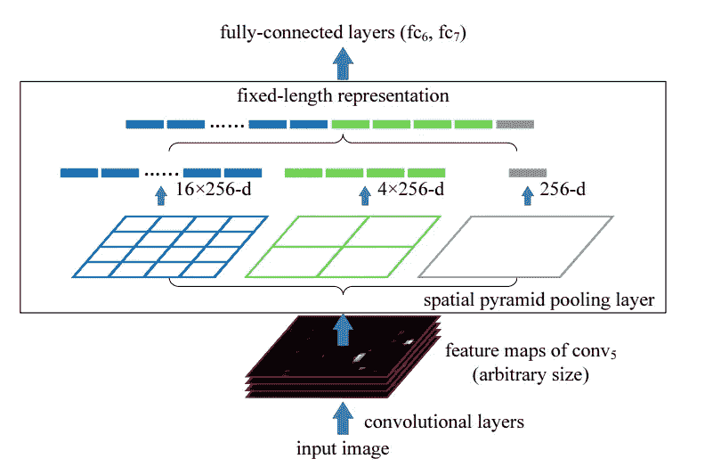
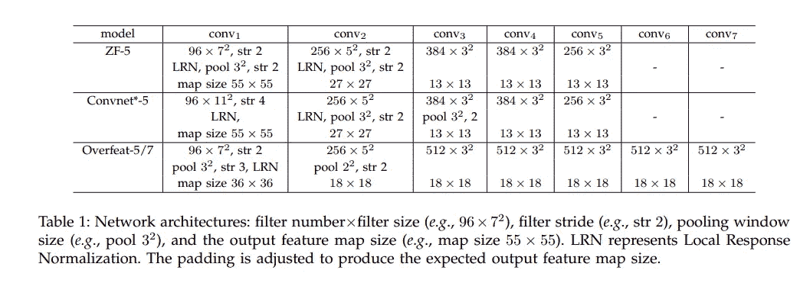
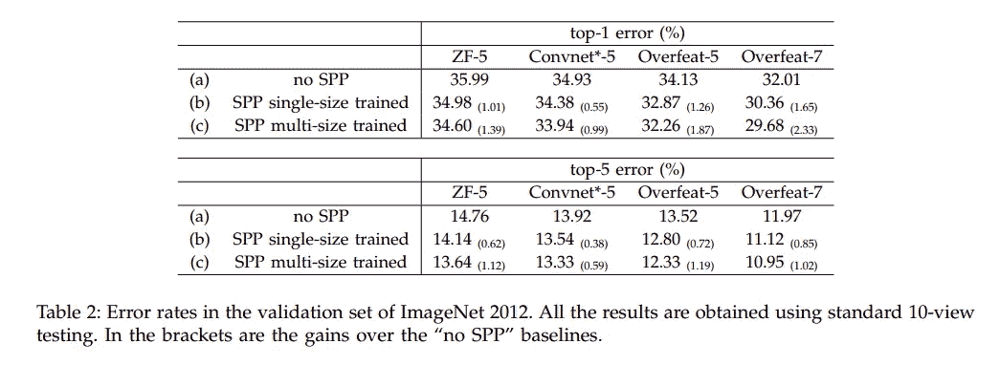
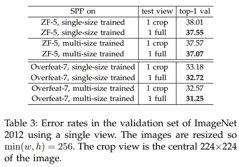
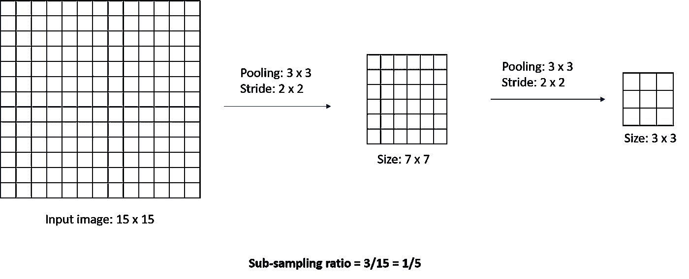
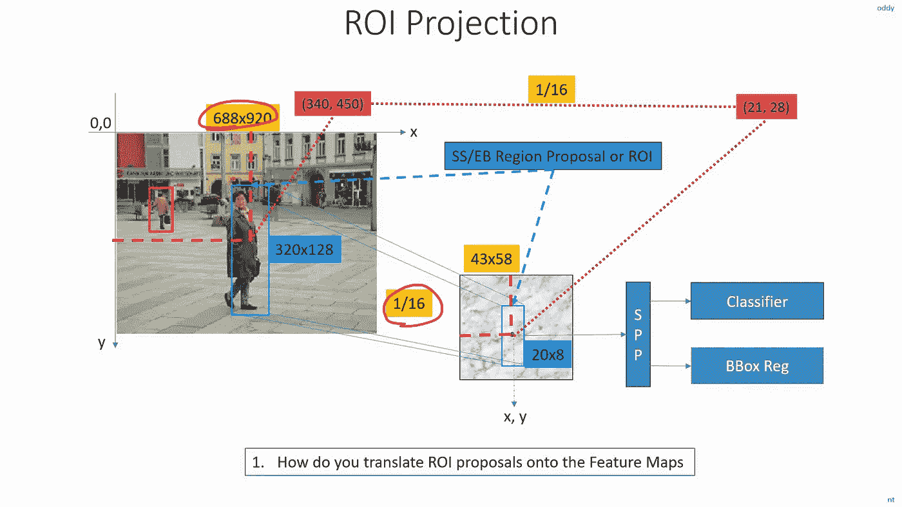
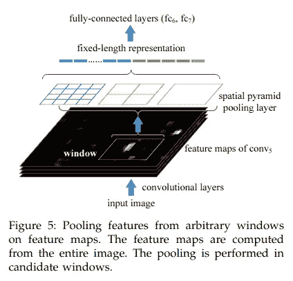
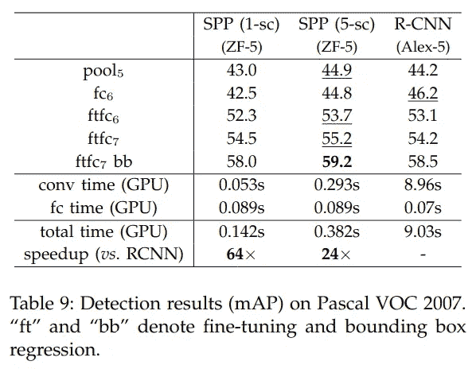

# 了解用于对象分类和检测的 SPPNet

> 原文：<https://towardsdatascience.com/understanding-sppnet-for-object-detection-and-classification-682d6d2bdfb?source=collection_archive---------8----------------------->

## SPPNet 的分析与评述

## SPPNet 允许可变大小的 CNN 输入图像，并可用于分类和对象检测

谢尔盖·阿库利奇在 [Unsplash](https://unsplash.com?utm_source=medium&utm_medium=referral) 上的照片

在论文“[用于视觉识别的深度卷积网络中的空间金字塔池](https://arxiv.org/pdf/1406.4729.pdf)”中，介绍了一种称为空间金字塔池层的技术，该技术使得 CNN 模型与输入图像大小无关。它是 ILSVRC 2014 中物体检测的亚军和分类挑战的亚军，因此值得一读。

在这篇文章中，我解释了 SPP 层，然后回顾了整篇文章。博客的结构是学生和老师之间的对话。

## 学生

我希望了解更多关于物体检测的知识。上次，你已经解释了用于物体探测的 R-CNN 网络。**在 R-CNN 之后，在目标检测领域还有其他研究吗？**

## 教师

在 R-CNN 之后不久，SPP-Net 被引入。与 R-CNN 相比，SPPNet 使模型与输入图像大小无关，并显著提高了边界框预测速度，而不影响地图。我将首先解释如何使模型不可知的输入图像大小。

CNN 网络的固定大小限制不是因为卷积层，而是因为全连接(FC)层。单个卷积层或一组卷积层获取图像，并产生与输入图像的特定比率(称为子采样比率，稍后解释)成比例的特征图。但是对于完全连接的层，输入必须是固定长度的向量。为了解决这个问题，作者用一个**空间金字塔池(SPP)** 层替换了最后一个池层(FC 层之前的层)。

> **注意:**SPP 方法受[词汇袋](/bag-of-visual-words-in-a-nutshell-9ceea97ce0fb)方法的启发。不需要对单词包有深入的理解，但是了解它将有助于对概念的理解。

## 学生

我所看到的池层有一个固定的大小，比如说，2 x 2，两个方向的步幅都是 2。所以在这种情况下，输出与输入保持比例。**池层如何解决问题？**

## 教师

在上面描述的池层中，您已经设置了固定步幅(2)和固定窗口大小(2 x 2)。正因为如此，你的输出总是与输入成正比。现在**如果你让池窗口和步幅与输入图像成比例，你总能得到固定大小的输出。**此外，SPP 层不仅仅应用一个池化操作，它还应用了几个不同输出大小的池化操作(这就是相同操作的来源——空间金字塔池化),并在将结果发送到下一层之前将其合并。

空间金字塔池(SPP)层— [论文](https://arxiv.org/pdf/1406.4729.pdf)

在上图中，作者使用了三个池操作，其中一个操作只为每个地图输出一个数字。另一个为每个贴图提供 2 x 2 的网格输出，同样，最后一个提供 4 x 4 的输出。该操作被应用于由先前卷积操作给出的每个特征图(在上述情况下为 256 个图)。SPP 层输出被展平并发送到 FC 层。

现在要计算窗口大小和步幅大小，让我们声明一些变量和公式。

*   假设输入到 SPP 层的特征地图的大小为`[a x a]**↔**[13 x 13]`
*   我们需要单个地图的输出大小为`[n x n]**↔**[4 x 4]`
*   `window = ceiling(a/n)` **↔** 天花板(13/4) **↔4**
*   `stride = floor(a/n)` **↔** 楼(13/4) **↔3**

现在在[13 x 13]地图上，应用上面的窗口([4 x 4])和步幅([3 x 3])，我们得到的输出是[4 x 4]。该操作应用于所有的特征映射，对于 256 个特征映射，我们得到[4 x 4 x 256]的输出。因此，现在我们可以改变[n x n]网格大小，以获得所需的输出大小。

## 学生

SPP 层是网络的直观设计，因为它使 CNN 模型产生的结果与输入图像大小无关。所以根据我的理解，**在把特征发送到全连接层之前，我可以把这个层应用到任何 CNN。作者在本文中使用了哪些模型？**此外，由于在 FC 层之前引入了一个全新的层，因此**对于分类任务，作者是否使用了任何预训练的架构或者他们从一开始就训练了一个模型？**

## 教师

人们可以将 SPP 层应用于任何 CNN 架构。但是，我们谈论的是 2014 年的时间。当时出席的模特不多。作者使用了 ZF 网、AlexNet 和 over fat(5 层和 7 层)架构。然而，通过改变填充来修改这些网络，以获得期望的输出特征图。

SPPNet 中使用的 CNN 模型架构— [论文](https://arxiv.org/pdf/1406.4729.pdf)

作者在 ImageNet 2012 数据集上训练了该模型，并提供了对训练细节的详细分析，并将它们与没有在其上使用 SPP 层的当代模型进行了比较。然而，在深入本质细节之前，让我们先弄清楚一些定义。

> **多尺寸/多比例图像:**改变输入图像尺寸
> 
> **多视图:**使用图像增强——从输入图像中截取部分并翻转。

首先，作者在模型上用一个单一大小的输入[224 x 224]训练，然后用一个可变大小的输入[224 x 224]和[180 x 180]训练。作者在固定大小的图像上执行训练，以利用 GPU 实现的优势。在为**多尺寸**训练时，它们在一个时期发送相同的图像尺寸，然后改变到另一个时期。用于上述两种训练的金字塔是:{6 x 6，3 x 3，2 x 2，1 x 1}。

> **注意:**为了训练，图像被调整大小，使得最小值(高度、宽度)等于 256，并且剩余部分基于纵横比被调整。之后，从中心和四个角拾取 224 x 224 的作物，给我们总共 5 个 224 x 224 的图像。图像被翻转以从相同的位置产生 5 个以上的图像，从每个输入图像给出总共 10 个图像。

ImageNet 12 验证集分析— [论文](https://arxiv.org/pdf/1406.4729.pdf)

作者将**单一大小**训练的 SPP 模型与没有 SPP 的模型进行了比较，发现误差减少了。为了证明误差的减少是由于 SPP 层而不是由于参数的增加，他们将 SPP 层的金字塔更改为{4 x 4，3 x 3，2 x 2，1 x 1}，这大大减少了参数，但误差仅略有增加。

对填充尺寸和裁剪图像的验证— [纸张](https://arxiv.org/pdf/1406.4729.pdf)

作者还尝试用 224 次裁剪和不用 224 次裁剪来检验该模型，并对结果进行了分析。观察到误差减少，如上图所示。根据这种损失的减少，作者说:

> 由此可见维护完整内容的重要性。

## 学生

从上面的数字，我们可以说 SPPNet 论文中引入的新层确实减少了分类任务的误差。**我还想知道作者是如何推断出对象检测任务的模型的？**

## 教师

作者可以使用该模型进行对象检测，并可以添加一个包围盒检测器来拍摄地图。然而，为了理解这是如何发生的，我们将首先理解**子采样率**的概念

了解子采样率-作者提供的图像

子采样率可用于从输入图像形状确定 CNN 特征图的输出形状。简单地将输入图像尺寸乘以**子采样率**将得到特征图尺寸。我们一会儿会用到这个概念。

> **注意:**填充确实会影响子采样率，因为我们可能需要根据填充增加/减少一个常数。文件附录中提供了详细信息。

SPPNet 论文已经显示了用于对象检测的 ZF 网论文的分析。ZF 网论文的次抽样比率为 16。现在，对于对象检测，他们仍然使用选择性搜索算法来确定区域(每幅图像约 2k 个区域)的建议。但与 R-CNN 不同，它们不会将每个建议区域发送到 CNN，而是将这些区域映射到最后一个卷积层(Conv5)的输出特征图。

从图像到特征图的对象映射——来自视频的[SS](https://www.youtube.com/watch?v=wGa6ddEXg7w&list=PL1GQaVhO4f_jLxOokW7CS5kY_J1t1T17S&index=72)

在上面的图像中，图像中的对象被映射到特征映射。让我们看看数学，看看如何做到这一点。

*   设图像尺寸为`[img_height, img_width]` **↔**【688×920】
*   让出现在图像中的一个物体的中心在`[x, y]`**↔**【340，450】
*   上述物体的高度和宽度是`[obj_height, obj_width]`**↔**【320，128】
*   现在，为了将它们映射到特征图上相应的空间位置，我们简单地将它们乘以`sub-sampling ratio (S)` **↔** 16。
*   特征地图的尺寸将会是`[img_height * S, img_width * S]` ↔[43 x 58】
*   特征图上的物体中心将在`[x * S, y * S]` ↔[21，28】的空间位置
*   特征图上对象的高度和宽度将为`[obj_height * S, obj_width * S]` ↔[20 x 8】

这样，我们可以将输入图像中的任何对象映射到输出特征图。对象的坐标也被投影到特征地图，然后只有该区域被发送到 SPP 层进行特征提取，然后发送到 FC 层。

对象窗口到特征图的映射— [论文](https://arxiv.org/pdf/1406.4729.pdf)

## 学生

将输入图像中的区域投影到特征图上以避免在图像的相同部分上进行冗余的卷积运算是减少计算量的一种聪明的方法。**与 R-CNN 相比，这种机制是否影响了检测图谱？**

## 教师

在比较它的性能之前，我们还需要了解一些细节。作者使用了单一大小([224 x 224]而已)的 ImageNet 预训练 ZF-5 网络。为了检测，他们使用了两种不同的方法进行预测:**单尺度** —其中最小值(高度，宽度)= 688，**多尺度**其中最小值(高度，宽度)= {480，576，688，864，1200}和其他尺寸根据长宽比调整大小。

在**多尺度**检测的情况下，作者使用了一种选择尺度的新策略，该尺度具有最接近对象的像素总数(224 x 224 = 50，176)，以确定该尺度中对象的存在。

与 R-CNN 相比，在单尺度下，性能下降了 0.5%，而在多尺度下，性能提高了 0.7%。虽然地图的增加并不大，但速度却有相当大的提高。作者还比较了有和没有微调 FC 层的模型，并将其与 R-CNN 进行了比较，结果如下所示。

> **注:**卷积层没有微调，只有 FC 层。

与 R-CNN 在 Pascal VOC 07 — [论文上的比较](https://arxiv.org/pdf/1406.4729.pdf)

> **注:**我们已经讨论了 Pascal VOC 2007 数据集上的对象检测结果。

论文中的大部分关键概念都已经讨论过了。但是，我建议您阅读这篇论文，因为他们在分类和检测部分提供了更详细的分析。

理解 SPP 层使得学习在此之后构建的两阶段模型变得更加容易。我将很快在 FastR-CNN 的报纸上写作。敬请期待！！

# 参考

K.何，X 张，s 任，孙军，[用于视觉识别的深度卷积网络空间金字塔池](https://arxiv.org/pdf/1406.4729.pdf)，，2014