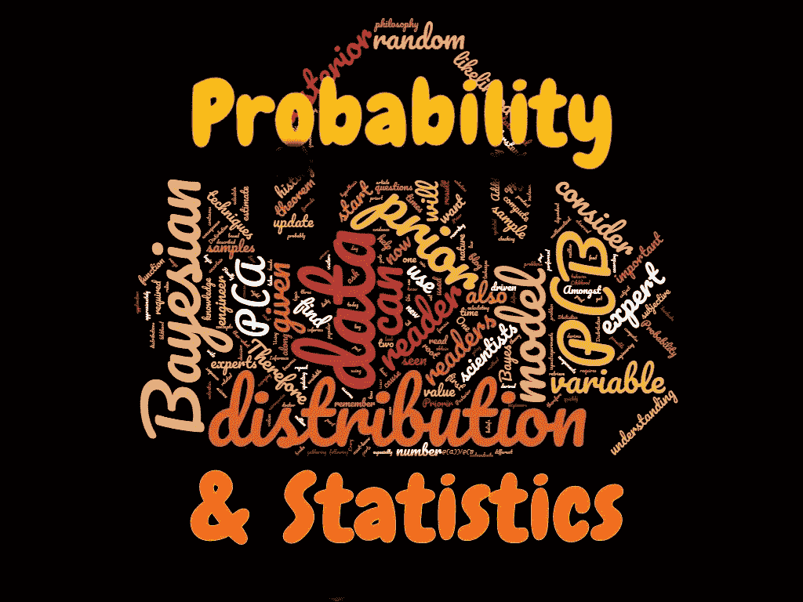
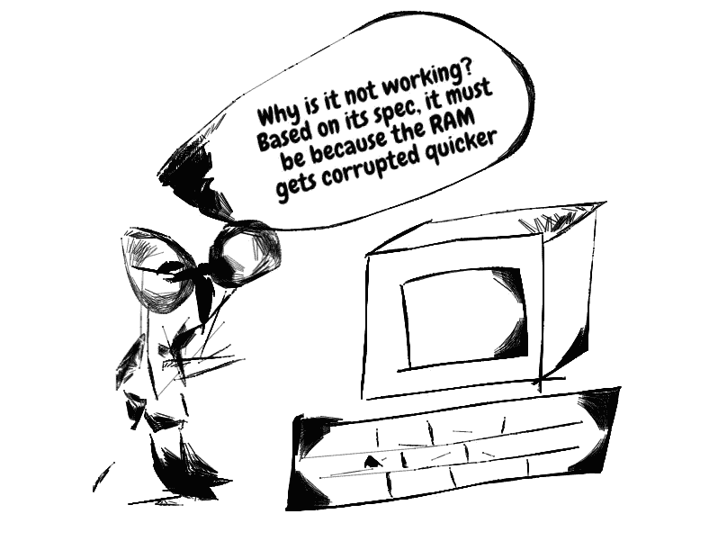
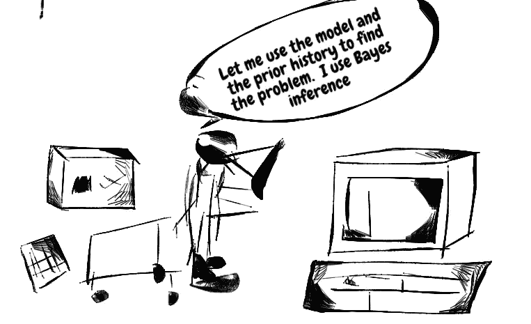
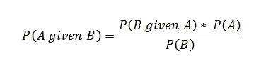
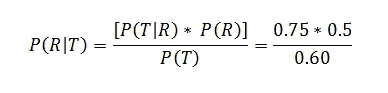
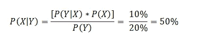
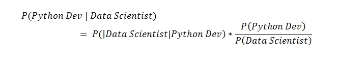
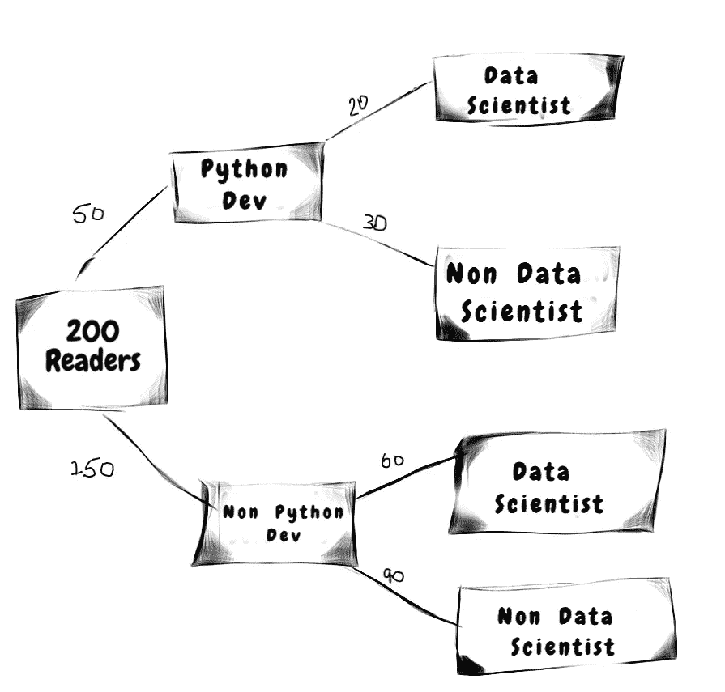
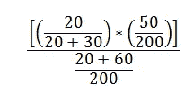

# 理解统计和概率:贝叶斯推理

> 原文：<https://towardsdatascience.com/understanding-statistics-and-probability-bayesian-inference-ec98bd570502?source=collection_archive---------15----------------------->

## 了解统计的一个关键领域，这一领域在许多部门引起了兴趣

贝叶斯推理是最流行的统计技术之一。这是一种在收集新数据时更新事件先验概率的技术。贝叶斯推理是一种数据驱动的技术。

传统上，贝叶斯模型是首先使用的模型之一。它们被用作基线模型，因为它们基于对世界的简单看法，并使科学家能够更容易地解释推理。因此，贝叶斯推理是统计学中最重要的学习技巧之一。

> 本文将向读者介绍贝叶斯推理。这是一个必须知道的话题。

概率统计中的一个重要概念

# 文章目标

本文将概述以下概念:

1.  什么是贝叶斯推理？
2.  什么是贝叶定理？
3.  理解概念的例子
4.  朴素贝叶斯模型

贝叶斯推理在很多领域都有应用，包括保险、医疗保健、电子商务、体育、法律等等。贝叶斯推理在分类算法中被大量使用，由此我们试图将文本或数字分类/分组到它们适当的类别中。

此外，中国对银行业，尤其是金融业的兴趣日益浓厚。

# 1.什么是贝叶斯推理？

在我解释什么是贝叶斯推理之前，我们先来了解一下关键的构建模块。

我先举一个例子。

## 计算机工程师示例

假设我有一台停止工作的电脑。我家附近有两个电脑工程师会修电脑。

两位工程师都声称有不同的技术来诊断和解决问题。

## 第一工程师——频率主义方法

第一个工程师有一个模型，由一个数学方程组成。这个模型是根据一个事件的发生频率建立的。该模型需要一组输入来计算计算机为什么停止工作的诊断。

第一个工程师诊断问题的方式是询问模型需要作为输入的问题。

例如，工程师会询问计算机规格，如操作系统、硬盘大小和处理器名称。然后，他会将答案输入模型，然后模型会给出计算机故障的原因。

该模型将使用观察到的事件频率来诊断计算机停止工作的原因。

频繁主义方法

## 第二工程师—贝叶斯方法

第二个工程师有一个稍微不同的机制来诊断问题。他还使用了第一个工程师使用的相同模型，但是除了该模型之外，他还利用了事件的先前历史来诊断问题。因此，工程师会问与第一个工程师相同的问题，但他也会询问问题的先前历史。

例如，第二个工程师会询问计算机规格，如操作系统、硬盘大小和处理器名称。此外，他还会询问有关计算机历史记录的问题，例如，它过去是否停止过工作，如果知道的话，它停止工作的原因以及事件发生的次数。

工程师将收集该台计算机的适当历史记录，以便更好地了解问题。这种技术被称为贝叶斯推理。简而言之，在贝叶斯推理中，我们使用先验历史和已知模型来计算后验结果。

贝叶斯方法

> 第一个工程师使用频率主义方法，第二个工程师使用贝叶斯推理方法。

频率主义方法在小样本量的情况下并不准确，因为它是基于积极事件发生的观察频率，而贝叶斯方法依赖于关于事件发生概率的先验信念。话虽如此，频率主义方法比贝叶斯推断更容易实现和理解，通常用于大样本量。

贝叶斯推断是一种统计推断方法，在这种方法中，随着更多的证据或信息变得可用，贝叶斯定理用于更新假设的概率。贝叶斯更新在数据序列的动态分析中尤其重要。

贝叶斯推理技术是基于贝叶斯定理的。贝叶斯定理可以通过使用先验和似然分布计算后验分布来帮助我们更新随机变量的知识。

这就把我们带到了文章的第二部分。

# 2.贝叶斯定理

简单地说，贝叶斯定理计算一个事件的后验概率。它使用事件的先验概率和似然概率。

让我们考虑一下，我们想要估计一个目标变量的行为。这个目标变量本质上可以是随机的。因此，我们从收集随机样本的数据开始。这个数据是我们的样本集，它有自己的抽样分布。由于每个样本都有不同的数据点，分布可以帮助我们量化采样技术中的误差。

一旦收集了样本，进行了实验，我们现在可以使用贝叶斯定理来获得新的信息，以更新我们先前的理解。

贝叶斯定理是一个框架，它使我们能够在一个事件已经发生的情况下计算另一个事件发生的概率。

## 贝叶斯定理公式

两个随机变量 A 和 B 的贝叶斯定理是:

贝叶斯定理公式

**让我们来理解一下公式**

上面的公式表明有两个事件:A 和 B

我们试图找到条件概率；假设事件 B 已经发生，事件 A 发生的概率。这就是所谓的后验分布。

1.  它的计算方法是，假定事件 A 已经发生，通过计算事件 B 发生的概率与事件 A 的无条件概率的乘积，得出事件 A 和 B 的联合概率。这显示在分子中。

2.最后，我们将联合概率除以事件 B 发生的概率。

## 三个主要组成部分

贝叶斯推理得出后验概率。它假设后验概率是两个主要输入(为简单起见)的结果:先验概率和似然函数。似然函数来源于统计模型本身。贝叶斯推理根据贝叶斯定理计算后验概率。

1.  我们计算的是后验分布。这是 P(给定 B)。

2.我们已经有的是 P(B)。这是事件 B 已经发生的概率。

3.最后，P(B|A)是似然概率。它是在 A 已经发生的情况下，B 发生的概率。

每当我们想要预测一个随机变量时，我们已经有了一个先验的已知分布。举个例子，我们有一个先验分布，如果我们掷硬币一百万次，那么我们看到正面的次数大约是 50%

> 贝叶斯统计的目标是计算后验分布。

对于先验分布，我们使用贝叶斯定理来获得后验分布。这是我们看到数据后更新的认识。利用后验分布，我们可以总结我们对数据的理解。

> 贝叶斯推理是数据驱动的，因为先验分布和后验分布是由数据驱动的

# 3.理解概念的例子

我相信应用概念来解决实际问题，因为只有这样我们才能彻底理解概念。

## 1.让我们来看一个简单的例子:跑步和训练

让我们假设你正在训练在 25 分钟内跑完 5 公里。

如果你在健身房训练，你想知道达到跑步目标时间的概率。

让我们用贝叶斯公式来找出概率

在高层次上，我们需要四个数字

1.  P(R)是在 25 分钟内跑完 5 公里的概率。50%是基于收集的数据，因此 50%的人在 25 分钟内跑完 5 公里。
2.  P(T)是在健身房训练的概率。60%是基于收集的数据，因此 60%的人进行训练，不管他们是否在 25 分钟内完成了跑步。
3.  P(T|R)是假设一个人在 25 分钟内完成了 5 公里跑步，他/她正在健身房训练的概率。是 75%。

**问题:假设你在健身房训练，在 25 分钟内跑完 5 公里的目标时间的可能性有多大？**

因此，问题是找到 P(R|T)。我们知道它的计算方法是:

答案是 62.5%

## 2.另一个例子是金融机构的债券违约

让我们假设我们在一家金融机构工作，并希望在另一只债券 Y 已经违约的情况下，找出债券 X 违约的概率。

我们可以创建一个概率矩阵来可视化这个问题:

债券的概率矩阵

使用概率矩阵求解非常简单。

1.  假设债券 X 已经违约，债券 Y 违约的联合概率是 10%(右下角方框)
2.  不管债券 X 是否违约，债券 Y 违约的概率都是 20%(第二栏的总和)

举例回答

因此，如果债券 Y 已经违约，债券 X 有 50%的可能违约。

## 3.让我们用另一个例子来理解

让我们假设我们知道每天有 X 个读者阅读这个博客。假设一个读者是数据科学家，我想计算他/她是 Python 开发者的概率。

让我们把 A 称为一个数据科学家读者。

*   读者是数据科学家的概率是 P(A)
*   读者不是数据科学家的概率是 P(A’)

让我们把 B 称为是 Python 开发者的读者。

*   读者是 Python 开发者的概率是 P(B)
*   读者不是 Python 开发者的概率是 P(B’)

假设一个读者是数据科学家，那么他/她是 Python 开发者的概率有多大？

解决方案是:

问题的公式

因此，我们可以从收集一天所需的数据开始。

让我们考虑以下数字:

今天有 200 名读者阅读了这个博客

在 200 名读者中:

*   20 名读者是数据科学家，因为他们是 Python 开发人员
*   30 读者不是数据科学家，他们是 Python 开发者
*   60 名读者是数据科学家，而不是 Python 开发者。
*   90 位读者既不是 Python 开发者，也不是数据科学家。

**那么问题是——假设一个读者同时也是数据科学家，那么他成为 Python 专家的可能性有多大？P(B|A)**

我们可以计算一棵树来形象化它:

概率决策树

问题的公式

因此，概率计算如下:

得到概率的方程式

这给了我们 25%

因此，假设读者是数据科学家，那么他/她有 25%的机会是 Python 开发人员。

# 4.贝叶斯模型—朴素贝叶斯

最后，我想向读者介绍朴素贝叶斯模型。在大多数分类数据科学项目中，特别是在文本挖掘项目中，朴素贝叶斯模型被用作基准/基线模型。

该模型本质上是概率性的。它基于我上面解释的概念。因此，它使用贝叶定理来计算结果。

这个模型之所以被称为天真，是因为它的基础是对现实的极度简化。它假设数据中的要素在给定类标签的情况下相互独立。对于大多数数据集来说，这种假设并不完全正确。

作为一个实例，这些特征可能被链接在一起。解释一下，像国家历史博物馆或白金汉宫或白宫或黑色日等词，当它们一起写在不同的句子中时，有完全不同的意思。因此，这表明对这些特征有某种形式的依赖。

> 简单起见，朴素贝叶斯模型假设所有特征都是独立的。有时一个可以解释的模型比一个无法解释的精确模型更重要

传统上，贝叶斯模型是首先使用的模型之一。它们很容易解释，因为它们是基于对世界的简单看法。此外，参数很容易理解。因此，为什么朴素贝叶斯分类器被视为基线模型。

# 摘要

本文解释了什么是贝叶斯推理和贝叶斯定理。

感谢您的阅读

特别是，它概述了以下主题:

1.  什么是贝叶斯推理？
2.  什么是贝叶定理？
3.  理解概念的例子
4.  朴素贝叶斯模型

贝叶斯推理在很多领域都有应用，包括保险、医疗保健、电子商务、体育、法律等等。贝叶斯推理在分类算法中被大量使用，由此我们试图将文本或数字分类/分组到它们适当的类别中。

此外，中国对银行业，尤其是金融业的兴趣日益浓厚。