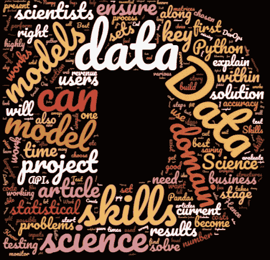
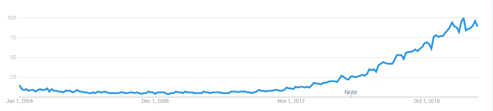
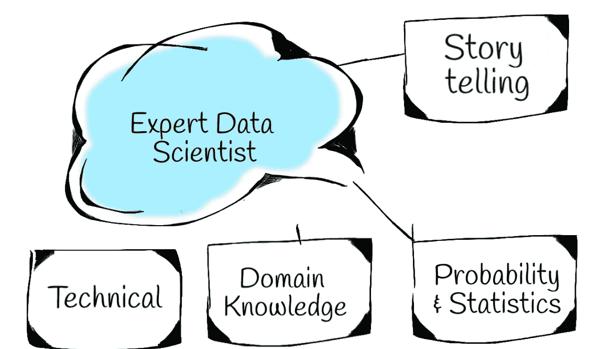
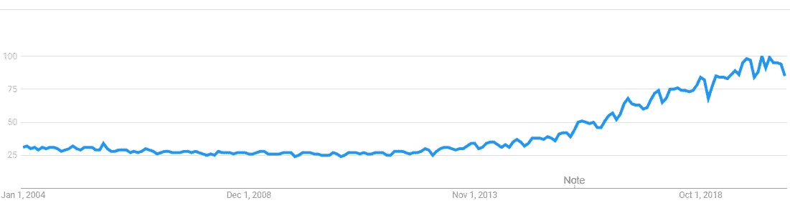
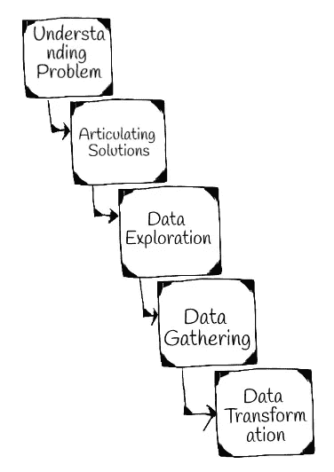
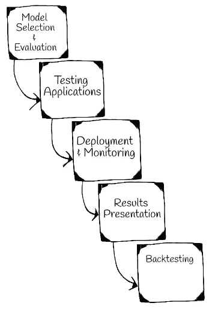
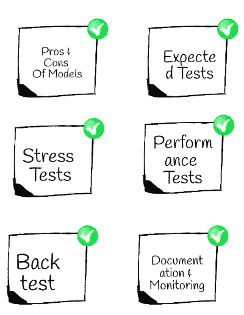
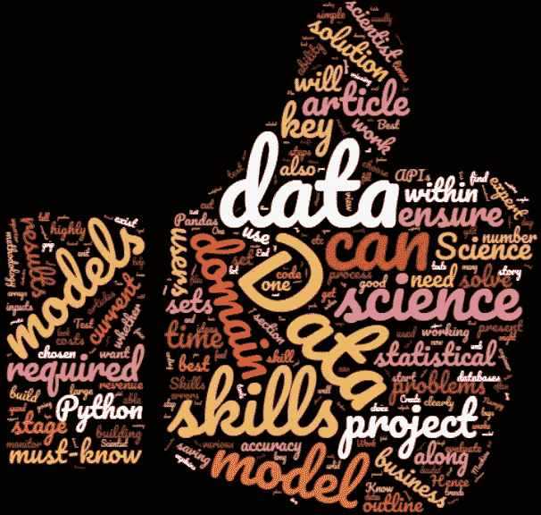

# 理解统计和概率:成为专家数据科学家

> 原文：<https://towardsdatascience.com/understanding-statistics-and-probability-becoming-an-expert-data-scientist-b178e4175642?source=collection_archive---------12----------------------->

## 介绍数据科学家的专业技能以及最佳实践和成功的数据科学项目步骤

数据科学是当今的热门话题。组织认为数据科学家是 T2 的精英。业内每个人都在谈论数据科学的潜力，以及数据科学家可以为他们的 BigTech 和 FinTech 组织带来什么。做数据科学家很有吸引力。

本文将概述成为数据科学领域专家所需了解的一切。

关于专家数据科学家的话题。作者图片

在困难时期，对数据科学家的需求更大，因为能够从事削减成本和创造收入的项目至关重要。数据科学项目之所以成为可能，主要是因为先进的计算能力、数据可用性和廉价的存储成本。

> 定量分析师、软件工程师、业务分析师、测试人员、机器学习工程师、支持人员、开发人员、项目经理到销售主管都可以在数据科学领域工作。

# 文章目标

这是本文的四个部分:

1.  数据科学家——魔术师
2.  专家数据科学家的基本技能
3.  数据科学项目阶段
4.  数据科学常见陷阱
5.  数据科学最佳实践

本文将介绍什么是数据科学以及它是如何工作的。我还将概述成为一名成功的数据科学家所需的技能。此外，本文将概述成功的数据科学项目的 10 个阶段。然后，文章将提到我们在数据科学建模项目中面临的最大问题，以及我建议每个人都熟悉的最佳实践。

我还将强调成为专家数据科学家所需的技能。有时，很难写下所有的东西，但我会尝试向有抱负的数据科学家提供我推荐的所有信息。

# 1.数据科学家——魔术师

专家数据科学家可以利用他们的高级编程技能、卓越的统计建模知识、领域知识和直觉，提出本质上具有创造性的项目想法，可以降低成本，并为企业带来可观的收入。

我们所需要做的就是在谷歌趋势中找到术语*数据科学*，来想象这个领域有多受欢迎。随着时间的推移，人们的兴趣越来越浓，而且还在不断增长:

2004 年以来数据科学的全球趋势。来自谷歌趋势

数据科学项目可以解决曾经被认为不可能解决的问题。

专注于数据科学的解决方案将技术推向了更高的水平。我们看到了试图模拟波动性、价格和实体行为的解决方案。许多公司已经实现了奇妙的数据科学应用，而不仅限于 FinTech 或 BigTech。

在我看来，数据科学的保护伞要求个人具备多种多样的技能；从开发、分析到 DevOps 技能。

# 2.专家数据科学家的基本技能

要成为一名成功的专家数据科学家，必须具备正确的基础。

首先，数据科学是计算机科学和统计学的一个分支。因此，它涉及到一个人获得计算机科学和统计知识。关于它没有两种方法。虽然知识越多越好，但是我们不能一下子学会所有的东西。有些领域比其他领域更重要。本文将只关注必须知道的技能。

成为专家数据科学家的关键技能。作者图片

在这一部分，我将概述所需的技能。在我看来，只有 4 个主要技能。

## 1.领域知识

在我们发明解决方案之前，我们需要了解问题。理解这个问题需要非常了解这个领域。

本部分的必备技能是:

*   了解领域内当前的问题和解决方案，以突出低效之处
*   对用户工作方式的深刻理解
*   收入是如何产生的，在哪里可以节省成本
*   了解谁是决策者以及难点是什么

该领域的用户是该领域最好的老师。成为某个领域的专家需要数年时间。在我看来，了解该领域的最佳方式是为用户编写一个数据科学应用程序，以解决该领域中最棘手的问题。

## 2.讲故事

对于数据科学家来说，最重要的技能是讲述并销售故事的能力，这一点我怎么强调都不为过。讲故事的必备技能是:

*   富有想象力
*   开放实验
*   自信地清晰简明地表达观点
*   有说服力的
*   自信地寻求领域专家的指导
*   展示数据和方法

最重要的是，关键要素是真诚地相信你的想法。

因此，最重要的技能本质上是一种软技能。相信我，只要训练得当，我们都能掌握它。

故事应简明清晰地解释提议的数据科学解决方案要解决的问题。决策者应该能够确定问题确实存在，并且建议的解决方案可以帮助他们削减成本并产生更多收入。

> 没有讲故事，几乎不可能获得企业资助的项目，而没有项目，数据科学家的技能可能最终会腐烂。

利益相关者询问的常见问题围绕着时间线，这些时间线严重依赖于所需的数据。因此，帮助他们理解那些所需的数据集是什么以及到哪里去获取它们是至关重要的。

在项目生命周期中，解决方案通常会呈现给几个用户。因此，一个人应该能够自信地表达他/她的想法。

因此，关键技能是能够讲述您的数据科学项目的故事，并向目标受众介绍正确的细节。

## 3.技术技能:

我们需要能够至少准备一个原型，然后将其生产成生产质量的软件。

必备的技能是能够:

1.  创建类、函数、调用外部 API，并彻底理解数据结构。
2.  通过编程(SQL + Python)从各种来源加载和保存数据的专业知识
3.  能够编写函数将数据转换成适当的格式

很明显，理解使用微服务架构设计可伸缩的技术解决方案，以及持续集成和部署的知识是很重要的，但是我现在有意避免提及这些技能，我只关注必须知道的技能。还是那句话，知识越多越好，但是在这里，让我们只关注那些必须知道的。

虽然我们可以使用 R 编程语言，我也写过关于 R 的文章，但是我推荐并且更喜欢使用 Python 编程语言。Python 已经开始成为数据科学家事实上的选择。此外，还有巨大的社区支持。我还没有发现一个关于 Python 的问题没有得到回答。

Google trends 显示 Python 的受欢迎程度正在不断提高:

2004 年以来的全球 Python 趋势。摘自谷歌趋势

因此，技术部分的第一个关键技能是牢固掌握 Python 编程语言。

我强烈推荐阅读这篇文章:

 [## 关于 Python 的一切——从初级到高级

### 在一篇文章中你需要知道的一切

medium.com](https://medium.com/fintechexplained/everything-about-python-from-beginner-to-advance-level-227d52ef32d2) 

众所周知，数据科学家花费大量时间设计收集数据的解决方案。大多数数据本质上要么是基于文本的，要么是数字的。另外，数据集通常是非结构化的。Python 包的数量是无限的，要了解所有的包几乎是不可能的。有 3 个套装我一直推荐给大家:熊猫，Numpy 和 Sci-kit Learn。

Numpy 是数据科学生态系统中广泛使用的包。它在处理数字时非常高效和快速。Numpy 允许我们处理数组和矩阵。

了解如何做到这一点很重要:

*   创建集合，如数组和矩阵。
*   如何转置矩阵
*   执行统计计算并保存结果。

我强烈推荐这篇文章。理解 Numpy 就足够了:

 [## 为什么要用 NumPy？

### 在重新发明车轮之前了解 NumPy 特征

medium.com](https://medium.com/fintechexplained/why-should-we-use-numpy-c14a4fb03ee9) 

最后，由于我们大部分时间都花在玩数据上，我们严重依赖数据库和 Excel 电子表格来揭示数据集中隐藏的秘密和趋势。

为了找到这些模式，我推荐读者去学习熊猫图书馆。在熊猫的特性中，有必要了解:

*   什么是数据帧
*   如何将数据加载到数据帧中
*   如何查询数据框
*   如何连接和过滤数据框架
*   操纵日期，填补缺失值，并执行统计计算。

我推荐这篇文章，它正好解释了这一点:

 [## 你知道熊猫能做这么多吗？

### 不先探索熊猫就不要编码 Python

medium.com](https://medium.com/fintechexplained/did-you-know-pandas-can-do-so-much-f65dc7db3051) 

只要我们能够操纵数据并将其转换为适当的结构，我们就可以使用 Python 来调用任何机器学习库。我推荐每个人阅读 Scikit-learn 库的接口。

## 4.统计和概率技能

调用机器学习模型本质上是技术性的，但解释和增强模型需要概率和统计的知识。

让我们不要将机器学习模型视为黑盒，因为我们必须向利益相关者、团队成员解释工作方式，并在未来提高准确性。

统计和概率部分的必备技能是:

*   概率分布
*   取样技术
*   模拟技术
*   力矩的计算
*   透彻理解精度测量和损失函数
*   回归和贝叶斯模型理解
*   时间序列知识

一旦我们有了数据，理解数据的底层特征是很重要的。所以我推荐大家去了解统计和概率。特别是，关键是要掌握各种概率分布，它们是什么，采样如何工作，我们如何生成/模拟数据集，以及执行假设分析。

除非我们了解统计学领域，否则机器学习模型可能看起来是一个黑箱。如果我们知道统计学和概率是如何工作的，那么我们就能理解模型并自信地解释它们。

有两篇必读的文章，我推荐大家阅读，以便牢固掌握统计学和概率。

第一篇文章将解释概率的关键概念:

 [## 理解概率和统计:数据科学家的概率基础

### 为统计学家解释概率的关键概念

towardsdatascience.com](/understanding-probability-and-statistics-the-essentials-of-probability-for-data-scientists-459d61a8da44) 

第二篇文章概述了统计推断技术:

 [## 理解概率和统计:数据科学家的统计推断

### 构成数据科学家工作基础的一个必须知道的话题

towardsdatascience.com](/understanding-probability-and-statistics-statistical-inference-for-data-scientists-fd05bde7d63) 

虽然神经网络、激活函数、耦合函数、蒙特卡罗模拟和伊藤微积分的知识很重要，但我想专注于必须知道的统计和概率技能。

> 随着我们开始从事更多项目，我们可以研究高级/专家级架构和编程技能，了解深度学习模型如何工作，以及如何部署和监控数据科学应用，但有必要建立正确的基础。

# 3.数据科学项目阶段

让我们首先了解一个成功的数据科学项目需要什么。

我们可以用一百万种方式分割数据科学项目，但简单来说，有 10 个关键阶段。

我将在下面解释每个阶段。

数据科学项目的前 5 个阶段。作者图片

## 1.理解问题

这是数据科学项目的第一阶段。它需要获得对目标业务领域的理解。

它涉及数据科学家与企业主、分析师和团队成员的沟通。首先了解领域中的当前流程，以发现是否有任何低效之处，以及解决方案是否已经存在于领域中。关键是尽早向用户呈现问题和解决方案。

## 2.阐明解决方案

然后，选择的解决方案清晰地呈现给决策者。项目的输入、输出、交互和成本已经确定。

这种技能有时需要很长时间才能掌握，因为它需要销售和分析技能。人们需要非常好地理解这个领域，并向决策者推销这个想法。

关键是评估概念的合理性，写下并同意所有的假设和基准结果。总是选择一个基准过程。它可以是当前的过程，目标是产生一个优于当前基准过程的解决方案。用户通常知道并理解基准流程。始终记录基准解决方案的工作情况，因为这将有助于比较新的解决方案。

重要的是要提到这些假设，记下它们，并得到用户的确认，因为应用程序的输出将取决于这些假设。

## 3.数据探索

现在问题陈述已经确定，这一步需要研究项目中所需的数据。它涉及到寻找数据的来源以及所需的数量，例如历史数据的记录数或时间线，以及我们可以从哪里获取数据。

因此，它需要商业和定量分析技能。

## 4.数据采集

这一阶段主要是与数据团队进行沟通，并获取所需的数据。它需要使用高级编程技术构建工具来收集数据，并将数据保存到存储库中，如文件或数据库。可以通过 web 服务调用、数据库、文件等提取数据。

这需要调用 API 并将它们保存在适当的数据结构中的技术技能。我还建议每个人都充分理解 SELECT SQL 语句。

## 5.数据转换

此阶段需要检查每个要素，了解我们需要如何填充缺失值，需要执行哪些清理步骤，是否需要操纵日期，是否需要对数据进行标准化或规范化，和/或从现有要素创建新要素。

这个阶段需要理解数据统计概率分布。

数据科学项目的最后 5 个阶段。作者图片

## 6.模型选择和评估

这一阶段需要将数据输入统计机器学习模型，以便它们能够解释数据、训练自己并输出结果。然后，我们需要调整所选模型的参数，以获得最高的精度。这个阶段需要理解统计模型和准确性度量。有大量的模型可用，每一个都有其优点和缺点。

大多数机器学习模型已经用 Python 实现了，并且它们是公开可用的

关键是要能够知道调用哪个模型，用什么参数，以及如何衡量其准确性。

将输入数据分成三部分至关重要:

*   训练-用于训练模型
*   测试-用于测试已训练模型的准确性
*   验证-用于在微调模型超参数后提高模型准确性

我强烈推荐这篇文章。它以直观的方式解释了端到端的机器学习过程:

 [## 机器学习项目的端到端指南

### 解释如何通过简单的步骤构建成功的机器学习模型

medium.com](https://medium.com/fintechexplained/end-to-end-guide-for-machine-learning-project-146c288186dc) 

首先选择一个简单的模型也是明智的，它可以给你预期的结果。这个模型被称为基准模型。回归模型传统上是很好的基准模型。

回归模型很简单，可以在早期发现数据集中的错误。记住过度拟合是一个问题，模型越复杂，就越难向用户解释结果。因此，总是先查看更简单的模型，然后应用正则化来防止过度拟合。我们还应该利用 boosting 和 bagging 技术，因为它们可以根据频率对观测值进行加权，并提高模型预测能力。一旦我们穷尽了简单的模型，只有这样我们才应该研究高级模型，比如深度学习模型。

要了解神经网络是如何工作的，请阅读本文:

 [## 理解神经网络

### 让我们来理解革命的概念

medium.com](https://medium.com/fintechexplained/understanding-neural-networks-98e94251fb97) 

## 7.测试应用程序

这个阶段需要测试当前代码，以确保它按照预期工作，从而消除任何模型风险。我们必须对测试和 DevOps 技能有一个很好的理解，以便能够实现可以在每次签入时运行的持续集成构建计划。

构建计划应该执行代码的检验，运行所有的测试，准备代码覆盖报告，并产生所需的工件。我们的测试还应该包括向应用程序提供意想不到的数据。我们应该对应用程序进行压力和性能测试，并确保所有的集成点都能工作。关键是在您的解决方案中构建单元、集成和冒烟测试。我还建议构建一个行为驱动的测试框架，确保应用程序按照用户需求构建。我用过`behave` Python 包，推荐给大家。

## 8.部署和监控应用程序

这个阶段包括将代码部署到用户可以测试和使用应用程序的环境中。这个过程需要在没有任何人工干预的情况下运行。这涉及到实现持续部署的 DevOps 技能。它应该获取工件并部署解决方案。该流程应该运行冒烟测试，并通知用户应用程序已成功部署，这样一切都是自动化的。

我们经常被要求在容器中使用微服务架构来跨服务器水平部署解决方案。

解决方案启动后，我们需要对其进行监控，以确保它正常运行，没有任何问题。我们应该记录所有的错误，并实现我们可以调用的心跳端点，以确保应用程序成功运行。

> 数据科学项目不是一次性的项目。他们需要持续监控获得的数据集、问题和解决方案，以确保当前系统按预期运行。

我强烈推荐这篇旨在从基础知识方面解释微服务架构的文章:

 [## 什么是微服务架构？

### 微服务架构越来越受欢迎，几乎在所有主要的软件项目中都有使用。这是…

medium.com](https://medium.com/fintechexplained/what-is-microservices-architecture-1da41a94a29b) 

## 9.应用结果演示

我们现在准备展示结果。我们可能希望构建一个 web 用户界面，或者使用其他工具中的报告工具(如 Tablaue)向用户呈现图表和数据集。

这又回到了领域和讲故事的技巧。

## 10.回溯测试应用程序

最后，对应用程序进行回测也很重要。一旦模型被激活，我们想要确保它总是按照我们期望的那样工作。验证模型的一种方法是输入历史数据，并从数量和质量上验证结果。

当前项目成为下一阶段的基准。接下来的阶段可能涉及改变数据集、模型，或者只是微调超参数。

> 很难找到一个人可以独立完成所有阶段的工作，但这些超级明星在行业中确实存在，他们是专家数据科学家。获得所有需要的技能需要多年的努力，是的，只要有合适的项目和足够的时间，这是可能的。在一个阶段比另一个阶段更自信当然很好，但关键是对每个阶段都有足够好的理解。

# 4.数据科学常见陷阱

在从事数据科学项目时，记住常见的陷阱很重要。

这一部分将提供陷阱的概述。

数据科学项目的常见陷阱。作者图片

## 错误的输入数据

确保你的输入数据是高质量的，否则，你将花费大量的时间来产生一个对用户没有好处的解决方案。

## 错误的参数

模型本质上是一组函数。函数的参数通常是基于直觉和知识来校准和决定的。确保参数是正确的，并且参数中传递的数据是好的，这一点很重要。

## **错误的假设**

验证关于数据和模型及其参数的假设是很重要的。错误的假设最终会浪费大量的时间和资源。

## 型号的错误选择

有时我们选择了错误的模型，并给它输入正确的数据集来解决正确的问题。不出所料，应用程序会产生无效的结果。有些模型只适合解决特定的问题。因此，一定要确保所选择的模型适合您试图解决的问题。

## 编程错误

数据科学项目有时需要大量编码。在实现不正确的映射、数据结构、函数和一般的编码错误时，这些错误会被引入到项目中。关键是在您的解决方案中构建单元、集成和冒烟测试。我还建议建立一个行为驱动的测试框架。

> 软件工程师/分析师/经理或任何人都可以成为专业的数据科学家，只要他们继续在数据科学阶段工作

# 5.数据科学最佳实践

最后，我想概述一下数据科学项目的最佳实践。

最佳实践。作者图片

1.  注意模型的优缺点。不是所有的模型都能解决所有的问题。如果您选择了平滑技术，那么请确保您了解衰减因子以及该方法是否有效。始终选择一个简单的基准模型，并尽早将结果呈现给最终用户。另外，将数据分为训练集、测试集和验证集。
2.  始终构建一个基准模型，并向领域专家展示结果。根据预期输入测试项目，以确保结果符合预期。这将澄清假设和输入数据集的大部分问题。
3.  根据意外输入测试项目，以确保结果不是意外的。对项目进行压力测试极其重要。
4.  测试应用程序的性能。必须确保它能够处理大型数据集和请求。从一开始就建立 CI/CD 计划。
5.  总是根据历史数据对你的模型进行回溯测试。输入历史数据来统计遇到的异常数量是很重要的。由于历史不会重演，关键是要记住回溯测试可以验证项目实施时设定的假设。因此，总是对模型进行回溯测试。
6.  记录和评估提议方法的合理性，并监控应用。确保领域的业务用户在项目的早期阶段和各个阶段都参与进来。持续监控应用程序，以确保它的响应和工作符合预期。

# 摘要

感谢您的阅读。作者图片

数据科学是当今非常热门的学科。本文概述了成为一名成功的专家数据科学家所需的技能。然后，它概述了我们在数据科学模型构建项目中面临的最大问题以及最佳实践。

随着时间的推移，我们可以开始收集更多的数据，例如并行运行代码或构建容器来启动应用程序，或者模拟数据来预测模型。然而，这里的关键点是概述必须知道的技能。

让我知道你的想法。