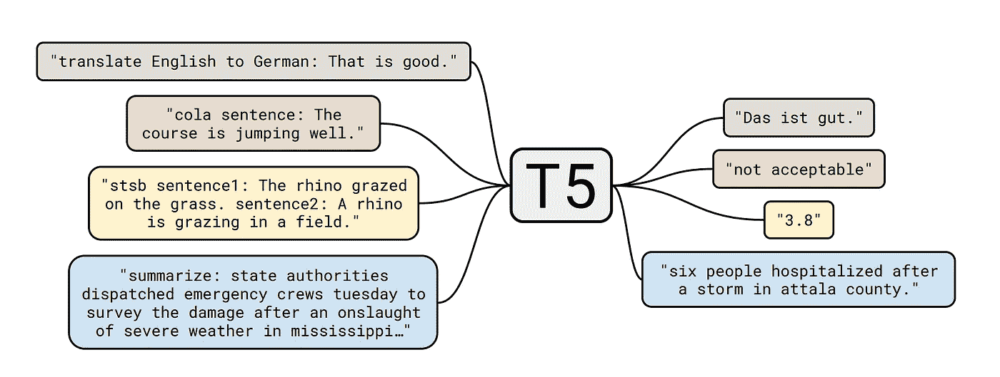
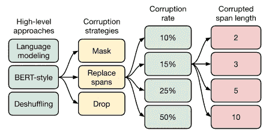

# 理解 T5 模型:文本到文本转换转换器模型

> 原文：<https://towardsdatascience.com/understanding-t5-model-text-to-text-transfer-transformer-model-69ce4c165023?source=collection_archive---------16----------------------->

[来源](https://miro.medium.com/max/4006/1*D0J1gNQf8vrrUpKeyD8wPA.png)

## 介绍

最近几年已经有太多的预训练模型被开源到 NLP 社区，比如[乌尔姆菲特](https://arxiv.org/abs/1801.06146)、[伯特](https://ai.googleblog.com/2018/11/open-sourcing-bert-state-of-art-pre.html)、 [GPT](https://openai.com/blog/better-language-models/) 等等。鉴于这种庞大模型的规模，考虑到所需的数据量和计算量，从头开始训练这种网络几乎是不可能的。这就是一种新的学习范式“**迁移学习**”开始发挥作用的地方。迁移学习是机器学习中的一个研究问题，它专注于存储在解决一个问题时获得的知识，并将其应用于不同但相关的问题。这个想法是使用预先训练好的网络权重，并对其进行微调，以完成手头的一些特定任务。我们希望利用网络权重的事实要求它首先在一个非常大的高质量语料库上进行训练，以学习**语言结构**、**语法**和**语义**。大多数现有的模型，如乌尔姆菲特、GPT，都是用[维基百科](https://www.tensorflow.org/datasets/catalog/wikipedia)和[谷歌新闻数据集](https://research.google/tools/datasets/)上的[语言模型](https://en.wikipedia.org/wiki/Language_model)目标进行预训练的。然而，另一方面，伯特接受了 **MLM(掩蔽语言模型)目标**的训练。在这篇文章的后面，我们将会看到什么是 MLM，以及 T5 是如何以相似的目标进行训练的，只是做了一些一般化的调整。只是为了确保每个人都在同一页上，一个[语言模型](https://en.wikipedia.org/wiki/Language_model)是一个[机器学习模型](https://en.wikipedia.org/wiki/Machine_learning)，它查看句子的历史部分并预测句子中的下一个单词。

[**T5:****T**ext-**T**o-**T**ext-**T**transfer-**T**transformer](https://arxiv.org/pdf/1910.10683.pdf)模型提出将所有 NLP 任务重新组织成一个**统一的文本到文本格式**，其中输入和输出总是文本串。这种格式使一个 T5 型号适合多种任务。从特色动画中可以看出，它从左侧为各种 NLP 任务接收文本输入，并为相应的任务输出文本。我们将在下面的章节中看到更多关于模型如何被训练的内容。在此之前，我想讨论一下用于预训练模型的数据。作者将其命名为 [C4](https://www.tensorflow.org/datasets/catalog/c4) **(庞大干净的爬行语料库)**。它的大小约为 700GB，是清理后的版本[通用抓取](https://commoncrawl.org/)数据集。作者提到了仅提取英文文本、删除代码行、重复数据删除等意义上的清理。这是一个高质量的预处理英语语料库，他们已经提供了下载。此外，T5 模型在 C4 上进行了预先训练，在许多 NLP 基准测试中取得了最先进的结果，同时具有足够的灵活性，可以针对各种重要的下游任务进行微调。

## 培训目标

第 10 页—[https://arxiv.org/pdf/1910.10683.pdf](https://arxiv.org/pdf/1910.10683.pdf)

T5 的训练目标也与 BERT 的相同，即稍加修改的掩蔽语言模型。**掩蔽语言模型**是[双向模型](https://medium.com/@plusepsilon/the-bidirectional-language-model-1f3961d1fb27)，在任何时候 t，单词的表征都是从它的左右语境中导出的。T5 采用的细微差别是用单个掩码关键字替换多个连续的标记，这与对每个单词使用掩码标记的 BERT 不同。从上图中可以看出，通过添加扰动，原始文本被转换为输入和输出对。由于最终目标是训练一个输入文本和输出文本的模型，目标被设计成产生一个序列，与 BERT 不同，它试图通过最终的[前馈](/deep-learning-feedforward-neural-network-26a6705dbdc7)和 [softmax](https://en.wikipedia.org/wiki/Softmax_function) 在输出级别输出一个单词(本身)。

该模型在 **C4 语料库** *(如上所述)*上进行训练，其目的与预训练的一部分相同。然后，它在各种任务上进行微调，如[语言翻译](https://machinelearningmastery.com/develop-neural-machine-translation-system-keras/)、[摘要](https://machinelearningmastery.com/gentle-introduction-text-summarization/)、[句子相似度](https://medium.com/@adriensieg/text-similarities-da019229c894)等。微调是通过向每个输入中添加特定于任务的前缀文本来显示模型 I/O 文本对。例如— **将英语翻译成德语:< text >** ，添加这样的前缀使模型能够针对手头的特定任务调整其权重，并且通过缩小其生成范围，仅产生该任务的预期输出。所有的任务本质上都有相同的目标、训练程序和解码过程。作者还声称，他们没有发现任何一个案例，其中模型变得混乱，并输出完全随机的东西或另一项任务的预期输出。一件非常有趣的事情是，他们甚至将**回归**任务建模为文本生成目标，比如句子相似度。为了缩小实数的范围，他们生成了一个 0 到 5 之间的 0.2 量化的数字，这意味着，该模型只能生成 0.2 差异的数字，例如-3.2，3.4，3.6 等。LR 计划、符号化、序列长度等训练级别细节可在 [3.1.2 中详细阅读。培训科。](https://arxiv.org/pdf/1910.10683.pdf)

作者进行了广泛的[超参数调整](https://en.wikipedia.org/wiki/Hyperparameter_optimization)和跨各种任务的测试。下图显示了不同级别的调整-

1.  **预训练风格** —他们尝试了典型的自回归风格语言建模目标、BERT 风格掩蔽语言模型目标和去混洗去噪目标。他们发现 BERT 风格(缺失上下文预测)是预训练模型的最佳选择。
2.  **讹误方案**——他们试验了 3 种讹误策略，屏蔽一个随机单词，屏蔽一个跨度(超过 1 个连续单词)，从输入中删除一个单词。考虑到手头的任务类型，即两个 I/O 都是文本字符串，破坏 span 最适合它们。
3.  **腐败率**-在尝试了不同的腐败率后，他们发现所有腐败率的表现几乎相同，其中 15%的腐败率略好。
4.  **讹误长度** —他们还试验了不同的讹误跨度长度，发现跨度长度越大，模型的性能越差，这似乎也是真的，考虑跨度长度等于句子长度将意味着模型从空输入中产生文本，使其具有高度可变性的灵活性。

第 19 页—【https://arxiv.org/pdf/1910.10683.pdf 

我也鼓励读者阅读[第 32 页:反思](https://arxiv.org/pdf/1910.10683.pdf)来理解培训模型的要点。

## 演示

本节将重点对预训练的 T5 模型进行推理。所有代码已经提交到[Github:Text-to-Text-Transfer-Transformer](https://github.com/prakhar21/T5-Text-to-Text-Transfer-Transformer)。随意克隆和玩。此外，不要忘记开始回购，以防你喜欢它。

 [## prak har 21/T5-文本到文本转换器

### 针对各种预培训任务的 T5 模型演示。-prak har 21/T5-文本到文本转换器

github.com](https://github.com/prakhar21/T5-Text-to-Text-Transfer-Transformer) 

你的母语不是英语吗？查看多语言字幕视频解说版本(同样，更详细)——

**参考文献**
1。[谷歌 AI 博客—T5](https://ai.googleblog.com/2020/02/exploring-transfer-learning-with-t5.html)2。[https://arxiv.org/pdf/1910.10683.pdf](https://arxiv.org/pdf/1910.10683.pdf)

> 你也可以查看我写的其他研究论文的解释
> 
> [基于图的文本相似度方法](https://medium.com/mlearning-ai/a-graph-based-text-similarity-method-with-named-entity-information-in-nlp-abc7f1201d96)
> 
> [用于移动设备的语法纠正系统](https://medium.com/mlearning-ai/efficient-system-for-grammar-error-correction-on-mobile-devices-3a207105b7a3)
> 
> [超越准确性:使用清单对 NLP 模型进行行为测试](/beyond-accuracy-behavioral-testing-of-nlp-models-with-checklist-48544db3fef1)
> 
> [用于摘要文本摘要的 BERT](https://medium.com/analytics-vidhya/leveraging-bert-for-extractive-text-summarization-on-lectures-294feb643486)
> 
> [用于抽象概括的飞马](https://medium.com/analytics-vidhya/pegasus-pre-training-with-extracted-gap-sentences-for-abstractive-summarization-acb238aa1096)

*我希望这本书值得你花时间阅读。谢谢大家！*

【https://prakhartechviz.blogspot.com】最初发表于**。**