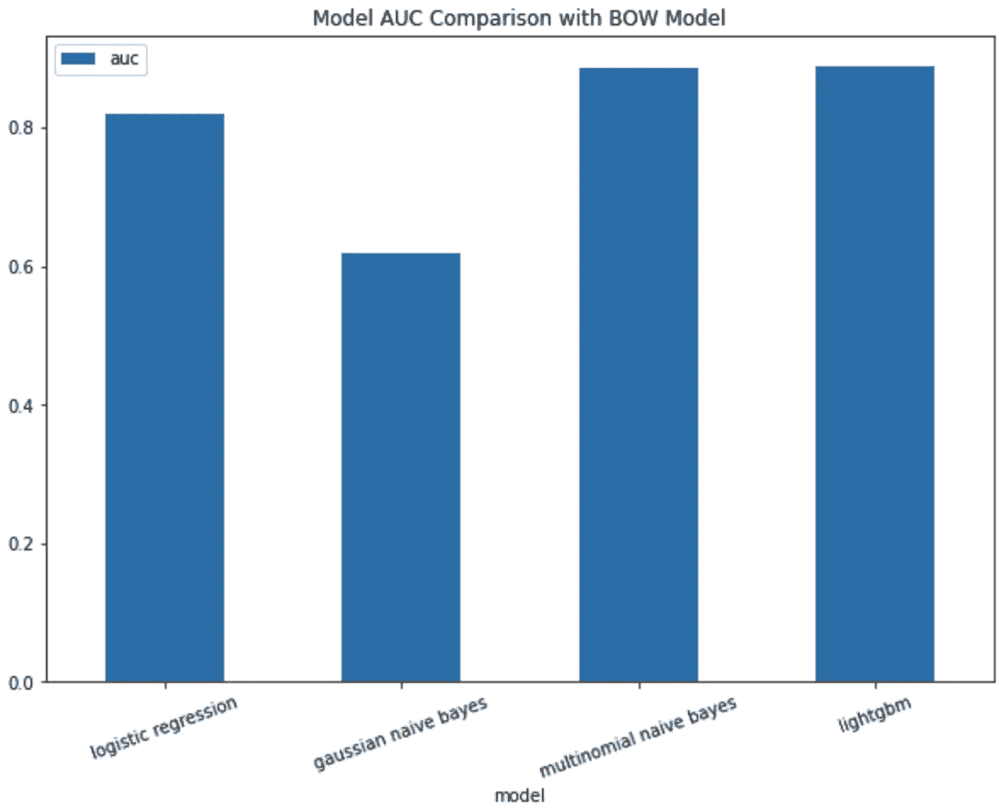
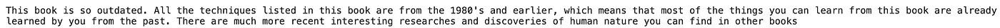
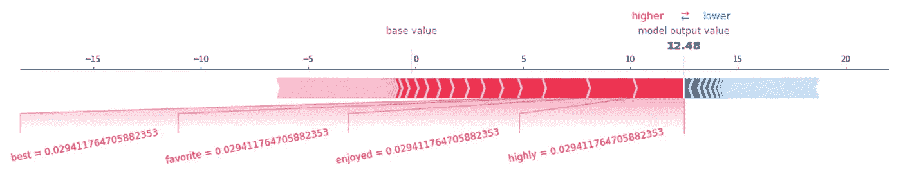
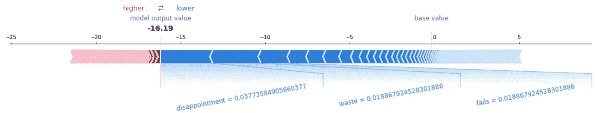

# 理解文本向量化 I:如何拥有一袋单词已经显示了人们对你的产品的看法

> 原文：<https://towardsdatascience.com/understanding-text-vectorizations-how-streamlined-models-made-feature-extractions-a-breeze-8b9768bbd96a?source=collection_archive---------44----------------------->

## 自然语言处理

## Sklearn 管道、SHAP 和面向对象编程在情感分析中的应用


照片由[阿玛多·洛雷罗](https://unsplash.com/@amadorloureiroblanco?utm_source=unsplash&utm_medium=referral&utm_content=creditCopyText)在 [Unsplash](https://unsplash.com/?utm_source=unsplash&utm_medium=referral&utm_content=creditCopyText) 拍摄

你知道吗，在神经网络变得无处不在之前，我们已经(几乎)解决了情感分析问题？

在当前自然语言处理(NLP)越来越依赖深度学习模型来产生惊人性能的时代，我们经常忽略最简单类型的文本矢量化技术的重要性——单词袋(BOW)和词频-逆文档频率(TF-IDF)。事实上，通过这两种技术，我们已经能够以超过 80%的准确率预测一段给定文本的情感。换句话说，我们对最先进的深度学习模型所做的一切只是试图从这些分类问题中挤出更多的性能改进。在某种程度上，几乎所有更复杂的模型都依赖于 BOW 和 TF-IDF 的概念。在这篇博文中，我们将在 sklearn pipelines 的帮助下，尝试理解和实现 BOW 和 TF-IDF。

## **为什么选择 Sklearn 管道？**

您可能会认为使用管道是一种极端的大材小用。事实上，实现管道需要在面向对象编程(OOP)中大量使用，这可能会使调试变得相当困难。虽然我花了两周的时间来实现 BOW 和 TF-IDF(其间我犯了一些错误，在另一篇博客中会有更多的介绍)，但这绝对值得花时间和精力。通过使用 sklearn 管道，我们能够在单个函数调用中使用原始数据进行转换和训练/预测。例如，如果我们想使用 sklearn 的 TF-IDF 矢量器，训练 logistic 回归模型，我们只需使用以下几行代码。

```
**from** sklearn.feature_extraction.text **import** CountVectorizer
**from** sklearn.linear_model **import** LogisticRegression
**from** sentiment_analysis.models.model **import** StreamlinedModellogistic = StreamlinedModel(
    transformer_description="Bag of words",
    transformer=CountVectorizer,
    model_description="logisitc regression model",
    model=LogisticRegression,
)
```

`TfidfVectorizer`和`LogisticRegression`是来自 sklearn 的模块对象，而`StreamlinedModel`是我们将要实现的管道对象。正如你可能已经看到的，有了这个结构，我们将能够很容易地用任何变形金刚和模型交换上述两个对象——这个结构将保持界面的通用性，并使特征提取变得轻而易举。还有一些其他真正重要的原因，我们希望以这种方式构建模型，但这将在另一篇博客文章中讨论。

## 实现*流线型模型*

要实现`StreamlinedModel`类，我们应该回忆一下我们熟悉的大多数 sklearn 包是如何使用的。举个例子，

```
logistic = LogisticRegression()
logistic.fit(X_train, y_train)
logistic.predict(X_test)
```

我们的`StreamlinedModel`将有相同的行为，因此我们将在类中添加相同的`.fit`和`.predict`方法。其他有用的方法包括`.predict_proba`和`.score`。这些方法可以只是 sklearn 的`BaseEstimator`中相同方法的包装器。例如，管道培训模型可以简单地是

然后，我们可以构建一个名为`make_model_pipeline`的类方法，它在类实例化时使用 4 个参数，并创建一个 sklearn 管道对象。

这个`self.pipeline`就是我们可以称之为`.fit`和`.predict`等的同一个对象。就是这样！我们已经创建了`StreamlinedModel`。下面是完整的实现

## 词汇袋模型

由于可以灵活地将变压器转换为我们选择的任何变压器，我们现在可以将相同的接口用于我们定制的 BOW 和 TF-IDF 变压器。出于区分的目的，我们将我们定制的弓变压器称为`WordFrequencyVectorizer`。同样的`StreamlinedModel`可以以如下方式使用

```
**from** models.feature **import** WordFrequencyVectorizer
**from** sklearn.linear_model **import** LogisticRegression
**from** sentiment_analysis.models.model **import** StreamlinedModellogistic = StreamlinedModel(
    transformer_description="Bag of Words",
    transformer=WordFrequencyVectorizer,
    model_description="logisitc regression model",
    model=LogisticRegression,
)
```

在这篇博文中，我们将重点讨论单词包模型的实现，而将 TF-IDF 留给下一篇。

## 大意

弓模型的想法非常简单。我们希望找到能够强烈反映积极或消极情绪的特定单词的分数。例如，一篇评论包含更多积极的词，如“棒极了”，“棒极了”会被认为比一篇评论包含“一般”这样的词更积极。由于评论都有不同的长度，我们需要用 0 填充每个评论中没有包含的单词。例如，如果我们有以下 3 个评论，

```
I love dogs, I think they have adorable personalities.
I don't like cats
My favorite pet is a bird
```

我们会让每一个独特的词占据一个特定的位置。那些没有包含在评论中的单词将被填充为 0，而出现不止一次的单词将被增加到它们出现的次数。

矢量化的评论

现在我们了解了 BOW 模型如何工作的一般概念，是时候看看我们如何将这个概念应用到我们的情感分析任务中了。我们将从从数据源加载评论开始。

## 加载评论

我们将在这个项目中使用的数据是来自约翰·霍普斯金大学[多领域情感数据集](https://www.cs.jhu.edu/~mdredze/datasets/sentiment/)的评论。一旦我们下载并解压缩数据，我们将看到一系列具有以下结构的文件夹。

```
/reviews  
   |--/books
      |--positive.review
      |--negative.review
   |--/dvd   
      |--positive.review
      |--negative.review
   |--electronics  
      |--positive.review
      |--negative.review
   |--kitchen_&_house_supplies  
      |--positive.review
      |--negative.review
```

我们希望将所有正面/负面的评论合并在一起，这样我们就不需要分别引用各个文件夹。我们将创建一个名为`LoadReviews`的类来实现这个目标。这个类的完整实现如下所示

由于评论是以 XML 格式存储的，我们必须使用`BeautifulSoup`将评论解析成文本字符串。实际的文本评论存储在标签`review_text`中。在阅读文本评论时，我们还会过滤掉不是 Unicode 字符串的字符。静态方法`strip_non_printable`完成这样的任务。所有处理过的评论都将存储在类别属性`reviews`中。正如您可能注意到的，我们的 BOW 模型将只对单个单词令牌而不是长字符串进行操作，我们将需要采取进一步的措施来将评论预处理成 BOW transformer 可以使用的正确的矢量化格式。

## 文本预处理

为了开始预处理步骤，**我们将首先把每个评论的长 str 格式转换成评论的标记化版本，这可以通过用空格分割字符串**来容易地完成。比如字符串“我爱 nlp”就会变成列表[“我”、“爱”、“NLP”]。

```
tokens = s.split()
```

使用 split 可能会导致常见的边缘情况，即单词有标点符号，但中间没有空格，例如“hello”。为了避免这个单词作为“hello”被区别对待，**我们将去掉所有的标点符号，用空白替换它。**

```
s = s.translate(str.maketrans(string.punctuation, 
                              " " * len(string.punctuation)))
```

**很多没有强烈感情指示的词，如“我”、“他们”、“一个”，但还是会占空格**。我们将继续从唯一单词列表中删除它们，使它们不再占据位置。

```
tokens = [t for t in tokens 
          if t not in stopwords.words("english") + [""]]
```

此外**，不同形式的相同词语，如“work”到“worked”，需要被视为相同词语**。这将要求我们对所有单词进行词干分析和词序分析，使其恢复到原始形式，这可以通过使用 NLTK 的词干分析器来完成。

```
tokens = [wordnet_lemmatizer.lemmatize(t) for t in tokens]
```

最后，我们还将删除长度小于 2 个字符的单词，因为它们可能对情感没有什么意义。

```
tokens = [t for t in tokens if len(t) > 2]
```

所有这些步骤都可以打包成一个名为`WordTokenizer`的实用程序类，实现如下。

准备好所有这些组件后，我们现在准备实现 BOW 模型。

## BOW 实现

由于模型将被`StreamlinedModel`对象用作转换器，我们需要遵循 sklearn 管道构建定制转换器的指导方针。这意味着对象需要有一个`.transform`和一个`.fit`方法。`.fit`方法将负责保存训练中的特定参数的转换，并在预测过程中应用它们。具体来说，在我们的情况下，数据集中包含的唯一单词列表将在训练期间拟合，但在预测期间不会再次重新拟合。

`word_index_mapping`将是对象`ReviewProcessor`的一个属性，本质上是所有唯一单词的枚举。如果预测过程中的单词不是唯一单词列表的一部分，我们还会将向量的最后一个位置设置为“未知单词”。

`.transform`方法用于将输入的原始文本转换成词频向量。

`get_word_frequency_vector`方法将接受检查，并根据预先计算的`word_to_index`映射增加向量中相应索引处的值。如果输入的审查文本包含未知单词，则`word_frequency_vector`的最后一个索引将递增。

弓形变压器的完整实现如下所示

现在我们已经将 BOW 实现为一个变压器，我们可以使用`StreamlinedModel`构建 4 个不同版本的模型并比较性能。

## 绩效评估

正如`StreamlinedModel`能够使用任何转换器一样，我们也可以通过交换`model`参数来使用不同的机器学习模型。例如，之前我们通过调用`LogisticRegression`对象使用了逻辑回归模型，我们可以将它更改为 lightGBM 模型，如下所示

```
**from** models.feature **import** WordFrequencyVectorizer
**import** lightgbm **as** lgb
**from** sentiment_analysis.models.model **import** StreamlinedModellgbm = StreamlinedModel(
    transformer_description="Bag of words",
    transformer=WordFrequencyVectorizer,
    model_description="logisitc regression model",
    model=lgb.LGBMClassifier,
)
```

我们将尝试 4 种不同的模型，并收集它们的预测 AUC 分数，以制作柱状图。



使用逻辑回归模型已经可以得到 0.82 的 AUC 分数。

LightGBM 模型还帮助我们将性能提高到 0.888，显示了树模型比线性模型更好的预测能力。

最有趣的结果来自两种不同的朴素贝叶斯模型，它们产生了截然不同的结果，**高斯朴素贝叶斯比多项式朴素贝叶斯表现得更差**。由于高斯朴素贝叶斯模型被设计为对连续变量进行操作，而词频只是离散的，因此低于标准的性能是意料之中的。

您可能已经注意到，在这个情感分析任务中，相对简单的多项式朴素贝叶斯模型取得了与相当高级的 lightGBM 模型相当的性能。那么我们的模型是如何做出决定的呢？让我们仔细看看。

## 错误分类的正面/负面评论

由于有多个评论被错误分类，我们将只显示与正确标签距离最大的评论。为此，我们将对预测概率进行排序，打印出第一个/最后一个(取决于标签)

```
# get the indices of the misclassified reviews
wrong_positive_inds = np.where((y_test == 1) 
                             & (y_pred != y_test))[0]
wrong_negative_inds = np.where((y_test == 0) 
                             & (y_pred != y_test))[0]# most wrong positive review
most_wrong_positive_index = wrong_positive_inds[
    y_prob_lgbm[:, 1][wrong_positive_inds].argmax()
]# most wrong negative review
most_wrong_negative_index = wrong_negative_inds[
    y_prob_lgbm[:, 1][wrong_negative_inds].argmin()
]
```

最错误的正面评价


这是一篇相当长且详细的正面评论，提到了这本书的优点和缺点。在弱点部分，一些负面词汇如“ ***问题*** ”、“ ***而不是*** ”被多次提及，这反过来增加了对该复习进行分类的难度。

我们来看看最错误的负面评论。



这个负面评论还包含一个正面词“ ***有趣的*** ”，没有明显的负面词(可能“ ***过时的****”*是一个负面词)，使得将这个评论归类为负面的可能性更小。

那么模型认为一篇评论到底哪些词是正面/负面的呢？接下来我们来看看。

## 特征重要性

在这一点上，我们经常会提出如何在两个性能最好的模型(LightGBM 和多项式朴素贝叶斯)之间进行选择的问题。答案在于互操作性。由于朴素贝叶斯依赖于计数和概率，我们可以很容易地找出哪些词对情感有贡献。然而，LightGBM 模型并不那么简单。由于大量独特的词，树分裂是相当具有挑战性的形象化。我们真的没有运气解释它们吗？

不完全是。在模型解释包 SHAP 的帮助下，我们可以在一个单独的评论中产生一个特性重要性的可视化(更多关于 SHAP 的信息在另一篇文章中)。在下面的 SHAP 可视化图表中，红色表示预测的情绪接近 1，而蓝色表示预测的情绪为 0。下面是模型预测为正的示例审查



一个非常正面的评论的例子

由于该评论包含强烈的积极词汇，如“ ***最佳*** ”和“ ***享受*** ”，因此该评论被预测为积极的。



非常负面的评论的例子

负面评论通常由负面词汇组成，如“*”、“ ***失败*** ”或“ ***不好*** ”。*

## *结论*

*对于情感分析任务来说，单词包可能是最简单的文本矢量化类型，但它已经非常有效了。GitHub 项目可以在这里找到[。下面是我们今天学到的内容。](https://github.com/chen-bowen/Streamlined_Sentiment_Analysis)*

1.  *面向对象编程极大地提高了整个工作流程的灵活性。在 sklearn pipelines 的帮助下，我们可以用同一个 BOW transformer 快速迭代和测试多个机器学习模型。*
2.  *我们必须为底层任务使用正确的模型。高斯朴素贝叶斯模型是唯一不能获得超过 80% AUC 分数的模型。这只是一个错误的模型，因为它被设计为对连续特征进行操作。*
3.  *LightGBM 赢得了比赛(以微弱优势)。基于树的模型能够产生相当大的拟合度和最佳性能，尽管多项朴素贝叶斯的性能仅稍差。*
4.  *LightGBM 需要依靠一些特殊的解释包才能被理解，现在我们正在得到它。随着模型解释在我们的行业中变得越来越重要，我们经常被迫选择更简单的模型来实现互操作性。SHAP 的存在改变了这一切。*

*在下一篇文章中，我们将在单词袋模型的基础上，用一个智能加权方案来改进它。下次见！*