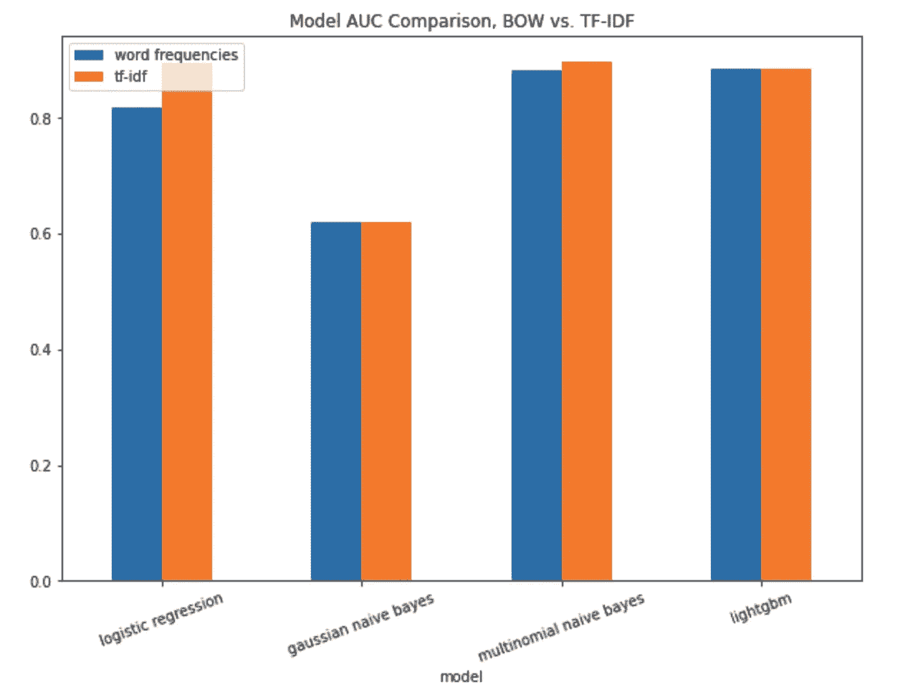
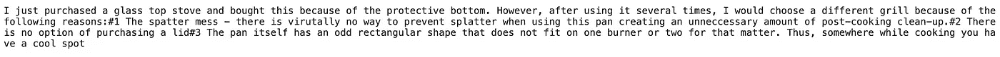
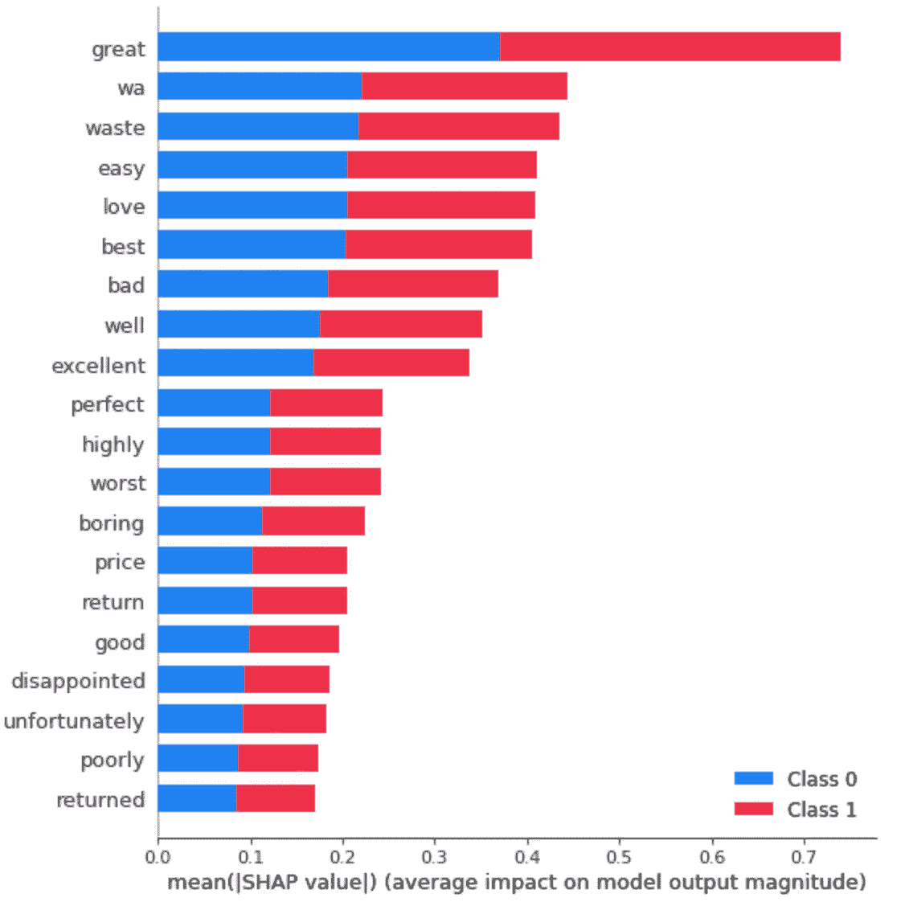

# 理解文本矢量化 II:TF-IDF 如何让您的简单模型拥有与高级模型匹敌的能力

> 原文：<https://towardsdatascience.com/understanding-text-vectorizations-ii-how-tf-idf-gives-your-simple-models-the-power-to-rival-the-79b6c975d7eb?source=collection_archive---------53----------------------->

## 自然语言处理

## Sklearn 管道、SHAP 和面向对象编程在情感分析中的应用


由[🇸🇮·扬科·菲利](https://unsplash.com/@itfeelslikefilm?utm_source=unsplash&utm_medium=referral&utm_content=creditCopyText)在 [Unsplash](https://unsplash.com/?utm_source=unsplash&utm_medium=referral&utm_content=creditCopyText) 上拍摄的照片

***L*** 让我们继续我们的情感分析之旅。

记得上次我们谈到使用单词袋模型来检测评论文本的情绪，我们已经有了一个相对较好的性能。今天，我们将在已有成果的基础上，用智能加权方案升级单词袋模型。在本帖中，我们将利用来自[第 1 部分](/understanding-text-vectorizations-how-streamlined-models-made-feature-extractions-a-breeze-8b9768bbd96a)的自定义管道`StreamlinedModel`对象，并见证从逻辑回归等简单模型应用 TF-IDF 转换器所获得的惊人改进。

## **词频—逆文档频率(TF-IDF)**

我们已经知道计算词频可以帮助我们判断评论文本的情感，但是这种方法忽略了单词在整个文档中的重要性。我们讨论了使用智能加权方案来解决这个问题，但是我们具体如何执行呢？

## 大意

答案是使用一种加权方案，该方案与该单词在所有文档中出现的频率成反比。如果这个词出现在几乎每一篇文档中(比如“ ***我*** ”、“ ***你*** ”或者“ ***他们*** ”)，那么如果我们对它们进行同等的加权，很可能会被视为非常重要。因此，我们想增加那些不经常出现的单词的权重。例如，使用相同的 3 篇评论

```
I love dogs, I think they have adorable personalities.
I don't like cats
My favorite kind of pet is bird
```

我们可以看到“ ***萌*** ”只出现在 3 个文档中的 1 个，文档频率为 3/(1+1)。我们在分母上加 1 以避免它变成 0。然后，我们将获取文档频率的自然对数值，这将为我们提供以下内容

```
idf(adorable) = log(3/2) = 0.176
```

与在 3 个文档中的 2 个中出现的类似于“ ***I*** 的单词相比，我们将得到如下的逆文档频率

```
idf(I) = log(3/3) = 0
```

然后我们将这袋字数乘以这个权重，得到 tf-idf 值。具体来说，

```
tf-idf(t, d) = tf(t, d) x log(N/(df + 1))
```

现在我们了解了 TF-IDF 的大致思想，让我们看看我们应该如何将这个模型实现为一个转换器。

## TF-IDF 实施

我们将经历与[第一部分](/understanding-text-vectorizations-how-streamlined-models-made-feature-extractions-a-breeze-8b9768bbd96a)中概述的相同的文本预处理步骤。由于术语频率定义与单词袋模型相同，我们将关注如何有效地计算所有单词的逆文档频率。

因为我们必须检查每个单词是否存在于每个文档中，所以运行时间可能是 O(n)，这将相当慢。我们可以将预计算的 IDF 保存在属性化的类中，并在计算词频时引用它。

我们从获取所有单词的文档频率的辅助方法开始。在 pandas `.str.contains`方法的帮助下，该方法将检测一列字符串中部分字符串的存在并返回一系列 0/1，我们可以对这些系列求和以获得单词的文档频率。然后，我们将重复相同的过程，并将结果存储在字典中。

我们将在转换器的`.fit`方法中使用`get_document_frequency`方法，对每个单词的文档频率应用对数转换。得到的 idf 值将被保存为一个类属性，当我们计算词频时，它将被用作权重。

我们的`.transform`方法将由两部分组成。除了计算词频(在 [part 1](/understanding-text-vectorizations-how-streamlined-models-made-feature-extractions-a-breeze-8b9768bbd96a) 中也有)，我们还会把它们乘以对应的 IDF 值。因为对于每个评论，我们将具有相同的 IDF 权重(因为单词索引顺序是固定的)，所以我们将重复 IDF 向量 N 次(等于评论的数量),以使 IDF 矩阵具有与单词频率矩阵相同的形状。最后，我们将在两个矩阵之间执行元素级乘法，以获得所有评论的 TF-IDF 值。

我们现在准备将 tf-idf 用作变压器。完整的实现如下所示。正如你可能注意到的，`TermFrequency_InvDocFrequency`变压器与[第一部分](/understanding-text-vectorizations-how-streamlined-models-made-feature-extractions-a-breeze-8b9768bbd96a)中的`WordFrequecyVectorizer`变压器共用多个部分。最好的实现是类继承。实现每一个 helper 函数仅仅是为了清晰起见，以防您对将单词包转换器作为主类不感兴趣。

现在我们已经将 TF-IDF 实现为一个变形器，我们将做同样的事情，使用`StreamlinedModel`构建 4 个不同版本的模型并比较性能。

## 绩效评估

同 [part 1](/understanding-text-vectorizations-how-streamlined-models-made-feature-extractions-a-breeze-8b9768bbd96a) ，我们将使用以下函数原型生成 4 个`StreamlinedModel`对象。

```
**from** models.feature **import** TermFrequency_InvDocFrequency
**import** lightgbm **as** lgb
**from** sentiment_analysis.models.model **import** StreamlinedModellgbm = StreamlinedModel(
    transformer_description="TF-IDF",
    transformer=TermFrequency_InvDocFrequency,
    model_description="logisitc regression model",
    model=lgb.LGBMClassifier,
)
```

我们将尝试 4 种不同的模型，并收集它们的预测 AUC 分数，以制作柱状图。这一次我们将比较我们以前获得的 AUC 分数，看看我们是否实际上能够获得任何改进。



确实有所改善。

使用我们的 tf-idf 转换器，即使使用逻辑回归模型，我们也能够获得 0.896 的 AUC。这将给我们的模型解释带来显著的优势——因为单个词的逻辑回归系数可以直接解释为对评论情感的重要性。不再需要外部包装。

我们还看到多项式朴素贝叶斯模型的性能略有提高，其 AUC 从 0.883 增加到 0.898，现在略高于旧的 winner lightGBM 模型，后者几乎没有任何改进。

还记得这篇博文的标题吗？TF-IDF 确实为逻辑回归这样的简单模型提供了击败 lightGBM 这样的高级模型的能力。这是一个完美的例子，使用正确的特性工程工具会给你带来难以置信的性能提升。

接下来我们来看看，是不是因为换了变形金刚，才发现最错误的正/差评都变了。

## 错误分类的正面/负面评论

我们将使用与[第 1 部分](/understanding-text-vectorizations-how-streamlined-models-made-feature-extractions-a-breeze-8b9768bbd96a)相同的行来获得最错误的正/负指数。

```
# get the indices of the misclassified reviews
wrong_positive_inds = np.where((y_test == 1) 
                             & (y_pred != y_test))[0]
wrong_negative_inds = np.where((y_test == 0) 
                             & (y_pred != y_test))[0]# most wrong positive review
most_wrong_positive_index = wrong_positive_inds[
    y_prob_lgbm[:, 1][wrong_positive_inds].argmax()
]# most wrong negative review
most_wrong_negative_index = wrong_negative_inds[
    y_prob_lgbm[:, 1][wrong_negative_inds].argmin()
]
```

最错误的正面评论(来自多项朴素贝叶斯模型，因为它现在是表现最好的模型)是


老实说，我不知道这是一个积极的评论。它包含了强烈的否定词，如“*”和“ ***而不是*** ”。我们的模型出错是可以理解的。*

*最错误的负面评论(来自多项朴素贝叶斯)是*

**

*我可以看出这篇评论是负面的，但是这篇评论没有任何强烈的负面词汇(见下一节)，犯这个错误也是可以理解的。*

## *特征重要性*

*我们已经在[第 1 部分](/understanding-text-vectorizations-how-streamlined-models-made-feature-extractions-a-breeze-8b9768bbd96a)中看到了使用 SHAP 来可视化个人评论的例子，我们可以使用 SHAP 来可视化总体水平上的功能重要性。*

**

*最重要的词其实是明显的情绪指示词。*

*“ ***伟大的*** ”、“ ***容易的*** ”、“ ***爱情的*** ”作为强有力的肯定*

*“*”、“*”、“ ***废物*** ”为强负者***

## **结论**

**我们使用 tf-idf 作为情感分析模型的特征工程工具，改进了我们的文本矢量器。事实上，tf-idf 也是许多更复杂的特征工程工具的基础，例如 word2vec。同样，GitHub 项目可以在这里找到。现在，让我们总结一下我们在这篇博文中学到了什么。**

1.  **获得正确的功能比使用更先进的型号更重要。使用 TF-IDF 将提高特征质量，甚至允许简单的模型胜过更高级的模型。**
2.  ****将值缓存为类属性将提高计算时间。保存每个字的 IDF 值使我们能够加快速度，否则这将是一个相当缓慢和昂贵的双 for 循环操作。****

**这就是文本矢量化的全部内容！接下来，我们将了解一些使用深度学习的更高级的特征提取工具。下次见！**