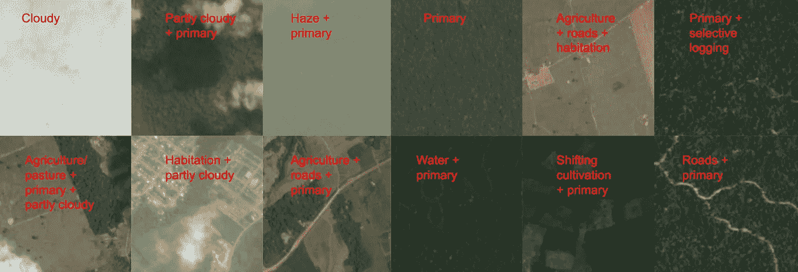
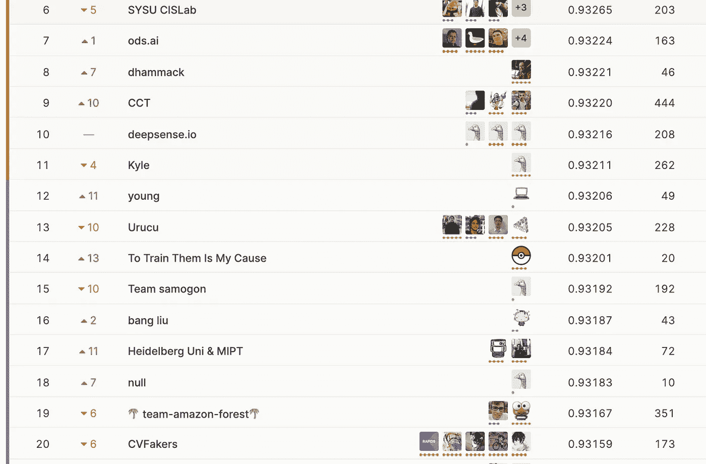
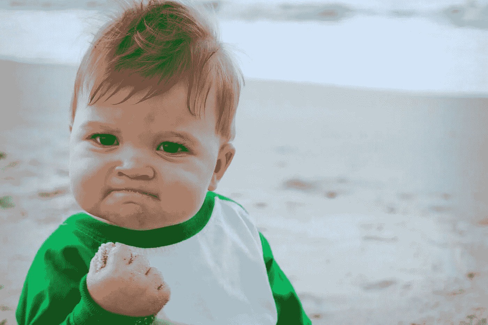

# 从卫星图像检测森林砍伐

> 原文：<https://towardsdatascience.com/understanding-the-amazon-rainforest-with-deep-learning-732bfb2eca6e?source=collection_archive---------39----------------------->


数据规格，来源:[星球:从太空了解亚马逊](https://www.kaggle.com/c/planet-understanding-the-amazon-from-space/data)

对于我作为 [Udacity 的机器学习工程师 Nanodegree](https://www.udacity.com/course/machine-learning-engineer-nanodegree--nd009t) 的一部分的顶点项目，我的任务是通过应用整个课程中学到的机器学习算法和技术来解决我选择的一个问题。我决定选择一个我非常热爱的领域:拯救环境。我听说过一个过去的 Kaggle 比赛，其中包括通过奇妙的 [fast.ai 课程](https://course.fast.ai/)对亚马逊雨林的卫星图像进行分类。你可以在这里找到比赛[。我决定踏上探测雨林砍伐的旅程，看看我能在 Kaggle 排行榜上爬多高。](https://www.kaggle.com/c/planet-understanding-the-amazon-from-space)

# 背景

亚马逊是世界上最大、最具生物多样性的热带雨林，占地 210 万平方英里。它由大约 3900 亿棵树组成，分为 16000 个种类。亚马逊被称为“地球的肺”，因为它有助于稳定地球的气候，并通过固定二氧化碳和产生世界上 20%的氧气来减缓全球变暖。

自 1978 年以来，超过 289，000 平方英里的亚马逊雨林已经在巴西、秘鲁、哥伦比亚、玻利维亚、委内瑞拉、苏里南、圭亚那和法属圭亚那遭到破坏。每一分钟，世界都会失去 48 个足球场大小的森林面积。人们担心，森林的破坏将导致生物多样性的丧失、栖息地的丧失以及植被中所含碳的释放，这可能会加速全球变暖。关于森林砍伐和人类侵占森林的位置的更好数据可以帮助政府和当地利益攸关方更快、更有效地做出反应。


亚马逊的选择性伐木，来源:[星球:从太空了解亚马逊](https://www.kaggle.com/c/planet-understanding-the-amazon-from-space/data)

# 问题陈述

这个项目的目标是利用卫星图像数据追踪由于森林砍伐导致的亚马逊雨林的变化。这些数据由 Planet 提供，由 [Kaggle](https://www.kaggle.com/) 主办，作为之前比赛的一部分——[Planet:从太空了解亚马逊](https://www.kaggle.com/c/planet-understanding-the-amazon-from-space/overview)。这项任务的标签是与 Planet 的影响团队合作选择的，代表了亚马逊盆地感兴趣的现象的合理子集。该任务是一个多标签图像分类问题，其中每幅图像将具有一个并且可能不止一个大气标签以及零个或多个常见和稀有标签。



带有标签的数据示例，来源:[星球:从太空了解亚马逊](https://www.kaggle.com/c/planet-understanding-the-amazon-from-space/data)

# 估价

模型基于它们的平均 F2 分数进行评估。F 分数通常用于信息检索，它使用精度 p 和召回率 r 来衡量准确性。精度是真阳性(tp)与所有预测阳性(tp + fp)的比率。召回率是真阳性与所有实际阳性的比率(tp + fn)。F2 分数由下式给出:


F2 评分公式，来源:[星球:从太空了解亚马逊](https://www.kaggle.com/c/planet-understanding-the-amazon-from-space/overview/evaluation)

# 履行

对于这个任务，我选择使用 fastai 库来实现深度学习模型，该库使用现代最佳实践来简化训练神经网络。fastai 库的主要特点之一是使用循环学习率。这是一种相对未知的设置学习率的技术(由于 [fast.ai 课程](https://www.fast.ai/)的流行，这种技术可能不再适用)，它提高了分类精度，同时与固定学习率值相比，需要更少的迭代。这种方法不是单调地降低学习率，而是让学习率在合理的边界值之间循环变化。fastai 的另一个好处是它使迁移学习变得异常简单:

```
from fastai.vision import *learn = cnn_learner(data, models.resnet50)
```

我的最终解决方案由五个模型组成，所有模型都在 ImageNet 上进行了预训练:resnet50、resnet101、resnet152、densenet121 和 densenet169。我分别对每个模型进行了微调，将训练数据分为 80%的训练和 20%的验证。我使用逐步调整图像大小来训练模型，这是我从杰瑞米·霍华德教授的 fast.ai 课程中学到的技术。渐进式调整大小是一种训练计算机视觉模型的方法，首先在比原始图像更小的尺寸上训练模型，然后继续将图像的尺寸增加两到三倍，直到最终在原始图像尺寸上训练。我首先在 64x64 像素图像上训练模型五个时期，只有网络的最后一层是可训练的，然后再训练五个时期，整个网络都是可训练的。我对 128x128 像素的图像做同样的处理，然后是原始的 256x256 像素的图像。最后，我在所有可用的训练数据上训练了五个以上的时期，合并了训练和验证集。我还尝试了半监督学习，使用我的最佳提交的标签在测试集上进行训练，但发现我的性能略有下降。在整个训练过程中，我使用 64 个批次，而学习率是在每五个时期之前使用 fastai 的内置函数选择的，以找到最佳学习率:

```
learn.lr_find()
learn.recorder.plot()
```


你想选择下降曲线最陡部分的学习率。这里我选了 0.01。

# 精炼

为了获得一个基线分数来衡量未来实验的影响，我实现了一个没有渐进调整大小的 resnet50，使用 256x256 像素的图像大小。我没有使用测试时间增强，并将阈值设置为 0.20。这款车型在比赛的私人排行榜上获得了 0.92746 的 F2 分。为了提高基线分数，我首先实现了渐进式改进。我尝试了几个不同的尺寸，并选定了 64 -> 128 -> 256，这使我的 F2 分数上升到 0.92881。在利用测试时间增加后，我的分数进一步增加到 0.92979。然后，我开始尝试给预测设定阈值，看看我是否能挤出更多的零点几个百分点。通过将阈值设置为 0.17，我可以将分数提高到 0.93024。最后，我将训练集和验证集结合起来，再训练五个时期，使单一 resnet50 模型的得分达到 0.93041。


使用所有训练数据、tta 和阈值 0.17 的 resnet50 模型的结果

# 结果

我对其他四个模型遵循了与上述相同的过程，通过创建五个模型的组合，我能够在私人排行榜上获得 0.93173 的 F2 分数。这个分数对于 938 支参赛队伍中的第 19 名来说已经不错了，只比第一名少了 0.00144 分。


使用所有训练数据、tta 和阈值 0.17 的五个模型集合的结果



竞赛排行榜[星球:从太空了解亚马逊](https://www.kaggle.com/c/planet-understanding-the-amazon-from-space/leaderboard)

# 反思/改进

我想尝试但没有时间/资源的一种技术是使用暗通道先验的单幅图像去霾-何等人。我相信这将是非常有益的，因为许多卫星图像包括霾和/或云，这使得模型更难对森林的底层特征进行分类。事实上，竞赛的获胜者在[对他的解决方案](https://www.kaggle.com/c/planet-understanding-the-amazon-from-space/discussion/36809)的简要描述中提到他使用了这种技术。我实际上实现了算法来处理整个数据集，但是我的本地机器仅处理训练数据就花了大约 30 个小时，而且我没有处理测试数据。这是我未来打算做的事情。


左:原稿，中间:使用导向过滤去除霾，右:去除霾

我可以尝试的另一个策略是 k-fold 交叉验证，而不是将数据分成训练集和验证集。这样，模型可以在整个过程中看到所有的训练数据，而不是分别对验证数据进行训练。第三名完成者[提到在他们的解决方案](https://www.kaggle.com/c/planet-understanding-the-amazon-from-space/discussion/38831)中使用 5 重交叉验证。

我还可以尝试训练更多的模型或不同的架构来试验更大的整体。竞赛的获胜者提到每个不同的标签都有一个模型，第三名完成者使用了 30 个不同的模型，经过 5 次交叉验证，产生了 150 个重量文件。

总的来说，我对自己的成绩非常满意——仅用五款产品就取得了排行榜前 2%的成绩。我希望通过实施上面列出的一些可能的改进领域，达到前 10 名，甚至最好是第一名。



*你可以从我的*[*GitHub*](https://github.com/ncondo/amazon-from-space)*下载复制我的结果的所有代码。*