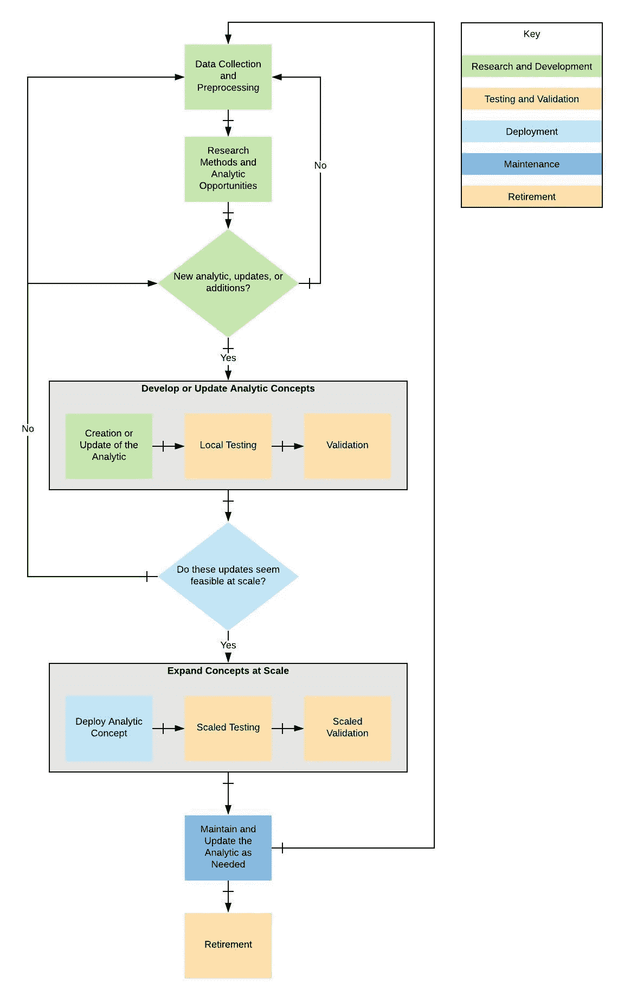

# 理解分析开发生命周期

> 原文：<https://towardsdatascience.com/understanding-the-analytic-development-lifecycle-2d1c9cd5692e?source=collection_archive---------16----------------------->

## 将您的分析从摇篮带到坟墓。

照片来自[像素](https://www.pexels.com/)上的[铁木尔·萨格兰比莱克](https://www.pexels.com/@marketingtuig)

正如我在之前的一篇文章中所讨论的，理解分析开发生命周期是至关重要的。你的分析不会永远持续下去，相反，会变得过时，需要退休。随着您收集更多更新的数据，您将需要继续维护当前的分析，同时创建新的分析。*了解你在分析生命周期的每个阶段需要做什么是至关重要的。*如下所示，我将分析生命周期视为开发的五个关键组成部分:研发、部署、测试、验证、维护和退役。因此，让我们一起来了解每个元素吧！

分析开发生命周期——作者使用 [LucidChart](https://lucid.co/) 创建的图像

# 研究与开发

研究和开发包含了分析开发生命周期的前几个步骤。收到数据后，您将花时间查看它，理解它的结构，并清理它。在进行这个过程时，您需要考虑您从数据中看到了哪些分析机会，您意识到的任何业务问题，以及它们是如何重叠的。当你开发你的问题陈述时，你可以开始测试分析概念并发展你的分析。

如果您正在使用现有的分析，此过程会有所不同。对于当前分析，您需要了解需要改进的领域、您将使用的方法以及您获得的任何主题专业知识(SME ),以帮助您完成这些更新。与 SME 进行后续对话将有助于您验证您的更新是否朝着正确的方向发展。

我发现这个过程的研究和开发阶段是最有趣的，因为在这个阶段你可以对你的数据了解得最多。我每天与其他数据科学家、数据工程师和主题专家一起工作。这些人帮助创建数据集和开发数据字典，以理解数据代表什么。然后，我可以理解如何将这些数据与其他数据集结合起来构建我的分析。我想确保我看到了更大的画面，并在继续下一步之前讲述一个令人信服的故事。

# 部署时的测试和验证

在与 SME 确认分析看起来符合预期并且产生了有意义的可靠结果后，就该准备部署分析了。部署过程可能有所不同，但概念是相同的。在这个阶段，我已经为我的分析开发或更新了代码，并且我结合了一个更加软件工程化的方法。

软件工程师通常在 CI/CD 管道中使用单元测试和验证技术来测试和验证代码是否按预期工作。当您测试和验证您的分析时，可以从一个小得多的数据集开始。这种测试和验证是为了确保您编写的代码能够按预期运行，不会引入任何重大缺陷或错误。在将代码部署到更大的数据集之前，添加单元测试会让您对代码运行良好感到满意。

既然您已经在小范围内测试并验证了代码，那么您可以将代码部署到测试环境中，以便在大型数据集上运行它。此时，您将希望对大多数(如果不是全部)数据运行您的代码，以验证结果是否仍然符合预期。您可以与您的 SME 进行复查，以确保自分析想法的概念或更新以来没有发生任何变化。如果分析看起来像预期的那样，您可以进入维护阶段。否则，您应该回到研发阶段来调查所看到的问题。在小范围内用单元测试和在大范围内用大部分或全部数据对测试代码进行两步验证，将有助于为经过良好测试和维护的分析代码创建一个坚实的基础。

我发现这个过程很有帮助，因为它通过单元测试显示了代码设计问题，并在大规模测试时提出了分析问题。测试和验证代码的多个步骤也确保了代码按预期执行。当使用 CI/CD 进行分析开发时，我发现代码更新的问题和迭代更少。

# 维护

既然您已经部署了您的分析工具，现在是时候让它过渡到维护模式了。在维护模式下，您可以监控您的分析是否存在任何缺陷或与预期结果的偏差。分析维护需要考虑的一些方面包括:

*   是否引入了新数据？您是否需要通过添加新数据来更新代码？
*   是否删除了影响您分析的数据？如果你不能解决这个问题，那么你可能需要考虑退休。
*   分析输出的表现是否符合预期，还是已经开始表现不佳？如果它表现不佳，是什么改变了？
*   你的分析试图预测的问题解决了吗，现在你的分析没有被使用？如果是这样，你可能需要考虑退休了。
*   问题陈述改变了吗？如果是的话，这对你的分析有什么影响？
*   需要重新培训一个模特吗？当您用于输入的数据发生变化或引入新信息时，可能会出现重新培训。

这些只是你在维护分析生命时需要考虑的一些领域。还有更多的可能性会出现，你需要抓住它们，评估可能的结果和下一步。

# 退休

退休可能是这个过程中最快的阶段。当一个分析不再有用时，是时候退出代码并转移到下一个项目了。根据您的团队，退出可能与删除代码、禁用部署或关闭结果仪表板有所不同。在这一点上，您需要向用户传达分析停止的原因和时间。这种沟通是必要的，因为您应该告知用户任何可能影响他们决策过程的重大变化。如果你用新的东西代替你的分析，也让他们知道。沟通是其他人理解你的过程的关键，没有它，事情会变得一团糟。

# 最后的想法

您的分析生命周期可能会有所不同，包括或删除我在这里提到的不同方面。我的想法是，分析生命周期非常类似于软件开发生命周期，因为您正在开发将被迭代、维护并最终退役的代码。唯一的主要区别是如何进行验证和测试，以确认您的工作得到了预期的结果。

我有兴趣了解更多关于这个生命周期如何与您今天所做的事情相适应的信息。你能做些改变吗？

如果你想阅读更多，看看我下面的其他文章吧！

 [## 每位数据科学家的 8 大技能

### 当我参加大学讲座时，最常被问到的问题是“我需要具备什么技能？”

towardsdatascience.com](/top-8-skills-for-every-data-scientist-79e6b1faf3e1)  [## 停止浪费你的时间，咨询一个主题专家

### 在从事数据科学项目时，请一位主题专家来审查您的工作可能会有所帮助。

towardsdatascience.com](/stop-wasting-your-time-and-consult-a-subject-matter-expert-f6ee9bffd0fe)  [## 创建用于熊猫分组的自定义聚合

### Pandas groupby 是一个函数，您可以在数据帧上使用它来分割对象、应用函数以及组合…

towardsdatascience.com](/creating-custom-aggregations-to-use-with-pandas-groupby-e3f5ef8cb43e)  [## 数据可视化的前 3 篇文章

### 如果您想更好地构建数据可视化，这些文章很有帮助。

towardsdatascience.com](/top-3-articles-for-data-visualization-956a08a54b04)  [## 不要太骄傲而不愿寻求帮助

### 如果你被一个 bug 卡住了或者感到不知所措，你可以寻求你需要的帮助。

towardsdatascience.com](/dont-be-too-proud-to-ask-for-help-76f21d16f318)