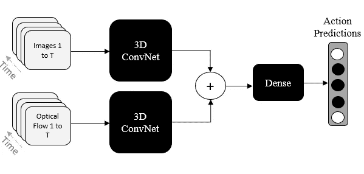
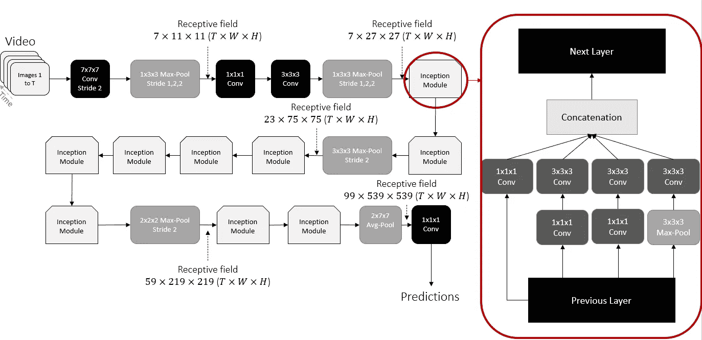

# 理解视频分类的支柱:I3D 架构

> 原文：<https://towardsdatascience.com/understanding-the-backbone-of-video-classification-the-i3d-architecture-d4011391692?source=collection_archive---------33----------------------->

单个图像中的信息和视频中的信息之间的显著差异之一是时间元素。这导致了深度学习模型架构的改进，以结合 3D 处理，从而额外处理时间信息。本文通过 I3D 模式总结了从图像到视频的建筑变革。

# I3D

图一。基于动力学数据集的双流 I3D 训练过程。图片由作者提供，改编自 Carreira 和 Zisserman (2017) [1]。

I3D 模型是由 DeepMind 和牛津大学的研究人员在一篇名为“ *Quo Vadis，动作识别？新模型和动力学数据集*【1】。本文比较了以前解决视频中动作检测问题的方法，同时还介绍了一种新的体系结构，这是本文的重点。他们的方法从 2D 架构开始，*膨胀*所有的过滤器和池内核。通过膨胀他们，他们增加了一个额外的维度要考虑，在我们的情况下是时间。虽然 2D 模型中的过滤器是方形的 *N x N* ，但是通过对它们充气，过滤器就变成了立方体的*N*x*N*x*N*

在这篇论文中，研究人员在已经训练好的模型上从 2D 滤波器中引导 3D 滤波器。换句话说，在他们的 3D 实现中，他们使用在非常大的数据集(如 ImageNet)上训练的 2D 模型的参数。为了直观地思考这个问题，他们重复给定图像 *T* 次。他们实际做的是沿着时间维度重复 2D 滤波器的权重 *N* 次，然后通过除以 *N* 来重新缩放它们。为确保正确完成，2D 案例的平均和最大池层应与 ImageNet 的 3D 案例相同。

另一个要考虑的修改是池和卷积层的接收域。为了刷新，卷积神经网络中的**感受域**是图像的一部分，一次只能被一个过滤器看到，随着我们堆叠更多的层，它会增加。2D 卷积和池集中在图像的高度和宽度上，因此是对称的(例如，7×7 的核是对称的，而 7×3 的核是不对称的)。然而，当包括时间维度时，找到最佳感受野是重要的，这取决于帧速率和图像维度。根据研究人员在[1]中的说法，如果感受野在时间上相对于空间增长过快，它可能会合并来自不同对象的边缘，破坏早期特征检测。如果感受野生长太慢，它可能无法捕捉场景动态。总之，由于额外的时间维度，I3D 的核是不对称的。

## 建筑

考虑到这些，作者用下面的图表形象化了他们的架构:

图二。图片由作者提供，改编自 Carreira 和 Zisserman (2017) [1]。

从图中可以看出，网络的起点使用不对称滤波器进行最大汇集，在空间维度上汇集的同时保持时间。直到后来在网络中，他们才运行包含时间维度的卷积和池。初始模块通常在 2D 网络中使用，不在本文讨论范围之内。然而，总的来说，它是最佳局部稀疏结构的近似。它还处理不同比例的空间(在这种情况下还有时间)信息，然后汇总结果。这个模块的目的是让网络变得“更宽”而不是“更深”。1x1x1 卷积用于减少更大的 3x3x3 卷积之前的输入通道数，也使其计算成本低于替代方案。

# 贡献

虽然该架构的正式介绍是本文的主要贡献，但主要贡献是从动力学数据集到其他视频任务的迁移学习。[动力学人体动作数据集](https://deepmind.com/research/open-source/kinetics)包含人体动作的注释视频。这就是在各种与动作相关的深度学习任务中使用预训练的 I3D 网络作为特征提取网络的原因。**功能通常从“混合 5c”模块**中提取出来，并传递到新的架构或 I3D 的微调版本中。

# 结论

I3D 是视频处理中最常用的特征提取方法之一。虽然也实现了像 S3D 模型[2]这样的其他方法，但是它们是在 I3D 架构的基础上构建的，对使用的模块做了一些修改。如果你想对视频或视频中的动作进行分类，I3D 是个好地方。如果你想为你的视频相关实验从一个预先训练好的模型中获得特征，I3D 也是值得推荐的。我希望你喜欢这个总结！

# 参考

[1]卡雷拉，j .，&齐塞尔曼，A. (2017)。Quo vadis，动作识别？一个新的模型和动力学数据集。在*IEEE 计算机视觉和模式识别会议论文集*(第 6299–6308 页)。

[2]谢，s，孙，c，黄，j，涂，z .，&墨菲，K. (2018)。重新思考时空特征学习:视频分类中的速度-精度权衡。在*欧洲计算机视觉会议(ECCV)* (第 305–321 页)。

**本文中的图像与[1]* 中的原始图像相似