# 使用 OpenCV 了解数字图像处理和计算机视觉的基础知识

> 原文：<https://towardsdatascience.com/understanding-the-basics-of-digital-image-processing-and-computer-vision-using-opencv-8bc0e67243c8?source=collection_archive---------18----------------------->

## CV 的基本概念:二值化，阈值，灰度和更多的见解。

这篇文章是关于数字图像背后的基本概念，它的处理，因此，也是 CV 的基础。最后，您可以找到一个使用 OpenCV 的 Python 的简单代码实现。

读完这篇文章后，你将能够回答以下问题:

*   计算机是如何看到图像的？
*   *有哪些典型的意象类型？*
*   *什么是图像处理中的二值化？*
*   *什么是阈值处理？*
*   阈值和二值化是如何应用的？

## 介绍

每幅图像都由像素组成，这些像素是用一种颜色填充的小方块。将所有不同的方块放在一起，然后缩小以看到所有的像素，就产生了我们所知道的图像。在下图中，可以清楚地看到小方块。它由 119 个水平像素列和 82 个垂直像素行组成。总的来说，这导致 119 x 82 = 9758 像素和 16 KB 的非常小的数据大小。

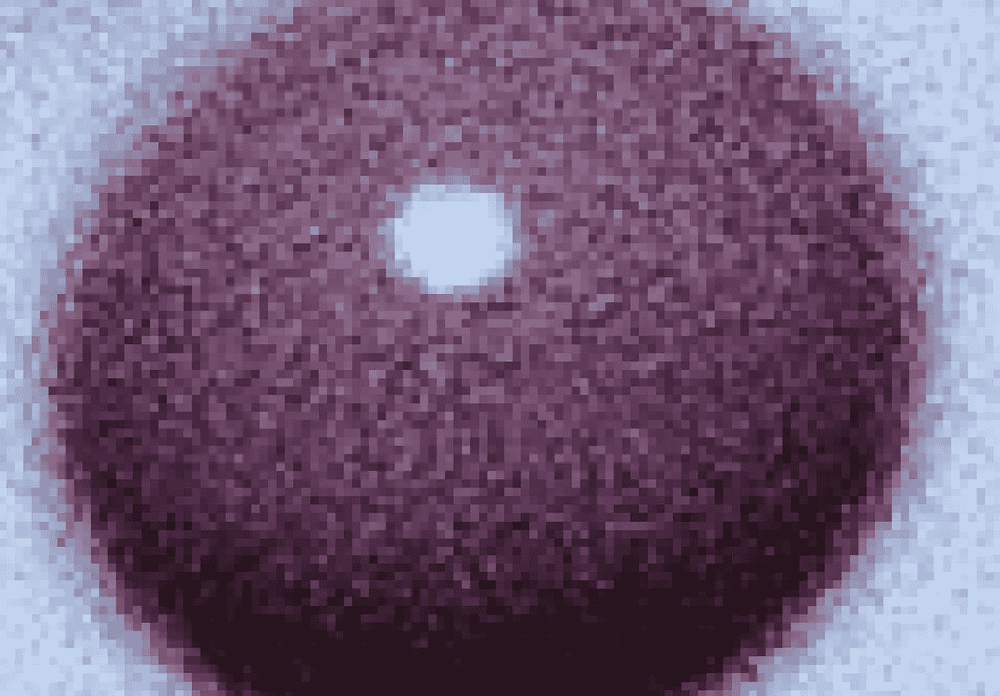

119 x 82 像素。来源:自己的图像

图像的平滑和清晰程度取决于图像的大小，因此也取决于像素的数量。放大一幅只有大约 10000 个像素的图像(如上图)会导致不清晰的结构，看起来更像俄罗斯方块，而不是平滑的线条。将此大小增加到 904 个水平像素列和 604 个垂直像素行，得到 904x604=546.016 个像素和 209 KB 的数据大小。图像现在已经更清晰了，但仍然有纹理，有点脆。

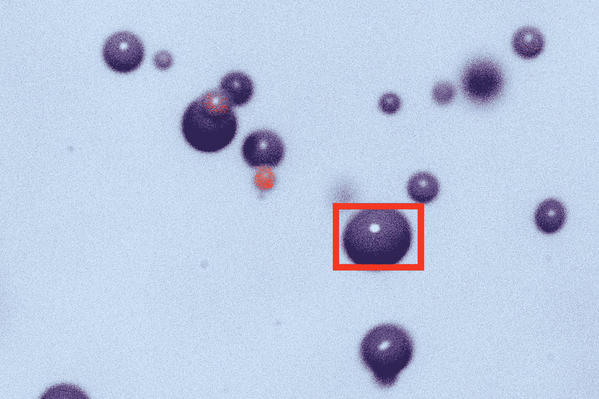

904 x 604 像素。

进一步缩小以看到由 4928 × 3264 = 16.084.992 像素组成的整个图像，会产生一个平滑且漂亮的图像。该映像现在的数据大小为 6,7 MB，即 6700 KB。

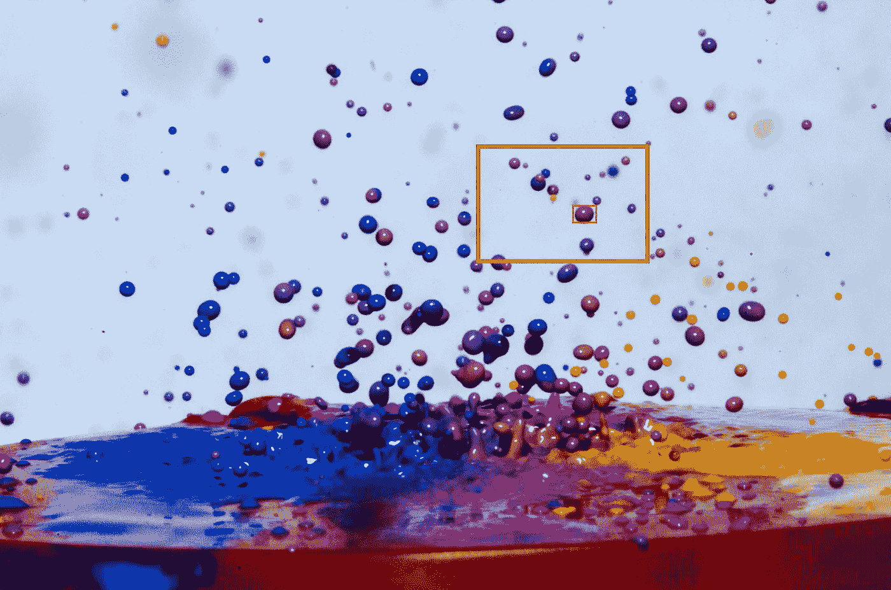

4928 x 3264 像素。

这就是我们看到的数字图像。但是对于计算机来说，它看起来怎么样呢？它得到什么，它如何处理输入？对于计算机来说，图像是形状的二维函数

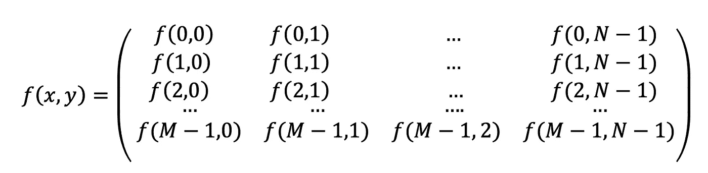

它是两个连续空间变量 x 和 y 的函数，x 是像素的行值，y 是列值。为了处理它，计算机对它进行采样和量化，将输入转化为矩阵，如上图所示。图像的每一个像素都用 f(x，y)进行处理(达席尔瓦和门东萨，2005)。

## 先说像素

在典型的数字图像中，每个像素由一个 8 位整数组成，导致 256 种可能的状态:

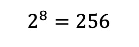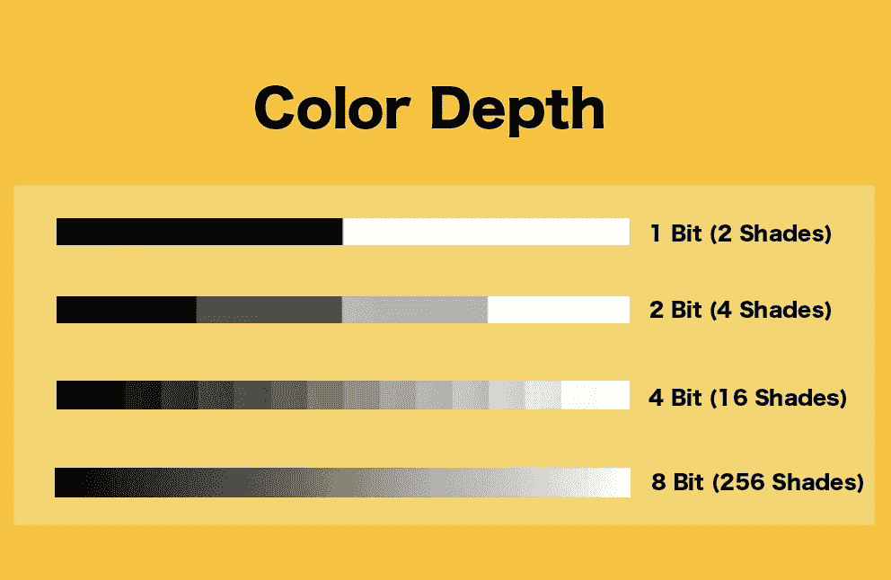

颜色深度:比特和阴影。来源:自有。

对于彩色数字图像，每个像素都有三个函数

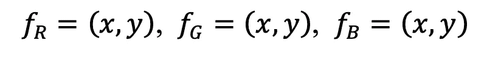

彩色数字像素由一个 1x3 矩阵组成，代表红色、绿色和蓝色三个原色通道，每个通道都是一个 8 位整数。每个像素的 256 个状态是指每个颜色通道的亮度，0 是颜色的最暗版本，255 是原色的最亮版本(Fisher 等人，a，2003)。

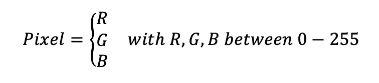

随后，R = 0、G = 0 和 B = 0 的向量将导致黑色像素，因为所有三个颜色通道都由最暗的阴影组成。R = 3，G = 168，B = 124 的星座将导致浅绿色像素，具有真正浅的红色值(只有 3 ),因此红色对所得像素颜色的影响很小，但是绿色和蓝色的值平衡，绿色是最强的值。这两种颜色都可以在下面的图片中看到。

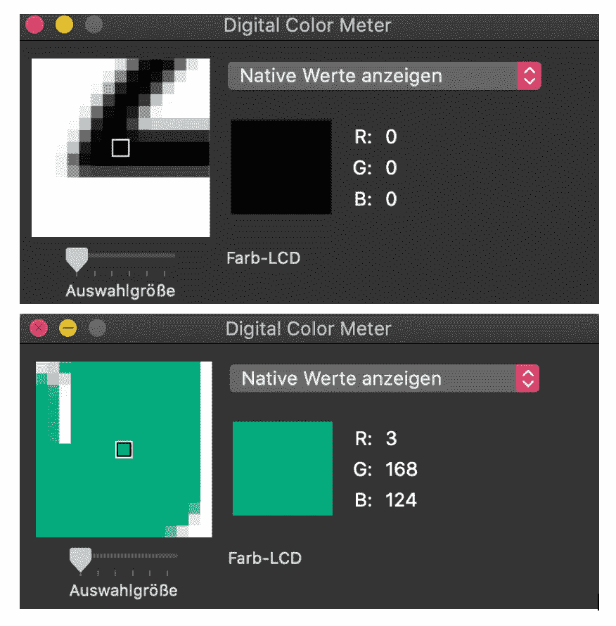

使用数字色度计选择颜色以查看 RGB 值。

## 图像类型

基本上存在多种类型的图像，但我们将考虑四种典型类型:

1.  **二值图像:**仅由黑白像素组成，白色为 0，黑色为 1。这种类型通常用于图像处理，例如在光学字符识别中识别图像中的字母和文本。
2.  **黑色&白色图像:** *黑白图像，特别是在摄影中，是典型的灰度图像。这意味着像素不仅由黑白颜色组成，而且每个像素都有 256 种不同的灰色阴影。*
3.  ***8 位彩色图像:*** 你遇到的大部分数码彩色图像都是 8 位彩色图像。它是最受欢迎的类型，也是上一节*中用来解释的类型，我们来谈谈像素。*如前所述，8 位导致 256 种不同的颜色深浅。
4.  **16 位彩色图像:**它是一种更复杂的彩色图像，没有它的小兄弟 8 位彩色图像那么受欢迎。对于一个像素的每个颜色通道，2 的 16 次方会产生 65536 种不同的色度。

*灰度调整。*在图像处理中，灰度是标准化和折衷数字彩色图像的常用技术。而彩色图像中的三维 RGB 空间导致

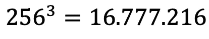

可能的组合，灰度图像具有明显较少的状态

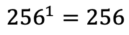

由于 256 种可能状态中的每一种状态对应于不同的亮度，因此灰度调整与提高自动亮度和对比度校正程序的速度相关。在成千上万幅图像的预处理中，灰度图像由于其单通道结构而比彩色图像处理得更快。因此，彩色图像必须转换成灰度图像。对于这一步，1x3 向量必须减少到 1x1 向量。想到的最简单的方法是给每个颜色空间分配相同的权重，即 0.33。该方法是众所周知的，并且是典型的方法:

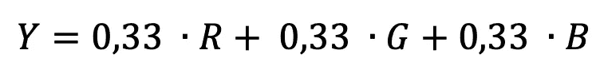

然而，三原色的波长各不相同(Choudhury，第 10 页及以后，2014 年)。这导致颜色对人类视觉的不同贡献。由于原色对人类颜色感知的这种不同贡献，比例不应该被认为是相等的，而应该适应人眼。Open CV 的变换公式是基于亮度不变的原理/BT601 (Open CV c，n.d .):

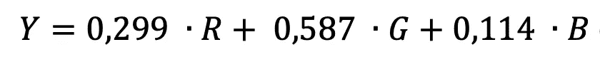

使用此公式，由三个值(RGB)组成的像素被转换为一个值(Y)，即 256 种不同灰度范围(0–255)内的一种灰度。因此，这也减少了每个像素包含的信息，从而减少了图像的数据量。

以上面的绿色调为例，R=3，G=168，B=124，将其填入灰度公式，得到 Y = 114，考虑到 256 种灰度，这是一个中等范围的灰色调。

灰度输入图像:

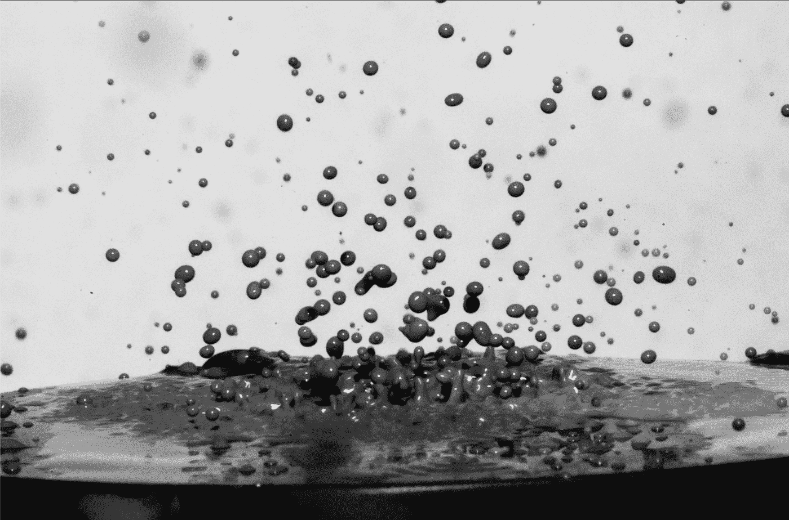

灰度图像。

将输入图像转换为灰度图像并绘制其像素值的直方图，可以显示图像中每种灰度的出现频率。在 200 到 250 范围内具有暗灰色阴影的像素具有最高的频率，如下面直方图右侧所示。看一看图片，底部的暗像素和气泡的一些像素是直方图中这个峰的一部分。

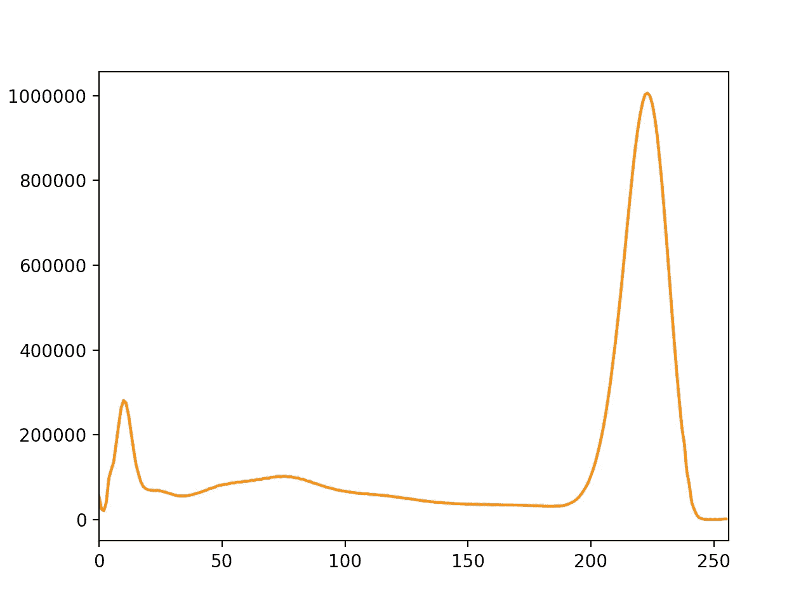

灰度的频率分布(直方图)。

## 二值化图像

向二进制图像的转换称为阈值处理。阈值化背后的思想是将所有像素分割为 1 或 0。超过定义阈值的灰度图像的所有像素都是 1，而低于定义阈值的值被转换为 0。输出是仅由黑白像素组成的图像，0 表示黑色，1 表示白色。为了定义阈值，存在不同的技术。该算法在这项工作中提出了两个步骤。它结合了简单的二值阈值和 OTSU 阈值。它计算使 1 和 0 两个类的加权类内方差最小的 t 值。

OTSU 阈值法(OpenCV，f，n.d .)

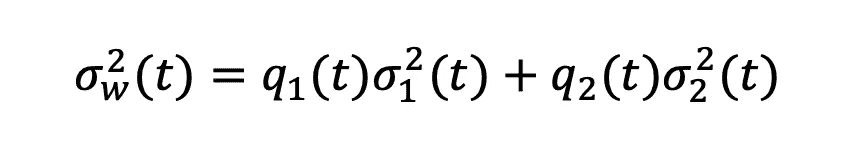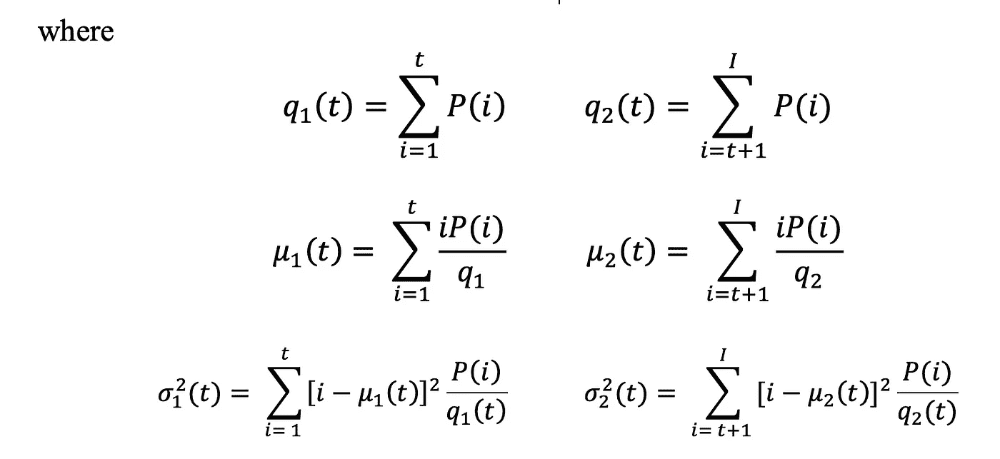

然后通过(OpenCV，f，n.d .)将检索到的值用于二进制阈值处理

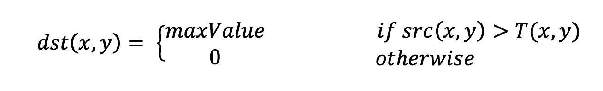

阈值化后，图像被分割成前景和背景。所有不等于 0 并因此为 1 的像素可以被定义为文档的内容和前景。下图的阈值处理是用 Open CV 和上面解释的两种方法完成的。

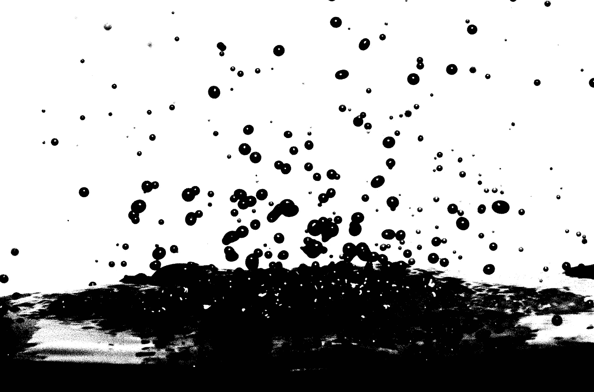

产生二值化图像的阈值处理。

**感谢阅读！**

[](https://medium.com/subscribe/@hucker.marius) [## 请继续关注马里乌斯·哈克的新文章

### 请继续关注 Marius Hucker 的新文章。如果您还没有注册，您将创建一个中型帐户…

medium.com](https://medium.com/subscribe/@hucker.marius) 

下面是应用所解释方法的一小段代码:

```
**#import the OpenCV library**
import cv2**#read your file** file=r’/Users/marius/Desktop/color.jpg’
img = cv2.imread(file)**#Grayscaling the image via OpenCV**
gray = cv2.cvtColor(img, cv2.COLOR_RGB2GRAY)**#Thresholding the image**
gray,img_bin = cv2.threshold(gray,127,255,cv2.THRESH_BINARY | cv2.THRESH_OTSU)**#Showing the image** cv2.imshow(‘image’,img_bin)
cv2.waitKey(0)
```

***参考文献***

Da Silva，E. A. B .，& mendon ca，G. V. (2005 年)。*数字图像处理。电气工程手册，891–910。*

费希尔，r .，帕金斯，s .，沃克，a .，&沃尔法特，E. (2003 年)。*像素值*。【https://homepages.inf.ed.ac.uk/rbf/HIPR2/value.htm 

打开 CV c .(未标明)。*颜色转换*。

打开 CV d .(未标明)。*对数组的操作*。[https://docs . opencv . org/2.4/modules/core/doc/operations _ on _ arrays . html](https://docs.opencv.org/2.4/modules/core/doc/operations_on_arrays.html)

打开 CV e .(未标明)。*图像阈值处理*。[https://docs . opencv . org/master/D7/d4d/tutorial _ py _ thresholding . html](https://docs.opencv.org/master/d7/d4d/tutorial_py_thresholding.html)

打开 CV f .(未标明)。*其他图像转换*。[https://docs . opencv . org/master/D7/d1b/group _ _ imgproc _ _ misc . html # gae 8 a4 a 146 D1 ca 78 c 626 a 53577199 e9 c 57](https://docs.opencv.org/master/d7/d1b/group__imgproc__misc.html#gae8a4a146d1ca78c626a53577199e9c57)