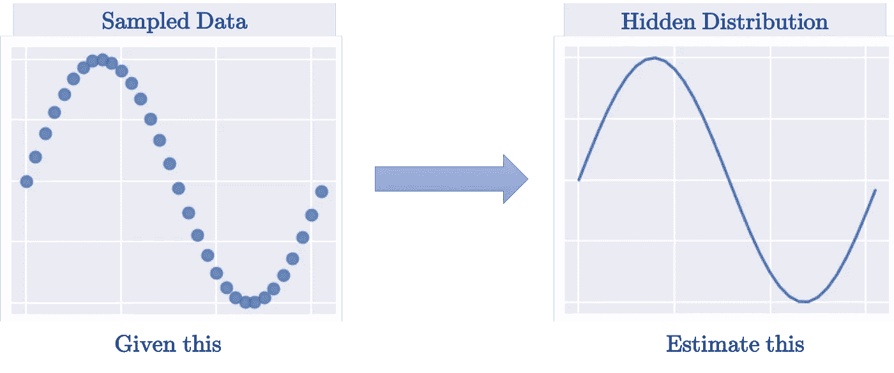
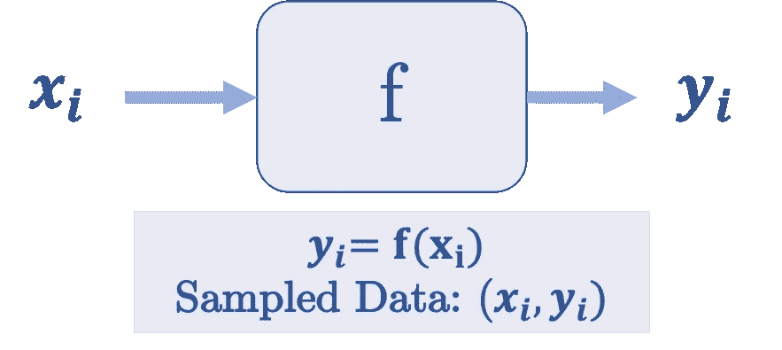
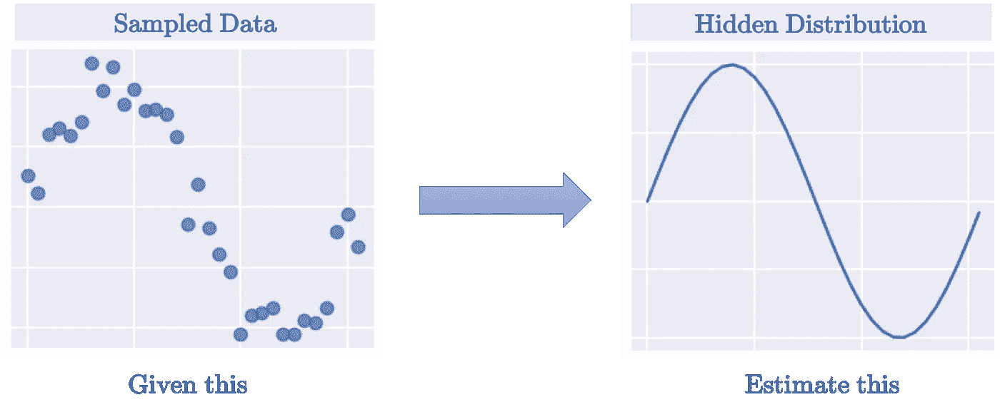
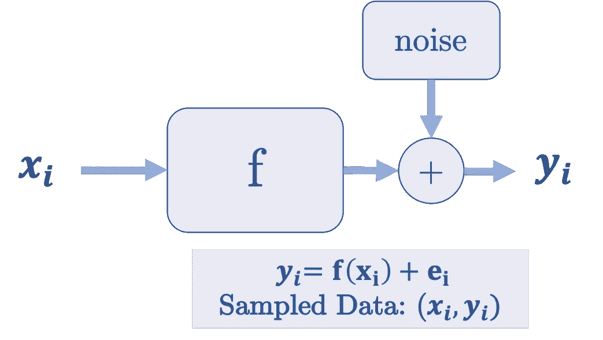
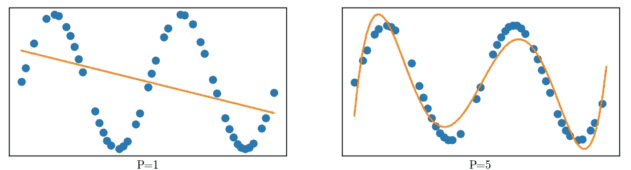
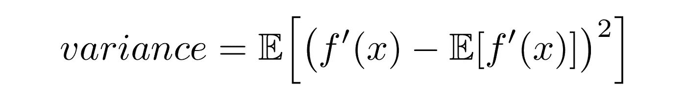
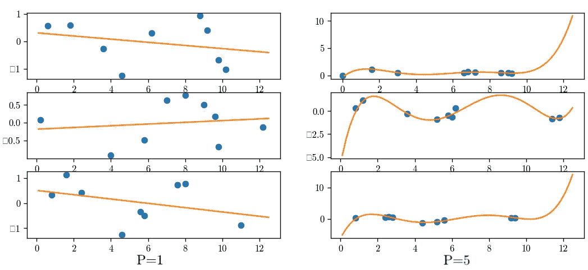
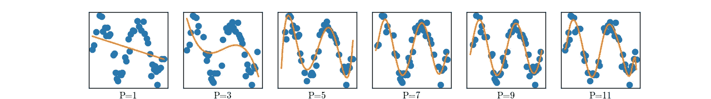
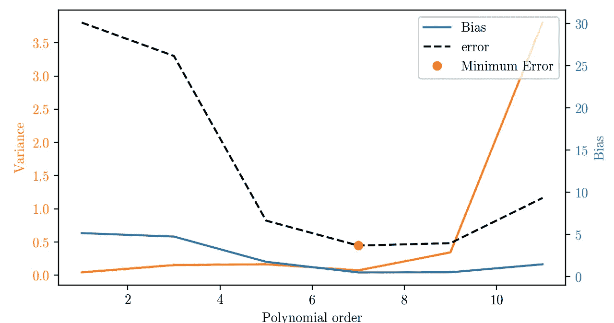
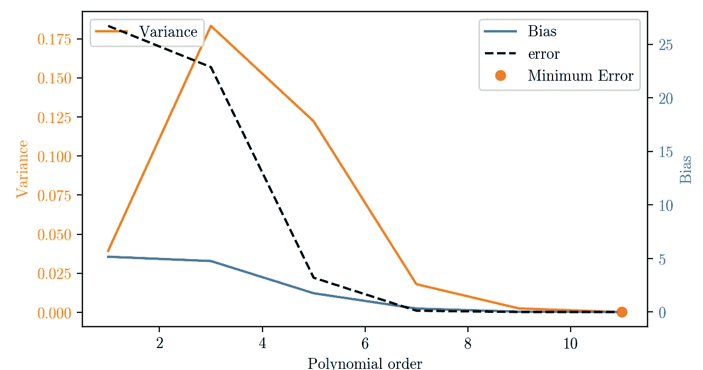

# 理解偏差-方差权衡，并通过示例和 python 代码将其可视化

> 原文：<https://towardsdatascience.com/understanding-the-bias-variance-tradeoff-and-visualizing-it-with-example-and-python-code-7af2681a10a7?source=collection_archive---------7----------------------->

机器学习中最重要和最基本的主题之一是偏差-方差权衡。在本文中，我们将详细介绍什么是偏差-方差权衡，它来自哪里，为什么必须考虑它，它如何影响我们的底层系统，以及可以做些什么来改进我们的 ML 模型。

# 上下文:它源于哪里？

ML 系统背后的总体思想是从收集的样本中建模数据集的隐藏分布。如果您从分布中抽取足够的样本，您可以得到一个相当精确的分布的重新创建，如下所示。

给定(x，y)对，估计 f。

但问题是，在现实生活中，收集的样本通常是嘈杂的。这种噪声的来源可能有很多因素，如量化、感官限制等。因此，我们得不到分布的精确输出，而是在其中加入了噪声因子。因此，现在的问题是，在给定输入 x 的情况下，估计函数 f 及其相应的噪声输出 y。

目标是有效地估计函数 f 并滤除噪声。由于您对添加到样本输出中的噪声了解不多，如果处理不当，ML 系统最终会将输入 x 映射到有噪声的输出 y(称为过拟合)。这种映射不是函数 f 的精确表示，并且对于看不见的测试数据产生很高的误差。

偏差-方差权衡告诉我们，在存在噪声的情况下，我们的基础系统(f`(x))应该有多复杂，才能相当准确地代表数据集的分布。

# 术语:什么是 ML 系统中的偏差和差异:

在我们的 ML 系统中，偏差和方差都是误差的来源。假设我们有一个训练数据集***【D】***，由从隐藏分布中采样的(x，y)对组成( ***y=f(x)+e*** )。我们从数据集*建立模型 ***f`*** ，使得训练标签和预测值之间的误差最小化(***error = y-f `(x)***)。*

# ***偏见:***

*偏差被定义为平均模型预测值 ***f`(x)*** 和地面真实值 ***f(x)*** 之间的误差*

**

*对从不同数据子集 **D_i** 预测的函数进行期望。更简单地说，你从隐藏分布中采样 **n** 个不同的数据集 **D_i** (每个数据集由多个(x，y)对组成)，然后估计 **n** 个不同的函数 ***f_i .****

**

*估计函数的偏差告诉我们基础模型预测值的能力。一般来说，更简单的模型不能捕捉高维数据的复杂性，因此它们有更高的偏差。例如，您有一个从正弦曲线采样的数据集，并且您试图使用一次多项式来估计它，即通过函数 ***y = ax+b.*** 无论您采样多少个数据点(x，y)，直线将永远无法捕捉正弦曲线的趋势。因此，对于正弦曲线，直线模型具有非常高的偏差。另一方面，假设您将多项式的次数增加到 3 次，即现在通过 ***y = ax +bx+c.*** 对其进行估计，该多项式将比前一个多项式的性能好得多，因此在估计正弦曲线时，3 次多项式的偏差比 1 次多项式的偏差小得多。*

**

*模型的高偏差与以下因素有关*

1.  *拟合不足—未能捕捉到数据趋势*
2.  *更强调概括*
3.  *训练和测试数据集的错误率都很高*
4.  *过于简化的模型*

# *差异:*

*方差是指给定数据集的模型预测的平均可变性。*

**

*估计函数的方差告诉您该函数能够根据数据集中的变化进行多大程度的调整。方差越大，函数对变化的数据集越稳健。例如，假设您训练两个不同的多项式来拟合从正弦曲线(1 次和 3 次多项式)采样的数据。你在三个不同的数据集(D1、D2 和 D3)上训练这两个多项式。下图显示了跨多项式次数和数据集的估计函数。*

**

*可以看出，1 次多项式在三个不同的数据集之间变化不大(因此方差较低)，而 3 次多项式的估计彼此相差很大(因此方差较高)。*

*模型的高方差与以下因素有关*

1.  *过度拟合-结束对数据集中噪声的建模*
2.  *更加强调尽可能接近地拟合每个数据点*
3.  *训练数据误差小，但测试数据误差大*
4.  *过于复杂的模型和稀疏的训练数据。*

> ***一般来说，如果你增加底层系统的复杂度，系统的偏差会减小，而方差会增大。它们两者彼此成反比。不能两个都减。这一点将是偏差-方差权衡的基础。***

# *权衡:*

*ML 模型的预期测试误差可通过以下公式分解为其偏差和方差*

> *测试误差=偏差+方差+不可约误差*

*这一点的完整推导可以在[这里](https://en.wikipedia.org/wiki/Bias–variance_tradeoff)找到。不可约误差是由于数据中的噪声引起的误差，并且与模型的选择无关。*

*所以为了减少估计误差，你需要减少偏差和方差。你必须选择一个模型(在我们的例子中是多项式的次数),以最小化误差的方式权衡偏差和方差。在过拟合和欠拟合的情况下，测试误差都可能很高。因此，我们需要偏差和方差的最佳平衡，这样我们的模型既不会过度拟合也不会欠拟合我们的数据。*

*考虑前面的例子。我们必须使用多项式从噪声采样数据 ***D*** 中估计正弦曲线。我们可以从各种不同次数的多项式中选择。在理想情况下，我们可以访问足够大量的无噪声数据(噪声=0)，泰勒级数展开告诉我们，如果我们不断增加多项式的次数，我们可以越来越好地逼近正弦曲线。但是在有噪声和有限数据集的情况下，增加多项式的次数将开始拟合数据中的噪声，并且在测试数据集上表现不佳。因此，我们需要找到在我们的数据集上最有效(即测试误差最小化)的多项式的最佳次数。*

*下图描绘了不同多项式的正弦曲线的估计值。1 次多项式过于简单，无法捕捉正弦曲线，而 11 次多项式则非常复杂，甚至可以包含噪声(因此偏离了我们试图估算的实际正弦曲线)。*

**

*正弦曲线的多项式回归*

*为了找到估计正弦曲线的最佳多项式，我们找到测试数据集的多项式(1、3、5、7、9 和 11 次)的偏差和方差。图表绘制如下。*

**

*可以看出，在存在噪声的情况下，7 次多项式为我们的正弦曲线提供了最佳拟合。该多项式的选择取决于*

1.  *样本数据中噪声的数量和性质*
2.  *训练数据量*

*我们假设采样的数据集没有噪声。对这个干净的数据集运行相同的实验得到了下面的图表*

**

*上图符合正弦曲线的泰勒级数展开，表明多项式的次数越高，逼近越好。完整的代码附后。*

# *Python 代码:*

*正弦曲线估计问题的 python 代码可以在下面找到。模块 gen_data()中的变量 b 用于控制采样数据中的噪声量。通过对 num_data=2000 个不同的(但重叠的)数据集估计 f`(x ),并对其进行平均，可以得到估计函数 f`(x)的期望值。*

# *总结:*

## ***对于干净且足够大的数据集:***

1.  *模型越复杂，估计误差越低，近似性越好。*
2.  *模型越复杂，偏差越小*
3.  *模型复杂度越大，**方差越低***

## *对于噪声数据集:*

1.  *更高的模型复杂度并不意味着更低的估计误差*
2.  *模型越复杂，偏差越小*
3.  *模型复杂度越大，**方差就越高***

*由于现实世界中的数据集几乎总是有噪声和有限的，因此我们需要找到底层模型的最佳复杂性，使我们在数据集上的误差最小。更高的复杂度并不能保证最合适。*

# *奖金:*

*可以在下面的链接中找到这个主题和机器学习中许多其他重要主题的紧凑备忘单*

* [## 机器学习面试主题的备忘单

### ML 面试的视觉备忘单(www.cheatsheets.aqeel-anwar.com)

medium.com](https://medium.com/swlh/cheat-sheets-for-machine-learning-interview-topics-51c2bc2bab4f)* 

*如果这篇文章对你有帮助，欢迎鼓掌、分享和回复。如果你想了解更多关于机器学习和数据科学的知识，请关注我@[**Aqeel an war**](https://medium.com/u/a7cc4f201fb5?source=post_page-----7af2681a10a7--------------------------------)**或者在**[***LinkedIn***](https://www.linkedin.com/in/aqeelanwarmalik/)***上与我联系。****