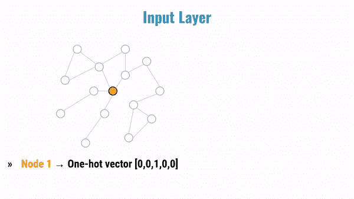

# 了解图形神经网络的构建模块(简介)

> 原文：<https://towardsdatascience.com/understanding-the-building-blocks-of-graph-neural-networks-intro-56627f0719d5?source=collection_archive---------14----------------------->

## [GRL 系列](https://towardsdatascience.com/tagged/grl-series)

## 对用于分析和学习图形数据的神经框架的直觉(带有运行代码)

T 他的帖子是关于*图形神经网络* (GNNs)的一系列文章的介绍。本系列的目标是通过直觉和例子提供 GNNs 构建模块的详细描述。

在这个系列中，我还会分享运行代码，使用 Numpy，Pytorch，以及这个领域采用的最突出的库，比如[深度图形库(DGL)](https://www.dgl.ai/) 和 [Pytorch 几何](https://pytorch-geometric.readthedocs.io/en/latest/)。在本系列的最后，您将能够组合这些构建块并创建一个神经架构来对图形数据执行分析和学习任务。

本系列将分析建立 GNN 的主要组件，包括(I)输入层，(ii)GNN 层，和(iii)多层感知器(MLP)预测层。

分析和分解标准 GNN 体系结构的框架基于最近发表的题为“基准图神经网络”的论文，其元数据如下:

> *Dwivedi，V. P .，Joshi，C. K .，Laurent，t .，Bengio，y .，& Bresson，X. (2020)。基准图神经网络。arXiv 预印本 arXiv:2003.00982 *。
> 来源:*[https://arxiv.org/abs/2003.00982](https://arxiv.org/abs/2003.00982)*

这篇文章不包括图论和神经网络的基础。对于这个主题的介绍，我建议阅读下面的文章:

[](/graph-theory-and-deep-learning-know-hows-6556b0e9891b) [## 图论和深度学习知识

### 图形学习和几何深度学习—第 0 部分

towardsdatascience.com](/graph-theory-and-deep-learning-know-hows-6556b0e9891b) 

## GNN 建筑:主要组成部分概述

*输入层*定义图形数据的初始表示，它成为 GNN 层的输入。基本上，其思想是为图的节点和边分配一个要素表示。

*GNN 层*对图形结构的信息进行编码。然后，它利用这些信息来更新节点和边的初始表示。

*MLP 预测层*执行特定的学习任务，包括*节点分类*或*链路预测*，采用从 GNN 层输出获得的编码图表示。

这篇文章介绍了输入层和 GNN 层背后的主要原理。接下来的文章将描述不同类型的 GNN 层，解释相关的功能，并显示它们之间的主要差异。同时，我将概述传统的 MLP 预测图层，以对图表数据执行特定的任务。



这个动画 gif 描述了通过 GNN 网络传播更新的节点特性——原始图片来自 GraphSAGE 网站的[主页](http://snap.stanford.edu/graphsage/)

## 输入层

如前所述，输入层的目标是定义图形数据的初始表示，将要素分配给节点和边。为了简单起见，我目前只考虑节点特性。

在图中表示节点的最简单的方法是使用*单键*向量。这种表示通常被用来区分 NLP 任务词汇表中的不同单词。在我们的例子中，它被用来表示图的不同节点。表示每个节点的向量的长度等于节点的数量，并且对于每个向量，不同位置的元素被设置为 1，而其他元素被设置为 0。

为了阐明这种表示，下面的脚本创建了一个包含 5 个节点的图，用一个热点向量表示。

```
import numpy as npX = np.eye(5, 5)
n = X.shape[0]
np.random.shuffle(X)print(X)-- output:[[0\. 0\. 1\. 0\. 0.]  # Node 1
 [0\. 0\. 0\. 1\. 0.]  # Node 2
 [1\. 0\. 0\. 0\. 0.]  # ..
 [0\. 0\. 0\. 0\. 1.]  # ..
 [0\. 1\. 0\. 0\. 0.]] # Node 5
```

这个矩阵的每一行代表图的一个节点。为了给每个节点分配初始特征，输入层将线性变换(也称为*投影*)应用于编码节点表示的一键矢量。简单回顾一下线性变换，定义如下:

```
Y = WX + b
```

如 Dwivedi 等人所报道的，在独热向量的情况下，偏置值 *b* 不用于线性变换。因此，以下脚本执行线性变换:

```
# Dimension of the node features (embedding)
emb = 3# Weight matrix (initialized according to Glorot & Bengio (2010))W = np.random.uniform(-np.sqrt(1\. / emb), np.sqrt(1\. / emb), (n, emb))print(W)-- output:
[[-0.34857891 -0.5419972   0.43603217]
 [ 0.26261991  0.04720523 -0.42555547]
 [-0.09968833  0.3218483   0.09688095]
 [-0.36646565  0.37652735 -0.45564272]
 [-0.24990413 -0.50164433 -0.51217414]]
--# Linear projection
L_0 = X.dot(W)print(L_0)-- output:[[-0.09968833  0.3218483   0.09688095]
 [-0.36646565  0.37652735 -0.45564272]
 [-0.34857891 -0.5419972   0.43603217]
 [-0.24990413 -0.50164433 -0.51217414]
 [ 0.26261991  0.04720523 -0.42555547]]
```

投影步骤为图中的每个节点分配一个 *d* 维向量表示。在这个例子中，表示节点的 5 长度的独热向量被映射(或投影)成 3 长度的密集特征向量。

转述 Dwivedi 等人的话:

> 输入层的目标是将节点(和边)的输入要素嵌入到隐藏要素的 d 维向量中。这种新的表示是通过简单的线性变换(也称为投影)获得的。

为了阐明这一方面，可以分析以下块:

```
# X: One-hot vectors representing the nodes
[**[0\. 0\. 1\. 0\. 0.] ** **# Node 1 - 1 element in the *3rd* position** 
 [0\. 0\. 0\. 1\. 0.]             **0 in the other positions**
 [1\. 0\. 0\. 0\. 0.]  
 [0\. 0\. 0\. 0\. 1.]  
 [0\. 1\. 0\. 0\. 0.]] # W: Weight matrix
[[-0.34857891 -0.5419972   0.43603217]
 [ 0.26261991  0.04720523 -0.42555547]
 **[-0.09968833  0.3218483   0.09688095] # Emphasis to the *3rd* row**
 [-0.36646565  0.37652735 -0.45564272]
 [-0.24990413 -0.50164433 -0.51217414]]# L_0 (projection) = X.dot(W)
[[**-0.09968833  0.3218483   0.09688095**] # **Features of Node 1,** [-0.36646565  0.37652735 -0.45564272]    **represented by the *3rd* row**
 [-0.34857891 -0.5419972   0.43603217]   **of the weight matrix**
 [-0.24990413 -0.50164433 -0.51217414]
 [ 0.26261991  0.04720523 -0.42555547]]
```

当前特征是随机生成的。因此，这些特征实际上并不传达关于节点的任何类型的信息。然而，节点的这些初始特征将通过两个不同的步骤来更新:

*   通过 GNN 层聚合相邻节点的特征。
*   通过 MLP 层为特定目的对神经结构进行的训练。

在这个双重过程的最后，我们将能够获得节点的*嵌入*表示，它将由传达特定信息的特征来表征。换句话说，节点的矢量表示将表达有意义的信息，作为人类，我们应该能够通过观察图形来识别这些信息。在最简单的情况下，相似的嵌入特征将被分配给图中相似的节点。

## GNN 层

GNN 层的目标是更新从输入层获得的节点的*维*维表示。这个目标是通过 Dwivedi 等人定义的计算来实现的。al，一个“递归邻域扩散”，通过所谓的“消息传递框架”。该框架背后的主要思想是每个结点要素都用其相邻结点的要素进行更新。邻居特征通过边作为消息被*传递*到目标节点。因此，节点的新表示编码并表示图形的局部结构。为了执行这个步骤，我们需要一个描述图中节点之间关系(边)的结构。描述图中节点之间关系的邻接矩阵在这个方向上帮助了我们。

考虑下面的脚本，它初始化一个 5 节点图中的随机邻接矩阵:

```
# Randomly generated adjacency matrix
A = np.random.randint(2, size=(n, n))
np.fill_diagonal(A, 1)  # Include the self loop# The following lines are a trivial ack to create a symmetric
# Adj matrix that defines the edges of an undirected
# graph of 5 nodes
A = (A + A.T)
A[A > 1] = 1print(A)-- output:[**[1 1 1 0 1]** # Connections to Node 1
 [1 1 1 1 1]
 [1 1 1 1 0]
 [0 1 1 1 0]
 [1 1 0 0 1]]
```

邻接矩阵的每一行代表由 1 元素标识的到一个节点的连接。例如，第一行表示节点 1 连接到自身、节点 2、节点 3 和节点 5。另一方面，节点 1 没有连接到节点 4，因为位置(1，4)中的值等于 0。

让我们看看当我们将邻接矩阵与应用了投影的输入图层的输出相乘时会发生什么:

```
# A: Adjacency matrix
[**[1 1 1 0 1]** **# Connections to Node 1**
 [1 1 1 1 1]
 [1 1 1 1 0]
 [0 1 1 1 0]
 [1 1 0 0 1]]# L_0: Output from the input layer
[**[-0.09968833  0.3218483   0.09688095] # Features of Node 1**
 [-0.36646565  0.37652735 -0.45564272]
 [-0.34857891 -0.5419972   0.43603217]
 [-0.24990413 -0.50164433 -0.51217414]
 [ 0.26261991  0.04720523 -0.42555547]]# L_1 = A.dot(L_0)
[**[-0.55211298  0.20358368 -0.34828506] # What is this?**
 [-0.8020171  -0.29806065 -0.86045919]
 [-1.06463701 -0.34526588 -0.43490372]
 [-0.96494868 -0.66711419 -0.53178468]
 [-0.20353407  0.74558089 -0.78431723]]
```

为了更好地理解节点表示发生了什么，考虑下面的脚本，它将节点 1 的 *d* 维表示求和为节点 1、节点 2、节点 3 和节点 5 的 d 维表示。

```
print(L_0[0, :] + L_0[1, :] + L_0[2, :] + L_0[4, :])-- output:
**[-0.55211298  0.20358368 -0.34828506]i**# L_1 = A.dot(L_0)
[**[-0.55211298  0.20358368 -0.34828506] # Features of Node 1,**
 [-0.8020171  -0.29806065 -0.86045919]   **obtained summing the**
 [-1.06463701 -0.34526588 -0.43490372]   **features of local neighbors**
 [-0.96494868 -0.66711419 -0.53178468]
 [-0.20353407  0.74558089 -0.78431723]]
```

如您所见，节点 1 的更新矢量表示对应于邻居特征的*聚合*(在这种情况下是求和运算)。换句话说，这种表示编码了图的局部结构。

这种表示的关键思想之一是在神经架构中堆叠 *L* 层，得到的目标节点表示聚集了节点的特征，其与目标节点的距离等于 *L* 。这种行为是“递归邻域扩散”的结果。

正如 Dwivedi 等人所强调的:

> “堆叠 L GNN 层允许网络从每个节点的 L 跳邻居构建节点表示。”

不同 GNN 层之间的主要差异包括聚合类型，聚合是通过利用本地图结构来执行的。在最简单的 GNN 公式中，例如普通图卷积网络(GCNs)，聚集/更新是一种*各向同性*操作。这意味着以同样的方式考虑邻居节点的特征。更高级的神经架构，如图形注意力网络(GAT)，引入了*各向异性*运算，其中每个邻居节点在聚合中的贡献根据其重要性进行加权。

## 下一步是什么

在下一篇文章中，我将介绍 GCN 层，还将描述带标记边的图(知识图)的一个特定扩展，名为关系图卷积网络(R-GCN)。

[](/graph-neural-networks-for-multi-relational-data-27968a2ed143) [## 多关系数据的图形神经网络

### 从 GCNs 到 R-GCNs:用神经架构编码知识图的结构

towardsdatascience.com](/graph-neural-networks-for-multi-relational-data-27968a2ed143) 

关于 GAT 层计算的各向异性操作的更多细节，我建议阅读下面的文章，它提供了“从 math 到 NumPy”的详细解释。

[](/graph-attention-networks-under-the-hood-3bd70dc7a87) [## 引擎盖下的图形注意力网络

### 从数学到数学的循序渐进指南

towardsdatascience.com](/graph-attention-networks-under-the-hood-3bd70dc7a87) 

【https://towardsdatascience.com/tagged/grl-series】:*要进一步阅读关于图形表征学习的文章，可以点击以下链接关注我的系列文章。*

*如果你喜欢我的文章，你可以支持我使用这个链接*[*https://medium.com/@giuseppefutia/membership*](https://medium.com/@giuseppefutia/membership)*成为一个中等会员*。