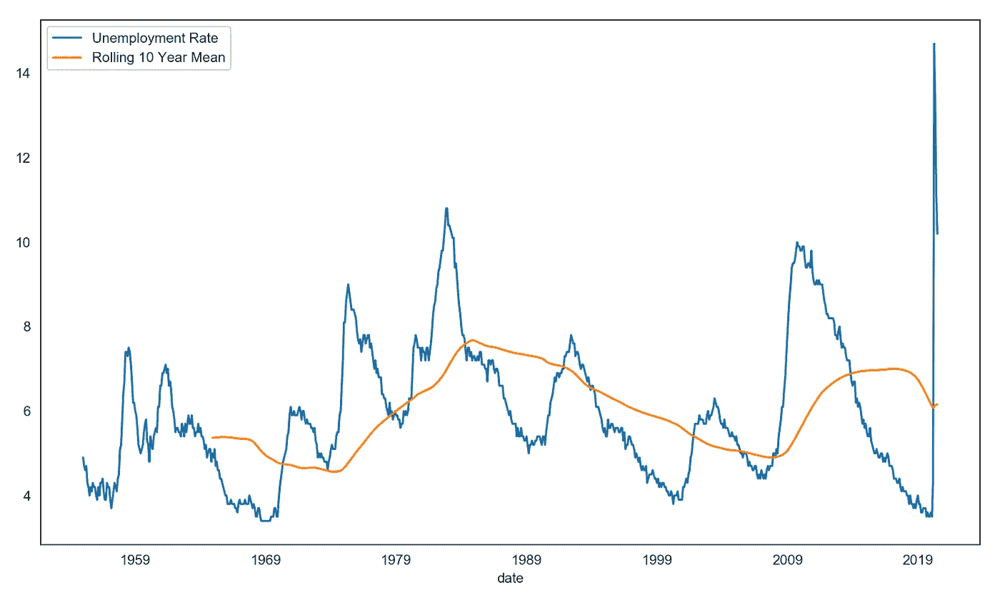
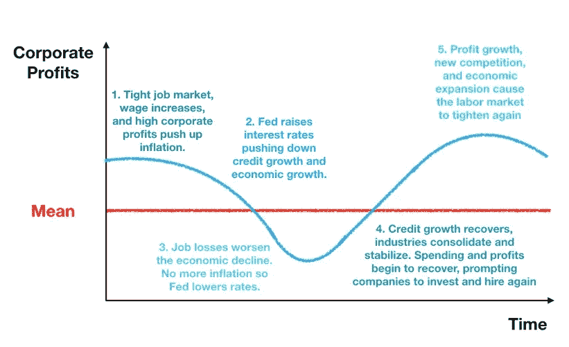
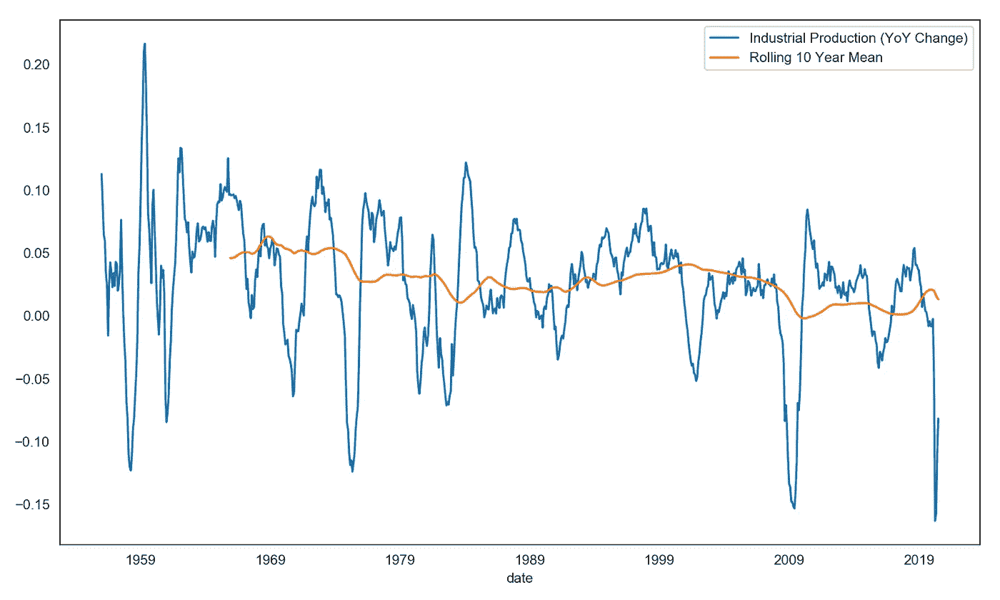
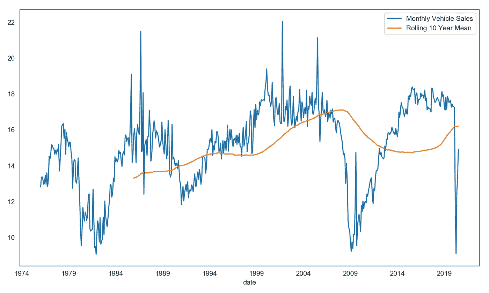
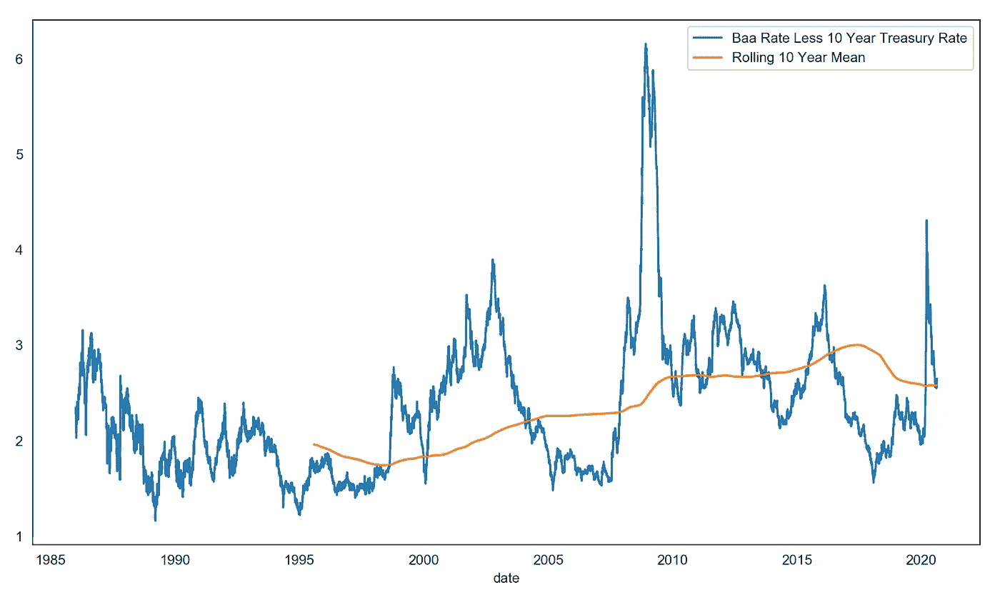
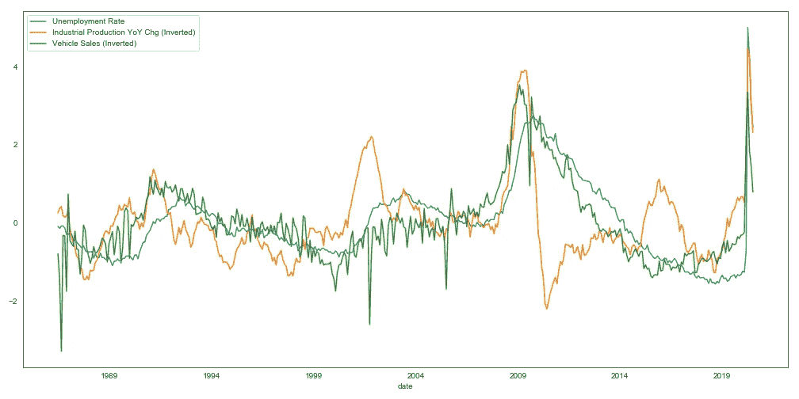
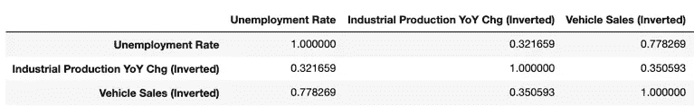
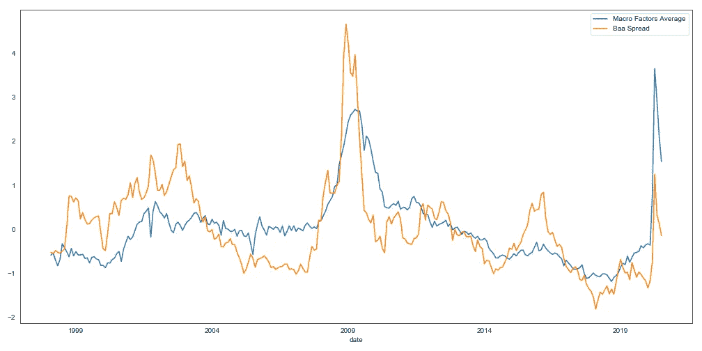

# 理解商业周期

> 原文：<https://towardsdatascience.com/understanding-the-business-cycle-79794263d49b?source=collection_archive---------26----------------------->

卢卡·布拉沃在 [Unsplash](https://unsplash.com?utm_source=medium&utm_medium=referral) 上的照片

## 也许是经济学中最强大的力量

经济学是一门不精确的科学，金融和投资更是如此(有人称之为艺术)。但如果经济学中有一样东西是你可以长期持续依赖的，那就是由于商业周期，事物的趋势意味着回归。

你可能听说过大数定律。它指出，当我们多次运行一个实验时，结果的平均值趋向于期望值(也称为平均值)。在更多处理时间序列数据的经济学和金融学中，数据也有向长期均值回归的趋势，尽管这种趋势有所减弱。例如，看看失业率在经济周期中的起伏，但会定期回到均值(橙色线):

由于商业周期，失业率回复到平均值(资料来源:圣路易斯美联储银行)

当然，这不同于大数定律，大数定律的思想是我们一遍又一遍地重复同样的实验。在经济学中，事情从来都不是一成不变的——十年前推动事情发展的许多力量如今往往已经大不相同了。因此，均值回归的幅度和速度会随着时间而变化。此外，平均值的精确值也是不确定的，可能会随着时间的推移而发生变化。

然而，驱动商业周期的最强大的力量是相当一致的，这解释了为什么尽管不断变化，许多经济变量如失业仍然倾向于可靠地意味着恢复:

*   尽管美联储可能会偏向鸽派或鹰派，这取决于谁在掌舵(严重偏向鸽派)，但它的任务是利用货币政策引导经济走向充分就业(和稳定的通胀)。美联储通常更喜欢稳定的经济增长、低失业率和不断上涨的资产价格。资产价格上涨(尤其是房地产)更受欢迎的原因是它会导致信贷扩张(资产价值上涨通过更健康的银行资产负债表、债务需求和更多贷款抵押品推动贷款)，这是经济增长的关键组成部分。
*   美国政府也通过财政刺激大力鼓励人们就业(幸福的公民、更高的支持率和更多的税收)。
*   过热行业或经济中的过度投资和过度就业增长最终会自我纠正——过多的供应和竞争(通常伴随着需求冲击)会压低价格和利润。而那些加入得太晚的企业往往以破产告终。
*   在失业率低于平均水平时(劳动力市场紧张)，高工资增长会推高通胀。如果通胀上升到足以让美联储开始加息，那么这也会减缓经济增长(通过减缓信贷增长——信贷减少，也就是借款，意味着每个人口袋里的钱减少，消费支出减少)。通常情况下，美联储最终会多次加息，导致经济陷入衰退，失业率超过平均水平。
*   受打击的行业或经济最终会复苏。一旦过剩供应被消除(通过违约或整合)，价格战就会停止，企业可以再次获得合理的投资回报。这种情况，加上扩张性货币和财政政策的影响，导致新一轮的经济扩张和失业率下降。

# 周期

在我们研究受周期影响的更多变量之前，让我们先描绘出它的大致形状和驱动力:

商业周期

每个周期都不同，推动过剩的行业也很少相同——上世纪 90 年代末是互联网，2005 年至 2008 年是房地产和银行。但是起作用的力量是相似的:

## 过热

紧张的劳动力市场以及强劲的企业利润和投资支出推动工资增长和信贷增长，这导致大量美元外流和通货膨胀。这刺激了(美联储的)利率上升。

## 衰退

更高的利率伤害了资产价格，降低了借贷的吸引力——净效应是支出减少，经济增长放缓，失业，最终是衰退(但不会有更多的通货膨胀)。

## 恢复

一旦通胀得到控制，美联储就能够专注于充分就业任务，并降低利率和/或印钞(量化宽松)，以刺激信贷增长和资产价格。通常，扩张性货币政策还伴随着政府的财政刺激——降低利率本身通常不足以扭转严重的衰退。

随着许多竞争对手的离去和业务的精简，幸存下来的企业逐渐恢复盈利，并开始重新招聘。

循环又开始了…

# 通过经济变量观察周期

早些时候，我们看到了这个周期如何导致失业潮涨潮落——尽管将失业率视为周期的主要驱动因素可能更准确(就业通常滞后于经济增长，但对大多数主要经济变量都有重大反馈影响)。

其他的是什么？工业生产的同比变化(与 GDP 高度相关)是另一个原因。请注意，当经济增长时，蓝线如何保持在橙线之上，而在衰退时，蓝线如何突破橙线之下。还要观察当前的低值，这暗示了由于持续的疫情导致的经济萎缩。好消息是，它已经开始意味着恢复，但仍远低于我们对健康和扩张的经济的预期。

工业生产年同比变化也在恢复(资料来源:圣路易斯美联储银行)

请记住，尽管有回归均值的趋势，但数据很少会在均值上停留很长时间。所以你不要把均值当成你以后会经常观察的一个水平。

我还增加了每月汽车销售总量——汽车销售对经济周期也非常敏感，因为当经济不景气时，人们往往会推迟大额购买。注意蓝线和橙线有多接近。这意味着，尽管疫情，目前的汽车销售速度几乎回到了可以被认为是正常的水平。

每月汽车总销量(资料来源:圣路易斯美联储银行)

我最喜欢观察的一个指标是信用利差，它衡量的是贷款人承担破产风险所需的额外收益率。它是公司债券(Baa 是仍然是投资级的最低评级)和安全债券(美国国债)利率之间的差异。我喜欢它，因为它是最近发生的事情的函数(有很多公司违约吗？)以及债券市场对未来的预期(未来几年是否会有很多公司开始违约？).这是一个很好的衡量市场风险偏好的指标——低于平均收益率意味着投资者认为一切都很好，高于平均收益率意味着投资者恐慌或接近它。

看起来投资者几个月前相当恐慌，但自那以后基本上平静下来了。

公司信用利差(来源:圣路易斯美联储银行)

我们可以做的一件事是查看每个时间序列的去趋势版本——为了消除趋势，我们只需减去平均值(蓝线减去橙线)。让我们将去趋势化(和 [Z 得分](https://en.wikipedia.org/wiki/Standard_score))变量相互叠加，看看它们是如何关联的:

各种宏观经济变量的 z 分数(来源:圣路易斯美联储银行)

我们可以看到，虽然失业率明显落后于其他两个系列，但这两个系列总体上是一致的。正如我前面提到的，失业率通常滞后于其他经济数据，因为企业往往不会轻易解雇员工，也不会轻易重新招聘员工(因为它们会在商业周期中实时摸索)。目前的疫情是一个例外，非自愿关闭迫使数千家企业关闭，数百万人几乎在一夜之间失业——所以这一次没有滞后。

如果你发现很难从前面的图中看出它们之间的相关性，下面是相关矩阵。汽车销售和工业生产高度相关(请注意，工业生产和汽车销售已经反转，使它们与失业方向一致，因此当汽车销售在图中出现高值时，实际上表示低于平均值)。失业率看起来相关性较低，因为与其他两个变量相比，它的移动具有滞后性(如果我们将失业时间序列滞后几个月，我们会看到更高的相关性)。

相关

最后，我们可以看看利差，包括投资市场对未来的预期(可能非常不准确)，如何与我们之前绘制的三个宏观经济变量的平均值相关联(时间序列绘制为 Z 分数)。

z 得分的宏观因素平均值与信用利差(来源:圣路易斯联邦银行)

它们通常一起移动(相关性=0.63)。这是金融的肮脏秘密之一——因为基于市场价格(以及市场嵌入和获取所有可用信息的方式)而被认为具有前瞻性的变量实际上是非常被动的。这意味着它们与经济数据同步(甚至略微落后)，几乎从不超前。真正的冲击会突如其来，通常会让投资者措手不及。

一件有趣的事情是，公司债券投资者对 2008 年和今天的看法有多么不同。尽管经济受到了类似规模的负面冲击，但信贷息差在这次疫情期间几乎没有变化，已经恢复到 10 年滚动平均水平。回到 2008 年，信贷息差最初受到的冲击要大得多，复苏也花了更长时间。

# 结论

宏观经济学是一个非常深奥的课题，这篇文章仅仅触及了商业周期的表面。尽管我把它命名为“理解商业周期”，但我怀疑任何没有先验知识和经验的人读了这篇文章后会对商业周期有深刻的理解。相反，更重要的是，你要认识到商业周期的存在——它是我们经济和金融生活中潮起潮落的原因。

一想到商业周期，就让我想起那句老话，“历史不会重演，但往往会押韵”。记住这一点，我们不仅应该认识到商业周期的存在，而且还应该在我们仍然处于当前阶段时，至少付出一些努力和思考来为周期的下一阶段做准备。干杯！