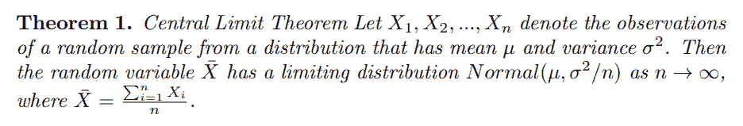
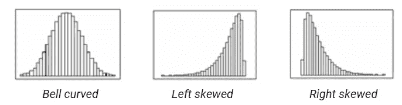
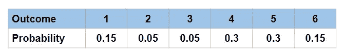
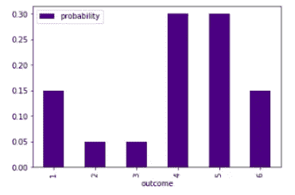
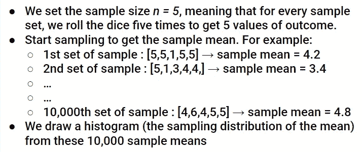
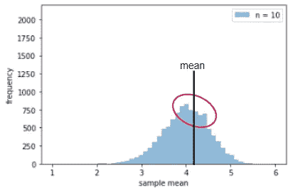
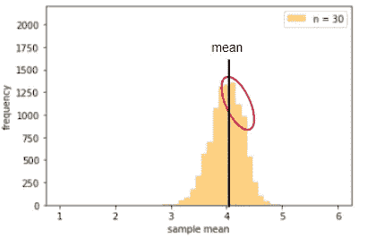
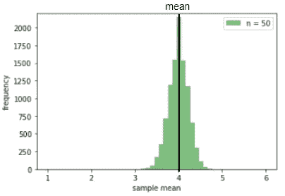
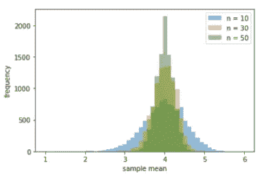

# 理解中心极限定理

> 原文：<https://towardsdatascience.com/understanding-the-central-limit-theorem-aeb89dd0ccad?source=collection_archive---------18----------------------->

照片来自[pixabay.com](http://pixabay.com)

## 以及它在假设检验中的重要作用

中心极限定理(CLT)是统计学中的一个流行概念。我相信大多数(有抱负的)数据科学家都以某种形式听说过它，或者至少在高层次上听说过这个定理。当数据量很大时，该定理经常被说成是神奇地提供了任何数据分布与正态(高斯)分布之间的相互联系。

话虽如此，我观察到这个定理的真正概念对许多人来说相当不清楚——包括我。是的，该定理将任何分布与正态分布联系起来。但是什么样的联系呢？不清楚。以及实现连接的过程是怎样的？也不清楚。

> 对我来说更糟糕的是，我曾经认为这个定理意味着当数据量很大时，任何数据都将遵循正态分布。或者换句话说，在大数据点上不可能有偏斜(或任何非正态)分布。废话！

通过这篇文章，我将试着解释 CLT，这样你就不会陷入和我上面一样的误解。最后，我还讨论了该定理在每个数据科学家都应该理解的核心能力之一，即假设检验中的重要性。

本文的菜单如下:

1.  重温定理
2.  揭穿“均值的抽样分布”这一关键概念
3.  演示:一个疯狂的骰子
4.  假设检验中的 CLT

# 定理

下面是中心极限定理(CLT)的精确(数学)形式。

不要慌！因为我不假设你们每个人都是铁杆数学家，所以我提供该定理的“简单英语”版本:

> 给定一个足够大的样本量，一个变量的均值的**抽样分布将近似为正态分布，而不管该变量在总体中的分布如何。**
> 
> 更好的是，均值的抽样分布的均值等于总体均值。

或者在更高的层次上，变量的值可以遵循不同的概率分布，如下所示。

图一。分布的可能形状([来源](https://online.stat.psu.edu/stat504/node/14/))

然而，如果样本量很大，平均值的**采样分布将始终遵循钟形曲线(正态分布)形状。**

# 平均值的抽样分布

从上面的讨论中，我想再强调一次:保证遵循/近似正态分布的不是总体中的原始变量分布；取而代之的是均值的抽样分布。

均值的抽样分布是什么？这真的是一个关键概念，帮助我理解这个定理到底是关于什么的。所以下面就通过一个循序渐进的例子来一起揭穿吧！

根据以上，均值的抽样分布就是我们从多组样本中收集的每一个均值所形成的分布。在我们的例子中，我们有 *k* 组样本(每组包含 *n* 个高度值)。

# 演示:一个疯狂的骰子

来自 pixabay.com[的照片](http://pixabay.com)

现在是时候看看中央极限定理的作用了！

假设我们有一个疯狂(不平衡)的骰子，其概率质量函数如下。

我们疯狂骰子的概率质量函数

读上表的一个例子:骰子显示 5 的概率是 0.3(而不是像在平衡骰子中的 1/6 ~ 0.166)。此外，注意这个骰子分布的平均值是 4。因为

(1x 0.15)+(2x 0.05)+(3x 0.05)+(4x 0.3)+(5x 0.3)+(6x 0.15)= 4

接下来，我们来可视化一下这个骰子分布！显然，这种分布是不对称的，更不用说呈钟形了。

图二。骰子分布

现在，我们做以下事情。我们假装不知道骰子的分布。我们所知道的是我们手头有骰子，我们想通过执行下面的过程来估计骰子分布的平均值。

注意，上面选择 n = 5 只是为了说明的目的(为了计算每个样本的平均值)。它太小了，容不得 CLT 插手。下面，我们展示了当 *n* = {10，30，50}遵循完全相同的程序时的直方图。

**直方图为 *n* = 10**

图 3。n = 10 的直方图

突然之间，直方图(均值的采样分布)已经有些钟形了！(回想图 2，原分布严重不。)**这确实是 CLT 在行动中的示范**。

然而，它仍然是不对称的(见红色圆圈)，意味着平均值大于 4(地面真相)。

**直方图为 *n* = 30**

图 4。n = 30 的直方图

对于 *n* = 30，对称性越来越好。尽管它仍然稍微向左倾斜，再次意味着平均值比 4 稍大一点。

**直方图为 *n* = 50**

图 5。n = 50 的直方图

对于 n = 50，我们有一个几乎对称的高斯分布。分布以 4 为中心。这意味着如果我们在实验中选择了 n = 50，我们就能正确地估计出我们疯狂掷骰子的平均值。

**要观察的东西**

随着样本量 *n* 的增加，我们的演示中有两件事值得注意:

1.  平均值的抽样分布更接近正态(钟形)分布。
2.  此外，分布形状的可变性更强(越来越集中于总体平均值)。

图 6。不同 ns 对分布的影响

# 假设检验中的 CLT

中心极限定理在假设检验中至关重要，至少在以下两个方面。

**测试的正态假设**

众所周知，许多参数检验假设数据是正态的，如 t 检验、方差分析等。多亏了 CLT，考虑到我们的样本量很大，我们更有信心使用这样的测试方法。

为了更详细地说明这一点，假设我们要比较一个连续指标的两个平均值(来自两组),每个平均值都来自 1000 个样本。我们最初想使用 t 检验来继续，但在有人质疑我们数据的正态性假设后，我们开始怀疑。

如果我们理解 CLT，这种担心是不必要的，因为我们知道，即使数据总体是非正态的，均值的抽样分布将遵循正态分布。这就是我们需要关心的，因为我们将要测试的是手段。

**点估计精度**

回想我们在进行上述演示后的第二个观察结果；随着 *n* 变大，分布形状在可变性上变紧。这意味着假设检验的样本量越大，我们就越有信心从我们的数据中得到的点假设估计精确地逼近真实的总体参数。

继续我们比较两个平均值的例子。如果样本量增加到 10，000——与原始设置中的 1000 相比，我们会对两组的两个平均估计精度更有信心。

# 概述

祝贺并感谢您读到这里！🎉

在这篇文章中，我们讨论了中心极限定理，它是统计学中最重要的结果之一。特别是，我们强调理解“均值的抽样分布”的关键概念，当样本量很大时，其分布(而不是其他)保证遵循正态分布。后来，我们用这个定理来估计一个假想的疯狂骰子的平均值，从而证明了这个定理的有效性。

我想用一句话来结束这个话题。CLT 只对方差有限的分布有效。这意味着对于具有无限方差的分布，如柯西分布，CLT 的结果将不成立。

总而言之，希望这篇文章对你理解中心极限定理有所帮助！