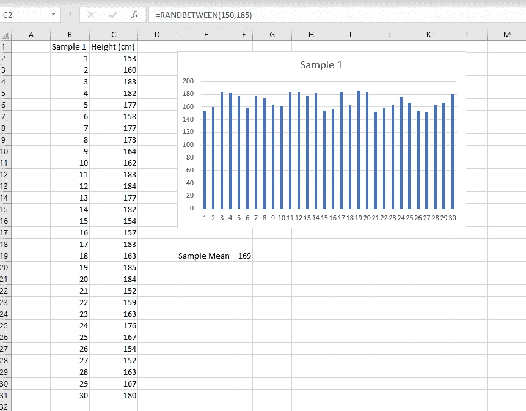
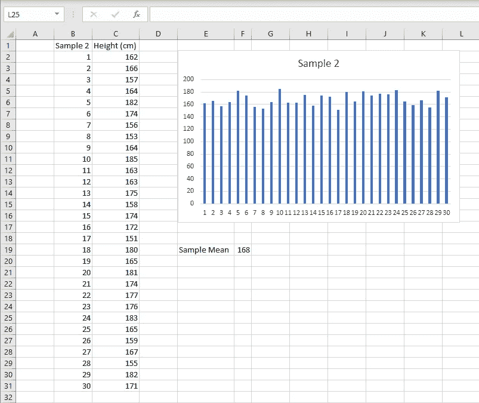
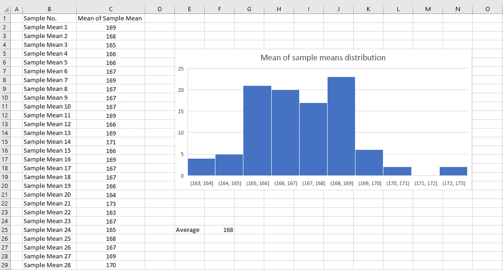

# 理解中心极限定理

> 原文：<https://towardsdatascience.com/understanding-the-central-limit-theorem-de6e65385e97?source=collection_archive---------23----------------------->

## 理解统计学中最重要概念之一的实用指南

在 [Unsplash](https://unsplash.com/s/photos/building?utm_source=unsplash&utm_medium=referral&utm_content=creditCopyText) 上由 [Verne Ho](https://unsplash.com/@verneho?utm_source=unsplash&utm_medium=referral&utm_content=creditCopyText) 拍摄的照片

中心极限定理(简称 CLT)是统计学领域中最重要的概念之一。

在这篇文章中，我将尝试用简单而非技术性的方式来解释这个概念。

## **简介**

让我们继续从高中的例子开始，就像这篇[帖子](/linear-regression-101-2fe898297b3)中讨论的那样

您现在决定进一步研究这些数据。

接下来，您想要找出在美国读 10 年级的所有男性高中生的平均身高。

但是为了得到准确的数据，你需要找出 10 年级每个学生的身高，然后除以学生总数，这几乎是一个不可能的任务。

这就是中心极限定理来拯救我们的地方。

> 中心极限定理表明**充分样本均值将近似等于总体均值**。

这意味着我们可以从数据的基本样本中找到人口的平均身高。

让我们看看怎么做。

## 方法学

从总体人口中挑选一个样本(样本 1)，大约 30 名学生，收集他们的身高，然后记录他们的样本均值，这也称为 x̄1

从另外 30 名学生中选择另一个样本(样本 2)，记录平均值，x̄2(样本平均值 2)

对大约 100 个样本做这个练习，并标绘数值(x̄1，x̄2..x̄100)并找出这些值的平均值。

> 随着样本数量的增加，上面的图将开始看起来更像正态分布(其中数据关于平均值对称，接近平均值的数据比远离平均值的数据出现的频率更高)
> 
> 样本平均值将近似等于总体平均值

此外，无论原始总体的数据分布如何(可以是正态分布/偏斜分布/均匀分布或任何其他分布)，都会发生这种情况

这个概念的力量在于，我们甚至可以将我们最初的问题扩展到一个更大的环境中。

例如，找出不同国家十年级学生的平均身高。

在这里，我们将不得不包括来自每个国家的样本，并包括更多的样本。

请注意，这里的原始人口分布可能是倾斜的，一些国家的高个子学生分布相对较高。

如果我们将所有样本均值数据点绘制在图上，它看起来就像正态分布。

## 实际应用

现在我们知道，不管人口数据点是如何分布的，样本均值图看起来总是像正态分布。

对于正态分布，我们知道

1.  均值、中值和众数相等
2.  数据关于平均值是对称的

利用这些性质，我们可以从总体上对人口进行推断

这有很多实际的应用。例如，预测哪个政党将在选举中获得多数席位，计算生活在不同地区的家庭每月的债务。