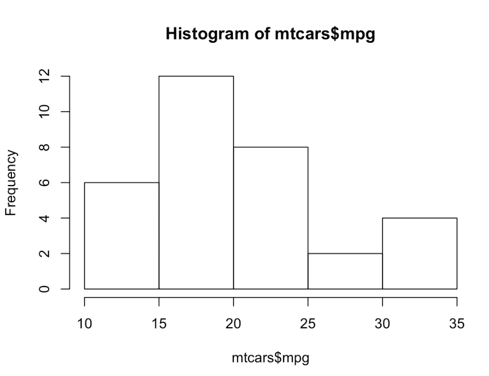
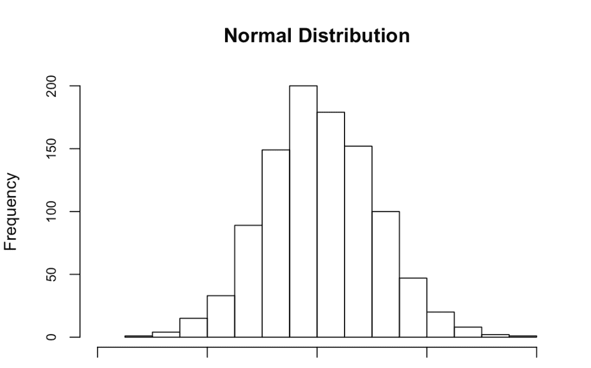
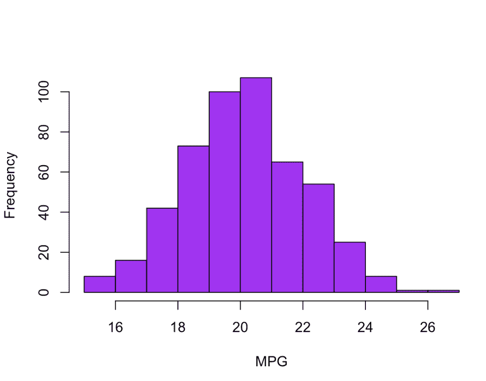

# 理解中心极限定理

> 原文：<https://towardsdatascience.com/understanding-the-central-limit-theorem-e3f7061a8d92?source=collection_archive---------53----------------------->


图片由 [Willi Heidelbach](https://pixabay.com/users/wilhei-883152/?utm_source=link-attribution&utm_medium=referral&utm_campaign=image&utm_content=689619) 来自 [Pixabay](https://pixabay.com/?utm_source=link-attribution&utm_medium=referral&utm_campaign=image&utm_content=689619)

# 在我们编码之前，快速回顾一下

今天，我想分解中心极限定理，以及它与数据科学家执行的这么多工作的关系。

# 直方图刷新程序

首先，任何数据科学家的核心工具都是一种非常简单的图表类型，称为直方图。虽然你肯定见过很多直方图，但我们经常忽略它的重要性。直方图的核心目的是了解给定数据集的分布。

作为复习，直方图表示在 x 轴上发现的变量的不同值在 y 轴上的出现次数。

这里有一个这样的例子，我们想了解在我们的数据集中，汽车每加仑行驶英里数的分布情况。这里我们使用的是`mtcars`数据集，可以看到在我们图表的右边有一点尾巴；这个直方图就是所谓的右偏直方图。这背后的概念是，是的，有汽车的极限汽油里程，但他们是非常少的。



# 标准正态分布

与您刚才看到的类似，您可能已经看到的经典分布是众所周知的正态分布，也称为钟形曲线，或标准正态分布。核心思想是事件的“分布”是**对称的* *。

看看下面的剧情。我们看到的直方图与之前的相似，但这里更加对称。



# 中心极限定理到底是什么？

中心极限定理指出样本均值的分布应该是近似正态的。

# 让我们在实践中看看这个定理

考虑下面的例子。假设你在一所大学工作，你想了解一个校友离开学校第一年的收入分布。

事实上，你不可能为每个校友收集数据。或者，您将对总体进行多次采样，以获得每个“样本”的单个样本均值。

我们现在通过直方图绘制样本均值，可以看到正态分布的出现。

这里的关键要点是，即使输入变量不是正态分布，抽样分布也会接近标准正态分布。

# 我们来编码吧！

作为这个想法的最后一个演示，我们最初从`mtcars`数据集绘制了 MPG 的分布。这里，我们为每个 mpg 样本生成一个向量，然后循环 50 个样本，每个样本取数据集中 10 个随机记录的平均值。我们再次将它们绘制成直方图，可以看到正态分布的出现。

```
mpg_samples <- c()for (i in 1:50) { 
    mpg_samples[i] = mean(sample(mtcars$mpg, 10, replace = TRUE))
    } 
hist(mpg_samples, col = 'purple', xlab = "MPG")
```



这应该作为数据科学培训的基本概念，是假设检验、实验以及其他数据科学方法和技术的基础。

我希望这对你有所帮助！

祝数据科学快乐！