# 理解中心极限定理

> 原文：<https://towardsdatascience.com/understanding-the-central-limit-theorem-e905f8c06bb5?source=collection_archive---------24----------------------->

## 从头开始的数据科学

## 对数据科学最重要的统计结果建立直觉。

你在新闻上看到的每一项民意调查或科学研究中对效应大小的每一个估计背后都有两个统计学结论:大数定律和中心极限定理。其中之一，大数定律，通常给人的印象是相当直观，但另一个就有点难以理解了。这是一个微妙的结论，其实际用途并不明显，但它可能是应用数据科学中最重要的一项统计数据。它强调了统计学家和数据科学家如何量化误差幅度，他们如何测试影响是否显著，以及为什么正态分布(那些经典的钟形曲线分布)在现实世界的变量中如此常见。如果您从事任何领域的应用统计工作，并且想要了解为什么您的工具会以这样的方式工作，您首先需要了解中心极限定理。

**复习大数定律**

大数定律陈述了一些对许多人来说似乎显而易见的事情:许多重复试验的平均值应该是这些试验中任何一个的平均期望值。任何一次试验都可能偏离平均值，但是当你考虑越来越多的试验时，它们的*组合平均值*几乎总是越来越接近预期平均值。一个常见的例子是抛硬币。如果你翻转的次数足够多，你应该得到大约一半的正面和一半的反面。如果你只抛几次硬币，很有可能得到一串正面或反面，但随着你继续抛，正面和反面的比例与平均值相差很大的可能性就会降低。

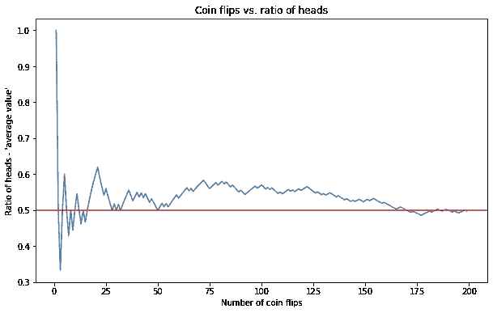

一个模拟的例子:当你掷越来越多的硬币时，正面在总数中的比例应该是 0.5 左右

大数定律对于调查和投票也很重要。例如，让我们说，在你可以很容易地在互联网上查找之前，你想知道人们的平均身高是多少。你决定进行一项调查可能是一种明智的方式，并开始询问随机的人他们有多高。一项随机调查的结果本身就是一个随机变量——你可能会选择比平均水平高的人或比平均水平低的人，如果你随机选择他们，你不会提前知道他们是高了还是矮了。你不能只调查一个人——你随机找到一个与平均身高完全相同的人的几率有多大！—但是如果你调查许多人，你的样本平均值可能会接近总体人口的真实平均值，如果你调查越来越多的人，你的样本平均值会越来越接近真实平均值。样本 10 比样本 1 好，样本 100 比样本 10 好。

这是大数定律在起作用——你的样本越大，你期望的真实平均值就越接近。你可能会意识到这里有一些警告，这并不像“更多的调查等于更好的结果”那么简单。特别是，这只有在您的试验或调查是随机的并且属于同一分布的情况下才有效。比方说，如果你在 NBA 比赛后从更衣室里的人群中随机选择调查对象，你会遇到麻烦。NBA 球星的身高分布与普通人群的身高分布不同，所以如果你的样本平均值与普通人群的不一致，不要感到惊讶。更微妙的是，如果你对调查对象的选择不是相互独立的，你也会遇到麻烦。比方说，你随便打电话给一个人，问他们有多高。太好了，你的调查又多了一个身高，但是，当你和他们通话的时候，你想你可以节省一些时间给陌生人打电话，也可以问问他们家里其他人的身高。现在你的样本不再是随机的了。满足这些要求的一个样本或一组随机变量的统计学术语是它们是“独立同分布的”——或 i.i.d

(实际上，LLN 还需要满足几个要求，例如，分布有一个明确定义的期望值，但是这些问题在现实世界的用例中并不经常出现。)

**下一步:中心极限定理**

有了 LLN，你就知道要得到一个好的估计值，你只需要一个足够大的样本。但是，多大的样本才是“足够大”呢？要回答这个问题，我们需要中心极限定理。中心极限定理认为，像样本平均值这样的样本统计量本身就是一个随机变量，随着样本量的增加，它大致呈正态分布，而与从中抽取样本的总体分布无关。*实际上有很多东西需要解开，所以让我们考虑一下定理的每个部分意味着什么。

像样本平均值这样的样本统计数据:首先需要理解的一件重要事情是，CLM 不能告诉我们任何关于某个特征在总体中的分布情况，甚至不能告诉我们该特征在样本中的分布情况。相反，CLM 告诉我们一些关于样本平均值分布的有趣的事情。请记住，我们调查中的单个测量值是一个随机变量。样本平均值也是一个随机变量，因为它完全来自测量值，而测量值本身就是随机变量。因为有了 CLM，我们知道了一些关于样本平均值分布形状的重要信息——也就是说，随着样本量的增长，它会变成正态分布。

**正态分布**:正态分布是一类人们倾向于熟悉的“钟形曲线”分布:薄的尾部围绕着较厚的中部，对称地以平均值为中心。正态分布有一个公式，但就我们的目的而言，我们不需要过多地考虑它。重要的是要理解，正态分布本质上只是一种具有众所周知的属性的形状，就像“圆”是一种形状一样。就像圆可以更大或更小一样，正态分布有不同的大小——有些更高更窄，有些更平更宽——但都有某些共同点。为了完美地描述一个圆，你只需要两条信息，它的半径和它的中心位置。同样，为了完美地描述一个正态分布，你只需要两条信息——它的平均值(类似于它的“中心”)和它的标准差。

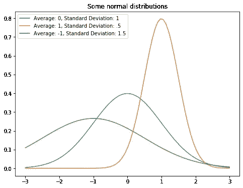

三种正态分布

为了理解随着样本大小的增加，样本平均值将呈正态分布意味着什么，让我们看一个简单的例子。我们将考虑一个更简单的随机变量，即掷骰子的值，而不是高度样本。你会注意到掷骰子的概率分布(假设它是一个公平的骰子)明显不像钟形曲线。每个数字出现的可能性都是相同的:

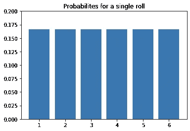

这个分布有一个“平均”期望值，但这个平均值实际上是 3.5，一个我们在任何单个卷上都不会看到的数字。不管你掷骰子多少次，下一次掷骰子的概率保持不变。如果我们掷一个骰子很多次，并简单地记录它落在什么地方，我们应该得到一个看起来非常类似于这些基本概率的图表，加上或减去由于我们掷的随机机会而产生的一些差异:

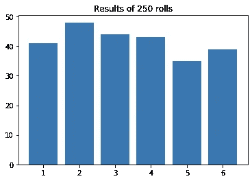

如果我们不是一次掷出一个骰子，而是一次掷出一把并记录平均值，有趣的事情就开始发生了。让我们试着一次掷出 5 个骰子:

当我们一次掷出五个骰子时，我们开始在中间看到一个峰值。这在某种程度上是大数定律的开始——当我们掷出一个骰子时，我们得到的值往往远离整体期望值，如 1 和 6，但当我们掷出多个骰子并考虑它们的平均值时，我们倾向于得到更接近期望值 3.5 的数字。此外，分布开始呈现钟形。用更多的纸卷再试一次会延续这一趋势:

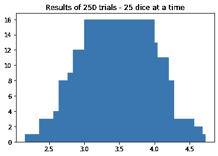

**不考虑抽取样本的人口分布**:你可能会想，这可能不是一个令人印象深刻的结果，像掷骰子这样简单的事情可能会合理地倾向于这种结果。令人难以置信的是，不管你考虑的随机变量的潜在分布是什么，这个结果都成立。比方说，你有一个装了子弹的骰子，它不会以相等的概率落在每个数字上。考虑这些可能性:

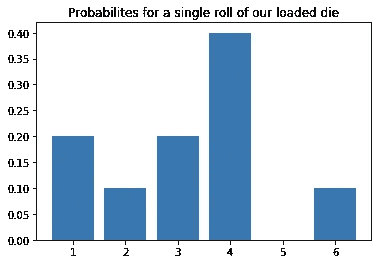

这个骰子喜欢一些数字，比如 4，但实际上从不落在 5 上。如果我们滚动几次，我们会得到你所期望的结果:

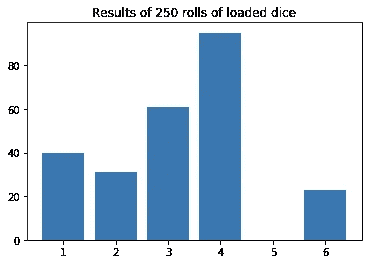

但是，再一次，如果我们一次掷出 5 个骰子，平均结果，我们开始看到钟形曲线的开始形成:

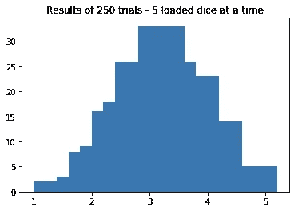

如果我们一次滚动 25 个，我们就不能真正判断出我们是从一个偏斜的基本分布中产生这些样本平均值的:

基础随机变量具有何种分布并不重要，随着样本规模的增长，样本平均值的分布将越来越接近正态分布。

请记住，任何正态分布都可以用两条信息来描述，即平均值和标准偏差。对于样本平均值的分布，这两个值是什么？平均值将是真实的总体平均值。然而，标准偏差会随着样本量的增加而缩小——这本质上又是 LLN，随着样本量的增加，平均值会向真实的总体平均值靠拢。事实证明，这条正态曲线的标准差是总体的标准差除以样本量的平方根。

**为什么这如此重要？**

为什么知道样本平均值是正态分布会这么有用？尤其是当你只看到一个样本平均值的时候？不像你正在研究的分布，你可能甚至不知道它的形状，正态分布有一些众所周知的和可靠的特征。有了一个合理大小的样本，大数定律表明我们应该找到一个接近真实总体平均值的样本平均值，但是有多接近呢？知道样本平均值是正态分布会有所帮助。回想一下，正态分布是一种具有某些可预测属性的形状，其中之一是它在其平均值附近最密集。正态分布的大部分区域以平均值为中心，尾部很快消失。从正态分布中随机选取的数字更可能来自曲线的中心区域，而不是尾部。

更重要的是，虽然一些正态分布比其他的更高和更窄，但我们可以用相同的标准差比率来量化曲线下的面积。为了说明我的意思，考虑下面的正常曲线:

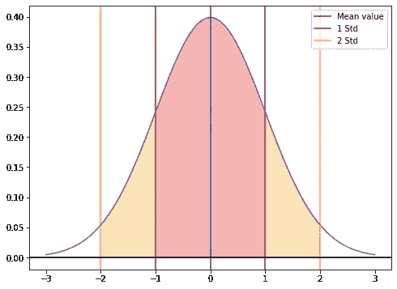

蓝色垂直线代表分布的平均值。红色垂直线是平均值上下的一个标准差。它们之间的红色阴影区域——也就是曲线下平均值的-1 和 1 倍标准差之间的所有数据——仅占曲线下区域的 68%。类似地，黄色垂直线代表平均值上下的两个标准差，它们之间的距离代表分布总面积的 95%多一点。如果你从正态分布中随机选取一个值，95%的情况下你会得到这两条线之间的值。不管正态分布的均值或标准差取什么值，这都是正确的。

两个正态分布。每个分布中的阴影区域大小相同

事实证明，即使我们只看到一个样本和一个样本平均值，这些关于样本平均值的分布和正态分布的事实总的来说给了我们很多工作。样本平均值是真实总体平均值的无偏估计量，样本的标准偏差是总体标准偏差的无偏估计量(实际上，对样本标准偏差有一个小的调整，以[纠正一些偏差](https://en.wikipedia.org/wiki/Bessel's_correction)，但它不会改变这里的逻辑，而且，无论如何，大多数统计软件包都会为您应用它)。回想一下，样本平均值分布的标准差来自总体的标准差(除以样本大小的平方根)。我们有了描述这一个样本的样本平均值分布所需的所有信息！

此外，我们非常确定这个特殊的样本平均值落在分布的中心。我们不知道它是高于真实人口平均值还是低于真实人口平均值，但我们 95%确定它在平均值上下两个标准差之间。如果我们取样本平均值，加上两个标准差，得到一个上限，减去两个标准差，得到一个下限，我们就有了一个区间。在以这种方式创建的 95%的范围内，真实的总体平均值将落在范围内的某处。这被称为“置信区间”，因为它量化了 95%的置信水平。这也是民意调查误差幅度产生的原因。

这可能有助于了解实际情况，所以让我们考虑另一个简单的例子。同样，我们将掷骰子(或者，我将让计算机模拟掷骰子)。我们将掷出 20 面骰子，所以掷骰子的“总数”是从 1 到 20 的每一个数字。该人群的“平均”预期值为 10.5。每个样品总共有 20 卷。从这个样本中，我们将得到总体平均值(样本平均值)和样本标准差的估计值。根据这些，我们将以上面讨论的方式构建 95%的置信区间。以下是 25 次模拟试验的结果:

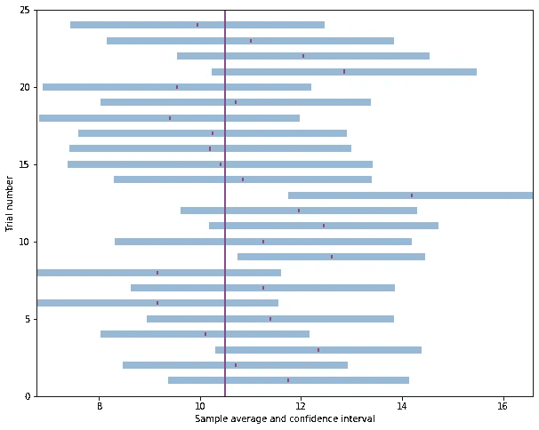

红色破折号是样本平均值，围绕它们的蓝色条是置信区间。例如，在第一次试验中，样本平均值接近 12，置信区间在 9 到 14 之间。为了便于参考，我将垂直的紫色线设为 10.5，以代表真实的人口期望值。你会注意到样本平均值会因随机机会而波动，有时你的样本平均值会高于真实平均值，有时会低于真实平均值。但是当你构造置信区间时，区间几乎总是包含真实的总体平均值。在这里的 25 个模拟试验中，只有两个样本与平均值相差很远，以至于真实的总体平均值没有出现在置信区间的某个地方。当然，像掷骰子这样的事情，我们可以提前知道真实的期望值应该是多少，但是当处理其他一些随机变量时，建立这样的置信区间是至关重要的。

CLM 也可以用来回答你需要多大样本的问题。回想一下，随着样本大小的增加，样本平均值的标准差下降(它是总体标准差除以样本大小的平方根)。如果您再次进行上述相同的实验，但这次每次试验包括 100 次掷骰子，而不是只有 20 次，您可能会看到如下结果:

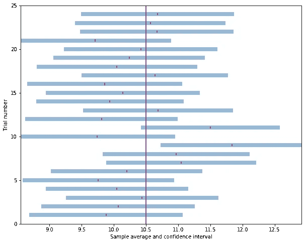

这看起来很像我们第一次运行这个实验，直到你看着 x 轴，注意到规模更小！我们的样本平均值通常更接近真实的总体平均值，并且我们的置信区间更小。使用 CLM 和这些关于正态分布形状的见解，我们可以回答样本需要多大才能达到某个预先指定的准确度水平的问题。

* CLM 的正式陈述通常是指独立随机变量的归一化总和，而不是它们的简单平均值，但是结论适用于样本平均值，并且出于本简介的目的，考虑样本平均值更简单。