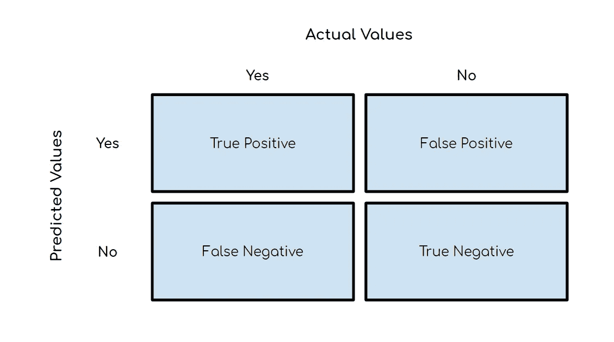
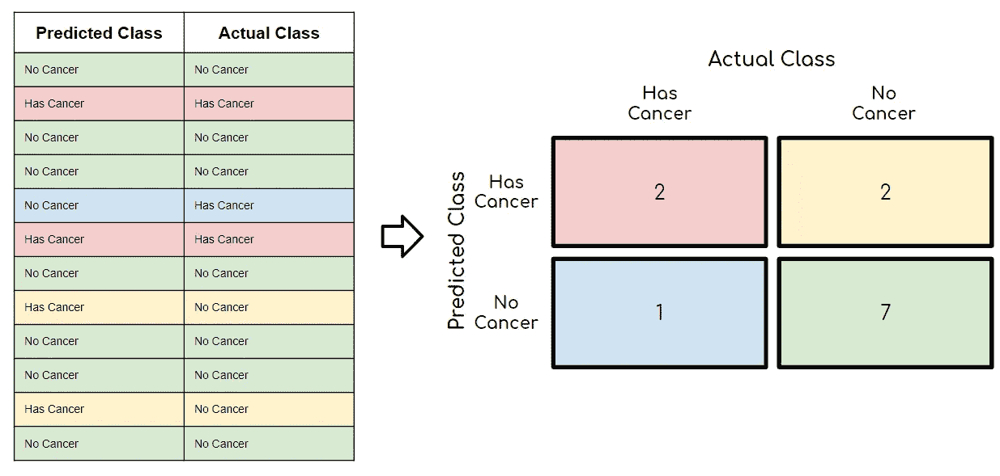

# 理解混淆矩阵以及如何在 Python 中实现它

> 原文：<https://towardsdatascience.com/understanding-the-confusion-matrix-and-how-to-implement-it-in-python-319202e0fe4d?source=collection_archive---------1----------------------->

## 评估模型的基本概念


图片由来自 [Pixabay](https://pixabay.com/?utm_source=link-attribution&utm_medium=referral&utm_campaign=image&utm_content=2979107) 的 [Gino Crescoli](https://pixabay.com/users/AbsolutVision-6158753/?utm_source=link-attribution&utm_medium=referral&utm_campaign=image&utm_content=2979107) 拍摄

# 目录

1.  [简介](#0d3e)
2.  [什么是混淆矩阵？](#3378)
3.  [混淆矩阵度量](#ed2f)
4.  [2 x2 矩阵示例](#baf7)
5.  [Python 代码](#ccfe)

> **请务必在此** [**订阅**](https://terenceshin.medium.com/membership) **或我的** [**个人简讯**](https://terenceshin.substack.com/embed) **千万不要错过另一篇关于数据科学指南、技巧和提示、生活经验等的文章！**

# 介绍

任何人都可以用几行代码构建一个机器学习(ML)模型，但构建一个好的机器学习模型则完全是另一回事。

我说的**好的**机器学习模型是什么意思？

这要看情况，但一般来说，你会根据你决定使用的一些预先确定的指标来评估你的机器学习模型。当涉及到构建分类模型时，您最有可能使用**混淆矩阵**和相关度量来评估您的模型。混淆矩阵不仅在模型评估中有用，而且在模型监控和模型管理中也有用！

*别急，我们这里说的不是线性代数矩阵！*

在本文中，我们将介绍什么是混淆矩阵，一些关键术语和指标，一个 2x2 矩阵的例子，以及所有相关的 python 代码！

说了这么多，让我们开始吧！

# 什么是混淆矩阵？

混淆矩阵，也称为误差矩阵，是一个**汇总表**，用于评估分类模型的性能。正确和错误预测的数量用计数值汇总，并按每个类别细分。

下图是一个 2x2 混淆矩阵的结构。举个例子，假设有十个分类模型预测为“是”的实例，而实际值为“是”。那么数字 10 会出现在正象限的左上角。这就引出了一些关键术语:



2x2 混淆矩阵的结构

*   **阳性(P)** :观察呈阳性(如**是**一条狗)。
*   **阴性(N)** :观察不阳性(如**不是**狗)。
*   **真阳性(TP)** :模型正确预测阳性类别的结果。
*   **真阴性(TN)** :模型正确预测阴性类别的结果。
*   **假阳性(FP)** :也称为**类型 1 错误**，这是一种模型错误预测阳性类别而实际上为阴性的结果。
*   **假阴性(FN)** :也称为**类型 2 错误**，这是一种模型错误预测阴性类别而实际为阳性的结果。

> **请务必点击** [**订阅此处**](https://terenceshin.medium.com/membership) **或我的** [**个人简讯**](https://terenceshin.substack.com/embed) **千万不要错过另一篇关于数据科学指南、技巧和提示、生活经验等的文章！**

# 混淆矩阵度量

现在您已经了解了混淆矩阵的一般结构以及相关的关键术语，我们可以深入了解一些可以从混淆矩阵中计算出来的主要指标。

*注意:这个列表并不详尽——如果你想看到你可以计算的所有指标，请查看维基百科的页面* [*这里*](https://en.wikipedia.org/wiki/Confusion_matrix) *。*

## 准确(性)

这仅仅等于模型正确分类的预测的比例。


## 精确

精度也称为**正预测值**，是相关实例在检索实例中所占的比例。换句话说，它回答了“多大比例的积极认同是正确的？”


## 回忆

召回率，也称为**敏感度**、**命中率**或**真阳性率(TPR)** ，是实际检索到的相关实例占总量的比例。它回答了“有多少比例的实际阳性被正确识别？”


为了真正击中要害，下面的图表是记住精确和回忆之间的区别的一个很好的方法(它确实帮助了我)！

## 特征

特异性，也称为**真阴性率(TNR)** ，衡量被正确识别的实际阴性的比例。它是回忆的反义词。


## F1 分数

F1 分数是对测试准确性的一种衡量——它是精确度和召回率的调和平均值。它的最高分是 1(完美的精确度和召回率)，最低分是 0。总的来说，这是对你的模型的精确性和健壮性的一个度量。


# 2x2 混淆矩阵示例

如果这对你来说仍然没有意义，那么在我们看了下面的例子之后就明白了。

想象一下，我们创造了一个机器学习模型，可以预测病人是否患有癌症。左边的表格显示了模型做出的 12 个预测以及每个患者的实际结果。有了我们的配对数据，你就可以用我上面展示的结构来填写混淆矩阵。

一旦填写完毕，我们就可以了解关于我们模型的一些事情:

*   我们的模型预测 4/12(红色+黄色)患者患有癌症，而实际上有 3/12(红色+蓝色)患者患有癌症
*   我们的模型具有 9/12 或 75%的准确度((红色+绿色)/(总))
*   我们模型的召回率等于 2/(2+1) = 66%



实际上，你会希望癌症检测模型的召回率尽可能接近 100%。如果一名癌症患者被诊断为没有癌症，情况会糟糕得多，相比之下，一名没有癌症的患者被诊断为癌症，但后来通过更多的测试才意识到他/她没有癌症。

# Python 代码

下面是计算上述指标所需代码的摘要:

```
# Confusion Matrix
from sklearn.metrics import **confusion_matrix**
confusion_matrix(y_true, y_pred)# Accuracy
from sklearn.metrics import **accuracy_score**
accuracy_score(y_true, y_pred)# Recall
from sklearn.metrics import **recall_score**
recall_score(y_true, y_pred, average=None)# Precision
from sklearn.metrics import **precision_score**
precision_score(y_true, y_pred, average=None)
```

在 Python 中有三种方法可以计算 F1 分数:

```
**# Method 1: sklearn**
from sklearn.metrics import f1_score
f1_score(y_true, y_pred, average=None)**# Method 2: Manual Calculation**
F1 = 2 * (precision * recall) / (precision + recall)**# Method 3: Classification report [BONUS]**
from sklearn.metrics import classification_report
print(classification_report(y_true, y_pred, target_names=target_names))
```

# 结论

现在你知道了什么是混淆矩阵以及它的相关度量，你可以有效地评估你的分类 ML 模型。即使在完成开发 ML 模型之后，理解这一点也是非常重要的，因为您将在机器学习生命周期的模型监控和模型管理阶段利用这些指标。

> **请务必点击** [**订阅此处**](https://terenceshin.medium.com/membership) **或我的** [**个人简讯**](https://terenceshin.substack.com/embed) **千万不要错过另一篇关于数据科学指南、技巧和提示、生活经验等的文章！**

# 感谢阅读！

如果你喜欢我的工作，想支持我…

1.  支持我的最好方式就是在**媒体**这里[关注我](https://medium.com/@terenceshin)。
2.  成为第一批在**Twitter**T2 上关注我的人之一。*我会在这里发布很多更新和有趣的东西！*
3.  此外，成为第一批订阅我的新 **YouTube 频道** [这里](https://www.youtube.com/channel/UCmy1ox7bo7zsLlDo8pOEEhA?view_as=subscriber)！
4.  在 **LinkedIn** 上关注我[这里](https://www.linkedin.com/in/terenceshin/)。
5.  在我的**邮箱列表** [这里](https://forms.gle/UGdTom9G6aFGHzPD9)报名。
6.  看看我的网站，[**terenceshin.com**](https://terenceshin.com/)。