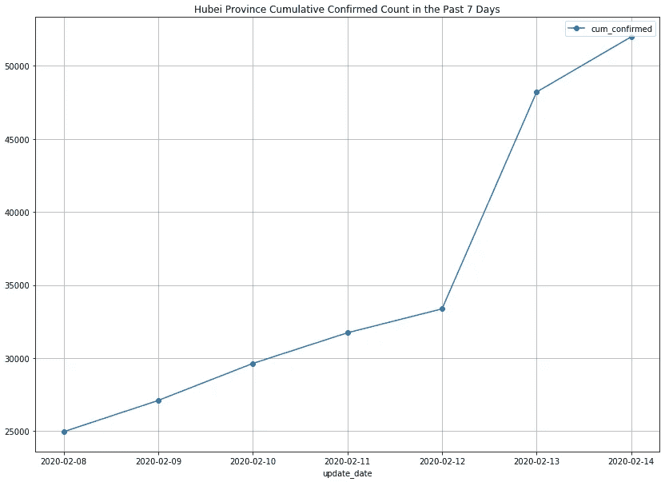
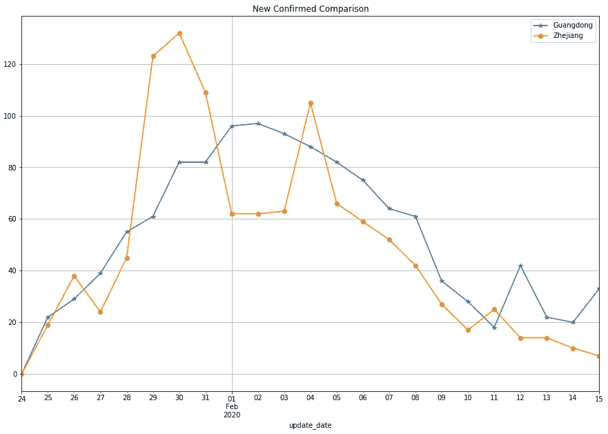
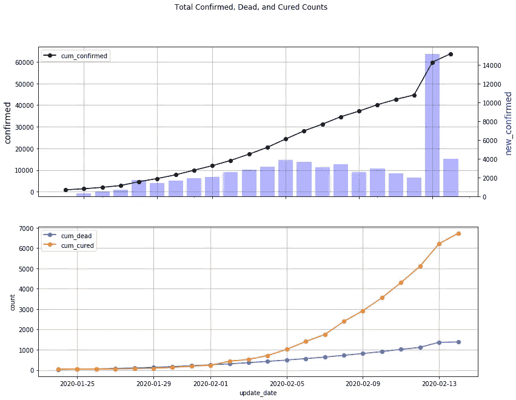
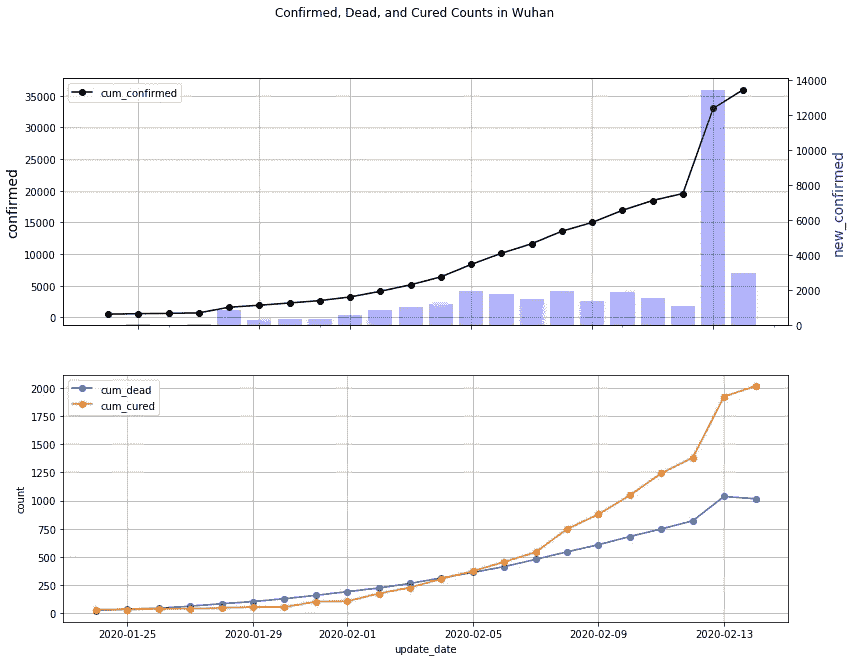
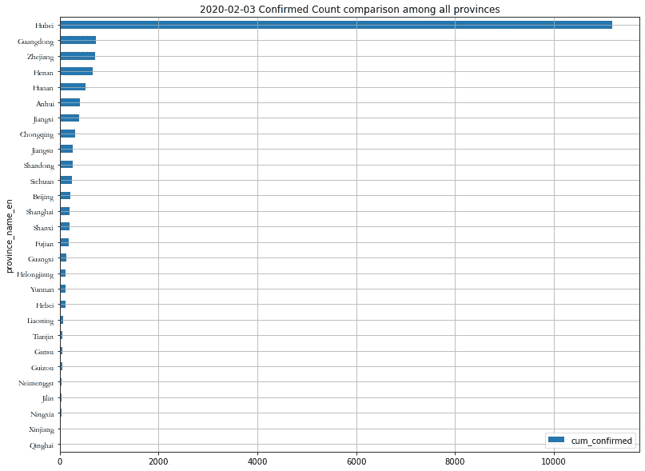
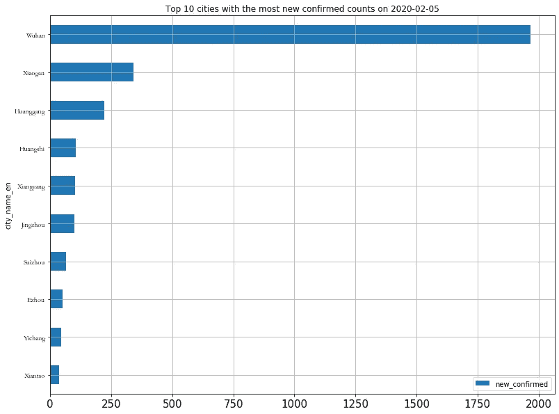

# 了解冠状病毒流行数据

> 原文：<https://towardsdatascience.com/understanding-the-coronavirus-epidemic-data-44d2fb356ecb?source=collection_archive---------12----------------------->

## 用于分析当前冠状病毒爆发的 Python 工具箱


Graphical Illustration from [前瞻网](https://t.qianzhan.com/caijing/detail/200122-b2c202ef.html)

新型冠状病毒(之前命名为 2019-nCov，后来改为 COVID-1⁹)目前正在席卷中国。截至 202⁰时间 2 月 13 日，它引发了一场全球卫生紧急事件，并夺走了 1000 多人的生命。世界各地的人们不断受到新闻、谣言、困惑和恐慌的轰炸。

为了帮助人们更好地评估形势，并促进理性反应，流行病数据必须便于公众获取。很多网站一直在实时发布一些疫情数字。比如[丁香元](https://ncov.dxy.cn/ncovh5/view/pneumonia)、[约翰霍普金斯 CSSE](https://gisanddata.maps.arcgis.com/apps/opsdashboard/index.html#/bda7594740fd40299423467b48e9ecf6) 、 [Mapbox](https://www.mapbox.cn/coronavirusmap/) 等。这些网站向公众提供及时的信息，但它们不能提供足够的数据进行分析。例如，使用上述网站回答以下任何一个简单的问题都非常困难或者几乎不可能:

Q1。湖北省过去 7 天的确诊病例数是多少？

Q2。广东省和浙江省的每日新增确诊病例相比如何？

Q3。截至 2020 年 2 月 13 日，死亡人数最多的前 5 个城市是哪几个？

(还有更多……)

为了能够分析数据，需要一个更方便的数据集。[DXY-2019-nCoV-Data](https://github.com/BlankerL/DXY-2019-nCoV-Data)GitHub 项目每天多次从[丁象元](https://ncov.dxy.cn/ncovh5/view/pneumonia)抓取实时疫情报告，并保存为 CSV 文件。但是这个 CSV 文件只包含网站数据的快照。由于报告时间的随机性和不断变化的报告格式，不容易用于分析。

因此，这个项目[**ncov 2019 _ analysis**](https://github.com/jianxu305/nCov2019_analysis)**⁴**是在 GitHub 中创建的。其主要目的如下:

*   执行关键数据清理
*   提供了一个方便的结构化数据供用户探索和贡献
*   使用此工具箱分析冠状病毒流行的某些方面

这个 GitHub 项目包含一个 [Python 笔记本](https://github.com/jianxu305/nCov2019_analysis/blob/master/src/coronavirus_demo_colab.ipynb)来说明基本用法。为了方便读者，笔记本在 Google Colab 中。以下是该软件包的演示。

# 1.获取原始数据

```
import pandas as pd
import matplotlib.pyplot as plt
import utils  *# functions to process the coronavirus data*data = utils.load_chinese_data()  #load the raw CSV data
```

这个加载函数显示数据集的一些基本信息。

```
Last update:  2020-02-14 13:02:25.736000
Data date range:  2020-01-24 to 2020-02-14
Number of rows in raw data:  38164
```

原始 CSV 数据如下所示:

# 2.数据处理

该步骤调用一个函数 *utils.aggDaily()* ，该函数运行多个步骤:

*   将原始 CSV 数据聚合到每日数据中。
*   由于不一致的报告方案、缺失的报告等，执行关键清理。
*   每天新增确诊/治愈/死亡人数。
*   为*省名*和*城市名*添加 **_en* 列，以便非中文用户可以轻松使用这些数据。

```
daily_frm = utils.aggDaily(data)
daily_frm.tail()
```

生成的“ *daily_frm* ”是一个平面 Pandas 数据框，逻辑上按(update_date，province_name(_en)，city_name(_en)进行索引，因此用户可以轻松地以他们想要的任何方式对数据进行切片，或者导出到其他应用程序(如 Excel 或 Google Sheet)进行进一步分析。

有了这个数据集，这三个对那些流行网站来说很难的示例问题可以通过几行代码轻松回答。现在让我们重温这些问题:

Q1。湖北省过去 7 天的确诊病例数是多少？

```
daily_frm[daily_frm['province_name_en'] == 'Hubei'].groupby('update_date').agg('sum')[-7:]
```



Q2。广东省和浙江省的每日新增确诊病例相比如何？

```
frm1 = daily_frm[(daily_frm['province_name_en'] == 'Guangdong') | (daily_frm['province_name_en'] == 'Zhejiang')].copy()frm1['update_date'] = pd.to_datetime(frm1['update_date'])frm2 = frm1.groupby(['update_date', 'province_name_en']).agg('sum')ax = frm2['new_confirmed'][:, 'Guangdog'].plot(figsize=(15,10), label='Guangdong', grid=True, marker='*')frm2['new_confirmed'][:, 'Zhejiang'].plot(ax=ax, label='Zhejiang', grid=True, title='New Confirmed Comparison', marker='o')ax.legend(loc='upper right')
```



Q3。截至 2020 年 2 月 13 日，死亡人数最多的前 5 个城市是哪几个？

```
daily_frm[(daily_frm['update_date'] == pd.to_datetime('2020-02-13'))].sort_values('cum_dead', ascending=False)[:5]
```

正如您所看到的，这个数据集非常灵活，可以轻松地回答许多其他方式难以解决的问题。

# 3.绘图功能

为了加快数据的分析，提供了两个方便的可视化绘图功能:

*   时间序列图:*utils . ts plot _ conf _ dead _ cured()*
*   横截面图:*utils . cross _ section _ bar()*

例如，您可以通过以下命令绘制中国确诊、死亡和治愈病例的总数:

```
fig = utils.tsplot_conf_dead_cured(daily_frm, title= 'Total Confirmed, Dead, and Cured Counts')plt.show()
```



同样，用户可以使用特定城市/省份的数据来获得该地区的相同绘图。此外，可以提供一个可选参数 *logy* 来控制 y 轴，这样用户可以更容易地看到数字是否呈指数增长。以下是武汉疫情中心同一地块的一个例子。

```
fig = utils.tsplot_conf_dead_cured(daily_frm[daily_frm['city_name_en'] == 'Wuhan'], **logy**=False, title='Confirmed, Dead, and Cured Counts in Wuhan')plt.show()
```



横截面图也很容易制作。以下是一个比较所有省份已确认数量的示例:

```
fig = utils.cross_sectional_bar(daily_frm, '2020-02-03', col='cum_confirmed', groupby='province_name_en', title='2020-02-03 Confirmed Count comparison among all provinces')plt.show()
```



可以提供一个可选参数" *largestN* "来只显示前 N 个条形。例如，下面比较了 2020 年 2 月 5 日最新确认数量最多的 10 个城市:

```
fig = utils.cross_sectional_bar(daily_frm, '2020-02-05', col='new_confirmed', groupby='city_name_en', largestN=10, title='Top 10 cities with the most new confirmed counts on 2020-02-05' )plt.show()
```



# 最后的话

以上是工具箱的一些基本用法。我希望它能为你更好地了解最近的冠状病毒疫情提供方便和帮助。

在[下一篇文章](/behind-the-coronavirus-mortality-rate-4501ef3c0724)中，我将使用这个工具箱来分析死亡率。你会看到并不是广为流传的 2%那么简单。

# 承认

我要感谢我的朋友 David Tian，他是一名机器学习工程师，对 Google Colab 的设置提供了慷慨的帮助，并对本文提出了宝贵的建议。看看他有趣的自驾* [DeepPiCar](/deeppicar-part-1-102e03c83f2c) *博客。

**更新(2020 年 3 月 2 日)**

来自约翰霍普金斯大学的国际数据已经被添加到我的 GitHub 项目中。这些数据不如中国的丁香园数据统一，因为许多国家没有省级报告，也根本没有市级数据。此外，在国家之间运送病人需要在数据处理方面格外小心。所以为了方便分析，做了一些数据清理。

参考:

[1]2020 年 2 月 11 日，世卫组织决定将该疾病命名为新冠肺炎:[https://www . who . int/DG/speechs/detail/who-总干事-s-remarks-at-the-media-briefing-On-2019-ncov-On-11-2020 年 2 月](https://www.who.int/dg/speeches/detail/who-director-general-s-remarks-at-the-media-briefing-on-2019-ncov-on-11-february-2020)

[2]2020 年 1 月 30 日，世卫组织宣布进入国际卫生紧急状态:[https://www . who . int/news-room/detail/30-01-2020-statement-On-the-second-meeting-of-the-international-health-regulations-(2005)-emergency-Committee-about-the-outbreak-of-novel-coronavirus-(2019-ncov)](https://www.who.int/news-room/detail/30-01-2020-statement-on-the-second-meeting-of-the-international-health-regulations-(2005)-emergency-committee-regarding-the-outbreak-of-novel-coronavirus-(2019-ncov))

[3]2 月 13 日，中国冠状病毒死亡人数超过 1000 人:[https://global news . ca/news/6533678/China-coronavirus-death-toll-who/](https://globalnews.ca/news/6533678/china-coronavirus-death-toll-who/)

[4]代码的 GitHub 链接:[https://github.com/jianxu305/nCov2019_analysis](https://github.com/jianxu305/nCov2019_analysis)