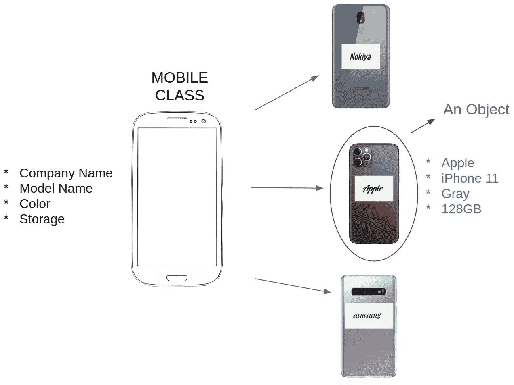

# 理解 python 中对象和类的症结。

> 原文：<https://towardsdatascience.com/understanding-the-crux-of-objects-and-classes-in-python-87c5f4f22d76?source=collection_archive---------40----------------------->

## 简化面向对象编程。

Emile Perron 在 [Unsplash](https://images.unsplash.com/photo-1484417894907-623942c8ee29?ixlib=rb-1.2.1&ixid=eyJhcHBfaWQiOjEyMDd9&auto=format&fit=crop&w=1489&q=80) 上的照片

*Nitin 是我大学三年级的学生，他从事编程已经很长时间了，到目前为止，他只是将函数和子例程作为编写应用程序的一种方式。最近，他决定转向面向对象的编程方法，并寻求我的帮助来理解其本质。在本文中，我试图通过我和 Nitin 之间的对话来解释面向对象编程的本质。*

**关键词** —对象、类、属性、实例、方法。

***我:*** *Nitin，你为什么对学习面向对象编程这么感兴趣，* [*面向过程编程*](https://www.ukessays.com/essays/information-technology/procedure-oriented-programming-4784.php) *有什么问题？* ***Nitin:****我发现我的代码很难结构化和[模块化](https://www.techopedia.com/definition/25972/modular-programming)。即使对于一个稍微不同的任务，我也别无选择，只能从头开始重写代码。此外，除了可重用性问题，我还发现调试代码很困难。
***Me:*** 是的，你是对的，这些都是程序编程方式的一些局限性。但是不要担心，我们有面向对象编程来拯救我们。*

****Nitin:*** *那么，什么是面向对象编程(OOP)？*
***我:* OOP** 基本上是一种编程方式，集中于利用&实现**对象**和**类**来设计/编写特定的应用程序。*

*   ***对象**是遵循某种结构/轮廓的数据类型，它可以存储数据并可以基于某种操作操纵数据。*
*   *一个**类**是对象的一种轮廓/模板。这些类使用**方法**定义了一个对象在程序中的行为。*
*   ***属性**是一个对象或一个类的属性/特征。据说所有对象都是某个类的一个**实例**。*

*让我们借助一个例子来理解这些术语:假设你有一个手机商店&想开发一个系统来观察你商店里手机的特性。为了便于说明，让我们假设你只是苹果、诺基亚和三星智能手机的交易者。*

*所以，你从一个**移动**类开始。所有的手机都有一个共同的特点——它们是“智能手机”。所以“**智能手机**”变成了**职业属性**，一个我店里所有手机都拥有的属性。还有另一种特定于被创建对象的属性，它们被称为**实例属性**。例如，不同的智能手机有不同的属性，如**公司名称**、**型号名称**、**颜色**、**存储、价格、**等。对于不同的被创建对象，这些特征将是不同的。*

*一个具体对象/实例的例子——一部**移动**手机，公司名称= **三星**，型号名称= **三星 Galaxy S10** ，颜色= **黑色，存储= 128 GB。因此，一个类是对它的实例拥有什么的描述。这个描述是由我们的实例属性给出的。在这里，我们可以看到数据被表示为对象的实例属性。***

**

*方法是我们系统组件交互的一种方式。方法是可以对我们的实例属性执行**操作**的动作。方法描述了类的行为。这些方法是特定类的所有对象都可以执行的通用操作。因此，一个类也是它的实例通过这些方法能做什么的描述。*

*考虑一个简单的例子:假设我们有另一个名为“current_battery”的实例属性，你可以定义一个方法 **Charging** ，这个方法在被调用时会更新你手机当前的电池电量。我们将在后面的章节中看到更详细的方法。*

****Nitin:*** *但是，方法和函数有什么区别呢？* ***Me:*** 尽管两者都使用 def 关键字，但方法通常定义在类内部，而函数则定义在类外部。记住:方法描述了一个类的行为。此外，函数是独立于对象的过程，而方法则依赖于对象的状态。*

****Nitin:*** *这个挺有意思的。* ***Nitin:****如果还能展示一些代码的话会很有帮助。* ***我:*** 确定。我假设您了解一些 Python 编程的基础知识。请考虑以下情况:*

*现在，你可能会问什么是“ *__init__* ”？是方法吗？什么是“*自我*”？它的价值是什么？让我们深入研究一下。*

*名字 **" *__init__"*** 是 python 中一个特殊的保留方法。我们使用 *__init__* 来指定正在创建的对象/实例的属性。 *__init__* 让你定制 python 如何实例化一个类的对象。也被称为**构造器**或**初始化器**。每当你创建一个类的新实例时，自动调用 *__init__* 方法*。(您可以检查它打印的上面的代码“init 被自动调用”)。这里，m1 和 m2 是正在创建的新实例。**

*****【自我】*** 是指被创建的实例/对象(m1，m2)。 **self** 包含实例的内存。当我们在一个类中创建方法时，它们自动接收 instance 作为第一个参数。这与其他几种编程语言不同，在这些语言中，**本身**作为隐藏参数传递给方法。**

*****Nitin:*** *一个类内可以多次使用构造函数吗？* ***Me:***是的，我们可以在一个程序中使用多个 __init__。但是，不管类中最后定义的构造函数是什么，它都将被使用。所以，本质上你只能使用一个构造函数。请考虑以下情况:**

**现在让我们继续前进。也可以手动为实例创建一个实例变量(属性)，例如 **m1.batterylife = 45。但是使用类没有任何好处，你每次都需要手动设置变量。同样，我们也可以更新实例变量的值。( **m1.price = 620** )。借助于方法，我们也可以做到这一点。请考虑以下情况:****

*****Nitin:*** *用方法改变值和直接更新值哪个好？* ***Me:*** 从长远来看，通过一种方法来改变值会给你更多的灵活性。假设计量单位发生了变化——商店原本是以美元结算的，现在不得不处理卢比。你只需要乘以 70 倍。( **self.price = price*70)。**想象一下，如果您为每个实例手动执行该操作，会有多痛苦。**

**上面定义的方法(new_price，discount_price)是 **Mobile** 类中的**常规方法**。常规方法将实例**又名自身**作为第一个参数，用于改变对象/实例的功能。我们也有**类方法。我们需要一些功能，不是写在一个对象上，而是写在整个类上。 它们用来修改一个类的状态。这些方法不是特定于对象的。****

**我们在装饰器(“@classmethod”)的帮助下使用类方法。在这些方法中，我们将类(cls 关键字)作为第一个参数传递。考虑一个例子:**

**还有另外一类方法——**静态方法**。静态方法也属于整个类，而不是某个特定的对象。这些方法不能改变对象的状态，因为它们没有被绑定。我们在装饰器(“@staticmethod”)的帮助下使用静态方法。他们不把类或实例作为第一个参数。请考虑以下情况:**

*****Nitin:*** *那么，静态方法和类方法有什么区别呢？* ***Me:***基本的区别是静态方法不能用来改变我们程序的功能，而类方法可以用来这样做。class 方法将类作为参数来了解该类的状态。静态方法不知道类的状态。这些方法通过接受一些参数来完成一些实用任务。**

**最后，我希望你喜欢学习哎呀。我很想知道任何阅读这篇文章的人的反馈。我很乐意回答对上述任何概念的疑问/问题。你可以在下面评论或者通过 [Linkedin](https://www.linkedin.com/in/akash2016123/) 联系我。**

**谢谢大家！**