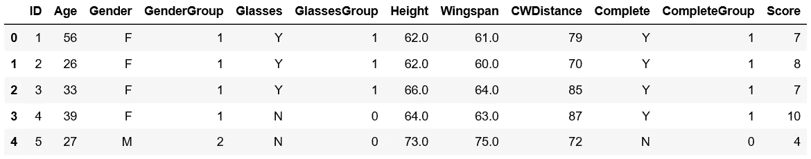
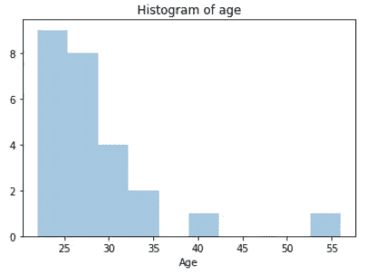
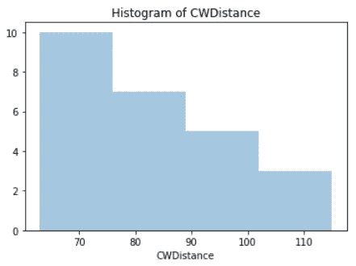
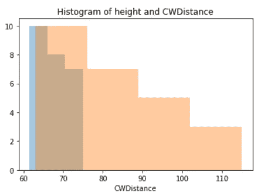
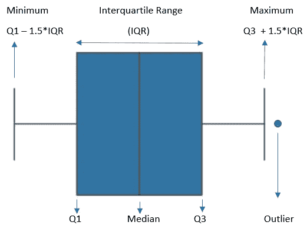
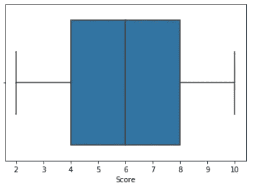
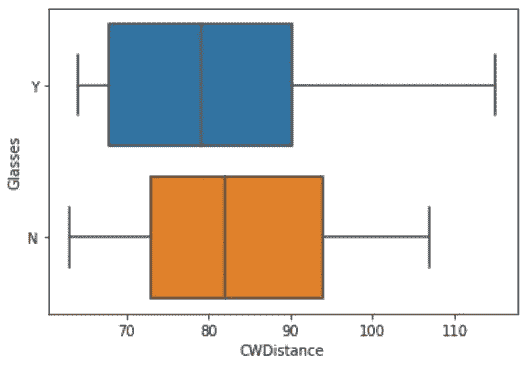
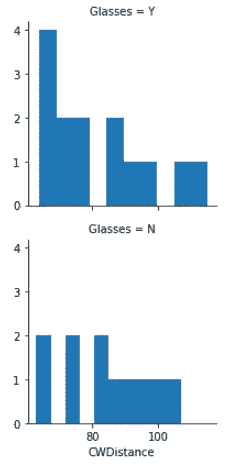

# 使用直方图和箱线图理解数据，并举例说明

> 原文：<https://towardsdatascience.com/understanding-the-data-using-histogram-and-boxplot-with-example-425a52b5b8a6?source=collection_archive---------26----------------------->

## 了解如何从直方图和箱线图中提取最多的信息

理解数据并不意味着只得到平均值、中值、标准差。很多时候，了解数据的可变性或分布是很重要的。直方图和箱线图都有利于提供大量关于数据集的额外信息，有助于理解数据。

## 柱状图

直方图只从数据集中选取一个变量，并显示每个变量出现的频率。我将使用一个简单的数据集来学习直方图如何帮助理解数据集。我将使用 python 来制作情节。让我们导入数据集:

```
import pandas as pd
import seaborn as sns 
import matplotlib.pyplot as plt
df = pd.read_csv("Cartwheeldata.csv")
df.head()
```



这个数据集显示了车轮数据。假设，办公室里的人决定在野餐时进行一场侧手翻距离比赛。上面的数据集显示了结果。我们来了解一下数据。

1.  做一个“年龄”直方图。

```
sns.distplot(df['Age'], kde =False).set_title("Histogram of age")
```



从上图可以明显看出，大部分人都在 30 岁以下。只有一个人 39，一个人 54。这种分布是右偏的。

2.做一个‘CW distance’的分配。

```
sns.distplot(df["CWDistance"], kde=False).set_title("Histogram of CWDistance")
```



多好的楼梯啊！很难说哪个范围的频率最高。

3.有时将两个分布图放在一起可以很好的理解。在同一张图中绘制“高度”和“距离”。

```
sns.distplot(df["Height"], kde=False)
sns.distplot(df["CWDistance"], kde=False).set_title("Histogram of height and score")
```



从这幅图中，我们不能说身高和 CWDistance 之间有关系。

现在看看，我们能从箱线图中提取什么样的信息。

## 箱线图

箱线图显示了更详细信息的数据分布。它更清楚地显示了异常值，最大值、最小值、四分位数(Q1)、第三个四分位数(Q3)、四分位数间距(IQR)和中位数。你可以从 IQR 算出中间的 50%。下面是图片:



它还为您提供了有关数据偏斜度、数据紧密程度以及数据分布的信息。

让我们看一些使用侧手翻数据的例子。

1.  做一个“分数”的箱线图。

```
sns.boxplot(df["Score"])
```



需要注意的是，最小值为 Q1-1.5 * IQR，最大值为 Q3 + 1.5*IQR。 **它们不是字面上的数据的最小值和最大值。这表明了一个合理的范围。**

> 如果您的数据值小于 Q1-1.5 * IQR 且大于 Q3 + 1.5*IQR，则这些数据可称为异常值，或者您可能需要再次检查数据收集方法。

在这张特殊的图片中，合理的最小值应该是，4–1.5 * 4，这意味着-2。我们的最小值不应小于-2。同时估计最大应该是 8 + 1.5*4 或者 14。所以，数据的最大值应该大于 14。幸运的是，数据集的最低分和最高分分别是 2 分和 10 分。这意味着没有异常值，数据收集过程也很好。从上图来看，分布看起来也是正态分布。

从这个图中，我们可以说，

a.分布是正态的。

b.中位数是 6

c.最低分为 2 分

d.最高分为 10 分

e.第一个四分位数(前 25%)是 4

f.第三个四分位数(75%)在 8

g.中间 50%的数据范围从 4 到 8。

h.四分位距是 4。

2.在同一箱线图中绘制两个变量有助于了解一个变量如何影响另一个变量。将 CWDistance 和“眼镜”绘制在同一个图中，看看眼镜是否对 CWDistance 有任何影响。

```
sns.boxplot(x = df["CWDistance"], y = df["Glasses"])
```



不戴眼镜的人比戴眼镜的人有更高的中位数。不戴眼镜的人的总体范围较低，但 IQR 值较高。从上图来看，IQR 的范围是 72 到 94。但是对于戴眼镜的人来说，总的视距要高一些，但是 IQR 从 66 到 90，比不戴眼镜的人要小。

3.分别针对戴眼镜和不戴眼镜的人的 CWDistance 直方图可以给出更多的理解。

```
g = sns.FacetGrid(df, row = "Glasses")
g = g.map(plt.hist, "CWDistance")
```



如果你看到，从这张图上看，戴眼镜的人的最大频率在 CWM 距离的开始。需要更多的研究来推断眼镜对近视距离的影响。构建一个置信区间可能会有所帮助。

我希望这篇文章能给你一些关于箱线图和直方图的额外信息。

更多阅读推荐:

[](/a-complete-guide-to-confidence-interval-and-examples-in-python-ff417c5cb593) [## 置信区间的完整指南，以及 Python 中的示例

### 对统计学中一个非常流行的参数——置信区间及其计算的深入理解

towardsdatascience.com](/a-complete-guide-to-confidence-interval-and-examples-in-python-ff417c5cb593) [](/interactive-geospatial-data-visualization-in-python-490fb41acc00) [## Python 中的交互式地理空间数据可视化

### 绘制世界特定地区的地图，在地图上展示活动，并四处导航

towardsdatascience.com](/interactive-geospatial-data-visualization-in-python-490fb41acc00) [](/want-to-become-a-data-scientist-in-12-weeks-3926d8eacee2) [## 想在 12 周内成为数据科学家？

### 花钱前再想一想

towardsdatascience.com](/want-to-become-a-data-scientist-in-12-weeks-3926d8eacee2) [](/polynomial-regression-from-scratch-in-python-1f34a3a5f373) [## Python 中从头开始的多项式回归

### 学习用一些简单的 python 代码从头开始实现多项式回归

towardsdatascience.com](/polynomial-regression-from-scratch-in-python-1f34a3a5f373)