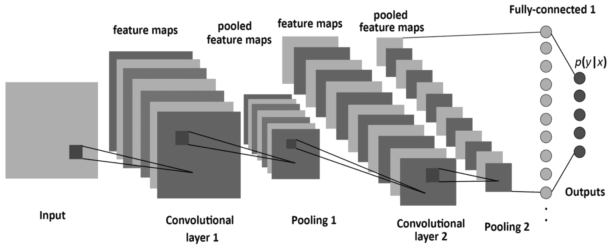
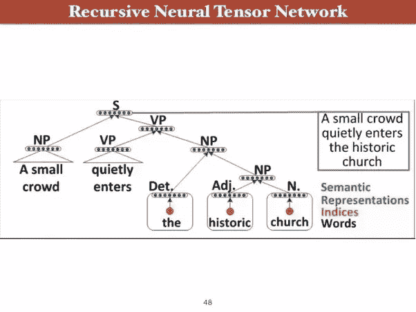

# AI，ML，和 DL:如何不把它们混在一起！

> 原文：<https://towardsdatascience.com/understanding-the-difference-between-ai-ml-and-dl-cceb63252a6c?source=collection_archive---------0----------------------->

## 理解人工智能、机器学习和深度学习之间的区别

> 我敢肯定，我们大多数人可能都熟悉“人工智能”这个术语，因为它一直是一些著名的好莱坞电影如《黑客帝国》、《终结者》、《星际穿越》的主要焦点。尽管好莱坞电影和科幻小说将人工智能描绘成像人类一样的机器人接管地球，但人工智能技术的实际进化甚至没有那么聪明或那么可怕。相反，人工智能已经发展到为医疗保健、零售、制造、银行等行业提供许多不同的好处。

人工智能、机器学习、深度学习、数据科学都是这个时代的热门词汇。了解它是什么以及它们之间的区别比以往任何时候都更加重要。虽然这些术语可能密切相关，但它们之间还是有区别的，请看下图。

作者照片

# **什么是人工智能？**

自从提出“机器能思考吗？”这个问题以来，人类一直痴迷于创造人工智能是艾伦·图灵在 1950 年提出的。人工智能使机器能够思考，也就是说，在没有任何人工干预的情况下，机器将能够做出自己的决定。这是计算机科学的一个广阔领域，它使机器看起来像具有人类智能。因此，这不仅仅是给计算机编程，让它通过遵守交通信号来驾驶汽车，而是这个程序也学会了表现出类似人类的道路愤怒的迹象。

图片来自人工智能 [HubSpot](https://www.youtube.com/watch?v=mJeNghZXtMo&t=173s)

# 人工智能系统的类型

人工智能系统根据它们模仿人类行为的能力、它们用于模仿人类行为的硬件、它们在现实世界中的应用以及思维理论来分类。使用这些特征进行比较，所有实际的和假设的人工智能系统都属于三种类型之一:

## **ANI:人工狭义智能**

人工狭义智能也被称为弱人工智能，它是当今世界上唯一存在的人工智能类型。狭义人工智能是面向目标的，被编程为执行单一任务，并且在完成它被编程为要做的特定任务时非常智能。人工智能的一些例子有 Siri，飞机上的自动驾驶仪，聊天机器人，自动驾驶汽车等。

狭义人工智能系统不像人类那样有意识、有知觉或受情绪驱动，它们使用来自特定数据集的信息，并且不执行它们被设计来执行的单一任务之外的任何任务。

## **AGI:人工通用智能**

人工通用智能也称为强 AI，是机器展示人类智能的一个概念。在这一点上，机器具有学习、理解和行动的能力，在给定的情况下与人类没有区别。一般的人工智能目前并不存在，但已经在许多科幻好莱坞电影中使用，在这些电影中，人类与有意识的机器互动，这些机器由情绪驱动并具有自我意识。

使用强大的人工智能，我们可以有能力建造能够在不确定的条件下思考、制定策略和执行多项任务的机器。他们可以在决策中整合他们先前的知识，提出创新的、创造性的和非常规的解决方案。

## **ASI:人工超级智能**

我相信你还记得阿诺德·施瓦辛格的《终结者》，在这部电影中，机器的认知在各个方面取代了人类的智慧。人工超级智能是一种假设的人工智能，机器将能够表现出超过最聪明的人的智能。在这种类型的人工智能中，除了拥有人类多方面的智能之外，机器还将拥有比人类更强的解决问题和决策能力。正是这种类型的人工智能将对人类产生巨大影响，并可能导致人类从地球上灭绝。

# **什么是机器学习？**

机器学习是人工智能的一个子集，它使用统计学习算法来构建系统，这些系统具有自动学习和从经验中改进的能力，而无需显式编程。

我们大多数人在日常生活中使用机器学习，比如在网飞、Youtube、Spotify 上使用推荐系统；像谷歌和雅虎这样的搜索引擎；像 google home 和亚马逊 alexa 这样的语音助手。在机器学习中，我们通过向算法提供大量数据，并允许它学习更多关于已处理信息的信息，来训练算法。

最大似然算法可以大致分为三类:监督学习、非监督学习和强化学习。

## **监督学习**

在监督学习中，我们有输入变量(x)和输出变量(Y ),我们使用算法来学习从输入到输出的映射。换句话说，监督学习算法采用一组已知的输入数据集及其对数据的已知响应(输出)来学习回归/分类模型。然后，学习算法训练模型来生成对新数据或测试数据集的响应的预测。

## **无监督学习**

当我们没有标记数据时，使用无监督学习。它的主要目的是在不参考已知输出的情况下，通过推断数据集中的模式来了解更多的数据。它被称为无监督的，因为算法通过在数据中寻找相似性、差异和模式来对未排序的信息进行分组。无监督学习通常作为探索性数据分析的一部分来执行。它最常用于查找数据聚类和降维。

## **强化学习**

简单来说，强化学习可以解释为通过不断地与环境互动来学习。它是一种机器学习算法，其中代理通过不断使用来自其先前动作和经验的反馈，以试错的方式从交互式环境中学习。强化学习使用奖励和惩罚，代理人执行正确的动作获得奖励，执行错误的动作获得惩罚。

# **什么是深度学习？**

深度学习是一种受人脑过滤信息方式启发的机器学习技术，它基本上是从例子中学习。它帮助计算机模型通过层来过滤输入数据，以预测和分类信息。由于深度学习处理信息的方式与人脑相似，因此它主要用于人们通常会做的应用程序中。这是无人驾驶汽车背后的关键技术，使他们能够识别停车标志，并区分行人和灯柱。大多数深度学习方法使用神经网络架构，因此它们通常被称为深度神经网络。

深度学习基本上是模仿人脑，它也可以被定义为包含大量参数和层的多神经网络架构。下面列出了三种基本的网络架构:

## **卷积神经网络**

图片来自 MDPI [文章](https://www.mdpi.com/1099-4300/19/6/242) *熵* 19.6 (2017): 242

卷积神经网络基本上是一种人工神经网络，它在计算机视觉领域中被最广泛地用于分析和分类图像。这是一种深度学习算法，它采用输入图像，并为图像中的各个方面或对象分配权重/偏差，以便能够区分彼此。CNN 的隐藏层通常由卷积层、汇集层、全连接层和标准化层组成。ConvNet 的架构类似于人脑中神经元的连接模式，其灵感来自视觉皮层的组织。

## **递归神经网络**

递归神经网络是一种用于序列预测问题的神经网络体系结构，并且在自然语言处理领域中被大量使用。rnn 被称为*递归*，因为它们对序列中的每个元素执行相同的任务，输出取决于之前的计算。考虑 rnn 的另一种方式是，它们有一个“存储器”，可以捕获到目前为止已经计算过的信息。

要了解更多关于 RNN 的信息，请参考这篇文章

[*http://www . wild ml . com/2015/09/recurrent-neural-networks-tutorial-part-1-introduction-to-rnns/*](http://www.wildml.com/2015/09/recurrent-neural-networks-tutorial-part-1-introduction-to-rnns/)

## **递归神经网络**

*一种* ***递归神经网络*** *是一种* [*深度神经网络*](https://en.wikipedia.org/wiki/Deep_learning#Deep_neural_networks) *通过对结构化输入应用相同的一组权重***来创建，以产生对可变大小输入结构的* [*结构化预测*](https://en.wikipedia.org/wiki/Structured_prediction) *，或对可变大小输入结构的标量预测[9]**

*递归神经网络更像分层网络，其中输入序列实际上没有时间方面，但是输入必须以树的方式分层处理。这是一个递归神经网络的例子。它展示了通过递归地获取对较小文本块执行的操作的输出来学习句子的解析树的方法。*

**

*截图来自 [PyTorch —递归神经网络—教程点](https://www.google.com/url?sa=i&url=https%3A%2F%2Fwww.tutorialspoint.com%2Fpytorch%2Fpytorch_recursive_neural_networks.htm&psig=AOvVaw1Xqy30OWN5TmfZmBgzs_wf&ust=1588290731429000&source=images&cd=vfe&ved=0CA0QjhxqFwoTCMjkk5nqjukCFQAAAAAdAAAAABAD)*

*本文试图通过定义人工智能、机器学习和深度学习，并解释每个主题中的各种子类别，来解释它们之间的差异。要更深入地理解上述主题，请参考参考资料部分提到的文章。*

## ****参考文献****

1.  *[http://beam Andrew . github . io/deep learning/2017/02/23/deep _ learning _ 101 _ part 1 . html](http://beamandrew.github.io/deeplearning/2017/02/23/deep_learning_101_part1.html)*
2.  *[https://content simplicity . com/what-is-deep-learning-and-how-it-work/](https://contentsimplicity.com/what-is-deep-learning-and-how-does-it-work/)*
3.  *[https://towards data science . com/what-the-type of-machine-learning-e 2 b 9 e 5d 1756 f](/what-are-the-types-of-machine-learning-e2b9e5d1756f)*
4.  *[https://code bots . com/artificial-intelligence/the-3-types-of-ai 是第三种可能性](https://codebots.com/artificial-intelligence/the-3-types-of-ai-is-the-third-even-possible)*
5.  *[https://www . science direct . com/topics/computer-science/supervised-learning](https://www.sciencedirect.com/topics/computer-science/supervised-learning)*
6.  *[https://medium . com/@ tja jal/distinguished-between-narrow-ai-general-ai-and-super-ai-a4bc 44172 e 22](https://medium.com/@tjajal/distinguishing-between-narrow-ai-general-ai-and-super-ai-a4bc44172e22)*
7.  *[https://towards data science . com/understanding-neural-networks-from-neuron-to-rnn-CNN-and-deep-learning-CD 88e 90 E0 a 90](/understanding-neural-networks-from-neuron-to-rnn-cnn-and-deep-learning-cd88e90e0a90)*
8.  *[https://en.wikipedia.org/wiki/Recursive_neural_network](https://en.wikipedia.org/wiki/Recursive_neural_network)*
9.  *[https://www.youtube.com/watch?v=k2P_pHQDlp0&t = 404s](https://www.youtube.com/watch?v=k2P_pHQDlp0&t=404s)*