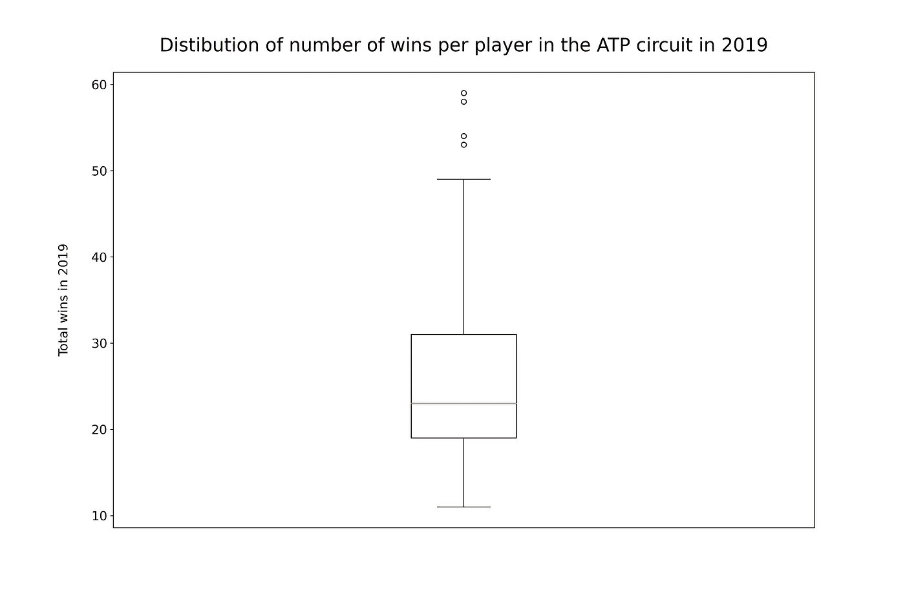
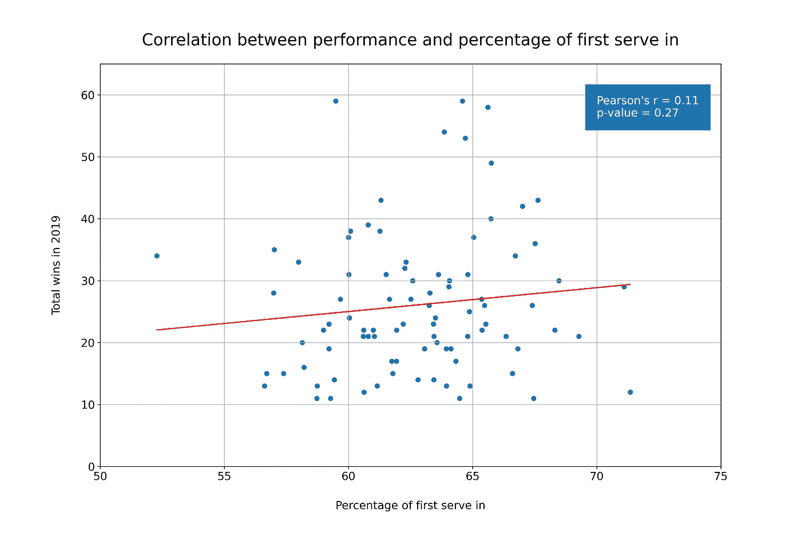
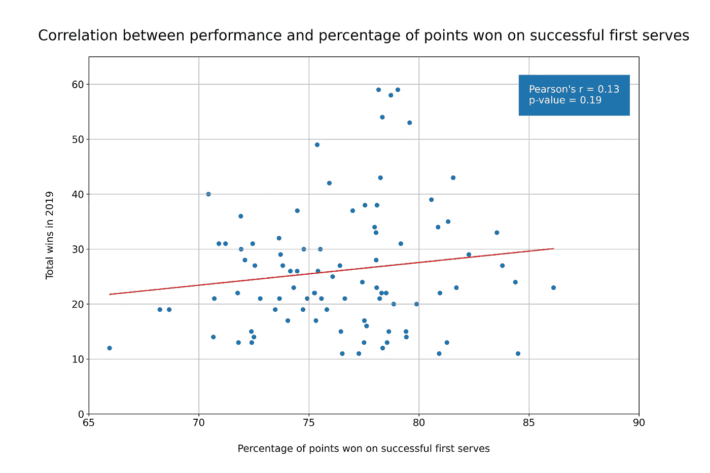
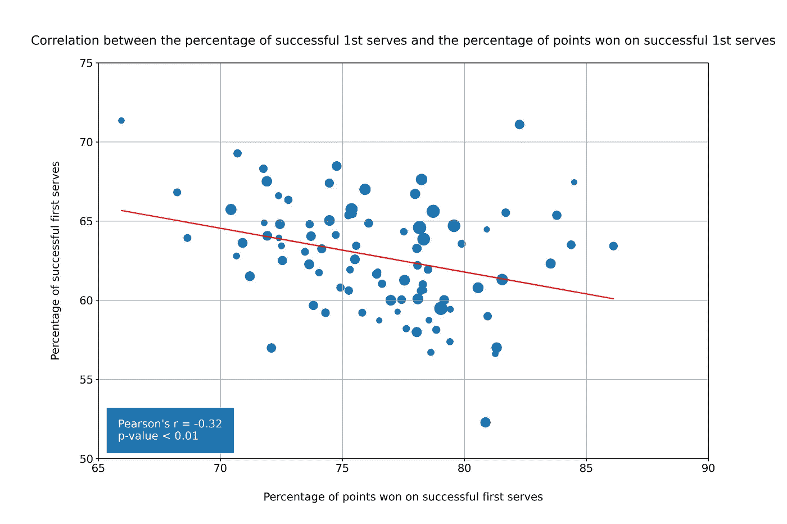
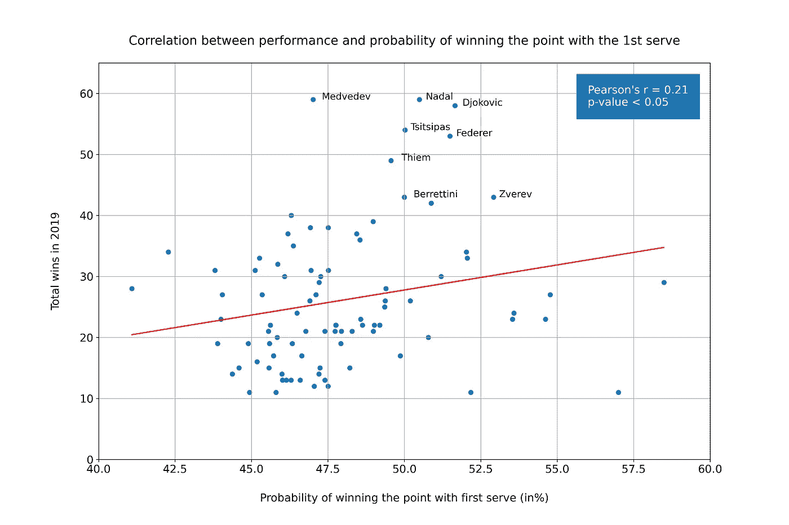
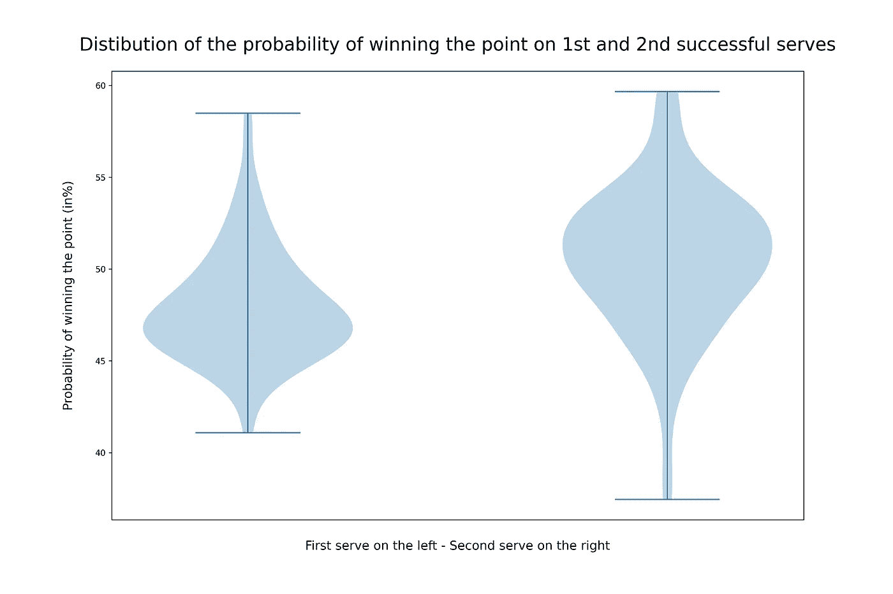
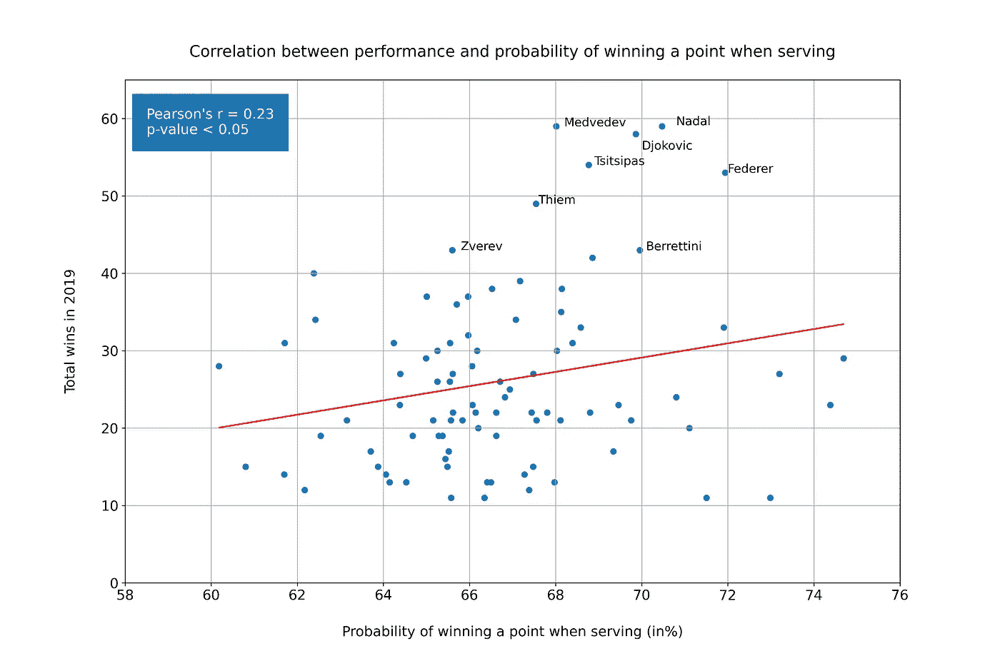

# 用数据分析理解网球运动中一发的重要性

> 原文：<https://towardsdatascience.com/understanding-the-importance-of-first-serve-in-tennis-with-data-analysis-4829ab088d36?source=collection_archive---------8----------------------->

## 我们能根据一个网球运动员的第一次发球来判断他的表现吗？

[电影人](https://unsplash.com/@filmdudes?utm_source=medium&utm_medium=referral)在 [Unsplash](https://unsplash.com?utm_source=medium&utm_medium=referral) 拍摄的照片

网球是一项动态复杂的运动。单个点涉及的击球有好几个，但只有一个是在不受对手影响的情况下进行的:发球。事实上，发球让球员有机会以具体的优势开始得分。良好的发球对每个职业选手来说都是很重要的，但是我们能把良好的第一发球和出色的表现联系起来吗？如果你是一名网球运动员，你可能听过这样一句话“你的第一次发球有多好，你就有多好”。这是真的吗？

# 资料组

为了回答我们的研究问题，我们需要好的数据。[杰夫·萨克曼](http://www.jeffsackmann.com/)创建并维护网球文摘，这是一个令人难以置信的网站，提供了数以千计的网球比赛数据集。为了进行这项分析，我使用了他在 2019 年 ATP 比赛中的[数据集](https://github.com/JeffSackmann/tennis_atp)。该数据集包括 126 场比赛的每场比赛的数据，包括戴维斯杯比赛，总共 2.782 场比赛。

该数据集中的重要列是显示每个球员和每场比赛的列:发球得分数、第一次发球得分数、第一次发球得分数、第二次发球得分数和双误得分数。

让我们开始分析。

# 表演

我们首先要分析的是通过计算胜场数来分析每个球员的表现。少于 10 场胜利的球员已经被排除在分析之外，在数据集中总共留下 89 个头。

从表中可以看出，前 10 名选手至少赢了 40 场比赛，而前 5 名选手至少赢了 53 场比赛。如果我们看一下前 5 名球员的总体表现，我们可以得出结论，他们比前 10 名名单中的后 5 名球员多赢得 30%的比赛。

每个玩家的获胜分布证实了表现最好的 5 个玩家是异常值，这意味着他们的表现远远高于其他玩家的表现。因此，在赛道上的优势是由少数运动员决定的。

# 发球

现在我们已经了解了比赛的表现，我们可以开始看发球了。通过处理数据集，我测量了每个球员第一次和第二次发球成功的百分比(成功:发球落在发球区)。此外，我计算了发球成功时第一次和第二次发球得分的百分比。下面是最佳 10 名演员的数据。

有了这些数据，我们就可以开始分析成绩和发球的相关性了。我们应该分析的第一个相关性是表现和成功的第一发球的百分比，这被认为是一个重要的因素。

从上面的散点图可以看出，这两个变量之间没有显著的相关性。我们需要进一步挖掘。也许表现和成功的第一次发球得分率之间的相关性能给我们更多的信息。

同样，这两个变量之间没有显著性。在这一点上，有两个原因可以解释这些结果:1)电路中的电平非常高，性能不是由发球决定的，或者 2)我们应该看看概率，看看我们是否获得了更重要的输出。

# 从不同的角度分析第一发球

我们已经看到，高比例的成功首次发球并不预示着高水平的表现。事实上，一些球员可能会在第一次发球时慢一些，以避免在第二次发球时得分。这就是为什么我们需要分析成功的第一次发球的百分比和成功的第一次发球得分的百分比之间的相关性，以了解这两个变量的重要性。

这里我们开始有了有趣的结果。这两个变量是负相关的，这意味着成功的首次发球的百分比越高，成功的首次发球得分的百分比越低。为什么？嗯，很难说，但是我们可以用风险来解释这个现象。当我们发球时，我们可以在三个主要策略中选择:1)我们可以瞄准发球得分(错过发球区的最高风险)，我们可以瞄准给对手施加压力(中等风险)，我们可以瞄准只在发球区内发球(最低风险)。我们可以假设，一发成功率高的球员没有冒足够的风险去赢得分数，因此，他们的一发没有赢得很多分。

散点图中数据点的大小取决于玩家的获胜次数。如果你看一看最大的数据点，几乎所有的数据点都落在 75 < X < 80 和 60 < Y < 65 之间的区域。这意味着最好的执行者在风险和最大化成功的机会之间找到了一个很好的平衡。通过计算第一次发球得分的概率，这一点会变得更加清楚。

# 完美均衡

第一次发球得分的概率由 p1*q1 给出，其中 p1 是第一次发球在发球区内的概率，q1 是假定第一次发球成功得分的条件概率。这是一个非常简单的计算，我们可以用两个变量来做。

表现最好的人(除了少数例外)是那些在第一次发球时最大限度地提高得分概率的人。如果我们看一下 X 轴，我们可以看到前五名选手的第一次发球赢得了超过 50%的发球得分(梅德韦杰夫除外)。事实上，很少有球员能够做到这一点，而那些做到的通常是像约翰·伊斯内尔这样的大发球者，他们在对打中表现更差。

通过在成功的第一次发球的百分比和成功的第一次发球得分的百分比之间找到完美的平衡来最大化第一次发球得分的概率。就拿费德勒和杜尚·拉乔维奇两个球员来举例吧。杜尚·拉乔维奇的发球成功率是 70%，而罗杰·费德勒是 65%。然而，费德勒在第一次发球成功时赢得 79%的分数，而拉乔维奇赢得 70%的分数。因此，拉乔维奇和费德勒第一次发球得分的概率分别是 49%和 52%。你可能会说微不足道，但在如此高的水平上，每一个微小的百分比都会有所不同。

# 第二次发球

我不会再用散点图来烦你了，因为表现和第二次发球得分的概率之间没有关联。然而，像费德勒和纳达尔这样的少数球员在第二次发球时有着令人难以置信的统计数据，获胜的概率在 60%以上。

正如我们所看到的，成功的第一次发球得分的概率分布趋于 0。那是什么意思？这意味着很少有球员有很高的概率在他们成功的第一次发球得分。第二次发球也一样吗？不完全是。如果我们仔细观察分布，我们可以看到第二把小提琴与第一把相比是颠倒的。事实上，许多球员在成功的第二次发球得分的概率是一样的。

在看剧情的时候，我们的视觉可能会欺骗我们，让我们相信 ATP 球员有更好的机会用二发拿下分。诚然，二发成功赢得该分的概率较高，但这是由于 p2(二发成功的概率)高于 p1(一发成功的概率)。

# 发球得分的概率

为了确定球员发球的强度，我们可以计算发球得分的总概率。根据奥多诺格的说法，发球得分的概率可以用公式 p1*q1 + (1-p1) * p2*q2 来计算，其中 p 是发球成功的概率，q 是假定发球成功时得分的条件概率。一和二分别代表第一和第二发球。

还是那句话，我们从上面的情节可以看出，表现最好的人在发球时有很大概率赢得一分。让我们看看费德勒和泽维雷夫，更好地理解一发和二发的重要性。如果我们回到最后的散点图，我们可以看到泽维雷夫比费德勒有更高的概率在一次成功的第一次发球中赢得分数(52.6 比 51.8)。然而，费德勒发球得分的总概率是 72%，而泽维雷夫是 65.8%。如果我们认为许多比赛是由两三个要点决定的，这是一个相当大的区别。

为什么泽维雷夫的概率比费德勒低？因为泽维雷夫的二次发球需要改进。的确，费德勒的二发有 56.7%的概率赢得一分，而泽维雷夫的概率只有 38.4%。这几乎是 20%的差异，对性能有很大影响。

# 限制

如前所述，网球是一项充满活力的复杂运动。很难得出这样的结论:有些球员比其他人表现得更好，因为他们成功发球得分的概率更高。发球和截击是命中最少的球。为了有一个更好的分析，我们应该考虑其他几个变量，尤其是每个球员的回报。

# 结论

对于 ATP 球员来说，在发球区内打出高比例的发球是不够的。事实上，球员需要通过平衡成功发球的概率和成功发球得分的概率来最大化他们发球得分的机会。成功发球的高概率可能表明球员没有承担足够的风险来给他的对手施加压力。

ATP 巡回赛中表现最好的选手能够找到一个完美的平衡，通过成功的第一次发球来最大化他们赢得积分的机会。此外，即使成功的第二次发球得分的概率与表现无关，第二次发球仍然是最大化发球得分机会的关键。因此，网球运动员应该通过平衡力量和风险来找到他们的完美平衡，以优化他们的发球比赛。

# 参考

*   页（page 的缩写）奥多诺格，a .巴兰坦，大满贯单打网球中发球速度的影响(2004)，科学和球拍运动 III:第八届国际乒乓球联合会体育科学大会和第三届世界科学和球拍运动大会会议录。
*   E.Gillet，D.Leroy，R. Thouvarecq，J. F. Stein,《慢速表面上优秀网球运动员发球和接发球策略的符号分析》( 2009 年),《力量和训练研究杂志》:第 23 卷第 2 期，第 532-539 页。