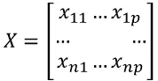
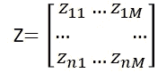
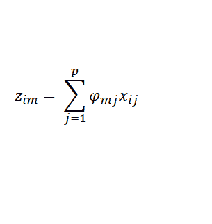
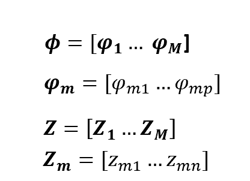
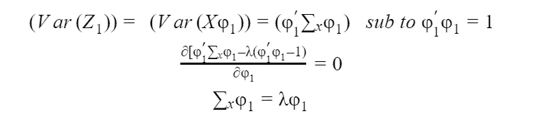
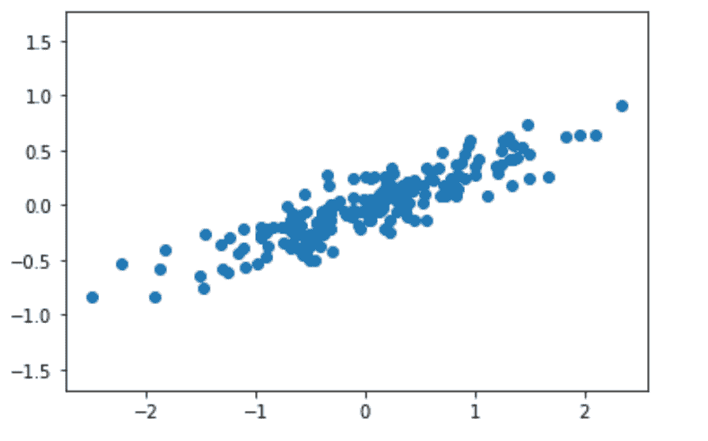
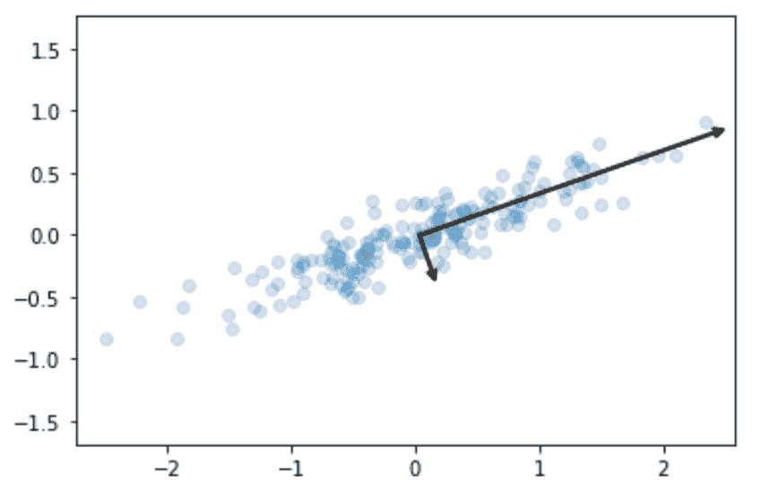
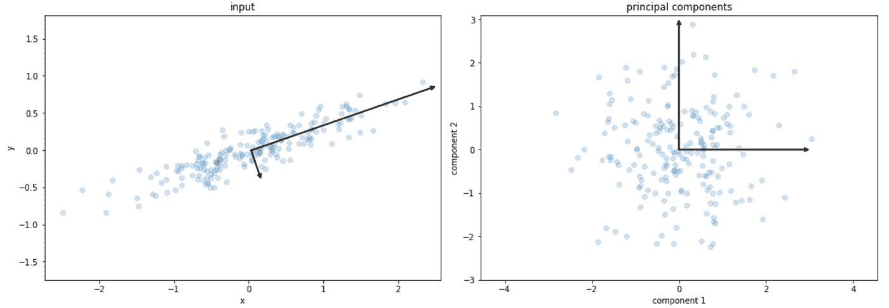

# 理解主成分分析和特征向量之间的联系

> 原文：<https://towardsdatascience.com/understanding-the-link-between-pca-and-eigenvectors-468435649d57?source=collection_archive---------48----------------------->

在我之前的[文章](/pca-eigenvectors-and-eigenvalues-1f968bc6777a)中，我一直在介绍主成分分析的概念，这是一种在机器学习中使用的强大技术，用于降低输入数据的维度。PCA 的一个重要的数学特征是它与原始特征矩阵 X 的[特征向量(和特征值)](/visualizing-eigenvalues-and-eigenvectors-e2f9e3ac58d7)的联系，在本文中，我将展示这种联系背后的比率。

让我们先简要回顾一下 PCA。与[特征选择技术](https://medium.com/analytics-vidhya/model-selection-for-linear-regression-b4bed678d37)不同，PCA 不使用初始特征的子集:而是计算一组新的特征，这些特征是原始特征的线性组合，存在于低维空间中。

因此，如果我们有 n 个观测值的特征矩阵 **X** ，每个观测值有 p 个维度:

我们可以计算新的特征矩阵 Z，从前者的线性组合获得:

其中 M 最多和 p 一样大，但是当然因为任务的目的(降维)，所以选择小于 p。

我们如何获得 Z？如上所述，它是原始特征的线性组合，因此第 m 个分量的第 I 个观察值由下式给出:

其中:

前 2 行的系数称为加载因子，其计算方式是这些新变量不相关，初始变量中的大部分信息存储在第一个分量中。因此，想法是 p 维数据给你 p 个主成分，但 PCA 试图将最大可能的信息放在第一个主成分中，这样，如果你想减少数据集的维度，你可以将分析集中在前几个成分上，而不会遭受信息损失方面的巨大损失。

在这种分析中，度量信息量的是方差，并且主成分可以在几何上被视为高维数据的方向，其捕捉最大数量的方差并将其投影到较小维度的子空间，同时保留大部分信息。因此，第一主成分占最大可能的方差；第二个分量将直观地解释第二大方差(在一个条件下:它必须与第一个主分量不相关)等等。

以此为目标，我们设置了一个约束最大化问题，其中我们寻求最大化每个主成分的方差，服从加载因子和归一化条件之间的正交条件(实际上，如果我们让加载自由，我们可以无限地增加它们以最大化方差)。

因此:

从特征值和特征向量的定义，我们可以得出结论，加载因子确实是特征向量。更准确地说，我们选择与最高特征值相关联特征向量作为加载因子。

所以这里是 PCA 和特征向量的联系！可以看出，上述关系也适用于其余的载荷因数，附加的约束条件是相互正交。

我们也可以形象化这个过程的几何表示。为了简单起见(以及可视化的可能性)，我将使用 2 维的原始特征空间，并且我将计算 2 个主成分，因此我不打算降低特征空间的维度。

假设我们有以下二维输入数据:

我已经把它定为 0 了。主要成分表示为:

现在，为了将我们的数据绘制到新的特征空间中(在这种情况下，我们创建了两个主成分，因此它仍然是 2D 图)，我们只需旋转这两个主成分，使 PC1 水平，PC2 垂直，这意味着它们是新的 x 轴和 y 轴。

我希望这篇文章是清晰和令人愉快的！如果你对这个话题感兴趣，并且想了解更多，我推荐以下阅读材料:

*   [https://towards data science . com/visualizing-environmentations-and-features vectors-e 2 f 9 e 3 AC 58d 7](/visualizing-eigenvalues-and-eigenvectors-e2f9e3ac58d7)
*   [https://towards data science . com/PCA-特征向量-特征值-1f968bc6777a](/pca-eigenvectors-and-eigenvalues-1f968bc6777a)
*   【https://www.youtube.com/watch?v=FgakZw6K1QQ 