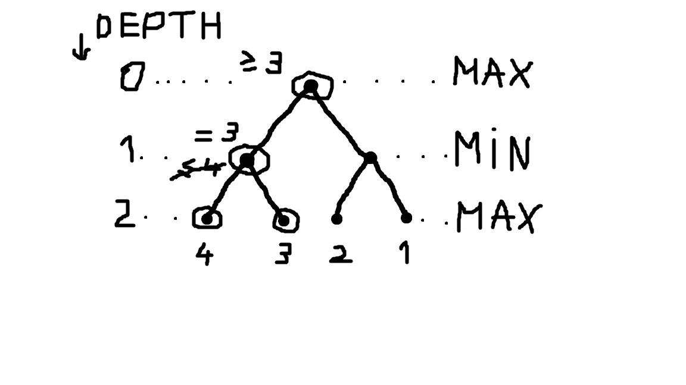
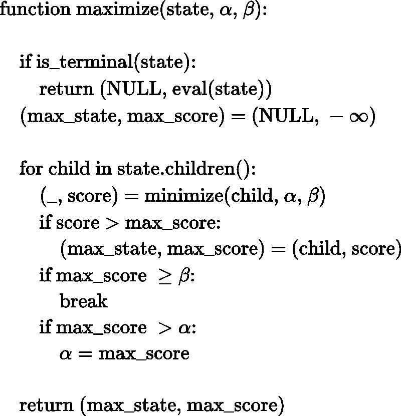
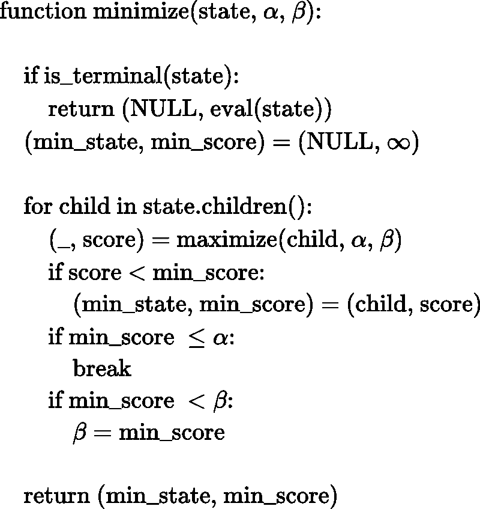

# 理解极大极小算法

> 原文：<https://towardsdatascience.com/understanding-the-minimax-algorithm-726582e4f2c6?source=collection_archive---------12----------------------->

## 用人工智能玩游戏

图片由[像素](https://pixabay.com/ro/?utm_source=link-attribution&utm_medium=referral&utm_campaign=image&utm_content=1846807)上的[像素](https://pixabay.com/ro/users/Pexels-2286921/?utm_source=link-attribution&utm_medium=referral&utm_campaign=image&utm_content=1846807)生成

假设你和一个朋友玩游戏。“你在游戏中的表现有多好”是通过一个数字分数来衡量的，当你比你的朋友更接近“赢得游戏”时，这个数字分数会增加，当你的朋友比你更接近“赢得游戏”时，这个数字分数会减少。在这种情况下，你可以把自己想象成最大化分数，把你的朋友想象成最小化分数。

我们可以想出一种算法，能够做出好的决策，并通过以下方式对上述情况进行建模来赢得这样的游戏:我们将有两个相互调用的实体(函数)；一个试图最大化分数，另一个试图最小化分数。基本上，这两个功能将模仿两个球员。

这个算法也是 AI 不是 ML 的一个很好的例子。有人制造这种混乱，认为 AI = ML 实际上，ML 是 AI 的一个子集。有些 AI 技术不涉及 ML。极大极小算法就是这样一种算法，它让计算机表现得很聪明，但它们并没有学到任何东西。尽管如此，它在许多游戏中运行良好。

## 极大极小算法

如果我们认为一个游戏是由 Max 和 Min 这两个玩家轮流进行的，那么我们可以把这个游戏描述为一个决策树。让我们看一个非常简单的例子:

这个树中的每个节点(除了终端节点)代表在游戏中的那个时刻应该做出的决定。我们决定采取哪一步行动。在这个例子中，我们只能从两个动作中选择，但一般来说，我们可以有任意数量的动作，这个数量可以根据游戏的状态而不同。

顶部节点(深度为 0 的节点)是游戏的当前状态。这里是我们决定游戏下一步行动的地方。这里我们从 Max 开始，因为它是玩家想要我们做的:最大化分数。他不是只根据 Max 从这一点开始可能达到的下一个博弈状态来决定，而是想:“在我走完其中一步后，我的敌人 Min 会怎么做？”

所以，它打电话给 Min 说:“嘿，如果我选左，你会怎么走？”，之后:“如果我选右，你会采取什么举措？”。

在 Max 找到 Min 要做的事情后，他选择能给他最高分的分支。

但是等等。Min 将如何决定做什么来最小化分数？他将采用与马克斯相同的策略。反过来，Min 会打电话给 Max，问他对于 Min 的每一个可能的选择，他会怎么做。但是在那之后，Min 并没有做出最大化分数的选择，而是反其道而行之:会做出最小化分数的选择。

以此类推……每个都将调用另一个，以类似这样的递归方式构建一棵大树，直到它们达到一个终止状态。

优选地，结束状态应该是游戏结束的状态。但是这通常在计算上代价太大；让算法探索所有可能的移动，直到游戏结束，这可能需要非常长的时间。所以，我们设定了一个最大深度。当游戏结束或达到最大深度时，游戏状态将被视为结束。

在上面的例子中，终端状态是底部的状态(深度 2)。

终端节点上会发生什么？

无论哪个玩家将到达终点状态，无论是最大值还是最小值，都不能使用到目前为止使用的相同策略；向对方寻求帮助的策略。

现在，在终端节点中，我们需要计算这些终端状态中每一个的游戏分数。

这在某些游戏中可能不那么明显，但我们需要，至少根据游戏的状态来估计分数。

在上面的例子中，终端状态的分数是底部的数字:1、2、3 和 4。

Max 玩家在这最后一关唯一要做的事情就是把这些分数返回给前一关的调用 Min。

完成后，我们的树看起来会像这样:

Min 要做的选择用箭头标出。分数从级别 2 传播到级别 1(分钟的级别)。

现在，在我们知道深度 1 将会发生什么之后，我们让 Max 在 0 层进行他的移动:

这意味着在博弈的当前状态下，最优的移动是由顶部节点的右边缘表示的，我们得到的分数至少是 3。

我说“至少”是因为这个算法运行起来好像 Max 和 Min 总是选择他们的最佳移动。但是如果，在现实中，我们的敌人比闵更坏，我们可能会得到更好的分数。

那么现在，如何用代码把这个算法表达清楚呢？上面的树只是为了直观地描述它。计算机不需要显式地构建这样的树。我们只需要两个函数:最大化和最小化，它们会互相调用。

下面是上述算法的示意图:

`maximize()`函数返回一个元组，该元组在其第一个位置包含使分数最大化的游戏的子状态，在第二个位置包含对跟随该状态将达到的分数的估计。`minimize()`函数返回一个模拟量。

下面的`decision()`函数将游戏的当前状态作为输入，并返回如果我们想要最大化我们的分数应该遵循的状态。

上面的`eval()`是估算其游戏输入状态得分的函数。

## α — β剪枝的极小极大

深度越大，我们的球员就越优秀。但是如果我们为它设置一个大的深度，这个算法会花费一些时间。所以，我们应该选择最大可能的深度来满足我们的时间要求。我们能不能让这个算法更快一点，这样我们就可以使用更大的深度值，同时还要遵守时间限制？

让我们看看下面的例子:

为了决定顶部节点的移动，我们需要评估树中的所有节点吗？

α-β剪枝是一种策略，我们可以通过忽略树的一些分支来改进极大极小算法，我们事先知道这些分支不会帮助我们做出最佳决策。名称α-β修剪来自于该算法中使用的两个参数，即α和β。

这种方法是如何工作的？

每当我们建立一个节点的分数时，我们也将它在树中向上传播到它的父节点，并使用它来设置父节点结果的下限或上限。

例如，在我们的树中，如果我们在建立了最左边的终端节点的分数(是 4)之后开始从左到右评估节点，我们知道父节点的结果不能大于 4。那是因为父节点是一个 Min 节点，如果我们已经有了 4 个，父节点就不能选择比这个更大的。

但是，在这一点上，这些信息没有太大的帮助。让我们继续，看看会发生什么。我们评估下一个终端节点，发现父节点的值是 3，并且顶部节点不能小于 3。这条信息会有所帮助。

如果我们继续评估节点，我们会发现得分为 2 的终端，这意味着它的父节点应该≤ 2。

现在，我们还需要评估最后一个节点吗？不。我们已经知道，如果沿着左边的分支，顶部节点至少可以得到 3。我们知道从右边的分支我们不能得到超过 2。所以，从现在开始我们可以忽略右边的分支。

在这个小例子中，这似乎不是一个很大的改进，因为我们只跳过了一个终端节点。但是在更大的树中，一个这样的节点可能包含一个相当大的子树。请注意，这里我们只跳过了一个兄弟节点，因为这是该分支中唯一剩下的节点。如果有更多的剩余节点，我们将跳过它们。例如，如果右分支有 2、1 和 0 作为终端节点，那么在我们评估 2 之后，我们将能够跳过 1 和 0。

此外，跳过多少节点将取决于终端节点的排序。你可能注意到了，在这个例子中，我把分数从 1，2，3，4 倒过来，变成了 4，3，2，1。这不是随机的。当分数按升序排列时，这是没有修剪发生的最坏情况。但这种糟糕的排序在实践中出现的可能性很小。平均而言，与没有修剪相比，α-β修剪允许极大极小算法在相同的时间内进行几乎两倍的深度。

下面是上述算法的伪代码。

Alpha 是(直接或间接)父 Max 节点中的最大下界，而 Beta 是(直接或间接)父 Min 节点中的最小上界。在最大化中，在迭代子节点时，我们将 alpha 值更新为目前为止找到的最大值，如果该最大值大于 beta，我们知道有一些父最小节点不会选择我们的当前分支，因此我们停止探索剩余的子节点。一个类似的事情发生最小化。

决策函数中的-/+无穷大(第一次调用最大化)意味着我们开始算法时对结果分数没有限制。

因此，极大极小算法是一个相对简单的算法，在简单的游戏中运行良好(低分支因子)。这也是 AI 不是 ML 的一个很好的例子。

在接下来的几篇文章中，我将展示如何使用该算法(以及 Selenium WebDriver)来创建一个能够在我们的屏幕上直播 2048 游戏的 AI。

 [## Selenium WebDriver:用代码浏览网页

### 如何与网站互动并提取数据

medium.com](https://medium.com/towards-artificial-intelligence/selenium-webdriver-browse-the-web-with-code-f064d3556a8)  [## 如何将 Minimax 应用到 2048 年

### 2048 年——一个简单的游戏，但是给计算机编程来解决它就不简单了

towardsdatascience.com](/playing-2048-with-minimax-algorithm-1-d214b136bffb)  [## 如何表现 2048 年的游戏状态

### …以及如何以面向对象的方式做到这一点

towardsdatascience.com](/how-to-represent-the-game-state-of-2048-a1518c9775eb)  [## 如何控制 2048 的游戏板

### …并完成最小最大算法的实现

towardsdatascience.com](/how-to-control-the-game-board-of-2048-ec2793db3fa9) 

我希望这些信息对你有用，感谢你的阅读！

这篇文章也贴在我自己的网站[这里](https://www.nablasquared.com/understanding-the-minimax-algorithm/)。随便看看吧！