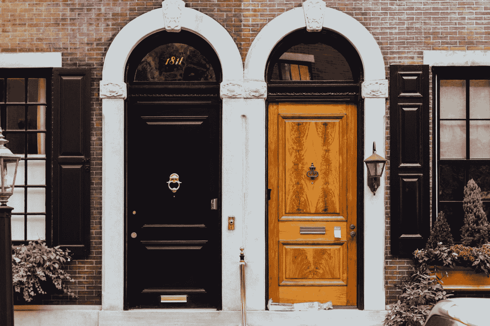
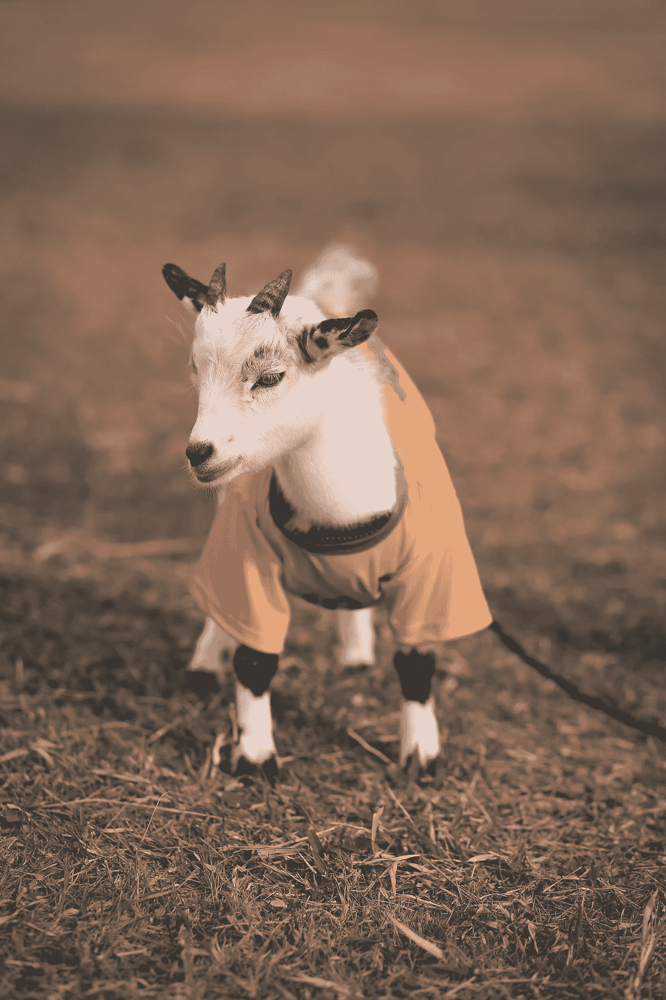
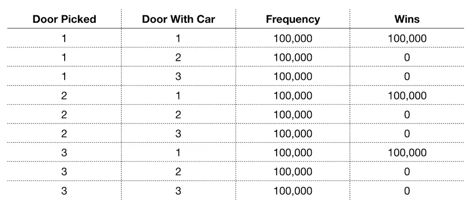
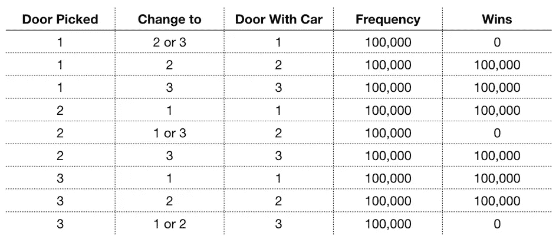

# 理解蒙蒂·霍尔问题

> 原文：<https://towardsdatascience.com/understanding-the-monty-hall-problem-a4383bc4ec74?source=collection_archive---------16----------------------->

雅各布·卡尔普在 [Unsplash](https://unsplash.com?utm_source=medium&utm_medium=referral) 上的照片

## 读完这篇文章，它将不再戏弄你的大脑

T 何天魔堂问题是一道流行的概率脑筋急转弯。这也是当我第一次听到答案时，我无法理解的一个问题。你有没有遇到过这样的情况:有人向你解释了一些事情，而这些事情对你来说是合理的，但你的直觉却一直在喊:“这不可能！”嗯，我第一次学解的时候就是这种感觉。

由于我们目前在三藩市避难(由于正在进行的疫情)，我有很多时间去思考、阅读和写作。所以今天我决定我将最终完全了解天魔堂的问题。

# 问题是

来自[维基百科](https://en.wikipedia.org/wiki/Monty_Hall_problem):

> “假设你在参加一个游戏节目，你有三扇门可供选择:一扇门后是一辆汽车；其他人后面，山羊。你选了一扇门，比如 1 号门，主人知道门后是什么，他打开了另一扇门，比如 3 号门，里面有一只山羊。然后他对你说，“你想选 2 号门吗？"**换个选择对你有利吗？**

由 [sergio souza](https://unsplash.com/@serjosoza?utm_source=medium&utm_medium=referral) 在 [Unsplash](https://unsplash.com?utm_source=medium&utm_medium=referral) 上拍摄的照片

# 解决方案

**剧透警告:**答案是，**是的，我们确实想切换**。但是为什么呢？如果我们真的做出了改变，我们得到汽车的可能性会增加多少呢？让我们找出答案。

这个问题是为了戏弄大脑而设计的，即使对于受过概率训练的人也是如此。它想让你迷失在概率中，直到你放弃并说，“它们不都是一样的吗？”

得出正确答案的一个非数学且相对简单的方法是使用下面的推理:

*   **一开始，当我们随机选择 3 个门中的一个时，我们得到车的概率是 1/3。**
*   如果在主人打开一扇门后，我们坚持自己的选择，我们拿到车的概率仍然是 1/3。一切都没有改变，尽管感觉就像门被打开时一样；所以我们的概率也保持不变。请这样想——如果我们坚持自己最初的决定，那么这个游戏就相当于我们只能选择一次，并且随后被我们的选择所束缚。在这种情况下，无论主持人是同时打开所有的门，还是一个一个地慢慢打开(他在蒙蒂霍尔问题中有效地做到了这一点)，得到汽车的概率总是 1/3。
*   当他打开一扇后面有山羊的门，给我们重新选择的选项，而不是把它当成原来游戏的延续，**我们应该把它当成一个新游戏。在这个新游戏中，我们只有两扇门可以选择。如果我们随机选择这两扇门中的一扇门(比如通过抛公平硬币)，我们得到汽车的概率是 1/2。**但只有当我们真的再次随机选择时，我们的概率才会提高，所以请确保正确地抛硬币。很恍惚，对吧？即使我们最初的选择是剩下的两个可能的选择之一，如果我们坚定不移地坚持我们最初的选择，我们得到这辆车的概率仍然是 1/3。但是，如果我们在剩下的两扇门中随机选择一个新的门(我们仍然可能选择原来的选择)，我们最终会有 50%的机会买一辆新车。

所以正确答案是肯定再选。但实际上正确的答案是选择另一扇门——不是你最初选择的那扇门。那么你落地的概率上升到 2/3！

# 那是怎么发生的？

我用 Python 为蒙蒂霍尔问题编写了一个模拟器( [**你可以在这里找到我的代码**](https://github.com/yiuhyuk/monty_hall) )。当我运行了 90 万次，然后非常努力地盯着结果时，我意识到发生了什么。

如果主人打开一扇后面有山羊的门后，你不改变你的门选择，结果会是这样。正如所料，在 1/3 的模拟中，你很幸运地选择了正确的门。

如果不更改选择，模拟结果

很明显，如果你有 1/3 的机会选择正确的门，那么你也有 2/3 的机会选择错误的门。扭转乾坤不是很好吗？但是唯一的方法就是我们选择两扇门，对吗？

如果我告诉你，在主人打开一扇门后，你改变了门的选择，你实际上选择了两扇门，会怎么样？听起来好得难以置信，对吗？但事实就是如此。如果我们颠倒一下情况，就更容易明白为什么了。

让我们想一想，如果我们决定扳动我们的门把，我们会有什么损失。在这种情况下，如果我们最初的选择是正确的，我们就输了。这是因为通过打开一扇错误的门(一扇有山羊的门)，主人实际上是在给我们一个免费的猜测。然后我们可以通过翻转我们最初的选择来完成我们最初决定的逆转。我们最初的选择将有 1/3 的几率是正确的——由于我们现在已经采取了最初选择的另一方，我们有 2/3 的几率得到汽车。

一个更直观的形象化方法是将 Monty Hall 问题重新塑造成一个稍微不同的游戏。想象你正在和另外两个玩家比赛。你们三个被随机分配到不同的门，你们可以保留分配给你们的门后的东西。

## 关键的转折

就在你开门之前，主人走过来对你说:

> 我会给你一个选择。你要么保留你门后的东西，要么保留你对手门后的东西。是的，两个都是！

你会接受这个交易吗？我肯定会的。**你的两个对手各打开一扇门(总共 2 扇门)，因此他们有 2/3 的机会得到这辆车。**如果你继续住在你现在的房子里，这比你 1/3 的机会要好，最坏的情况下，你会得到 2 只新的宠物山羊。

在 Monty Hall 问题中，通过选择切换你的门选择，你有效地选择了你对手的门(一个由主持人打开，另一个由你在你决定逆转自己之后打开)。

我们可以在模拟结果中看到这一点:

如果您更改选择，模拟结果

让我们看一下表格的前两行，以确保您知道发生了什么。在第一排，我们选了 1 号门。然后主人打开 2 号或 3 号门，露出一只山羊。我们选择他没有打开的门，我们也得到一只山羊(因为我们最初的选择是正确的，汽车在门 1 后面)。太糟糕了！

在第二行中，我们再次选择门 1。但这一次，车在 2 号门后面。知道了这一点，主人只能打开 3 号门，否则他会把车给我们看！最后，我们切换到 2 号门，打开它，得到一辆全新的汽车！

在我们的 900，000 次模拟中，我们现在在其中的 600，000 次模拟中赢得了这辆车(如果我们切换)，概率为 2/3，正如我们上面推理的那样。

希望你喜欢这个，并发现它很有见地。我计划在未来的日子里探索更多的概率和统计脑筋急转弯。干杯，祝大家健康！