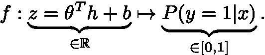

# 理解 Sigmoid 输出单元的动机

> 原文：<https://towardsdatascience.com/understanding-the-motivation-of-sigmoid-output-units-e2c560d4b2c4?source=collection_archive---------33----------------------->

## 本文试图对 sigmoid 函数的动机及其在输出单元上的使用给出一个全面的解释。

二元分类网络示例。男人的插图来自 [Pinterest](https://br.pinterest.com/pin/305681893459272481/) ，而熊的图像则是从[这里](https://www.dlf.pt/ddetail/obxomw_cartoon-bear-standing-up-hd-png-download/)获得的。

*在阅读《深度学习***一书中关于伯努利输出分布的 6.2.2.2 Sigmoid 单位的章节时，出现了一些与 Sigmoid 函数背后的直觉有关的问题，我将在这篇文章中尝试解决这些问题。本文试图通过阐述 sigmoid 函数的动机及其在输出单元上的使用，对上述章节给出一个全面的解释。**

# *从线性回归到二元分类*

*假设我们试图用神经网络来解决一个有监督的二进制分类问题。假设输出变量 *y* 只能取两个值，我们将假设这两个值为 0 和 1，网络只需要预测 *P(y=1|x)，*，因为两个类的概率必须相加为 1。所以，条件概率是一个参数为 *p=P(y=1|x)* 的伯努利变量。*

*让*

*   **h* 表示最后的隐藏层；*
*   *θ表示输出层的权重向量；*
*   **b* 表示输出层的偏置。*

*输出层将从前一个隐藏层接收 *h* ,并将计算其输入的线性组合，我们定义为*

**

*在下图中用蓝色表示。然后，输出单元必须应用函数 *f* 来计算输入为类别 1 的概率，用黄色表示。我们的目标是理解如何定义这个映射。*

**

*二进制分类神经网络，强调输出单元。*

> ***问题:**如何将一个实值(来自最后一个隐藏层 z 的线性组合)映射到一个概率，即映射到一个 0 到 1 之间的数字？换句话说，我们想定义一个函数 f*

**

*一个简单的解决方案是只考虑在 0 和 1 之间的那部分 z。所有负值将被映射到 0，而所有大于 1 的值将被映射到 1，如下图所示。*

**

*max{0，min{1，z}}函数的绘图。*

*为了简化，我们定义 *ŷ=P(y=1|x)* ，并且我们让ℒ( *ŷ，y)* 表示损失函数。如上图所示， *ŷ* 的导数几乎处处都是 0(除了 0 和 1 之间)。下面描述了如何应用链规则来更新权重，其中黑色和红色箭头分别表示向前和向后传播(该图的灵感来自于吴恩达在 Coursera 中的深度学习专业[)。我们可以看到，∂ŷ/∂z 为 0 的事实意味着，所有的导数(使用红色箭头)也将为 0，因为链式法则乘以它们。](https://www.coursera.org/specializations/deep-learning?utm_source=gg&utm_medium=sem&utm_content=17-DeepLearning-ROW&campaignid=6465471773&adgroupid=76541762319&device=c&keyword=python%20neural%20network&matchtype=b&network=g&devicemodel=&adpostion=&creativeid=379493352694&hide_mobile_promo&gclid=CjwKCAjw7-P1BRA2EiwAXoPWA6uTmuQmMQ_IAD0Qj76rUHxQHywuIjsF0Hgssh70c6bRDCP5fek4dxoCxxoQAvD_BwE)*

**

*梯度下降中用于更新权重的链式规则。*

*例如，使用梯度下降并让α表示步长，则 *θ的更新为**

**

*这将使 *θ* 在每次∂ŷ/∂z 为 0 时保持不变(这在检查 *ŷ).的图时经常发生*因此，如果大多数更新保持 *θ* 不变，那么达到参数 *θ* 的最佳值可能会非常困难。这被称为*消失梯度问题*，我们将在后面详述。因此，使用梯度下降来对条件概率建模的函数选择不会使训练非常有效，因此，我们需要另一种方法来将 *z* 映射到*【0，1】*。*

# *激发乙状结肠功能*

*在这一节中，我们将推导 sigmoid 函数，作为我们寻找映射 *f : ℝ → [0，1]* 问题的解决方案。我们将展示获得 sigmoid 的两种方法:*

*   *使用 0-1 损失；*
*   *应用与 softmax 函数中相同的基本原理。*

# *从 0-1 的失利开始*

*在这里，我们将描述[0–1 的损失如何激励对数赔率的使用](https://onionesquereality.wordpress.com/2016/05/18/where-does-the-sigmoid-in-logistic-regression-come-from/)。假设我们有一个函数 *g* 将 *x* 映射到{0，1}中的一个类。我们可以查看 0–1 损失，它计算错误分类的数量，定义为*

**

*我们希望最小化算法所犯的错误数量，因此，我们可以最小化预期条件损失(也称为条件风险):*

**

*最小化期望条件损失等价于最大化 *P(y=g(x)|x)* 。因此，如果对于 *y=1* 的条件概率高于对于 *y=0* 的条件概率，则预测的类别 *g(x)* 应该是 1。这可以表示为*

**

> *一个事件发生的几率是根据该事件发生的可能性与不发生的可能性之比来定义的。*

*数学上，这被定义为*

**

*注意，虽然事件的概率 *P(E)* 是 0 到 1 之间的数字，但是事件的概率 *odds(E)* 可以取任何非负值。通过记录一个事件的概率，称为 *log odds* ，我们得到一个实数值，我们可以对其进行线性建模，正如我们将在接下来看到的。*

*在不等式的左边 *(1)* 我们有条件概率的几率 *y=1|x* 。通过将*对数*应用于这个不等式，我们得到下面的不等式*

**

*对数概率变量现在可以取任何实数值，因此，我们可以作出简化的假设，即它是输入到输出单元的 *h* 的线性函数。因此，我们可以将对数概率写成*

**

*通过让 *z* 表示 *h* 的线性组合，如上面等式的右侧所示，求解此等式得到 *P(y=1|x)* 的 sigmoid 函数*

**

*因此，sigmoid 函数定义为*

**

*从 0–1 损失开始，我们可以通过假设对数几率在数据上是线性的来推导 sigmoid 函数。*

# *模仿 Softmax 推导*

*现在让我们分析获得 sigmoid 函数的另一种方法，首先理解另一个也代表概率的函数(称为 *softmax* )背后的基本原理，然后尝试将其应用于 sigmoid 函数。这种方法的动机是《深度学习》一书的作者在第 179 页提出的假设:*

> *(…)未标准化的对数概率在 y 和 z 方向上是线性的。*

*他们首先将非标准化对数概率建模为*

**

*这个假设对我来说并不明显，但是这篇[博文](https://alexander-schiendorfer.github.io/2020/02/17/why-so.sigmoid.html)从 softmax 函数开始帮助我更好地理解它。Softmax 可以被视为 sigmoid 函数的推广，其中我们可以有任意数量的类，而不仅仅是 2 个。设 *k* 为班级总数。Softmax 输出一个概率向量，每个类别一个。对于每个类别 *c* ，softmax 函数的输入是实数值的向量 *z* ，输出是与包含 *P(y=c|x)* 的 *z* 大小相同的概率向量。类似于 sigmoid 函数，在 softmax 中我们有将实数值映射到 *[0，1】的 *k* 问题。*此外，为了使 softmax 表示有效的概率分布，其所有输出的总和必须为 1。通过将 softmax 函数表示为 *f* ，这可以表示为*

**

*对于 *k⩾2* ，我们可以分两步构造这样的函数 *f* :*

*   ***求幂:**使元素非负；*
*   ***标准化:**将输出转换成概率。*

*同样的想法可以用于 sigmoid 函数，其中我们从类别 1 的 *z* 开始，并且我们将类别 0 的非标准化对数定义为 0。应用相同的基本原理产生 sigmoid 函数。*

**

*softmax 的构造与 sigmoid 函数的关系。*

*同样，我们将 *P(y=1|x)* 定义为 *z 的 sigmoid 函数。*通过查看上图，我们可以将条件概率更简洁地写成*

**

# *消失梯度问题*

*在分析了获得 sigmoid 函数的两种不同方式之后，让我们检查该函数是否是二进制分类网络的输出单元的良好候选。通过检查下面的 sigmoid 函数的图，我们可以看到， *z* 的大值将产生输入示例属于类 1 的非常有把握的预测，而 *z* 的非常负的值指示输入属于类 0 的概率很大。*

**

*sigmoid 函数图。*

*sigmoid 函数对非常大的正值和负值都饱和。在这些情况下，这将导致梯度∂ŷ/∂z 为 0。记住这也是我们首先分析的比较简单的函数中的问题， *f(z)=max{0，min{1，z}}* 。因此，当链式法则乘以偏导数时，学习可能是无效的。这被称为**消失梯度问题**，其中消失的小梯度阻止了权重的更新。*

*我们现在将引入一个损失函数ℒ，它将消除这种不方便的 s 形饱和效应。*

# *损失函数*

*请记住，由于条件输出变量具有伯努利分布，我们可以将其最大似然与神经网络的损失函数相关联。在最大似然估计中，我们将分布的参数估计为使观测数据的似然性最大的参数*

**

*其中 *m* 是示例的总数，我们使用上标符号来表示每个示例的索引。由于最优参数可以写成使条件概率的负对数最小化的自变量，因此将损失函数定义为负对数是有意义的。举一个例子，通过表示 *ŷ=P(y|x)* ，损失函数被定义为*

**

*现在让我们计算偏导数。*

**

*在计算下一个导数之前，我们先计算 sigmoid 函数的导数*

**

*现在，使用等式 *(2)* 来计算 *ŷ* 的导数是很简单的*

**

*正如我们接下来将看到的，在损失函数中使用对数将消除使用链式法则的 sigmoid 函数的指数效应*

**

*现在让我们检查对于损失函数来说，z*的哪些值具有零梯度。下面，在左侧，损耗被绘制为 *z、*的函数，在右侧，我们描绘了各自的梯度。**

**

*损耗和各自的导数，都是 z 的函数。*

*我们可以观察到，对于 *y=1* (红色曲线)，当 *z* 取非常大的正值时，损耗饱和。等效地，当 *z* 趋于+∞时，梯度趋近于 0。在这种情况下， *P(y=1|x) = σ(z)* 接近于 1，因此，神经网络已经有了正确的答案。类似地，对于 *y=0* ，损耗仅在 *z* 非常负(梯度趋于 0)时饱和，因此 *P(y=0|x) = 1-σ(z)* 接近 1，这也是正确的响应。*

> *简而言之，**只有当算法已经预测到正确的标签**时，损失才会饱和，因此在这些情况下停止学习是可以的。*

*此外，当模型做出不正确的预测时，即当 *y=1* 和 *z* 为负时，或者当 *y=0* 和 *z* 为正时，梯度的幅度趋向于 1，因为模型(错误地)更确信其误分类。*

> *该属性**允许参数在正确的方向**上快速(因为梯度不收缩)**更新。***

*损失函数将对数应用于 sigmoid 的事实抵消了其不想要的饱和效应。否则，对于非常正值和负值的 *z* ，我们将得到接近 0 的梯度，这将使该函数不适合学习。这种效果如下图所示。*

**

*损失函数中的对数如何解决 sigmoid 输出单元的消失梯度问题。*

# *结论*

*本文的主要目的是为二分类神经网络设计一个输出单元。我们将 sigmoid 函数作为将实数值映射到概率(即 0 到 1 之间的数字)的问题的解决方案。我们使用两种不同的方法来推导 sigmoid:0–1 损失和 softmax 函数。*

*我们还通过使用负对数损失函数解决了 sigmoid 函数中的消失梯度问题。这使得我们可以得出结论，对于二进制分类问题， **sigmoid** 是一个**合适的** **输出单元**。*

*然而，**不建议**使用 sigmoid 作为**隐藏单元**的激活函数，因为我们不会有跟随该单元的最大似然损失。因此，当 *σ* 在其域的重要部分饱和时，网络将遭受消失梯度问题。其他功能，如整流线性单元(ReLU)通常用作隐藏层中的激活。*