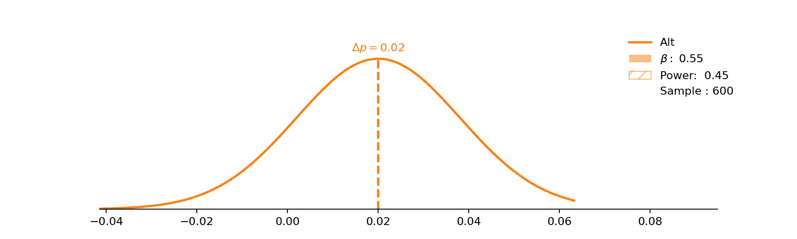

# 了解你的 A/B 测试的力量

> 原文：<https://towardsdatascience.com/understanding-the-power-of-your-a-b-tests-be78e40d220?source=collection_archive---------35----------------------->

## 实验设计选择的视觉探索

[@shelleypauls](https://unsplash.com/@shelleypauls) 上 [Upsplash](https://unsplash.com/photos/I58f47LRQYM)

当设计一个实验时，许多决定应该提前做出。其中一个我觉得难以想象的是*力量。*这个概念很简单— *如果一种效应确实存在，* *我们发现它的可能性有多大？—* 但一开始，确定不同因素如何影响它对我来说很棘手。下面，我将一些影响测试效果的因素形象化，但是首先让我们回顾一些事情。

让我们举个例子，当一个人去蔬菜水果店里时，他是否会买一个苹果。从历史上看，假设 10%的客户这样做，我们称之为 *p⁰* (通常我们在这里使用下标，但对于中等上标更容易)。我们想知道将苹果架移近门(治疗)是否会增加购买苹果的人的比例。在改变展台位置后，我们将该比例称为 *p* (不管它是否从 *p⁰* 改变)。*

为了使这成为真正的 A/B 测试，我们还需要一个对照组。在这个例子中，我们可以移动一半连锁店(随机选择)的摊位，而不移动另一半。然后我们将比较 p _ 处理和 p _ 控制，而不是比较移动前后的比例。

于是我们设立了无效( *H⁰* )和替代( *H* )假设:

> H⁰:购买苹果的人的比例不会增加(p ≤p⁰).
> 
> h:购买苹果的人的比例将会增加(p > p⁰).

现在这个测试可能有几个结果——要么这个动作会产生影响，要么不会，我们可以分别得出结论:它会产生影响。这四种可能性总结如下:

测试的 4 种可能结果

在我们运行测试之前，我们需要决定一些事情:

*   我们对假阳性的接受程度如何？
*   如果造成了某种影响，我们有多大的信心能抓住它？
*   我们希望能够探测到的最小效应是什么？

第一个项目符号定义了我们可接受的 I 类错误率(见上表)，或𝛼.第二个关系到我们的ⅱ型错误率，或者说𝜷.具体来说，第二点是描述测试的*功率*，由 1-𝜷.给出

幂和第二类错误以这种方式相关涉及到一个基本点，上表中的概率跨行求和为 1*—*也就是说，真相(实际发生的事情)没有与之相关的概率，要么治疗引起了变化，要么没有。概率与我们将*推断*发生的事情相关，所以如果*增加*发生，我们可能会推断它没有发生(用概率𝜷)或推断它发生了(用概率 1-𝜷).)

所以，言归正传。我们(提前)决定一个可接受的 I 型错误率，通常选择为𝛼=0.05，即“如果我们的治疗没有效果，5%的时间我们会说无论如何都有效果”，我们决定一个所需的功效，通常选择为𝜷=0.8，即“如果有*是*来自我们的治疗的效果，我们将能够在 80%的时间里将其与随机波动分开”。所以我们有我们的需求，我们如何调整测试设计来适应这些需求呢？

## 样本量

想象一下 H⁰确实是对的:移动苹果支架没有任何效果。嗯，在任何给定的一天，或多或少会有一些人购买苹果，所以即使真实的比例是 10%，在任何给定的一天对该比例进行抽样将会在 10%的平均值附近产生一个*分布*。这个样本越大，我们就越有可能接近 10%的关口。我们将想要理解比例上的*差异*∈*p = p*-*p⁰*，所以如果 *H⁰* 为真，这个分布将集中于零。*

如果 H *₀为真，5%的时间(由* 𝛼定义)*我们将测量 p > p_crit* 的值

**请记住，我们在该测试中的关键测量是∆p̂的单个值，即治疗组和对照组的样本比例的差异。我们需要取这个值，决定 H⁰还是 h 是对的。我们这样做是因为“如果 p̂大于某个临界值，我们将拒绝 H⁰而支持 h”。该临界值正是由*𝛼*定义的概率，并在图中用灰色虚线表示。*

现在想象 *H* 是真的:有*有*把苹果架移近门的积极效果，这个效果是+2 p.p .从 10%→12%增加。同样，在任何给定的一天对该比例进行抽样将会产生一个 12%左右的平均值分布。同样，样本越大，我们越有可能接近 12%的均值。这个∈*p*分布将以 2%为中心。

替代分布以 p=2%为中心，但是与零分布的重叠很大，导致高𝜷和低功率。

上面的逻辑暗示了我们增加实验效果的第一种方法。通过增加样本大小，我们*减少了*每个分布的方差，这增加了分布的比例——如果替代假设为真，我们将对该分布进行采样——这高于假阳性截止值*(显示为灰色虚线)。请注意，在下图中，无论是均值还是 I 型错误率都没有变化，唯一的变化是样本量的增加，这降低了可能的采样分布的方差，从而提高了功效。

之前让我困惑的一点是，在任何给定的测试中，我们实际上只是从这些分布中的一个进行抽样。要么 *H⁰* 为真，我们从蓝色分布中采样，要么 *H* 为真，我们从橙色分布中采样，但不是两者都是。这些数字是为了确定根据您的实验设计，您能说出您从哪个分布中取样的可能性——两个分布的重叠越多，就越难说出您从给定的测量的 *∆p̂.的哪个分布中取样*

仅改变实验的样本大小就可以调整分布的方差

随着样本量的增加，我们达到 80%的幂，同时保持第一类错误率为 0.05。这定义了我们每个处理和对照的样本量。回到我们的商店示例，如果每天有 100 人访问治疗组的商店，100 人访问对照组的商店，我们应该计划等待大约一个月，然后分析我们的实验(允许每组至少有 3000 个样本)。

## 最小可检测效应

另一种增强测试能力的方法是接受我们只能检测治疗的更大效果。在我们的视觉示例中，这意味着∈*p*增加(向右移动橙色分布)。

增加最小可检测效应

如果我们愿意相信我们的治疗将产生+3.5 p.p .的效果，并且我们对小于这个值的效果不感兴趣，我们可以接受更小的样本量，并且仍然获得必要的功效。

## 假阳性率

我们可以提高能力的最后一个方法是接受更高的 I 型错误率。在不改变任何一个分布的情况下，我们可以将关键的 *p-* 值下移，这实质上增加了我们得出有影响的结论的机会，但降低了我们对结论的信心。

增加可接受的假阳性(I 型错误)率， **𝛼**

我们是否愿意接受更高的 I 型错误率是一个环境问题。这取决于与犯某些类型的错误相关的*成本*是否不平衡。在我们的例子中，一个假阳性会导致我们不必要地移动苹果，也许没什么大不了的。另一方面，医学药物试验中的假阳性可能导致无效药物在医院使用。另一方面，假阴性会导致一种有效的药物被排除，不能用于未来的治疗。很明显，第一类和第二类错误的程度是非常主观的。

最后一点，这三个因素不需要单独调整。例如，我们可以*要求*𝛼=0.05 和𝜷=0.8，并求解∈*p*和样本大小。这将创建一个参数曲线，我们可以从中选择我们的设计。

求解𝛼=0.05 和𝜷=0.8 允许样本大小和∈*p*的多个解

注意样本大小和最小可检测效应之间的非线性关系。随着我们所寻找的效应变得越来越小，创建样本的成本会成倍增加。

这就是我们，我希望这些数字中的几个有助于想象，随着实验参数的不同选择，功率如何变化。他们确实帮助我弄清楚发生了什么。如果你过去没有在测试前运行过功耗分析，下次你设置实验时尝试一下。

 [## Paul stub ley-LinkedIn 自由职业数据和决策科学家

### 我是一名经验丰富的数据科学家，在个人工作和管理团队方面都有卓有成效的工作经历。

www.linkedin.com](https://www.linkedin.com/in/paul-stubley) 

*如果你想联系我，你可以在* [*LinkedIn*](https://www.linkedin.com/in/paul-stubley) 上联系我。*如果你想看代码和分析(包括每个发行版背后的派生)，可以在*[*GitHub*](https://github.com/paul-stubley/portfolio/tree/master/power_analysis)*上查看。动画是用 Matplotlib 和 imagemagick 制作的。*

*这一讨论受到了* [*数据科学纳米学位实验设计部分的启发，并由此引出。*](https://www.udacity.com/)