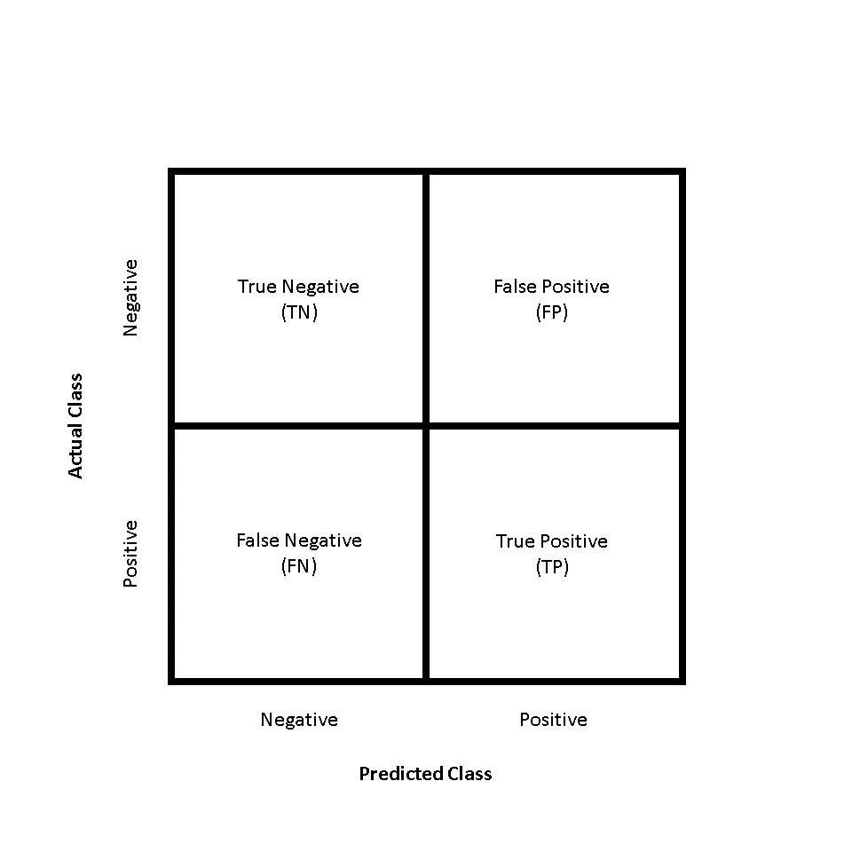
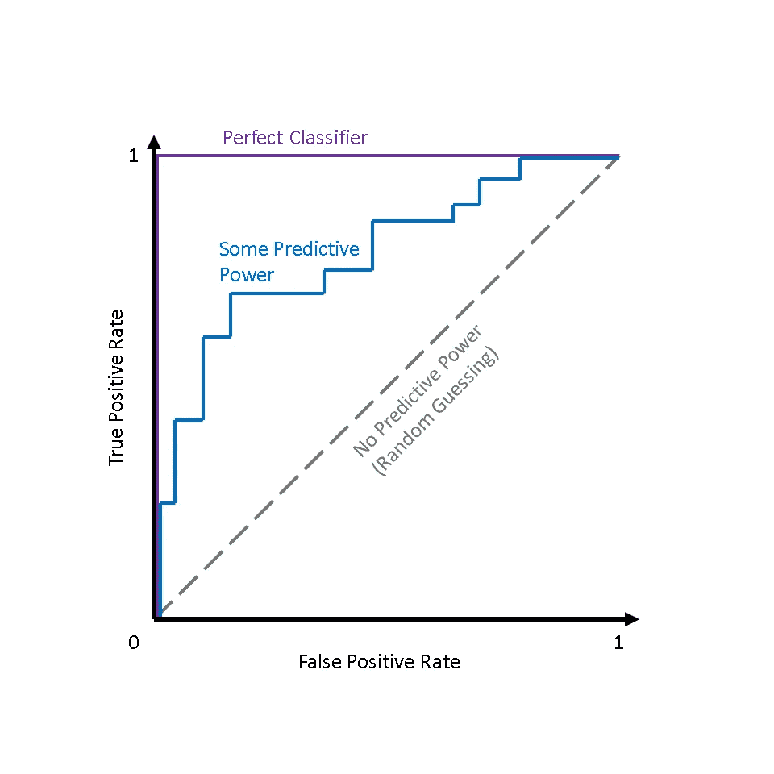
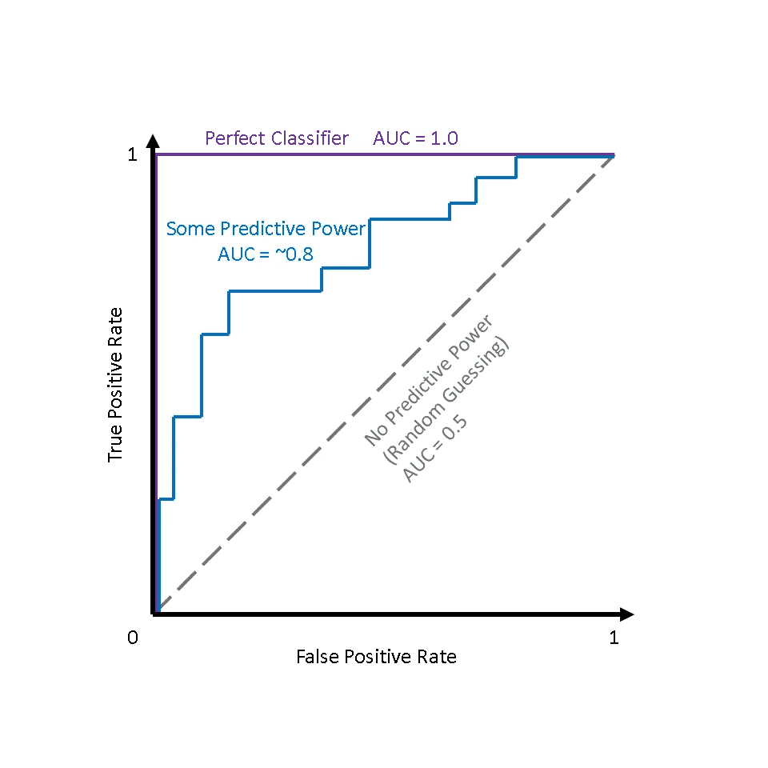
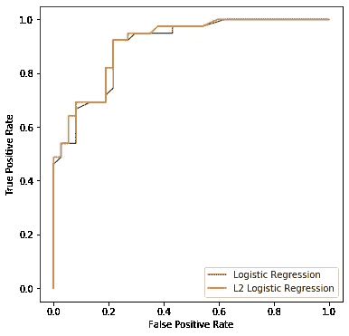
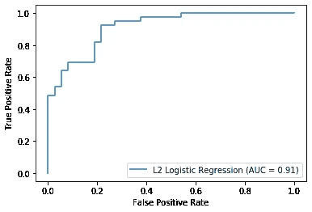

# 理解 ROC 曲线和 AUC

> 原文：<https://towardsdatascience.com/understanding-the-roc-curve-and-auc-dd4f9a192ecb?source=collection_archive---------1----------------------->

## 这些二进制分类性能指标是相辅相成的——让我们来探索一下。


马德琳·佩雷在 [Unsplash](https://unsplash.com?utm_source=medium&utm_medium=referral) 上的照片

## ROC 曲线

**接收机工作特性(ROC)曲线**经常用于评估二元分类算法的性能。它提供了分类器性能的图形表示，而不是像大多数其他指标那样提供单一值。

首先，让我们确定在二元分类中，一个测试预测有四种可能的结果:**真阳性**、**假阳性**、**真阴性**和**假阴性**。



二元分类问题的混淆矩阵结构

ROC 曲线是通过计算和绘制单个分类器在各种**阈值**下的**真阳性率**与**假阳性率**而产生的。例如，在逻辑回归中，阈值将是属于正类的观察的预测概率。通常在逻辑回归中，如果一个观察值以 0.5 的概率被预测为正，则它被标记为正。然而，我们实际上可以选择 0 到 1 之间的任何阈值(0.1、0.3、0.6、0.99 等)。)ROC 曲线帮助我们直观地了解这些选择如何影响分类器的性能。

**真阳性率**，或**灵敏度**，可表示为:


其中 **TP** 是**真阳性**的数量， **FN** 是**假阴性**的数量。真实阳性率是对一个*实际*阳性实例被归类为阳性的概率的度量。

**假阳性率**，或者 1 — **特异性**，可以写成:


其中 **FP** 是**假阳性**的数量， **TN** 是**真阴性**的数量。假阳性率本质上是衡量“假警报”发生的频率——或者说，实际的*阴性实例被归类为阳性的频率。*

图 1 展示了一些理论分类器如何绘制 ROC 曲线。灰色虚线表示不比随机猜测更好的分类器—这将绘制为对角线。紫色线代表一个完美的分类器——真阳性率为 100%，假阳性率为 0%。几乎所有真实世界的例子都会落在这两条线之间——不完美，但比随机猜测提供了更多的预测能力。通常，我们寻找的是一种保持高真阳性率同时又具有低假阳性率的分类器，这种理想的分类器将“拥抱”图 1 的左上角，很像紫色线。



图 1 —一些理论 ROC 曲线

## 罗马纪元

虽然可视化分类器的 ROC 曲线很有用，但在许多情况下，我们可以将这些信息归结为一个单一的指标—**AUC。**

****AUC** 代表(ROC)曲线下的**面积。**通常，AUC 分数越高，分类器对给定任务的表现越好。**

**图 2 显示，对于没有预测能力(即随机猜测)的分类器，AUC = 0.5，对于完美的分类器，AUC = 1.0。大多数分类器将落在 0.5 和 1.0 之间，少数例外是分类器表现*比随机猜测差*(AUC<0.5)。**

****

**图 2-具有 AUC 分数的理论 ROC 曲线**

## **为什么要用 ROC 曲线？**

**ROC 曲线呈现的一个优点是，它们帮助我们找到适合我们具体问题的分类阈值。**

**例如，如果我们正在评估一个垃圾邮件分类器，我们希望假阳性率非常非常低。我们不希望有人仅仅因为我们的算法过于激进，就因为垃圾邮件过滤器而丢失了一封重要的电子邮件。我们甚至可能允许相当数量的实际垃圾邮件通过过滤器，以确保没有重要的邮件丢失。**

**另一方面，如果我们的分类器预测某人是否患有绝症，我们可能会接受更多的假阳性(错误诊断疾病)，只是为了确保我们不会错过任何真正的阳性(实际患病的人)。**

**此外，ROC 曲线和 AUC 分数还允许我们比较不同分类器对同一问题的性能。**

## **例如:心脏病预测**

**为了演示 ROC 曲线在实践中是如何构建的，我将使用 Python 中的[心脏病 UCI](https://www.kaggle.com/ronitf/heart-disease-uci) 数据集。该数据集有 14 个属性，303 个观察值，通常用于根据其他 13 个属性(包括年龄、性别、胆固醇水平和其他测量值)预测患者是否患有心脏病。**

****导入&装载数据****

****

****列车测试分割****

**对于这个分析，我将使用标准的 75% — 25%训练测试分割。**

****逻辑回归分类器****

**在编写计算假阳性率和真阳性率的函数之前，我将对训练数据拟合一个普通的逻辑回归分类器，并对测试集进行预测。**

****计算真阳性率和假阳性率****

**现在我有了测试预测，我可以写一个函数来计算真阳性率和假阳性率。这是关键的一步，因为这是制作 ROC 曲线所需的两个变量。**

```
(0.6923076923076923, 0.1891891891891892)
```

**测试表明，该功能似乎正在工作——69%的真阳性率和 19%的假阳性率是完全合理的结果。**

****探索不同的阈值****

**为了获得 ROC 曲线，我需要一对以上的真阳性/假阳性率。我需要改变逻辑回归分类器用来预测患者是否患有心脏病(目标=1)的**阈值概率**。请记住，虽然逻辑回归用于分配类别标签，但是*实际上*所做的是确定观察值属于特定类别的*概率*。在典型的二进制分类问题中，一个观察值必须有 0.5 的概率被分配到正类。然而，在这种情况下，我将从 0 到 1 递增地改变阈值概率值。这将导致真阳性率和假阳性率的范围，允许我建立 ROC 曲线。**

**在下面的代码块中，我在一系列阈值概率值范围内获得了这些真阳性率和假阳性率。为了比较，我使用逻辑回归与(1)没有正则化和(2) L2 正则化。**

****绘制 ROC 曲线****

****

**逻辑回归分类器的两个版本似乎都做得很好，但 L2 正则化版本似乎表现得稍好。**

****计算 AUC 分数****

****sklearn** 有一个 **auc()** 函数，我将在这里使用它来计算两个版本的分类器的 auc 分数。 **auc()** 接受我们之前计算的真阳性率和假阳性率，并返回 auc 分数。**

```
Logistic Regression (No reg.) AUC 0.902979902979903
Logistic Regression (L2 reg.) AUC 0.9116424116424116
```

**正如所料，两个分类器都有相似的 AUC 分数，L2 正则化版本表现稍好。**

## **ROC 曲线和 AUC 的简单方法**

**既然我们已经从头开始有趣地绘制了这些 ROC 曲线，您将会松一口气，因为知道有一个非常非常简单的方法。 **sklearn** 的 **plot_roc_curve()** 函数可以仅使用拟合的分类器和测试数据作为输入，高效地绘制 roc 曲线。这些图也方便地包括 AUC 分数。**

********

****关闭****

**如果你已经做到这一步，感谢你的阅读！我发现在 Python 中低效地创建自己的 ROC 曲线是一项有价值的练习，我希望您能从本文中有所收获。**

****ROC 和 AUC 的一些有用参考:****

**[](https://machinelearningmastery.com/assessing-comparing-classifier-performance-roc-curves-2/) [## 用 ROC 曲线评估和比较分类器性能-机器学习掌握

### 最常报道的分类器性能的度量是准确度:正确分类的百分比…

machinelearningmastery.com](https://machinelearningmastery.com/assessing-comparing-classifier-performance-roc-curves-2/) [](http://faculty.marshall.usc.edu/gareth-james/ISL/) [## 统计学习导论

### 加雷思·詹姆斯、丹妮拉·威滕、特雷弗·哈斯蒂和罗伯特·蒂布拉尼家中的应用程序

faculty.marshall.usc.edu](http://faculty.marshall.usc.edu/gareth-james/ISL/)**