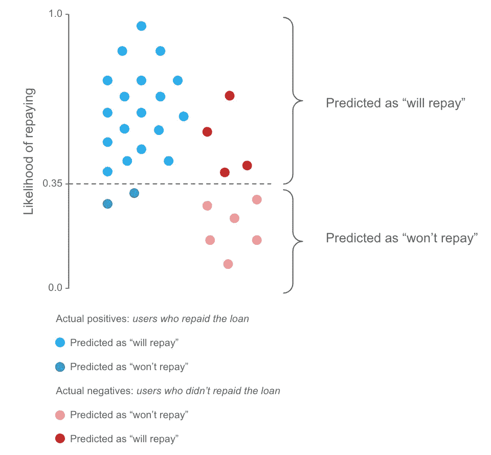
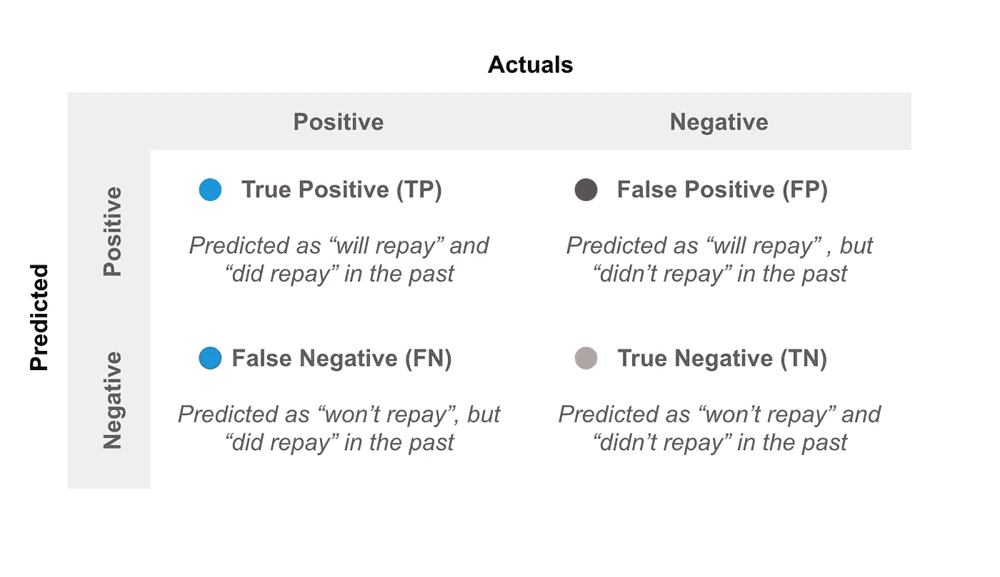
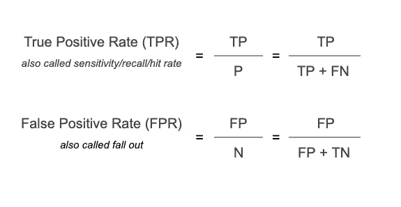
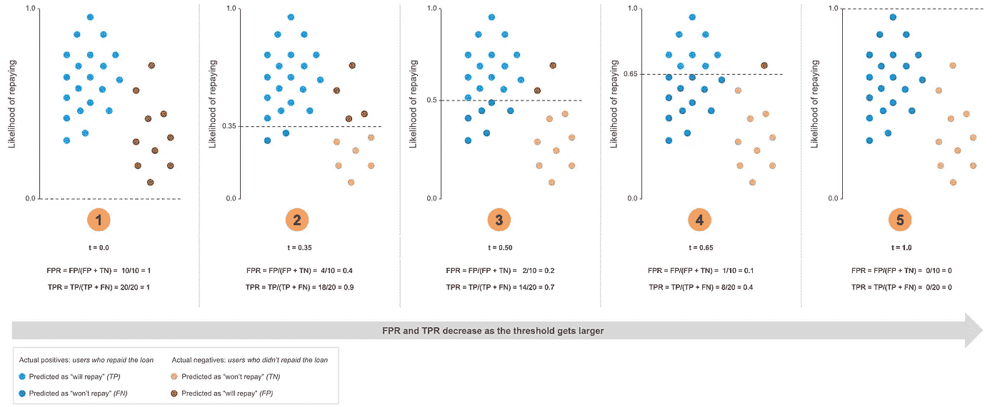
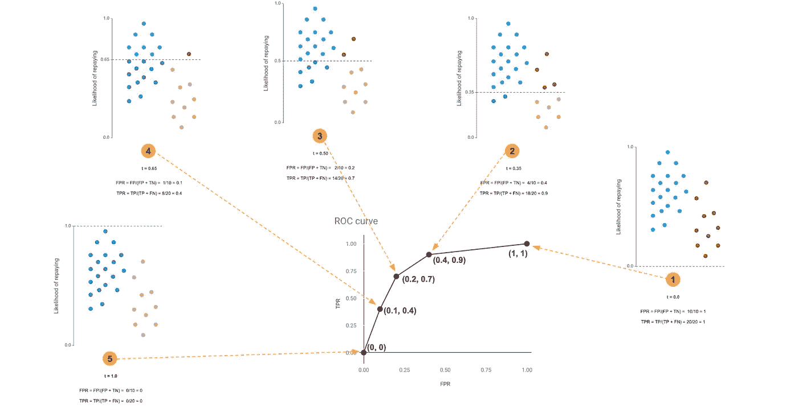

# 通过三个可视化步骤理解 ROC 曲线

> 原文：<https://towardsdatascience.com/understanding-the-roc-curve-in-three-visual-steps-795b1399481c?source=collection_archive---------2----------------------->

在数据科学中，我花了更长时间才理解的一个概念是受试者工作特征(ROC)曲线。这是您的分类模型工作情况的直观表示。

在这篇博客中，我想解释 ROC 曲线是如何通过三个可视化步骤从零开始构建的。

# 步骤 1:获取分类模型预测

当我们训练一个分类模型的时候，我们得到了得到一个结果的概率。在这种情况下，我们的例子将是*偿还贷款的可能性*。

图 1:分类模型示例

概率通常在 0 到 1 之间。价值越高，这个人偿还贷款的可能性就越大。

下一步是找到一个阈值，将概率分类为“*将偿还*或“*不会偿还*”。

在图 1 的例子中，我们选择了 0.35 处的*阈值:*

*   所有达到或超过此阈值的预测都被归类为*“将偿还”*
*   所有低于此阈值的预测都被归类为*“不会偿还”*

然后我们看看这些预测中哪些是正确分类的，哪些是错误分类的。有了这些信息，我们就可以建立一个混淆矩阵。

所有实际阳性，那些*确实偿还的，*是蓝点。

*   如果他们被归类为*【将偿还】*，我们就有了真正的积极(TP)
*   如果他们被归类为*“不会偿还”*，我们就有一个假阴性(FN)

所有实际负面，那些*没还的，*就是红点。

*   如果他们被归类为*【不会偿还】*，我们就真的否定了(TN)
*   如果它们被归类为*【将偿还】*，我们就有一个误报(FP)

在图 2 中，我们可以看到一个总结:

图 2:混淆矩阵

# 第二步:计算真阳性率和假阳性率

到目前为止，我们已经对所有的预测进行了分类，我们知道这些分类是否正确。这样，我们将计算接下来的两个指标:

图 TPR 和 FPR 的计算

*   真实阳性率(TPR): *在所有过去“确实还款”的人中，我们正确分类的百分比是多少*
*   假阳性率(FPR): *在所有过去“没有还款”的人中，我们漏分了百分之几*

我们可以在图 3 中看到这些计算的公式。

下面，在图 4 的第二个图中，我们可以看到阈值为 0.35 的原始示例。此时，我们

*   90%的阳性分类正确，那些*“已偿还”* (TPR)
*   漏分类 40%的所有否定，那些*“没还钱”* (FPR)

我们可以注意到 TPR 和 FPR 的结果随着阈值变大而降低。如果我们看第一个，阈值是 0:

*   所有阳性被正确分类，因此 TPR = 100%
*   所有的阴性都被错误分类，因此 FPR = 100%

在最后一个图表示例中，阈值为 1:

*   所有阳性被错误分类，因此 TPR = 0%
*   所有阴性都被正确分类，因此 FPR = 0%

图 4:不同临界值的 FPR 和 TPR 结果

> 总的来说，我们可以看到这是一个权衡。随着我们提高阈值，我们会更好地分类负面信息，但这是以错误分类更多正面信息为代价的

# 第三步:为每个截止点绘制 TPR 和 FPR

为了绘制 ROC 曲线，我们需要计算许多不同阈值*的 TPR 和 FPR(这一步在所有相关库中都被收录为* `*scikit-learn*` *)。*

对于每个阈值，我们在 x 轴上绘制 FPR 值，在 y 轴上绘制 TPR 值。然后我们用一条线把这些点连接起来。*就是这样！*

在下面的图 5 中，我们可以看到 ROC 曲线的每个点是如何代表一个分类在给定临界值的 FPR 和 TRP 的。

请注意，阈值为 1 时，第一个点位于(0，0)，阈值为 0 时，最后一个点位于(1，1)。

图 5: ROC 曲线示例

线下覆盖的面积称为*“曲线下面积(AUC)”*。这用于评估分类模型的性能。AUC 越高，模型就越能区分不同的类别。

这意味着在理想情况下，我们希望看到我们的线覆盖图形的大部分左上角，以获得更高的 AUC。

谢谢你看完🎉

希望你觉得这个博客有用！请在下面留下您的评论和反馈👇