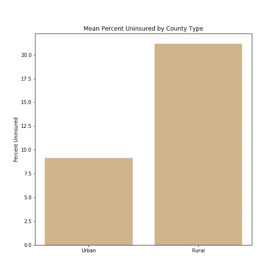
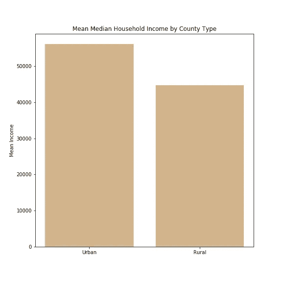

# 了解农村未参保人群

> 原文：<https://towardsdatascience.com/understanding-the-rural-uninsured-c14921796e5e?source=collection_archive---------55----------------------->

## 使用 Sklearn 的多元线性回归—编码示例

根据最近的人口普查数据，8.8%的美国人没有健康保险。也就是说，有 2800 万人可能会接受不符合标准的医疗服务，或者因为没有身份而被拒之门外。因为美国没有国有化的医疗保健，公民依靠健康保险来支付医疗费用。私营公司和公共医疗保健系统(如医疗保险和医疗补助)提供了各种各样的保险类型。在 2013 年患者保护与平价医疗法案(ACA)授权之前，未参保率为 18%。

感谢[约翰·里德](https://unsplash.com/photos/-04wiGkb8Jc)上[的 Unsplash](https://unsplash.com/)

## 为什么这是一个问题？

对于病人来说，没有保险意味着你可能会因为无力支付而被拒绝，或者你可能会接受不符合标准的医疗服务(更少的检查，医生更少的关注等)。如果原因严重，您可能不得不累积坏账(故意使用您无法偿还的信贷)以确保您可以获得护理。对于医生来说，你必须权衡因缺乏资金而拒绝患者的道德影响和你可能必须采取的减轻他们负担的措施，例如，承担费用、夸大症状或把他们送到公共资助的替代机构。

## 收集和准备数据

我为这个项目连接了四个数据集，以消除我的一些假设特征。我从 HealthData.gov T4 的一套社区健康指标开始。然后，我整合了来自人口普查局的一些数据集，以获得家庭收入中值( [1](https://www.census.gov/topics/income-poverty/income/data/tables.html) )、人口统计数据( [2](https://data.world/exercises/linear-regression-exercise-1) )以及农村与城市的细分数据( [3](https://www.census.gov/programs-surveys/geography/guidance/geo-areas/urban-rural/2010-urban-rural.html) )。

我根据相应州的平均值估算了每个县的社区健康指标的缺失值。我不得不删除一些行，因为四个集合中的一些集合将美国的领土视为等同于县，而一些偏远的县没有收集数据。

最后，进行了统计检验，以阐明农村和城市县之间的一些差异。未保险率、中等家庭收入、社区卫生中心的存在以及该县医疗服务不足的情况在农村和城市县之间都有显著差异。

城市县的未保险率明显低于农村县(9%比 21%，p 值=6.39e-32)。

## 开始建模

这是在我们清理和处理数据之后。我的完整笔记本可以在这里找到。

所以我们的 R 值大约是 0.4。这似乎相当低，对不对？对于像这样的社会科学项目来说，这还不算太糟糕！坦白说，模拟人类决策真的很难！虽然我们不能说我们有所有的答案，这个模型仍然允许我们确定未保险率的一些重要因素。

## 检查系数

让我们看看我们的系数。因为我们缩放了连续变量，我们可以相互解释这些系数。语法是“从‘老年人 _ 医疗保险’的平均值每增加一个单位的标准差，我们预计未投保率将增加 6.5%”。

我们可以看到，享受医疗保险的老年人、医生与 10 万人口的比率以及吸烟率是最大的积极因素(也就是说，它们增加了无保险率)。

对于负面因素，城市人口百分比、农村总人口和家庭收入中位数是有意义的。这告诉我们，随着各县人口越来越多和/或越来越城市化，他们的无保险率会下降。此外，较高的中值家庭收入与较低的未保险率相关，城市县的收入明显高于农村县(56k 比 44k，p 值=1.07e-80)。

我们看到，城市县的家庭收入中值明显高于农村县(56k 比 44k，p 值=1.07e-80)

## 结论

在运行我们的线性回归后，我们能够确定社区健康指标和人口统计因素的混合对未保险率有显著影响。高比例的吸烟者和享受医疗保险的老年人导致了未保险率的增加。我认为，享受医疗保险的老年人口是该县总老年人口的一个替代指标，因为老年人和儿童更有可能没有保险，这就推高了比率。

其他因素降低了这一比率。主要是，城市人口百分比每增加一个标准差，无保险率下降 5.62%。标准偏差每增加一个百分点，家庭收入中值的系数下降 2.44%，这个系数较小，但很重要。最后，随着县人口的增加，无论是城市还是农村，无保险率下降。

## 未来方向

我想纳入更具体的数据，例如，虽然家庭收入在未保险率中发挥了作用，但我们的数据仅限于县级，城市和农村人口混合的县可能会受到城市人口平均收入增加的影响。

还有一些可能影响这一比率的因素很难收集数据。我建议建立一个调查和汇总健康记录的系统，它可以提供为什么病人没有保险的原因。例如，一个有慈善系统的医疗机构列表(未保险的病人可以获得一个普通“基金”来支付手术费用)来检查这是如何影响未保险率的。

## 来源

[1]s·韦纳，“[我买不起！:未投保和投保不足者的护理困境](https://www.ncbi.nlm.nih.gov/pmc/articles/PMC1495228/)(2001)，普通内科杂志 16:412–418。

[2] J .科恩，“[统计力量分析](https://journals.sagepub.com/doi/10.1111/1467-8721.ep10768783)”(1992)，心理科学的当前方向 3:98–101。

数据集可以在文章中找到。我的回购是[这里](https://github.com/ArenCarpenter/Mod_2_Project)。