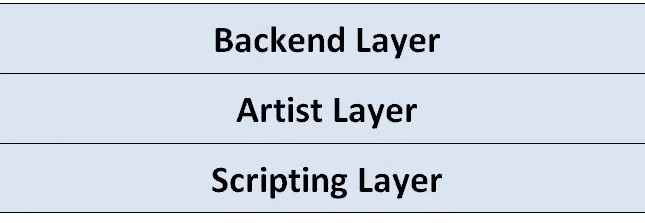
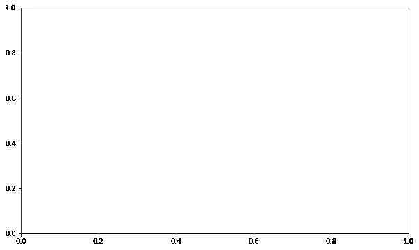
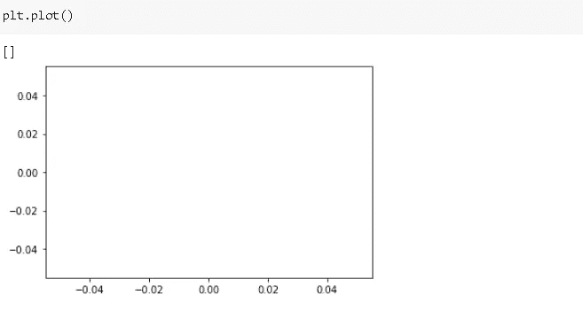
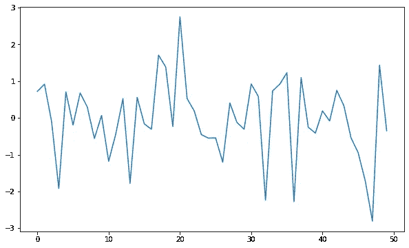
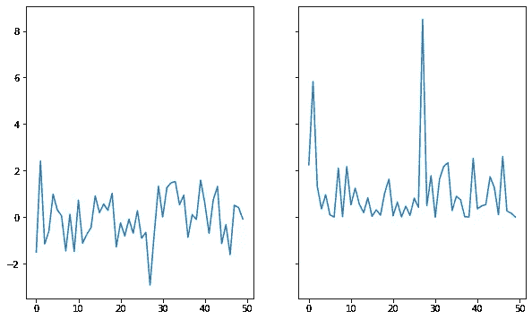
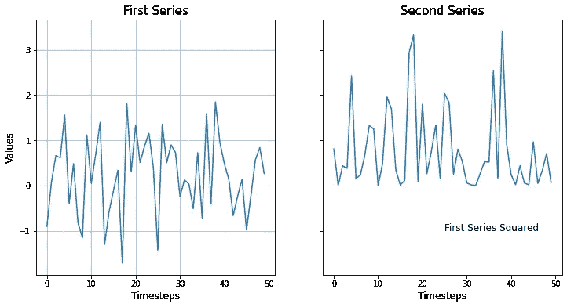

# 了解 Matplotlib 的结构

> 原文：<https://towardsdatascience.com/understanding-the-structure-of-matplotlib-23b97f507fac?source=collection_archive---------22----------------------->

## 那些情节是怎么创造出来的？


照片由[金莎·艾利斯](https://unsplash.com/@kymellis?utm_source=unsplash&utm_medium=referral&utm_content=creditCopyText)在 [Unsplash](https://unsplash.com/s/photos/view?utm_source=unsplash&utm_medium=referral&utm_content=creditCopyText) 上拍摄

Matplotlib 是一个广泛使用的 python 数据可视化库。它提供了许多不同种类的 2D 和 3D 绘图，对于数据分析和机器学习任务非常有用。

Matplotlib 提供了灵活性。创建情节有多种方式。为了掌握 matplotlib，有必要对其结构有一个透彻的了解。

Matplotlib 由三个主要层组成。



# **后端层**

如果你不是开发人员，你不太可能使用或处理后端层。它有三个抽象类:

*   FigureCanvas:定义绘制图形的区域。
*   渲染器:它是在图形画布上绘图的工具。
*   事件:处理用户输入，如键盘敲击和鼠标点击。

这类似于我们在纸上画画。假设你想画一幅画。你得到一张白纸(图画布)和一个画笔(渲染器)。你问你朋友画什么(事件)。

# **艺术家图层**

艺术家层由一个对象组成，该对象是**艺术家**。

> 我们在 matplotlib 生成的绘图上看到的一切都是艺术家实例。

标题、线条、文本、轴标签都是艺术家的实例。**图**是主要的艺术家对象，它将所有的东西结合在一起。让我们创建一个图形:

```
#importing matplotlib
import matplotlib.pyplot as plt
%matplotlib inline#creating a figure artist
fig = plt.figure(figsize=(10,6))
<Figure size 720x432 with 0 Axes>
```

我们创建了一个图形，但它没有任何可显示的内容。可以把它想象成一个容器，把一个情节的组成部分放在一起。

有两种类型的艺术家对象:

*   复合:图形，轴
*   图元:直线、圆、文本

我们需要添加一个或多个**轴**到**图**中，以便能够创建一个实际的绘图。让我们在行动中看到它。

```
fig = plt.figure(figsize=(10,6))
ax = fig.add_subplot(111)
```

我们在之前创建的图形中添加了一个轴。我们现在有一个空的地块:



请注意，我们已经使用脚本层来生成这些图。我只是想展示艺术家物品的概念。

**注意**:我们使用了**面向对象的风格**，在这里我们明确定义了艺术家对象的实例。另一个选项叫做 **pyplot style** ，我们让 pyplot 创建图形和轴对象。



Pyploy 风格

在这篇文章中，我们将坚持面向对象的风格。

# **脚本层**

这是我们最有可能打交道的一层。脚本层是 **matplotlib.pyplot** 接口。因此，当我们在下面的命令后使用“plt”创建图时，脚本层就是我们所玩的。

```
import matplotlib.pyplot as plt
```

脚本层自动化了将所有东西放在一起的过程。因此，它比艺术家层更容易使用。

让我们创造一些实际上看起来像情节的情节。

```
#create array to be plotted
import numpy as np
ser = np.random.randn(50)#create the plot
fig = plt.figure(figsize=(10,6))
ax = fig.add_subplot(111)
ax.plot(ser)
```

我们创建了一个图形和轴。然后调用轴对象上的绘图函数，并传递要绘制的数组。渲染图为:



此图形有一个轴，但一个图形可以包含多个轴。让我们创建一个有多个轴的:

```
#arrays to be plotted
ser1 = np.random.randn(50)
ser2 = ser1**2#create figure and axes
fig, (ax1, ax2) = plt.subplots(nrows=1, ncols=2,
                  sharey=True,figsize=(10,6))#plot the arrays on axes
ax1.plot(ser1)
ax2.plot(ser2)
```

我们使用**子情节**函数，用一行代码创建了图形和轴(ax1 和 ax2)。



Matplotlib 提供了高度灵活的工作环境。我们可以完全控制自己创造的情节。回想一下，我们在 matplotlib 图形上看到的所有东西都是 Artist 的实例。让我们在上面的情节中加入不同类型的艺术家。

```
ser1 = np.random.randn(50)
ser2 = ser1**2fig, (ax1, ax2) = plt.subplots(nrows=1, ncols=2,
                  sharey=True, figsize=(12,6))ax1.plot(ser1)
ax1.grid()
ax1.set_title('First Series', fontsize=15)
ax1.set_ylabel('Values', fontsize=12)
ax1.set_xlabel('Timesteps', fontsize=12)ax2.plot(ser2)
ax2.set_title('Second Series', fontsize=15)
ax2.text(25,-1, 'First Series Squared', fontsize=12)
ax2.set_xlabel('Timesteps', fontsize=12)
```

除了标题和轴标签，我们还在第一个轴上添加了网格线，在第二个轴上添加了一个文本艺术家。我们制作的情节:



我们可以用 matplotlib 做更多的事情。和其他工具一样，它需要大量的练习才能掌握。然而，具体和基本的第一步是学习基础知识和结构。之后可以通过练习创造更高级的剧情。

感谢您的阅读。如果您有任何反馈，请告诉我。

# **参考文献**

*   [https://matplotlib.org/3.2.2/index.html](https://matplotlib.org/3.2.2/index.html)
*   [https://www.aosabook.org/en/matplotlib.html](https://www.aosabook.org/en/matplotlib.html)