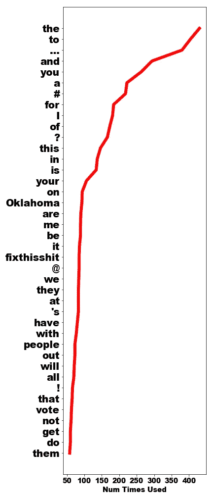
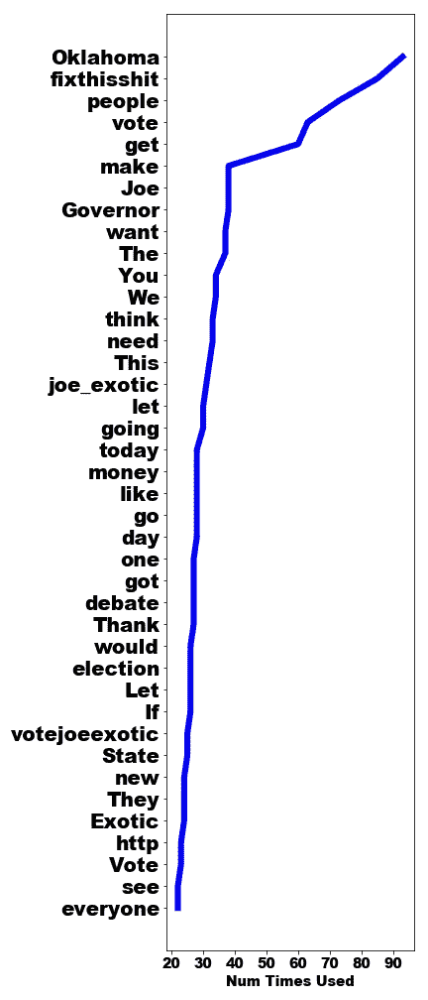
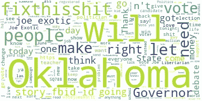
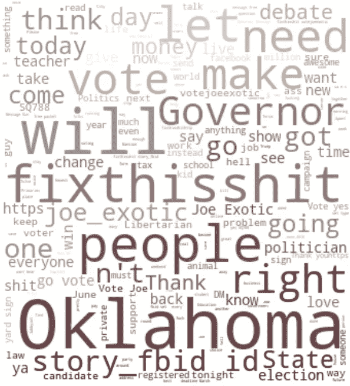
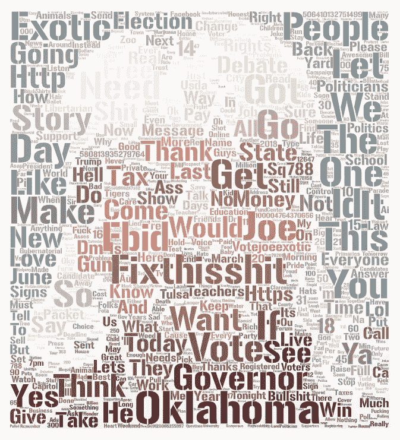
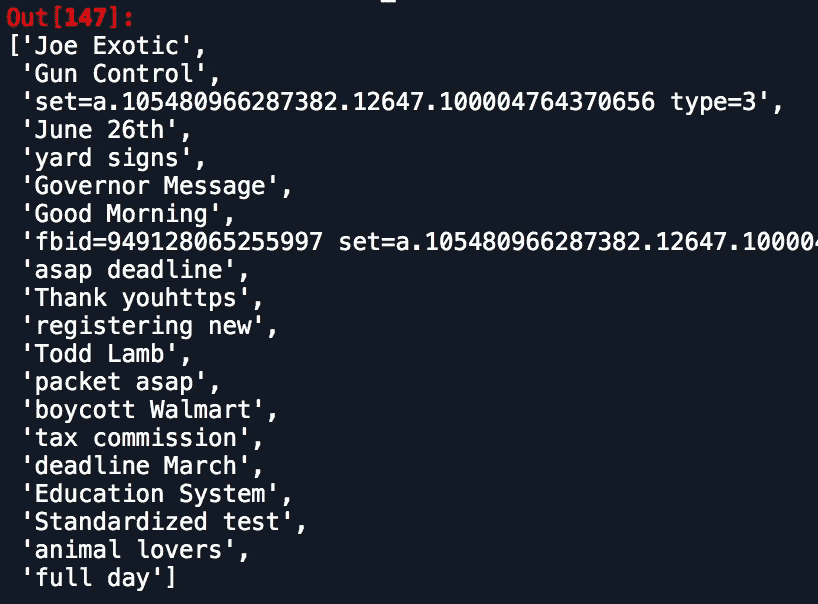
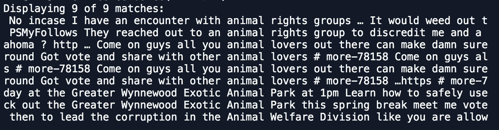
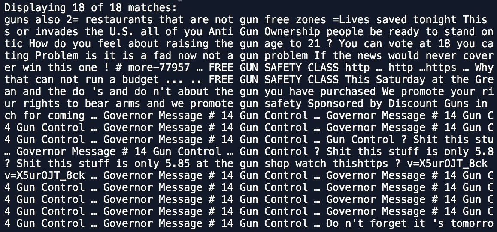

# 了解虎王🐯和他通过 Python 发的推文

> 原文：<https://towardsdatascience.com/understanding-the-tiger-king-and-his-tweets-through-python-b928f92af05d?source=collection_archive---------28----------------------->

## 🐯使用 Python 抓取 Twitter + NLP

## 虎王在推特上说什么？


照片由 [Engin Akyurt](https://unsplash.com/@enginakyurt) 拍摄

乔·异国情调是目前美国最大的名字。我们已经看到网飞是如何描绘他的，但是虎王是如何在推特上描绘他自己的呢？我开始通过抓取他的推特并学习他使用的词汇来找出乔·异国他乡是谁。

网飞的*虎王*在隔离期间吸引了美国，不管是好是坏。如果你不知道这部电视剧，这部纪录片重点介绍了美国的地下大型猫科动物游戏，魅力非凡的乔·异国情调(又名虎王)和他的死对头卡罗尔·巴斯金是主角。

尽管是#StayAtHome 期间的头号热门话题，乔仍然错过了一个名人的真实故事；推特上的蓝色勾号。

# 在国王的脑袋里

那么，虎王到底在推特上写些什么呢？毕竟，我们知道一个人的 Twitter 是一个很好的窥视他们所关心的东西的窗口。通过分析虎王的微博，我开始更全面地了解他。

我首先安装了 [twitterscraper](https://github.com/taspinar/twitterscraper) 。当然，Twitter 有自己的 API， [Tweepy](http://docs.tweepy.org/en/latest/index.html) ，但它有其局限性。也就是说，你不能再抓取超过七天的推文。那对我来说不可行，因此使用了 twitterscraper。

# 获取虎王的推文

twitterscraper 的作者 Ahmet Taspinar 实际上做了一项令人难以置信的工作，使推文变得容易。我所要做的就是提供我想要的账户。

```
# Scrape Tweets
handle = ‘joe_exotic’
out = twitterscraper.query_tweets_from_user(handle)
```

推特开始涌入。

然后，我使用一些简单的 pandas 命令将数据提取到一个可管理的数据帧中。

```
# Create Empty storage
df = pd.DataFrame()
Date = []
Text = []
Likes = []
Retweets = []
# Read data into respective columns
for tweet in out:
    Date.append(tweet.timestamp)
    Text.append(tweet.text)
    Likes.append(tweet.likes)
    Retweets.append(tweet.retweets)
```

一旦我有了推文，我就可以通过自然语言处理来准备它们进行分析。

# 准备虎王的推文

为了执行一些基本的自然语言处理，我导入了 [NLTK](https://www.nltk.org/) ，并对他的 tweets 进行了标记。

```
# Load in Tweets
df = pd.read_csv(‘JoeExoticTweets.csv’)# Tokenize words
texts = ‘ ‘.join(df[‘Text’]) # Turn into string
FindWordsText = nltk.word_tokenize(texts) # Separate text into words 
text = nltk.Text(FindWordsText) # Spit out processed words
words = text.tokens
```

然后，我做了一些轻微的清理，消除了任何链接，因为那些不是我感兴趣的真实单词。尽管看看他的链接可能会很有趣？任何人的分拆项目？

```
# Clean up links as words
words_clean = [i for i in words if ‘//’ not in i]
words_clean = [i for i in words_clean if ‘.com’ not in i]
other_messy_words = [‘https’, ‘ https’, ‘https ‘,   ‘.’,’:’,’\’’,’&’,’,’]
words_clean = [i for i in words_clean if i not in other_messy_words]
```

# 分析虎王的微博

先来看看虎王用的最多的是哪些词。我们将使用 NLTK 的 FreqDist 函数来做到这一点。

```
# Analyze Frequency
frequency_dist = nltk.FreqDist(words)
word_dict = sorted((value, key) for (key,value) in frequency_dist.items())
x, y = zip(*word_dict) # unpack a list of pairs into two tuples
```

现在我们有了这些组织好的列表，让我们做一个线图来显示前 40 个单词被使用的次数。

```
num_to_show = 40
plt.figure(figsize=[6,14])
plt.plot(x[-num_to_show:], y[-num_to_show:],lw=6,c='r')
plt.yticks(fontname = "Arial Black", fontsize=20)
plt.xlabel('Num Times Used',fontsize=14, fontname = "Arial Black")
plt.xticks(fontsize=14, fontname = "Arial Black")
plt.savefig("joes_most_common_terms.png", format="png")
plt.show()
```



乔·异国最常用的词

我们可以看到，小的、常见的词是他用得最多的；这是有道理的。我仍然认为这给了我们很多关于虎王的深刻见解。我看到他用了很多“…”和很多标签。他大量使用“我”,这可能意味着一种自我中心的叙述。问号的使用可能暗示，他在问公众问题。他钟爱的俄克拉荷马州经常被使用，还有一个标签#fixthisshit 来表明他对这个国家的感情。

每个人都使用像“the”、“to”和“it”这样的词，所以让我们添加一些停用词来消除它们，同时去掉标点符号和半结构缩写(n t，etc)。

```
# Remove stop words
stop_words = set(nltk.corpus.stopwords.words('english')) 
filtered_by_stopwords = [w for w in FindWordsText if not w in stop_words] 
extra_stopwords = ["…",'#','@','!','\'s','..',"’",'?','n\'t','.','I','...']
filtered_by_stopwords = [w for w in filtered_by_stopwords if not w in extra_stopwords]
```

再重做一次图表，看看更多独特的乔词。



过滤停用字词后 Joe 最常用的字词

这给虎王的内心增加了更多的颗粒度。他对什么感兴趣？这些推文不言自明:“人民”、“投票”、“州长”和“钱”。

# 字云！

我的下一步是做一个单词云。这些都很常见，但是很有趣，至少显示了虎王最常用的词。

Python 有一些很棒的工具可以用来构建单词云。我非常喜欢 [datacamp 的教程](https://www.datacamp.com/community/tutorials/wordcloud-python)，它利用了 WordCloud 库来生成它们。

它能为你做大部分艰苦的工作…

```
# Simple word cloud# make simple word cloud with white background 
wordcloud = WordCloud(background_color=”white”).generate(texts_clean)# show word cloud
plt.imshow(wordcloud, interpolation=’bilinear’)
plt.axis(“off”)
plt.show()
plt.figure(figsize=[12,12])
plt.savefig(“joes_tweets_simple.png”, format=”png”)
```



简单词云

嘭！我们经常看到类似的术语被使用，但是是以一种更可爱、更艺术的方式。

# 画一幅字肖像

如果乔用他最常用的词给他画一幅画，他会是什么样子？数据营教程向您展示如何将单词云塑造成形状和图像。所以我们来试试吧！我做了一个快速谷歌搜索乔异国情调，发现了这张可怕的照片。


照片来自[圣塔罗斯县监狱](https://commons.wikimedia.org/wiki/File:Joe_Exotic_(Santa_Rose_County_Jail).png)

然后，我将图像加载到 python 中，并将图像转换成一个 Numpy 数组。

```
mask = np.array(Image.open(“JoeExoticPic.jpg”))
```

然后使用 WordCloud 库中的 ImageColorGenerator 函数，我根据照片中的颜色创建了这个单词云。



乔异域词云写真

这似乎反映了图片的颜色，看起来比简单的白色单词云更有趣，但仍然不确定这是我要找的最终肖像。

WordArt.com[是另一个很酷的资源，它可以让你自定义形状或图像文字云，没有代码行。它们还允许您调整 hyper 参数，使完成的项目更具美感。我导入了所有虎王文字的栏目，上传了同样的图片，做了这个可视化:](http://wordart.com)



虎王字画像

好多了！实际的视觉效果也是交互式的，所以滚动一些单词来看看它的效果。

# 虎王一起用什么词？

单个单词很强大，但也许我们会更深入地了解常用的成对单词。

```
text.collocation_list()
```



虎王最配对的词

抵制沃尔玛！教育系统！枪支管制！以下是虎王本人经常讨论的一些话题。我们可以深入研究其中一些。6 月 26 日发生了什么？他说的最后期限是什么？什么是一整天？

# 虎王关于 *X* 的事情是什么？

当 Joe introductive 在谈论“T4”这个词时，他在说什么？

```
text.concordance("animal")
```



“*枪”怎么样？*

```
text.concordance("gun")
```



他最好的朋友，我们深爱的“卡罗尔酷猫巴斯金”呢？

```
text.concordance("Carole")
```

…没有匹配项…

什么！他从没提起过卡罗尔？当然是巴斯金。

```
text.concordance("Baskin")
```

没有。没什么。

奇怪。他在微博上提到过她吗？他删除它们是出于法律原因吗？卡罗尔·巴斯金的推特在哪里？！！

# 虎王是…

乔·特兰奇似乎是一个真正关心州政府、选举和州长的人。他关心“解决这个狗屎问题”，关心枪支管制、教育系统和抵制沃尔玛。他是这样一个人，他会把截止日期、日期和消息告知他的基础。也许，只是也许，他并不像网飞描绘的那样疯狂。

也许他应该得到自由？你可以在评论中辩论。

## 想摆弄数据吗？

你可以在我的 GitHub Repo:[https://github.com/AveryData/Tiger-King-Tweets](https://github.com/AveryData/Tiger-King-Tweets)找到这个项目的所有代码