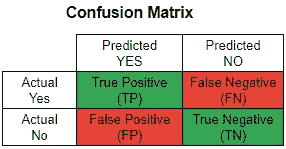
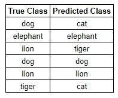
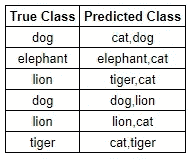

# 仍然使用准确性作为分类标准吗？

> 原文：<https://towardsdatascience.com/understanding-top-n-accuracy-metrics-8aa90170b35?source=collection_archive---------52----------------------->

## 了解多类分类问题的前 N 名准确性指标


里卡多·阿尔塞在 [Unsplash](https://unsplash.com/s/photos/accuracy?utm_source=unsplash&utm_medium=referral&utm_content=creditCopyText) 上的照片

准确性是分类模型最常见的评估标准，因为它简单明了。但是，当您手头有一个多类分类问题时，比方说，有 15 个不同的目标类，查看模型的标准准确性可能会产生误导。这就是“前 N 名”准确度可能有所用处的地方，在本文中，我将带您了解前 N 名准确度的基本直觉和 python 实现。

在讨论前 N 名精度之前，先回顾一下标准精度指标:

## **什么是准确性？**

准确性是模型正确预测的记录总数的百分比。准确度=(正确预测的记录数/记录总数)或准确度= (TP+TN) / (TP+TN+FP+FN)



## **为什么准确度不是多类问题的完美衡量标准？**

当您有许多不同的类别时，分类模型可能无法准确预测正确的类别。在文本分类这样的 NLP 情况下，这尤其成为一个问题，在这种情况下，您有大量的特征，并且数据没有充分地跨类聚类。因此，查看您的标准准确性指标有时可能会产生误导。如前所述，测量前 N 个精度可能有助于解决这个问题。

## **什么是 top N 精度？**

前 N 个精度并不是任何不同的度量，而是真实类的标准精度等于分类模型预测的 N 个最有可能的类中的任何一个。

最高 1 级准确度是指真实类别与模型预测的最可能类别相匹配的准确度，与我们的标准准确度相同。

前 2 名准确度是指真实类别与模型预测的 2 个最可能类别中的任何一个匹配的准确度。

前 3 名准确度是指真实类别与模型预测的 3 个最可能类别中的任何一个匹配的准确度。

同样，我们可以衡量前 4 名、前 5 名、前 6 名等等。

让我举个例子让你更好的理解。考虑必须将记录分类到相应的动物中(狗、猫、狮子、老虎和大象)。该表显示了 6 个记录的真实类别和预测类别。



由此，我们将得到 50%的准确率，这并不令人满意。现在让我们找出这个问题的前 2 个精度。该表显示了同一组记录的真实类别和 2 个最可能的类别。



这样，我们得到了 83%的准确率，与之前相比有了显著的提高。这是找到前 N 个精度背后的基本直觉。

我希望你已经理解了测量前 N 个精度的重要性。即使分类模型无法预测准确的类别，查看前 2 名或前 3 名的准确性在许多情况下可能是有用的，尤其是在有许多不同类别(如 15 或 20)的情况下。

现在，我将向您展示一些使用 python 查找前 N 个精度的**代码。不幸是，sci-kit learn 没有任何内置的功能。所以我在这里定义了一个函数，你可以直接复制，用在你的问题中。**

导入所需的库并预处理数据后，运行提供的函数。

```
def top_n_accuracy(X,y,n,classifier):
  X_train, X_test, y_train, y_test = train_test_split(X, y, test_size=0.2)
  vectorizer = TfidfVectorizer(min_df=2)
  X_train_sparse = vectorizer.fit_transform(X_train)
  feature_names = vectorizer.get_feature_names()
  test = vectorizer.transform(X_test)
  clf = classifier
  clf.fit(X_train_sparse,y_train)
  predictions = clf.predict(test)
  probs = clf.predict_proba(test)
  topn = np.argsort(probs, axis = 1)[:,-n:]
  y_true = np.array(y_test)
  return np.mean(np.array([1 if y_true[k] in topn[k] else 0 for k in range(len(topn))]))
```

您可以通过提供以下参数来调用该函数:

1.  X =特征变量
2.  y =目标类别
3.  n =要测量的前 N 名(例如，前 2 名的 n=2)
4.  分类器=您想要使用的分类模型(例如 LogisticRegression())

我已经为文本分类定义了这个函数，但是您可以简单地删除具有*矢量器*实例的行，并将其用于标准分类。