# 理解变压器，数据科学之路

> 原文：<https://towardsdatascience.com/understanding-transformers-the-data-science-way-e4670a4ee076?source=collection_archive---------13----------------------->

来源:[壁纸访问](https://wallpaperaccess.com/transformers)

## 通过问很多问题。

如今，变形金刚已经成为任何 NLP 任务的事实标准。不仅如此，它们现在还被用于计算机视觉和创作音乐。我相信大家都听说过 GPT3 变压器及其应用。 ***但抛开所有这些事情不谈，他们仍然一如既往地难以理解。***

我花了很多时间阅读首次介绍变形金刚的谷歌研究论文和许多博客文章，才真正理解了变形金刚的工作原理。

所以，我想把整个想法用尽可能简单的话写下来，加上一些非常基本的数学和一些双关语，因为我是一个在学习时享受乐趣的支持者。我会尽量少用术语和术语，但这是一个我只能做这么多的话题。我的目标是让读者在这篇文章结束时理解《变形金刚》最精彩的细节。

此外，这是我正式发表的最长的一篇文章，无论是从写这篇文章所花的时间还是文章的长度来看。因此，我建议你去喝杯咖啡。 ☕️

所以，我来了——这篇文章将是一篇高度对话性的文章，它是关于“ ***解码变压器”的。***

***问:那么，我为什么还要理解《变形金刚》？***

在过去，LSTM 和 GRU 架构(正如我在 NLP 上的[帖子](/nlp-learning-series-part-3-attention-cnn-and-what-not-for-text-classification-4313930ed566)中所解释的)以及注意力机制曾经是语言建模问题(简单地说，预测下一个单词)和翻译系统的最先进方法。但是，这些架构的主要问题是它们本质上是循环的，并且运行时间随着序列长度的增加而增加。也就是说，这些体系结构以 ***顺序*** 的方式获取一个句子并处理每个单词，因此随着句子长度的增加，整个运行时间也会增加。

Transformer 是一种模型架构，在论文《注意力就是你所需要的一切》中首次解释，它放弃了这种循环，而是完全依赖于注意力机制来绘制输入和输出之间的全局依赖关系。这使得它很快。

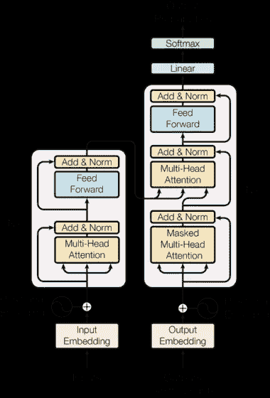

[来源](https://arxiv.org/pdf/1706.03762.pdf)

这是从报纸上截取的完整变压器的图片。而且，这确实令人生畏。因此，在这篇文章中，我将通过仔细阅读每一篇文章来揭开它的神秘面纱。所以请继续阅读。

# 大局

***问:听起来很有趣。那么，变压器具体做什么呢？***

本质上，转换器可以执行几乎所有的 NLP 任务。根据需要，它可以用于语言建模、翻译或分类，并且通过消除问题的顺序性，它可以快速完成这些工作。因此，机器翻译应用程序中的转换器会将一种语言转换为另一种语言，或者对于分类问题，会使用适当的输出层来提供分类概率。

这一切都将取决于网络的最终输出层，但变压器的基本结构将保持完全相同的任何任务。在这篇文章中，我将继续机器翻译的例子。

所以从一个很高的地方，这是变压器如何寻找一个翻译任务。它接受一个英语句子作为输入，并返回一个德语句子。

用于翻译的变压器(*图片作者*

# 积木

***问:那太基础了。*😎你能详细说明一下吗？**

好吧，记住最后，是你自找的。让我们再深入一点，试着理解变压器是由什么组成的。

因此，转换器本质上是由一堆编码器和解码器层组成的。编码器层的作用是使用注意机制将英语句子编码成数字形式，而解码器的目的是使用来自编码器层的编码信息来给出特定英语句子的德语翻译。

在下图中，转换器输入一个英语句子，该句子使用 6 个编码层进行编码。最终编码器层的输出然后进入每个解码器层，将英语翻译成德语。

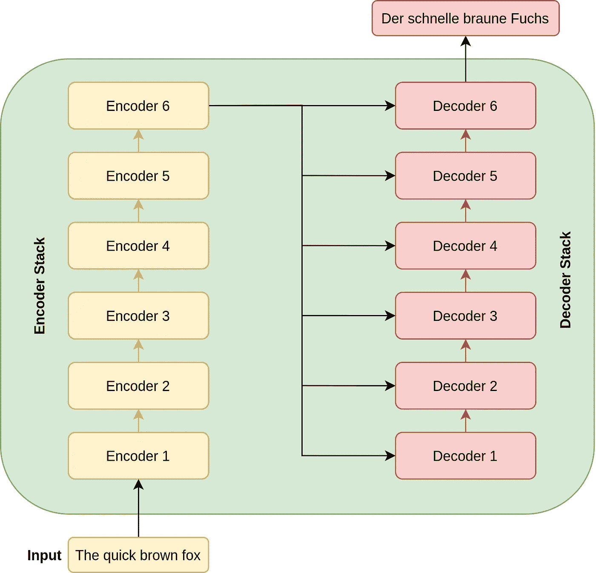

转换器中的数据流(作者提供的*图片)*

# 1.编码器架构

问:没关系，但是，编码器堆栈是如何准确编码一个英语句子的呢？

耐心点，我要开始了。因此，正如我所说的，编码器堆栈包含六个相互叠加的编码器层(如论文中所述，但未来版本的 transformers 会使用更多层)。并且堆栈中的每个编码器本质上具有两个主要层:

*   **多头自关注层，以及**
*   **位置式全连接前馈网络**

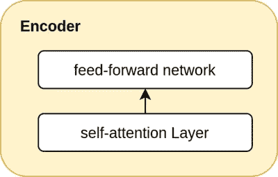

非常基本的编码器层(*图片作者*)

他们是满嘴的。对吗？请不要忘记我，我将在接下来的章节中解释这两个问题。现在，只要记住编码器层包含注意力和位置前馈网络。

问:但是，这一层期望它的输入是怎样的呢？

这一层期望它的输入是`SxD`(如下图所示)的形状，其中`S`是源句子(英语句子)的长度，`D`是嵌入的维度，其权重可以用网络来训练。在本帖中，我们将始终默认使用`D`作为 512。而 S 将是一批句子的最大长度。所以它通常会随着批次而变化。

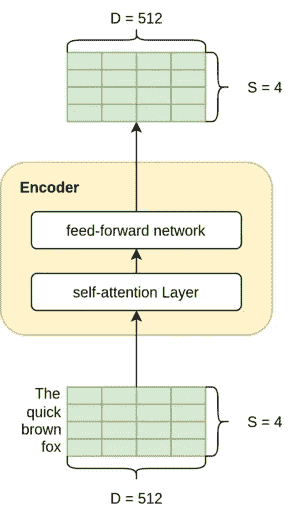

编码器—输入和输出形状相同(*作者图片*)

这一层的输出是什么呢？请记住，编码器层是相互堆叠的。因此，我们希望输出能够与输入具有相同的维数，以便输出可以轻松流入下一个编码器。所以输出也是这个形状，`SxD`。

***问:关于大小的讨论已经足够了，我知道什么进入什么离开，但是在编码器层实际上发生了什么呢？***

好了，让我们一个一个地过注意力层和前馈层:

## a)自我关注层

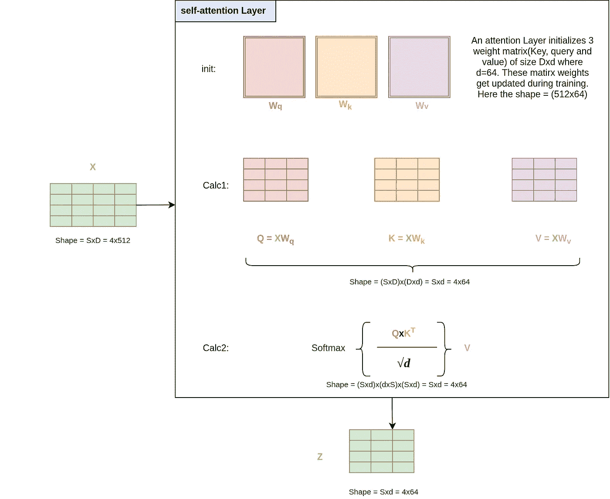

自我关注是如何工作的(*作者图片*)

上面的数字看起来很吓人，但很容易理解。所以和我呆在一起。

深度学习本质上只是大量的矩阵计算，我们在这一层本质上做的是大量的智能矩阵计算。自我关注层用 3 个权重矩阵初始化——查询(W_q)、键(W_k)和值(W_v)。这些矩阵中的每一个都具有(`Dxd`)的大小，其中 d 在文中被取为 64。当我们训练模型时，将训练这些矩阵的权重。

在第一个计算中(图中的 Calc 1)，我们通过将输入乘以相应的查询、键和值矩阵来创建矩阵 Q、K 和 V。

到目前为止，它是微不足道的，不应该有任何意义，但它是在第二次计算中变得有趣。让我们试着理解 softmax 函数的输出。首先，我们将 q 和 Kᵀ矩阵相乘，得到一个大小为(`SxS`)的矩阵，然后除以标量√d。然后，我们取一个 softmax，使各行之和为 1。

直观上，我们可以把得到的`SxS`矩阵想象成每个单词对另一个单词的贡献。例如，它可能看起来像这样:

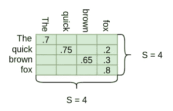

Softmax(QxKt/sqrt(d)) ( *图片作者*)

如你所见，对角线上的条目很大。这是因为这个词本身的贡献就高。这是合理的。但是我们在这里可以看到,“quick”这个词被分为“quick”和“fox”,“brown”这个词也被分为“brown”和“fox”。这直观地帮助我们说，“快”和“棕色”这两个词都指“狐狸”。

一旦我们有了这个包含贡献的 SxS 矩阵，我们就将这个矩阵乘以句子的值矩阵(Sxd ),它返回给我们一个 Sxd(4x64)形状的矩阵。因此，该操作实际上做的是用比如说. 75 x(快速嵌入)和. 2x(fox 嵌入)替换单词“quick”的嵌入向量，因此现在单词“quick”的结果输出本身就嵌入了注意力。

请注意，这一层的输出维度为(Sxd ),在我们完成整个编码器之前，我们需要将它改回 D=512，因为我们需要该编码器的输出作为另一个编码器的输入。

***问:但是，你把这一层叫做多头自我关注层。什么是多头？***

好吧，我的错，但我要说的是，我正要说到这一点。

之所以叫多头，是因为我们并行使用了很多这样的自我关注层。也就是说，我们有许多自我关注层堆叠在一起。在论文中，注意层的数量 h 保持为 8。于是输入的 X 并行通过许多自我关注层，每一层给出一个形状的 z 矩阵(Sxd) = 4x64。我们连接这些 8(h)矩阵，并再次应用大小为 DxD 的最终输出线性层 Wo。

我们有多大尺寸的？对于连接操作，我们得到大小为 SxD(4x(64x8) = 4x512)。将这个输出乘以 Wo，我们得到最终输出 Z，其形状为 SxD(4x512)。

此外，请注意 h、D 和 D 之间的关系，即 h x d = D

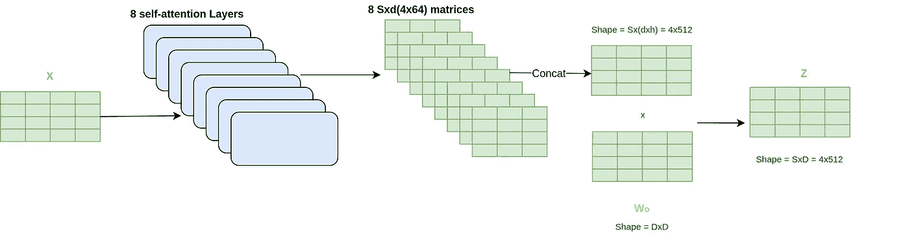

完整的多头自我关注层(作者的*图片)*

因此，我们最终得到了 4x512 形状的输出 Z。但是在它进入另一个编码器之前，我们通过一个前馈网络。

## b)位置式前馈网络

一旦我们理解了多头注意力层，前馈网络实际上就很容易理解了。它只是输出 z 上各种线性层和漏失层的组合。因此，这里也只是大量的矩阵乘法。

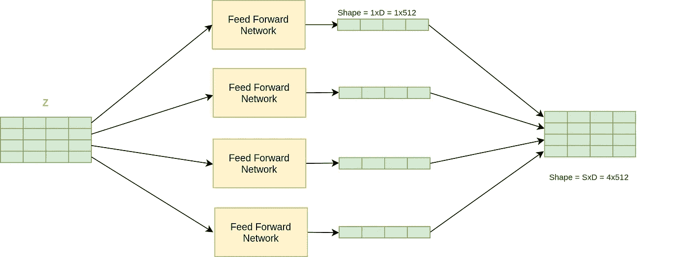

每个单词都进入前馈网络。(*图片作者*)

前馈网络将其自身并行地应用于输出 Z 中的每个位置(每个位置可以被认为是一个字),因此命名为逐位置前馈网络。前馈网络也共享权重，因此源句子的长度无关紧要(此外，如果它不共享权重，我们将不得不基于最大源句子长度来初始化许多这样的网络，这是不可行的)

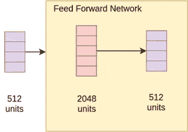

它实际上只是一个应用于每个位置(或单词)的线性图层

至此，我们对变压器的编码器部分有了大致的了解。

***问:嘿，我刚刚在浏览报纸上的图片，编码器堆栈中有一个叫做“位置编码”和“添加&规范”的东西。这些是什么？***

我又回到这里，所以你不必滚动[源](https://arxiv.org/pdf/1706.03762.pdf)

好的，这两个概念对于这个特殊的架构来说非常重要。我很高兴你问了这个问题。因此，在进一步讨论解码器堆栈之前，我们将讨论这些步骤。

## C.位置编码

由于我们的模型不包含递归和卷积，为了让模型利用序列的顺序，我们必须注入一些关于序列中记号的相对或绝对位置的信息。为此，我们将“位置编码”添加到编码器和解码器堆栈底部的输入嵌入中(我们将在后面看到)。位置编码需要具有与嵌入相同的维数 D，以便两者可以相加。

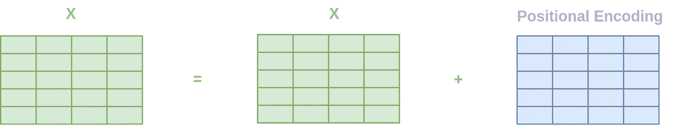

向 X 添加静态位置模式(*图片作者*)

在论文中，作者使用正弦和余弦函数为不同的位置创建位置嵌入。

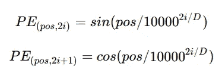

[来源](https://arxiv.org/pdf/1706.03762.pdf)

这种特殊的数学运算实际上会生成一个 2d 矩阵，该矩阵会添加到进入第一个编码器步骤的嵌入向量中。

简而言之，这只是一个我们添加到句子中的常数矩阵，这样网络就可以得到单词的位置。

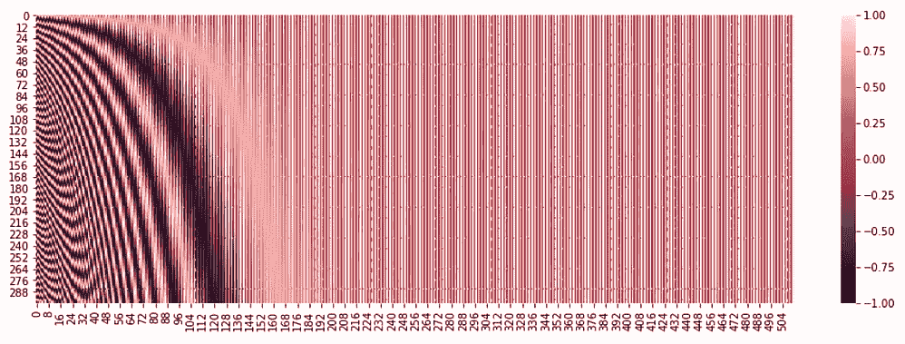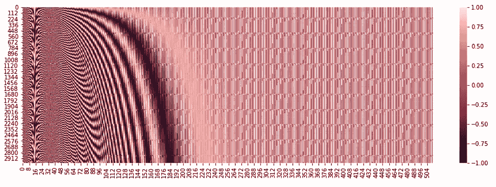

前 300 和 3000 个位置的位置编码矩阵(*图片作者*

上面是位置编码矩阵的热图，我们将把它添加到第一个编码器的输入中。我正在显示前 300 个职位和前 3000 个职位的热图。我们可以看到，我们向转换器提供了一个独特的模式来理解每个单词的位置。由于我们使用由 sin 和 cos 组成的函数，因此我们能够很好地嵌入非常高位置的位置嵌入，如第二张图所示。

**有趣的事实:**作者也让 Transformer 学习这些编码，并没有看到任何性能上的差异。所以，他们采用了上面的想法，因为它不依赖于句子的长度，所以即使测试句子比训练样本大，我们也不会有问题。

## D.添加并正常化

为了简单起见，我在解释编码器时没有提到的另一件事是，编码器(解码器架构也是如此)架构也有跳过级剩余连接(类似于 resnet50)。因此，本文中确切的编码器架构如下所示。简而言之，它有助于在深度神经网络中以更大的长度遍历信息。这可以被认为类似于(直觉上)在一个组织中传递信息，在这个组织中，你可以接触到你的经理，也可以接触到你的经理的经理。

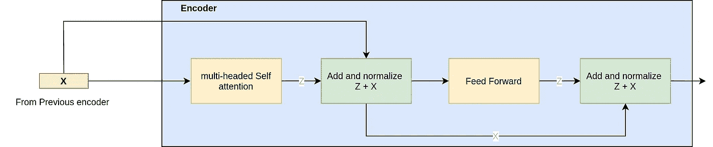

越级连接帮助信息在网络中流动(*图片作者*

# 2.解码器架构

***问:好的，到目前为止，我们已经了解了编码器获取一个输入句子，并将其信息编码到大小为 SxD(4x512)的矩阵中。这一切都很好，但它如何帮助解码器解码成德语？***

苍天不负苦心人。因此，在了解解码器是如何做到这一点之前，让我们先了解一下解码器堆栈。

解码器堆栈包含堆栈中的 6 个解码器层(如论文中再次给出的)，堆栈中的每个解码器由以下三个主要层组成:

*   **被屏蔽的多头自我关注层**
*   **多头自关注层，和**
*   **位置式全连接前馈网络**

它还具有相同的位置编码以及跳过级别连接。我们已经知道多头注意力和前馈网络层如何工作，因此我们将直接进入解码器与编码器的不同之处。

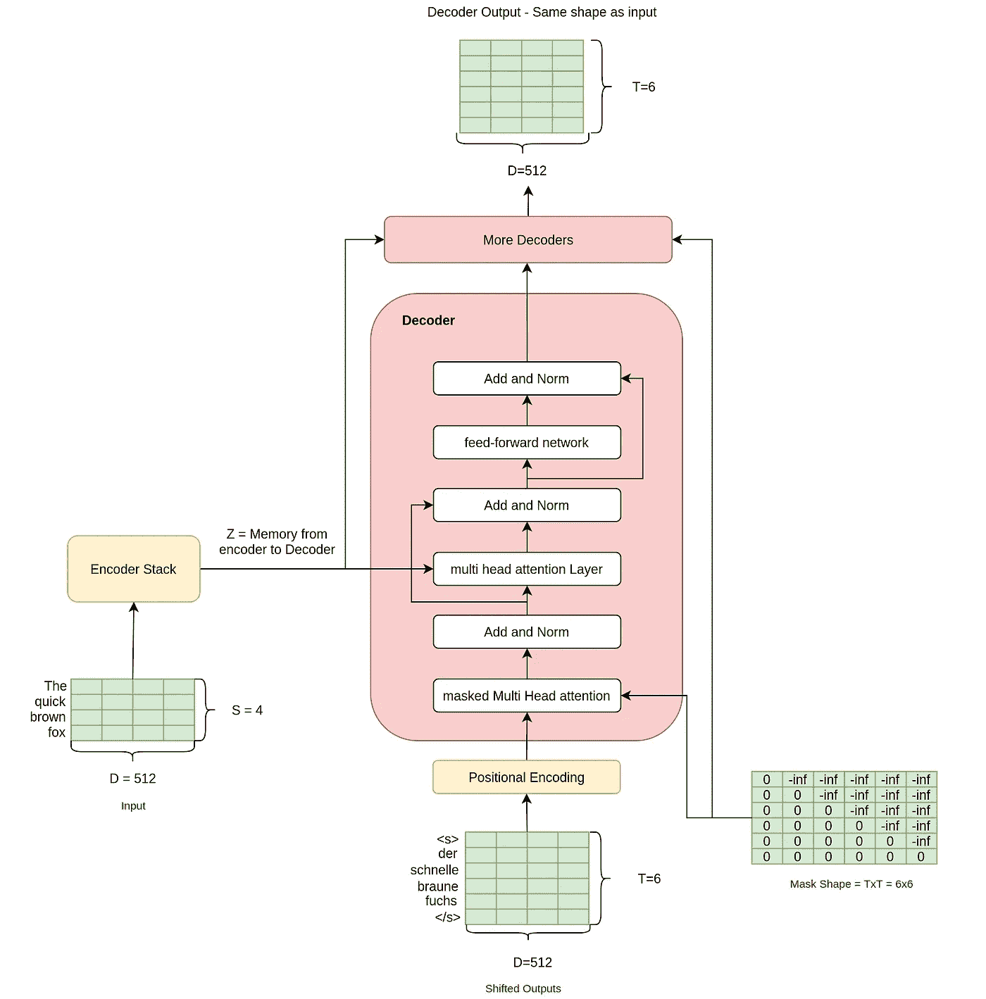

解码器架构(*图片作者*)

***问:等等，但是我看到我们需要的输出作为输入流入解码器了吗？什么？为什么？*😖**

我注意到你越来越擅长问问题了。这是一个很好的问题，也是我反复思考的问题，我希望当你看到这篇文章的结尾时，这个问题会变得更加清晰。

但是为了给出一个直觉，在这种情况下，我们可以将转换器看作一个条件语言模型。在给定输入单词和英语句子的情况下，预测下一个单词的模型，其预测以该单词为条件或基础。

这样的模型本质上是连续的，比如你如何训练这样的模型？你首先给出开始标记(`<s>`)，然后模型根据英语句子预测第一个单词。你可以根据预测是对还是错来改变权重。然后你给出起始令牌和第一个单词(`<s> der`)，模型预测第二个单词。你再次改变重量。诸如此类。

变形金刚解码器就是这样学习的，但美妙之处在于它不是以连续的方式学习的。它使用屏蔽来进行这种计算，从而在训练时获取整个输出句子(尽管通过在前面添加一个`<s>`标记来右移)。另外，请注意，在预测时，我们不会将输出提供给网络

***问:但是，这个屏蔽到底是怎么工作的呢？***

# a)屏蔽的多头自我关注层

它工作，像往常一样，你穿它我的意思是**😷**。玩笑归玩笑，正如你看到的，这次我们的解码器中有一个**屏蔽的**多头注意力层。这意味着，我们将以一种网络永远无法看到后续单词的方式来屏蔽我们的移位输出(即解码器的输入)，否则，它可以在训练时轻松复制该单词。

那么，在被掩蔽的注意力层中，掩蔽究竟是如何起作用的呢？如果你还记得的话，在注意力层中，我们将查询(Q)和键(K)相乘，然后在取 softmax 之前将它们除以 sqrt(d)。

然而，在掩蔽的注意层中，我们在 softmax(其将是 shape (TxT))之前将结果矩阵添加到掩蔽矩阵。

因此，在被遮罩的图层中，函数从:

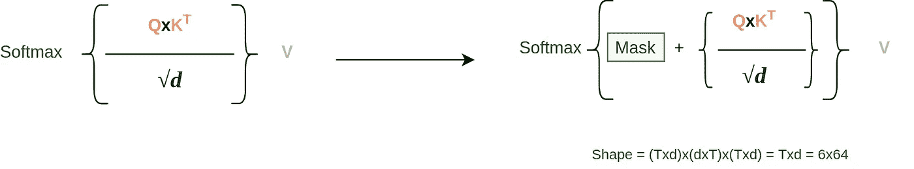

(*作者图片*)

问:我还是不明白，如果我们那样做，会发生什么？

这其实是可以理解的。让我一步一步来。因此，我们的 shape (TxT)的结果矩阵(QxK/sqrt(d))可能如下所示:(数字可能很大，因为 softmax 尚未应用)

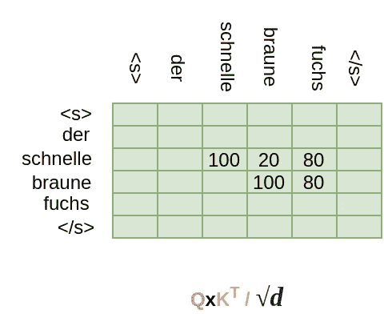

Schnelle 目前同时照顾 Braune 和 Fuchs

如果我们将上述矩阵的 softmax 与值矩阵 v 相乘，单词 Schnelle 现在将由 Braune 和 Fuchs 组成，但我们不希望如此，因此我们将掩码矩阵添加到其中，得到:

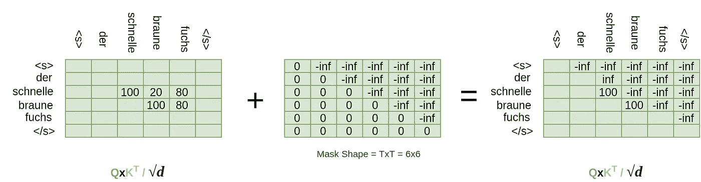

应用于矩阵的掩码操作。(*图片作者*)

那么，在我们完成 softmax 步骤后会发生什么呢？

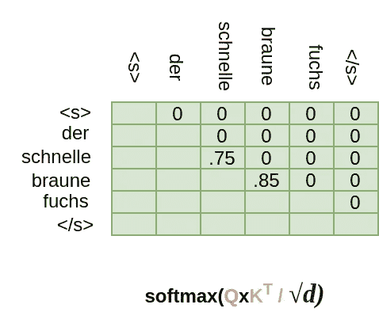

施奈尔从不注意施奈尔后面的任何一个词。(*作者图片*)

由于 e^{-inf} = 0，Schnelle 之后的所有位置都转换为 0。现在，如果我们将这个矩阵与值矩阵 V 相乘，对应于 Schnelle 在通过解码器的 Z 向量中的位置的向量将不会像我们想要的那样包含后续单词 Braune 和 Fuchs 的任何信息。

这就是转换器如何一次获得整个移位的输出句子，而不是以顺序的方式学习。我不得不说，非常整洁。

***问:你在开玩笑吗？这真是太棒了。***

很高兴你还和我在一起，你很感激。现在，回到解码器。解码器中的下一层是:

## b)多头关注层

正如您在解码器架构中看到的，一个 Z 向量(编码器的输出)从编码器流向解码器中的多头注意力层。来自最后一个编码器的这个 Z 输出有一个特殊的名字，通常称为内存。注意层将编码器输出和来自下面的数据流(移位输出)作为输入，并使用注意。查询向量 Q 由解码器中的数据流创建，而键(K)和值(V)向量来自编码器输出。

***问:这里没有面膜吗？***

不，这里没有面具。来自下面的输出已经被屏蔽，这允许解码器中的每个位置关注值向量中的所有位置。因此，对于要生成的每个单词位置，解码器都可以访问整个英语句子。

这是一个单独的注意力层(和之前一样，它将是多头的一部分):

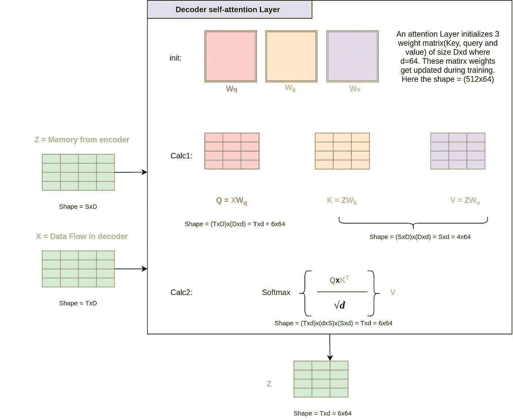

(*图片作者*)

***Q:但是这次 Q、K、V 的形状不会不一样吗？***

你可以看看我做了所有重量计算的图。我还想请你看看合成的 Z 向量的形状，以及我们的权重矩阵如何直到现在还没有在它们的任何维度中使用目标或源句子长度。通常，在我们所有的矩阵计算中，形状会相互抵消。例如，参见上面计算 2 中 S 维是如何抵消的。这就是为什么在训练期间选择批次时，作者谈论紧密批次。也就是说，在一批句子中，所有的源句子都有相似的长度。并且不同批次可以具有不同的源长度。

我现在将讨论跳过级连接和前馈层。它们实际上和……是一样的。

***问:好的，我明白了。我们有跳过级连接和 FF 层，并且在整个解码操作之后得到形状 TxD 的矩阵。* *但是德语翻译在哪里？***

# 3.输出头

我们现在真的很好，朋友。一旦我们完成了转换器，接下来的事情就是在解码器输出的顶部添加一个特定任务的输出头。这可以通过在顶部添加一些线性层和 softmax 来获得德语词汇中所有单词的概率*。我们可以这样做:*

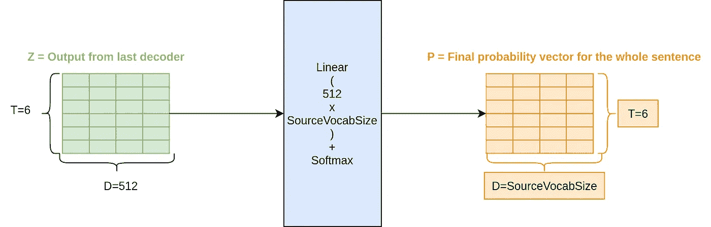

(*图片作者*)

如你所见，我们能够生成概率。到目前为止，我们知道如何通过这个变压器架构进行正向传递。让我们看看如何训练这样的神经网络结构。

# 培训:

到目前为止，如果我们鸟瞰一下这个结构，我们会发现:

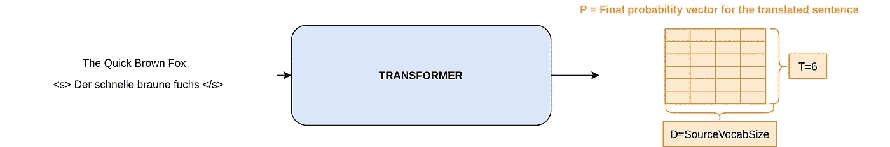

(*图片作者*)

我们可以给出一个英语句子和移位输出句子，向前传递，得到德语词汇的概率。因此，我们应该能够使用像交叉熵这样的损失函数，其中目标可以是我们想要的德语单词，并使用 Adam 优化器来训练神经网络。就像任何分类示例一样。这就是你的德语。

尽管在论文中，作者使用了优化器和损失的细微变化。如果您愿意，可以选择跳过以下两个关于 KL 偏差损失和 Adam 学习率计划的部分，因为这样做只是为了提高模型的性能，而不是变压器架构的固有部分。

***问:我来了这么长时间，有没有抱怨过？*😒**

好吧。好吧。我懂你的意思。那我们就这么做吧。

## a)标签平滑的 KL 散度:

KL 散度是当分布 P 由分布 Q 近似时发生的信息损失。当我们使用 KL 散度损失时，我们试图使用我们从模型中生成的概率(Q)来估计目标分布(P)。我们会尽量减少培训中的信息损失。

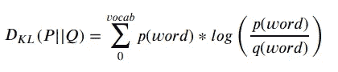

(*图片作者*)

如果你注意到，在这种形式中(没有我们将讨论的标签平滑),这与交叉熵完全相同。给定如下两个分布。

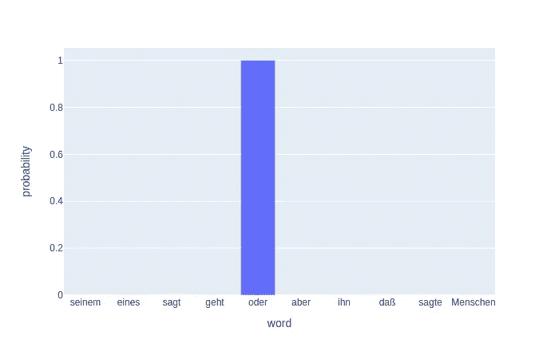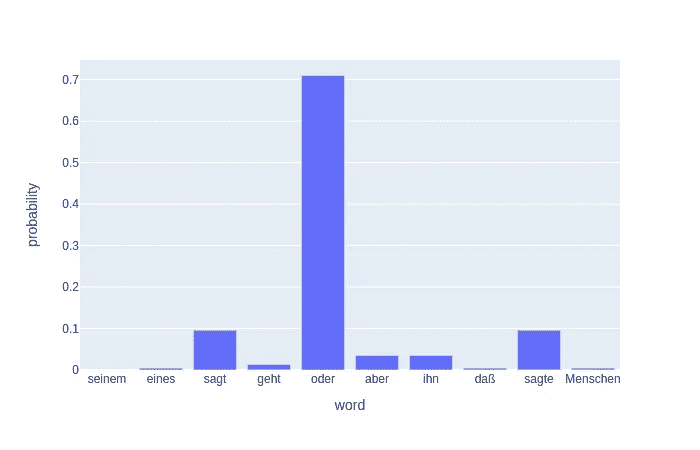

单词(令牌)的目标分布和概率分布

KL 散度公式给出了`-logq(oder)`,这就是交叉熵损失。

在本文中，尽管作者使用α = 0.1 的标记平滑，因此 KL 散度损失不是交叉熵。这意味着，在目标分布中，输出值由(1-α)代替，剩余的 0.1 分布在所有单词中。作者说这是因为模型不太自信。

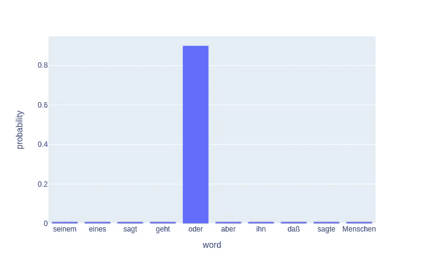

(*作者图片*)

***问:但是，为什么我们会让自己的模型不自信呢？这似乎很荒谬。***

是的，确实如此，但是直觉上，你可以把它想成当我们把目标作为 1 给我们的损失函数时，我们毫不怀疑真正的标签是真的，而其他的不是。但是词汇本来就是一个非标准化的目标。例如，谁说你不能用好来代替伟大？所以我们在标签中添加了一些混淆，这样我们的模型就不会太死板。

## b)使用 Adam 的特定学习率时间表

作者使用一个学习率计划程序来增加学习率，直到热身步骤，然后使用下面的函数来降低它。他们使用了 Adam 优化器，β = 0.9，β = 0.98。这里没什么太有趣的，只是一些学习选择。

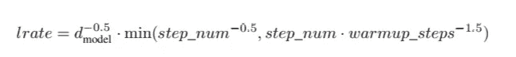

来源:[论文](https://arxiv.org/pdf/1706.03762.pdf)

问:等等，我刚想起来，在预测时间，我们不会有移位的输出，不是吗？那我们如何预测呢？

如果您意识到我们在这一点上拥有的是一个生成模型，我们将不得不以生成方式进行预测，因为我们在进行预测时不知道输出目标向量。所以预测仍然是连续的。

# 预测时间

使用变压器通过贪婪搜索进行预测(作者的*图片)*

该模型进行分段预测。在最初的论文中，他们使用波束搜索来做预测。但是出于解释的目的，贪婪的搜索也很好。在上面的例子中，我已经展示了贪婪搜索是如何工作的。贪婪搜索将从以下内容开始:

*   将整个英语句子作为编码器输入，仅将开始标记`<st>` 作为移位输出(解码器的输入)传递给模型，并进行正向传递。
*   该模型将预测下一个单词— `der`
*   然后，我们将整个英语句子作为编码器输入，并将最后预测的单词添加到移位后的输出(解码器的输入= `<st> der`)中，并进行正向传递。
*   该模型将预测下一个单词— `schnelle`
*   将整个英语句子作为编码器输入，将`<st> der schnelle`作为移位输出(解码器的输入)传递给模型，并进行正向传递。
*   依此类推，直到模型预测到结束标记`</s>`或者我们生成一些最大数量的标记(我们可以定义)，这样翻译就不会在任何中断的情况下无限期运行。

## **光束搜索:**

***问:现在我贪心了，也说说梁搜吧。***

好的，光束搜索的想法本质上和上面的想法非常相似。在 beam 搜索中，我们不仅查看生成的概率最高的单词，还查看前两个单词。

因此，举例来说，当我们给定整个英语句子作为编码器输入，而只给定起始标记作为移位输出时，我们得到两个最佳单词为`i` (p=0.6)和`der` (p=0.3)。我们现在将为两个输出序列生成输出模型，`<s> i`和`<s> der`，并查看生成的下一个顶部单词的概率。例如，如果`<s> i`给出下一个单词的概率为(p=0.05)，而`<s> der>`给出下一个预测单词的概率为(p=0.5)，那么我们丢弃序列`<s> i`并转而使用`<s> der`，因为句子的概率总和是最大的(`<s> der next_word_to_der` p = 0.3+0.5 与`<s> i next_word_to_i` p = 0.6+0.05 相比)。然后我们重复这个过程，得到概率最高的句子。

由于我们使用了顶部的两个字，所以对于这个波束搜索，波束大小是 2。在论文中，他们使用了大小为 4 的波束搜索。

**PS** :为了简洁起见，我展示了英文句子在每一步都通过，但实际上，编码器的输出被保存，在每一时间步只有移位后的输出通过解码器。

问:你还有什么忘记告诉我的吗？我会给你机会的。

是的。既然你问了。这是:

## BPE、重量共享和检查点

在论文中，作者使用字节对编码创建了一个通用的英语德语词汇。然后，他们在英语和德语嵌入和预 softmax 线性变换中使用共享权重，因为嵌入权重矩阵形状可以工作(Vocab 长度 X D)。

此外，作者平均最后 k 个检查点，以创建一个集合效果来达到性能*。*这是一种非常众所周知的技术，我们对模型的最后几个时期的权重进行平均，以创建一个类似于集合的新模型。

***问:可以给我看一些代码吗？***

这篇文章已经很长了，所以我会在下一篇[文章](https://mlwhiz.com/blog/2020/10/10/create-transformer-from-scratch/)中写。敬请关注。

现在，终于轮到我问问题了:你知道变压器是如何工作的吗？是，或者不是，可以在评论里回答。:)

# 参考

*   关注是你所需要的一切。
*   [带注释的转换器](https://nlp.seas.harvard.edu/2018/04/03/attention.html):这个有所有的代码。虽然我也会在下一篇文章中写一个简单的转换器。
*   [图解变形金刚](http://jalammar.github.io/illustrated-transformer/):这是变形金刚上最好的帖子之一。

在这篇文章中，我从面向细节、直观的角度介绍了 Transformer 架构是如何工作的。

如果你想了解更多关于 NLP 的知识，我想从高级机器学习专业化中调出一门关于 [**自然语言处理**](https://click.linksynergy.com/link?id=lVarvwc5BD0&offerid=467035.11503135394&type=2&murl=https%3A%2F%2Fwww.coursera.org%2Flearn%2Flanguage-processing) 的精品课程。一定要去看看。

我以后也会写更多这样的帖子。让我知道你对他们的看法。我应该写技术性很强的主题还是更初级的文章？评论区是你的朋友。使用它。还有，在 [**中**](https://medium.com/@rahul_agarwal) 关注我或者订阅我的 [**博客**](https://mlwhiz.ck.page/a9b8bda70c) 。

最后，一个小小的免责声明——这篇文章中可能会有一些相关资源的附属链接，因为分享知识从来都不是一个坏主意。

这个故事最初发表于 [**这里**](https://lionbridge.ai/articles/what-are-transformer-models-in-machine-learning/) 。