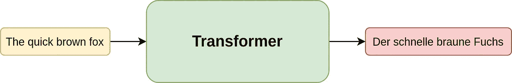
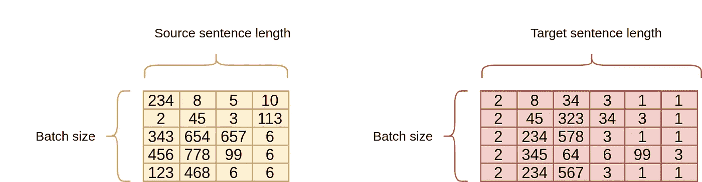
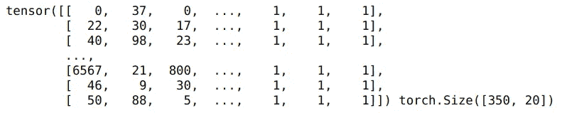
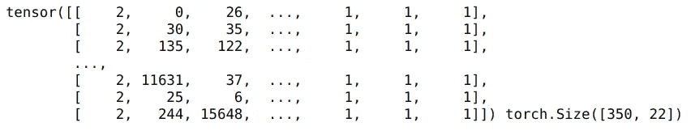
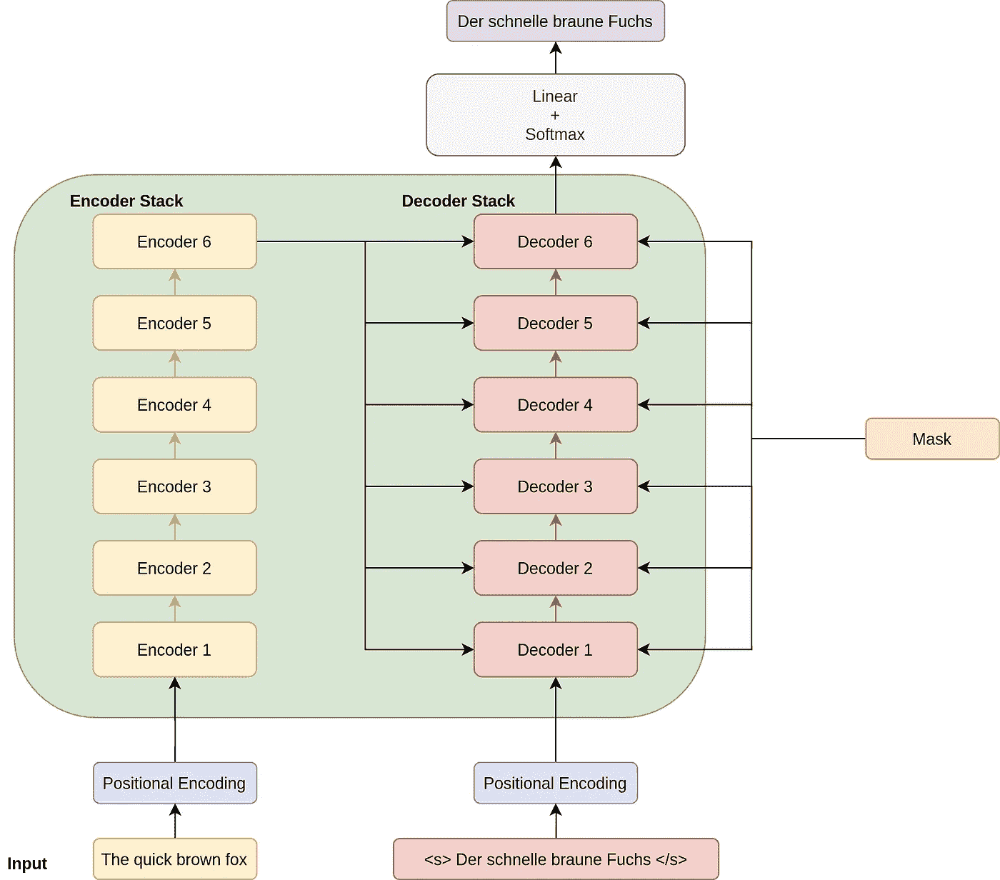
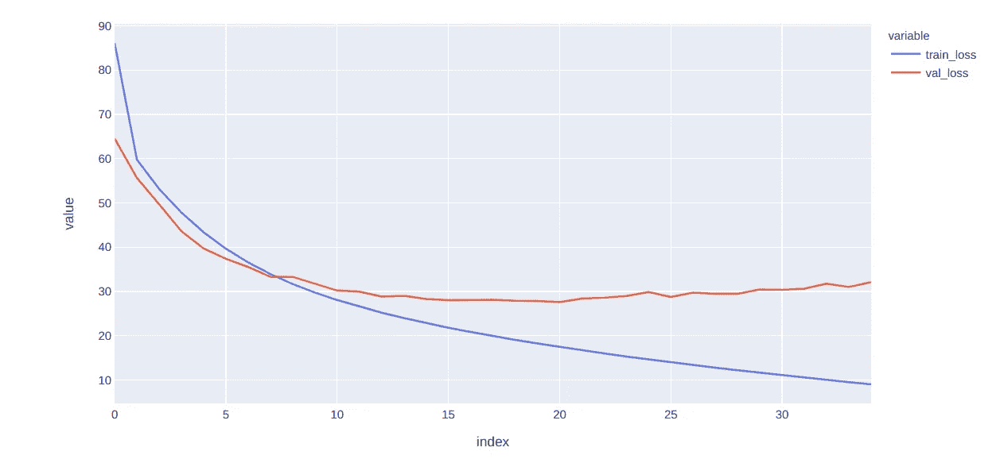

# 理解变压器，编程方式

> 原文：<https://towardsdatascience.com/understanding-transformers-the-programming-way-f8ed22d112b2?source=collection_archive---------19----------------------->


来源:[壁纸访问](https://wallpaperaccess.com/transformers)

## 因为你只能理解它，如果你能编程的话

如今，变形金刚已经成为 NLP 任务的事实标准。它们开始被用于自然语言处理，但现在被用于计算机视觉，有时也用于创作音乐。我相信你们都听说过 GPT3 变压器或其中的笑话。

***但抛开一切不谈，他们还是一如既往地难以理解。在我的[上一篇文章](/understanding-transformers-the-data-science-way-e4670a4ee076)中，我非常详细地谈到了变形金刚以及它们是如何在基本层面上工作的。我浏览了编码器和解码器架构，以及神经网络不同部分的整个数据流。***

但是正如我喜欢说的，在我们自己实施之前，我们并没有真正理解一些东西。所以在这篇文章中，我们将使用 Transformers 实现一个英语到德语的翻译器。

# 任务描述

我们想创建一个使用变压器将英语转换成德语的翻译器。因此，如果我们把它看作一个黑盒，我们的网络接受一个英语句子作为输入，并返回一个德语句子。



作者图片:用于翻译的转换器

# 数据预处理

为了训练我们的英德翻译模型，我们需要英语和德语之间的翻译句子对。

幸运的是，通过 IWSLT(国际口语翻译研讨会)数据集，我们有一个非常标准的方法来获取这些数据，我们可以使用`torchtext.datasets`来访问这些数据。这个机器翻译数据集是一种用于翻译任务的事实标准，包含不同语言的 TED 和 TEDx 演讲的翻译。

此外，在我们真正进入整个编码部分之前，让我们了解在训练时我们需要什么作为模型的输入和输出。我们实际上需要两个矩阵输入到我们的网络中:



作者图像:输入到网络

*   **源英文句子(Source):** 一个形状的矩阵(批量大小 x 源句子长度)。该矩阵中的数字对应于基于我们还需要创建的英语词汇的单词。例如，英语词汇中的 234 可能对应于单词“the”。还有，你有没有注意到很多句子都以一个单词结尾，这个单词在词汇中的索引是 6？这是怎么回事？因为所有句子的长度都不一样，所以会用一个索引为 6 的单词填充。所以，6 指的是`<blank>`令牌。
*   **移位的目标德语句子(Target):** 一个形状的矩阵(批量 x 目标句子长度)。这里，这个矩阵中的数字也对应于我们还需要创建的基于德语词汇的单词。如果你注意到这个特殊的矩阵似乎有一个模式。所有的句子都以一个在德语词汇中索引为 2 的单词开头，并且总是以一种模式结尾[3 和 0 或更多的 1]。这是有意为之的，因为我们希望以某个开始标记开始目标句子(so 2 代表`<s>`标记)，以某个结束标记(so 3 代表`</s>`标记)和一串空白标记(so 1 代表`<blank>`标记)结束目标句子。这一部分在我上一篇关于变形金刚的文章中有更详细的介绍，所以如果你对此感到困惑，我想请你看一看

现在我们知道了如何预处理数据，我们将进入预处理步骤的实际代码。

*请注意，如果您也使用其他方法进行预处理，这真的无关紧要。最终重要的是，最终，您需要以一种转换器可以使用的方式将句子源和目标发送到您的模型。即，源句子应该用空白标记填充，目标句子需要有开始标记、结束标记和由空白标记填充的剩余部分。*

我们首先加载 Spacy 模型，该模型提供了标记器来标记德语和英语文本。

```
# Load the Spacy Models
spacy_de = spacy.load('de')
spacy_en = spacy.load('en')def tokenize_de(text):
    return [tok.text for tok in spacy_de.tokenizer(text)]def tokenize_en(text):
    return [tok.text for tok in spacy_en.tokenizer(text)]
```

我们还定义了一些特殊的记号，我们将使用它们来指定空白/填充词，以及如上所述的句子的开头和结尾。

```
# Special Tokens
BOS_WORD = '<s>'
EOS_WORD = '</s>'
BLANK_WORD = "<blank>"
```

我们现在可以使用 torchtext 中的`data.field`为源句子和目标句子定义一个预处理管道。您可以注意到，虽然我们只指定了源句子的`pad_token`，但是我们提到了目标句子的`pad_token`、`init_token`和`eos_token`。我们还定义了使用哪些记号赋予器。

```
SRC = data.Field(tokenize=tokenize_en, pad_token=BLANK_WORD)
TGT = data.Field(tokenize=tokenize_de, init_token = BOS_WORD, 
                 eos_token = EOS_WORD, pad_token=BLANK_WORD)
```

如果你注意到现在我们还没有看到任何数据。我们现在使用来自`torchtext.datasets`的 IWSLT 数据来创建一个训练、验证和测试数据集。我们还使用`MAX_LEN`参数过滤我们的句子，这样我们的代码运行得更快。请注意，我们正在获取带有`.en`和`.de`扩展名的数据。我们使用`fields`参数指定预处理步骤。

```
MAX_LEN = 20
train, val, test = datasets.IWSLT.splits(
    exts=('.en', '.de'), fields=(SRC, TGT), 
    filter_pred=lambda x: len(vars(x)['src']) <= MAX_LEN 
    and len(vars(x)['trg']) <= MAX_LEN)
```

现在，我们已经获得了训练数据，让我们看看它是什么样子的:

```
for i, example in enumerate([(x.src,x.trg) for x in train[0:5]]):
    print(f"Example_{i}:{example}")---------------------------------------------------------------Example_0:(['David', 'Gallo', ':', 'This', 'is', 'Bill', 'Lange', '.', 'I', "'m", 'Dave', 'Gallo', '.'], ['David', 'Gallo', ':', 'Das', 'ist', 'Bill', 'Lange', '.', 'Ich', 'bin', 'Dave', 'Gallo', '.'])Example_1:(['And', 'we', "'re", 'going', 'to', 'tell', 'you', 'some', 'stories', 'from', 'the', 'sea', 'here', 'in', 'video', '.'], ['Wir', 'werden', 'Ihnen', 'einige', 'Geschichten', 'über', 'das', 'Meer', 'in', 'Videoform', 'erzählen', '.'])Example_2:(['And', 'the', 'problem', ',', 'I', 'think', ',', 'is', 'that', 'we', 'take', 'the', 'ocean', 'for', 'granted', '.'], ['Ich', 'denke', ',', 'das', 'Problem', 'ist', ',', 'dass', 'wir', 'das', 'Meer', 'für', 'zu', 'selbstverständlich', 'halten', '.'])Example_3:(['When', 'you', 'think', 'about', 'it', ',', 'the', 'oceans', 'are', '75', 'percent', 'of', 'the', 'planet', '.'], ['Wenn', 'man', 'darüber', 'nachdenkt', ',', 'machen', 'die', 'Ozeane', '75', '%', 'des', 'Planeten', 'aus', '.'])Example_4:(['Most', 'of', 'the', 'planet', 'is', 'ocean', 'water', '.'], ['Der', 'Großteil', 'der', 'Erde', 'ist', 'Meerwasser', '.'])
```

您可能会注意到，虽然`data.field`对象已经完成了标记化，但它还没有应用开始、结束和填充标记，这是有意的。这是因为我们还没有批处理，填充标记的数量本质上取决于特定批处理中句子的最大长度。

正如开始提到的，我们还通过使用`data.field`对象中的内置函数来创建源语言和目标语言词汇表。我们指定 MIN_FREQ 为 2，这样任何至少不出现两次的单词都不会成为我们词汇表的一部分。

```
MIN_FREQ = 2
SRC.build_vocab(train.src, min_freq=MIN_FREQ)
TGT.build_vocab(train.trg, min_freq=MIN_FREQ)
```

一旦我们完成了这些，我们就可以简单地使用`data.Bucketiterator`，它用于给出相似长度的批处理来得到我们的训练迭代器和验证迭代器。注意，我们使用 1 的`batch_size`作为验证数据。这样做是可选的，但这样做是为了在检查验证数据性能时不进行填充或进行最小填充。

```
BATCH_SIZE = 350# Create iterators to process text in batches of approx. the same length by sorting on sentence lengthstrain_iter = data.BucketIterator(train, batch_size=BATCH_SIZE, repeat=False, sort_key=lambda x: len(x.src))val_iter = data.BucketIterator(val, batch_size=1, repeat=False, sort_key=lambda x: len(x.src))
```

在我们继续之前，最好先看看我们的批处理是什么样子，以及我们在训练时作为输入发送给模型的是什么。

```
batch = next(iter(train_iter))
src_matrix = batch.src.T
print(src_matrix, src_matrix.size())
```

这是我们的源矩阵:



```
trg_matrix = batch.trg.T
print(trg_matrix, trg_matrix.size())
```

这是我们的目标矩阵:



所以在第一批中，`src_matrix`包含 350 个长度为 20 的句子，而`trg_matrix`是 350 个长度为 22 的句子。为了确保我们的预处理，让我们看看这些数字在`src_matrix`和`trg_matrix.`中代表什么

```
print(SRC.vocab.itos[1])
print(TGT.vocab.itos[2])
print(TGT.vocab.itos[1])
--------------------------------------------------------------------
<blank>
<s>
<blank>
```

果然不出所料。相反的方法，即字符串到索引也工作得很好。

```
print(TGT.vocab.stoi['</s>'])
--------------------------------------------------------------------
3
```

# 变形金刚



作者图片:应用程序架构

因此，现在我们有了一种将源句子和转换后的目标发送到转换器的方法，我们可以开始创建转换器了。

这里的很多积木都取自 Pytorch `nn`模块。事实上，Pytorch 也有一个 [Transformer](https://pytorch.org/docs/master/generated/torch.nn.Transformer.html) 模块，但它不包括论文中提到的许多功能，如嵌入层和位置编码层。所以这是一种更完整的实现，也从 pytorch 实现中吸取了很多东西。

我们特别使用 Pytorch nn 模块中的各种模块来创建我们的变压器:

*   [TransformerEncoderLayer](https://pytorch.org/docs/master/generated/torch.nn.TransformerEncoderLayer.html):单个编码器层
*   [TransformerEncoder](https://pytorch.org/docs/stable/generated/torch.nn.TransformerEncoder.html) :一堆`num_encoder_layers`层。在本文中，默认情况下保持为 6。
*   [TransformerDecoderLayer](https://pytorch.org/docs/stable/generated/torch.nn.TransformerDecoderLayer.html) :单个解码器层
*   [TransformerDecoder](https://pytorch.org/docs/stable/generated/torch.nn.TransformerDecoder.html) :一堆`num_decoder_layers`层。在本文中，默认情况下保持为 6。

此外，请注意，无论层中发生什么，实际上只是矩阵函数，正如我在变压器的解释帖子中提到的那样。请特别注意解码器堆栈如何从编码器获取内存作为输入。我们还创建了一个位置编码层，让我们将位置嵌入添加到单词嵌入中。

如果你愿意，你可以看看我已经链接的所有这些模块的源代码。我不得不多次亲自查看源代码，以确保我为这些层提供了正确的输入。

# 定义优化器和模型

现在，我们可以使用以下代码初始化转换器和优化器:

```
source_vocab_length = len(SRC.vocab)
target_vocab_length = len(TGT.vocab)model = MyTransformer(source_vocab_length=source_vocab_length,target_vocab_length=target_vocab_length)optim = torch.optim.Adam(model.parameters(), lr=0.0001, betas=(0.9, 0.98), eps=1e-9)model = model.cuda()
```

在论文中，作者使用了一个具有预定学习率的 Adam 优化器，但是这里我只是使用一个普通的 Adam 优化器来简化事情。

# 培训我们的翻译

现在，我们可以使用下面的训练函数来训练我们的变压器。我们在培训循环中必须做的是:

*   从批处理中获取 src_matrix 和 trg_matrix。
*   创建一个`src_mask` —这是告诉模型关于 src_matrix 数据中填充单词的掩码。
*   创建一个`trg_mask`——这样我们的模型就不能在任何时间点查看未来的后续目标单词。
*   从模型中获得预测。
*   使用交叉熵计算损失。(在论文中，他们使用了 KL 散度，但这也有助于理解)
*   反向投影。
*   我们保存基于验证损失的最佳模型。
*   我们还使用函数`greedy_decode_sentence`预测我们选择的一些句子在每个时期的模型输出，作为调试步骤。我们将在结果部分讨论这个函数。

我们现在可以使用以下工具进行培训:

```
train_losses,valid_losses = train(train_iter, val_iter, model, optim, 35)
```

以下是训练循环的输出(仅针对某些时期显示):

```
**Epoch [1/35] complete.** Train Loss: 86.092\. Val Loss: 64.514
Original Sentence: This is an example to check how our model is performing.
Translated Sentence:  Und die der der der der der der der der der der der der der der der der der der der der der der der**Epoch [2/35] complete.** Train Loss: 59.769\. Val Loss: 55.631
Original Sentence: This is an example to check how our model is performing.
Translated Sentence:  Das ist ein paar paar paar sehr , die das ist ein paar sehr Jahre . </s>.
.
.
.**Epoch [16/35] complete.** Train Loss: 21.791\. Val Loss: 28.000
Original Sentence: This is an example to check how our model is performing.
Translated Sentence:  Hier ist ein Beispiel , um zu prüfen , wie unser Modell aussieht . Das ist ein Modell . </s>.
.
.
.**Epoch [34/35] complete.** Train Loss: 9.492\. Val Loss: 31.005
Original Sentence: This is an example to check how our model is performing.
Translated Sentence:  Hier ist ein Beispiel , um prüfen zu überprüfen , wie unser Modell ist . Wir spielen . </s>**Epoch [35/35] complete.** Train Loss: 9.014\. Val Loss: 32.097
Original Sentence: This is an example to check how our model is performing.
Translated Sentence:  Hier ist ein Beispiel , um prüfen wie unser Modell ist . Wir spielen . </s>
```

我们可以看到我们的模型是如何从一个莫名其妙的翻译开始的——“然后在几次迭代结束时开始给我们一些东西。

# 结果

我们可以使用 Plotly express 绘制训练和验证损失。

```
import pandas as pd
import plotly.express as pxlosses = pd.DataFrame({'train_loss':train_losses,'val_loss':valid_losses})px.line(losses,y = ['train_loss','val_loss'])
```



作者图片:培训和验证损失

如果我们想要部署这个模型，我们可以简单地使用:

```
model.load_state_dict(torch.load(f”checkpoint_best_epoch.pt”))
```

并使用`greeedy_decode_sentence`函数对任何源句子进行预测，该函数为:


作者图片:使用变形金刚进行贪婪搜索预测

这个函数做分段预测。贪婪搜索将从以下内容开始:

*   将整个英语句子作为编码器输入，仅将开始标记`<s>` 作为移位输出(解码器的输入)传递给模型，并进行正向传递。
*   该模型将预测下一个单词——`der`
*   然后，我们将整个英语句子作为编码器输入，并将最后预测的单词添加到移位的输出(解码器的输入= `<s> der`)中，并进行正向传递。
*   该模型将预测下一个单词——`schnelle`
*   将整个英语句子作为编码器输入，将`<s> der schnelle`作为移位输出(解码器的输入)传递给模型，并进行正向传递。
*   依此类推，直到模型预测到结束标记`</s>`或者我们生成一些最大数量的标记(我们可以定义)，这样翻译就不会在任何中断的情况下无限期运行。

现在我们可以用这个来翻译任何句子:

```
sentence = "Isn't Natural language processing just awesome? Please do let me know in the comments."print(greeedy_decode_sentence(model,sentence))------------------------------------------------------------------Ist es nicht einfach toll ? Bitte lassen Sie mich gerne in den Kommentare kennen . </s>
```

由于我手头没有德语翻译，所以我将使用退而求其次的方法来查看我们的模型表现如何。让我们借助谷歌翻译服务来理解这个德语句子的意思。


作者图片:谷歌翻译结果

翻译中似乎有一些错误作为“自然语言处理”是没有的(讽刺？)但对我来说，这似乎是一个足够好的翻译，因为神经网络只需一个小时的训练就能理解这两种语言的结构。

# vorbehalte/verbes rungen(警告/改进)

如果我们按照报纸上的方法做每件事，我们可能会取得更好的结果:

*   全数据训练
*   字节对编码
*   学习率调度
*   KL 发散损失
*   光束搜索，和
*   检查点集合

我在我的[上一篇文章](/understanding-transformers-the-data-science-way-e4670a4ee076)中讨论了所有这些，所有这些都很容易实现。但是这个简单的实现是为了理解转换器是如何工作的，所以我没有包括所有这些内容，以免混淆读者。事实上，在变形金刚的基础上已经有了相当多的进步，让我们有了更好的翻译模型。我们将在接下来的文章中讨论这些进步以及它们是如何实现的，在这篇文章中，我将谈论 BERT，这是最受欢迎的 NLP 模型之一，其核心使用了转换器。

# 参考

*   [注意力是你所需要的一切](https://arxiv.org/abs/1706.03762)
*   [带注释的变压器](https://nlp.seas.harvard.edu/2018/04/03/attention.html)

在这篇文章中，我们使用 transformer 架构几乎从头开始创建了一个英语到德语的翻译网络。

为了更仔细地查看这篇文章的代码，请访问我的 [GitHub](https://github.com/MLWhiz/data_science_blogs/tree/master/transformers) 库，在那里你可以找到这篇文章以及我所有文章的代码。

如果你想了解更多关于 NLP 的知识，我想从高级机器学习专业化中调出一门关于 [**自然语言处理**](https://click.linksynergy.com/link?id=lVarvwc5BD0&offerid=467035.11503135394&type=2&murl=https%3A%2F%2Fwww.coursera.org%2Flearn%2Flanguage-processing) 的精品课程。一定要去看看。

我以后也会写更多这样的帖子。让我知道你对他们的看法。我应该写技术性很强的主题还是更初级的文章？评论区是你的朋友。使用它。还有，在 [**中**](https://medium.com/@rahul_agarwal) 关注我或者订阅我的 [**博客**](https://mlwhiz.ck.page/a9b8bda70c) 。

最后，一个小小的免责声明——这篇文章中有一些相关资源的附属链接，因为分享知识从来都不是一个坏主意。

这个故事最初发表于[这里](https://lionbridge.ai/articles/transformers-in-nlp-creating-a-translator-model-from-scratch/)。