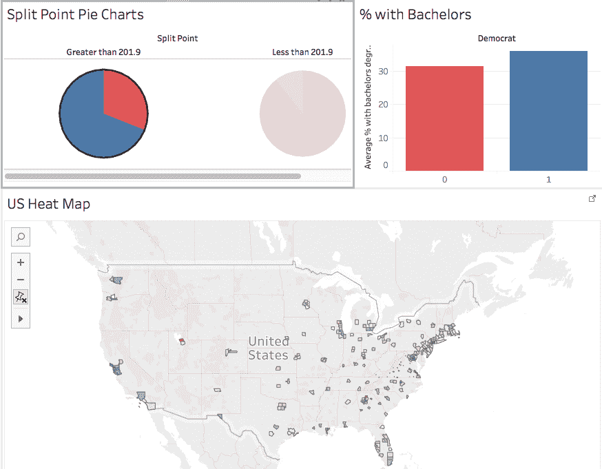

# 通过数据科学了解投票结果

> 原文：<https://towardsdatascience.com/understanding-voting-outcomes-through-data-science-5d257b51ae5c?source=collection_archive---------27----------------------->

[见互动数据即](https://kkehoe1985.github.io/2016_election_data_viz/)

在 2016 年总统选举的惊人结果之后，我想更好地理解在投票行为中起作用的社会经济和文化因素。随着选举结果的公布，我认为根据一些广泛可用的县级数据集反向工程一个投票行为的预测模型会很有趣。

最终的结果是一个 web 应用程序，让你上下拨动 10 个最有影响力的功能，并可视化你假设场景的县级投票结果:[2016 年总统选举的随机森林模型](https://kkehoe1985.github.io/2016_election_data_viz/):

 [## 2016 年总统选举的随机森林模型

### 请等到模型完成加载后再提交调整。上面的地图允许您构建…

kkehoe1985.github.io](https://kkehoe1985.github.io/2016_election_data_viz/) 

例如，如果你想回答问题*“如果全国范围内至少拥有学士学位的人的比例高出 2%，选举会有什么不同？”*您只需将该参数设置为 1.02，然后点击“提交”即可找到答案。

预测是由随机森林分类模型驱动的，该模型已针对 71 个不同的县级属性进行了调整和训练。使用真实数据，该模型的预测准确率为 94.6%，ROC AUC 得分为 96%。当您调整可调参数并点击“提交”时，模型会接收新数据并更新预测结果。

需要指出的是，上面的交互式可视化被描述为“假设的”比“预测的”更好。投票给民主党或共和党不是一个静态的分类；随着时间的推移，政党领导人和政纲会发生重大变化，因此同一模型不能用于预测多次选举过程中的投票结果。然而，在适当的背景下，该模型可以产生有价值的见解。通过理解选民*在不同情况下会如何对民主党和共和党 2016 年的政纲做出反应，我们可以更好地理解如何调整政纲以考虑未来 4 年的预计社会经济趋势。该工具旨在用于探索性数据分析，对其输出的解释更多的是一门艺术而不是科学。*

# 那么它是如何工作的呢？

我把它作为一个二元分类问题来处理；该模型需要预测每个县将投票给共和党还是民主党。为了创建一个预测模型，我需要一个强大的“解释性”数据集(社会经济和文化数据)和一个“响应”数据集(投票结果)。

这一过程的第一步是搜集大量关于教育、人口密度、收入、种族、性别、年龄和宗教的县级数据来源(参见[获取和清理美国县级数据源](https://github.com/kkehoe1985/ga_data_science_final_project/blob/master/Acquisition%20And%20Cleaning%20of%20U.S.%20County-level%20Data%20Sets.ipynb))。这需要在 Python 中进行数据清理和格式化，以及用加权平均值输入缺失值。

一旦数据被组合成一个单一的、干净的数据集，我就测试了许多监督学习技术，包括 k-最近邻、逻辑回归和随机森林分类。对于每一款车型，我都结合使用了[网格搜索](http://scikit-learn.org/stable/modules/grid_search.html)和[交叉验证](http://scikit-learn.org/stable/modules/cross_validation.html#cross-validation)技术，调整了必要的[超级参数](https://en.wikipedia.org/wiki/Hyperparameter_optimization):

*   [K-最近邻](https://github.com/kkehoe1985/ga_data_science_final_project/blob/master/KNN%20-%202016%20Election%20Predictions.ipynb)
*   [逻辑回归](https://github.com/kkehoe1985/ga_data_science_final_project/blob/master/Logistic%20Regression%20-%202016%20Election%20Predictions.ipynb)
*   [随机森林分类](https://github.com/kkehoe1985/ga_data_science_final_project/blob/master/RF%20-%202016%20Presidential%20Election%20Predictions.ipynb)

优化超参数后，我根据其预测准确性和 ROC AUC 评分评估了这些技术:

**随机森林分类**

*   ROC AUC 得分:96.1%
*   准确率:93.6%

**逻辑回归**

*   ROC AUC 得分:91.7%
*   准确率:89.4%

**K-最近邻**

*   ROC 曲线下面积分数:80.64%
*   准确率:87.4%

随机森林分类器对于这种分析是最准确的，因此是数据可视化中使用的模型。

# 决策树和随机森林

为了理解随机森林模型，我们首先需要理解决策树是如何工作的。决策树是由节点和分支组成的树状结构。每个节点可以被认为是对预测特征的测试。如果特征是定量的(在本练习中我们所有人都是如此)，那么将一个值设置为特征的分割点，高于该值的样本遵循一个分支，而低于该值的样本遵循另一个分支。在决策树分类器中，终端节点将导致对类别的预测。

在我们的例子中，特征和它们的分裂点是由它们的“基尼系数”值决定的。有关基尼系数的完整解释，请参见[决策树和基尼系数](https://www.youtube.com/watch?v=Zze7SKuz9QQ)，但简而言之，基尼系数是随机选择的子集成员被错误分类的概率(这可以被认为是“预期错误率”)。如果该值为 0，则表示该子集已被完全纯化；只有一个阶层的成员留下。在每一步，该树优先考虑其产生的子集产生基尼系数杂质最大减少的特征，称为“基尼系数”

单个决策树具有可解释的优点，但是为了净化样本数据，它通常会变得很大。这可能会产生一个与样本数据完美拟合的模型，但不能很好地推广到样本外数据(具有[低偏差/高方差](http://scott.fortmann-roe.com/docs/BiasVariance.html)的“过拟合”)。决策树也是“贪婪”的，因为它们在每个节点寻找局部最优决策(基于基尼系数)，但不考虑可能提供最有效路径的特征组合。

为了避开这些限制，我们可以使用一种叫做随机森林的[集成方法](http://scikit-learn.org/stable/modules/ensemble.html)，这种方法可以生成多个决策树。每棵树使用 [bootsrap 聚合](https://en.wikipedia.org/wiki/Bootstrap_aggregating)(“bagging”)来随机选择一个特性子集。允许树完全生长，无需修剪，并且仅基于为其选择的随机特征子集来评估树中的每个节点。重复该过程，直到树的森林已经生长，并且对于测试集中的每个数据点，随机森林模型将从所有决策树中取得多数投票。

# 我们学到了什么？

# 种族、教育、宗教和人口密度是预测投票结果的最重要的信号

为了对数据有所了解，一个很好的起点是构建一个随机森林，并可视化预测因子的特征重要性，这由特征的基尼系数决定。在这里，我们可以看到预测 2016 年总统选举政党赢家的十大特征:

由于这些是定量变量，每个特征都有一个分裂点，在这个分裂点上投票行为的差异是显著的。当我们检查每个特征的分割点时，我们看到以下内容:

*   2011 年至 2015 年拥有学士学位或更高学位的成人比例:29.95%
*   2011 年至 2015 年仅有高中文凭的成人比例:26.55%
*   每平方英里土地面积的住房密度:201.9
*   每平方英里土地面积的人口密度:483.7
*   人口:4 223 人

为了更好地可视化这些分割点的影响，检查分割点上方和下方的结果变量的分布会有所帮助。这里有一个使用人口密度的例子，你可以看到投票趋势在每平方英里 483 人以上和以下是相反的:

要检查其余功能，请参见下面的 Tableau 工作簿: [2016 选举分裂点仪表板](https://public.tableau.com/views/2016PresidentialElectionAnalysis-FeatureSplitPoints/SplitPointDash?:display_count=y&:origin=viz_share_link)。

# 美国南部投票结果的关键变量是人口的种族构成

如果美国白人的比例减少 25%，这个模型预测的美国南部可能是这样的:

**实际**

**假设的**

为了探索更多假设的场景，玩下面的网络应用程序，看看随机森林预测会发生什么:[2016 年美国总统选举的假设模型](https://kkehoe1985.github.io/2016_election_data_viz/)

# 描述性统计

即使不从我们的数据集创建模型，也可以从标准的探索性分析中获得一些见解:

# 在人口密度高的县，教育是投票结果的关键因素

人口密度在每平方英里 200 人以上的县倾向于投民主党的票。在那些投票给共和党的人中，拥有学士学位或更高学位的人口比例比民主党县低 12.5%(见[热图](https://public.tableau.com/views/2016PresidentialElectionAnalysis-SplitPointswithHeatMap/SplitPointDash?:display_count=y&:origin=viz_share_link)的分裂点):

# 人口老龄化的县投票率更高

共和党和民主党的平均年龄和投票率都呈正相关。然而，平均年龄是一个棘手的变量，因为它不排除低于投票年龄的人，这意味着年轻家庭数量多的县可能有更高的平均年龄选民，但整体平均年龄较低:

参见下面的 Tableau 仪表盘，探索解释变量之间的更多关系: [2016 年总统选举—数据探索](https://public.tableau.com/views/2016PresidentialElectionAnalysis/DataExploration?:display_count=y&:origin=viz_share_link)

# 投票率较高的县倾向于投共和党的票

关键的战场州，包括密歇根州、俄亥俄州和威斯康星州，整体选民投票率很高，但特别是来自共和党的选民:

# 投票率低的县投票给民主党

民主党倾向于在投票率最低的县赢得普选。在西南部人口稠密的县尤其如此。这更有可能发生在非战场县，因为选民参与度较低，可能认为结果是不可避免的:

# 自己探索

## 使用 [D3](https://d3js.org/) 和[烧瓶](http://flask.pocoo.org/)构建的交互式可视化

*   [2016 年美国总统大选随机森林模型](https://kkehoe1985.github.io/2016_election_data_viz/)
*   烧瓶后端:[2016 _ election _ data _ viz _ back _ end](https://github.com/kkehoe1985/2016_election_data_viz_back_end)
*   D3 前端: [2016_election_data_viz](https://github.com/kkehoe1985/2016_election_data_viz)

## 用于探索性分析的 Tableau 工作簿

*   [10 大特性的分割点](https://public.tableau.com/views/2016PresidentialElectionAnalysis-FeatureSplitPoints/SplitPointDash?:display_count=y&:origin=viz_share_link):在本工作簿中，您可以查看几个重要特性的分割点，并检查分割点上下的投票趋势
*   [用热点图分割点](https://public.tableau.com/views/2016PresidentialElectionAnalysis-SplitPointswithHeatMap/SplitPointDash?:display_count=y&:origin=viz_share_link):同上，但用美国的热点图代替直方图。可以通过单击饼图来过滤热图。
*   [按投票率统计的人口分布](https://public.tableau.com/views/2016PresidentialElectionAnalysis-PopulationDistributionbyVoterTurn-out/Populationdistributionbyvoterturnout?:display_count=y&:origin=viz_share_link):以柱状图显示按投票率统计的人口分布。直方图充当条形图的过滤器。
*   [解释变量之间的相互关系](https://public.tableau.com/views/2016PresidentialElectionAnalysis/DataExploration?:display_count=y&:origin=viz_share_link):该工作簿允许您选择 x 轴和 y 轴的变量，并基于前一工作簿中的分割点应用过滤器。这使得我们可以一次检查几个特征的相互作用。

## Jupyter 笔记本

*   [美国县级数据集的采集和清理](https://github.com/kkehoe1985/ga_data_science_final_project/blob/master/Acquisition%20And%20Cleaning%20of%20U.S.%20County-level%20Data%20Sets.ipynb)
*   [探索性数据分析— 2016 年总统选举](https://github.com/kkehoe1985/ga_data_science_final_project/blob/master/Exploratory%20Data%20Analysis%20-%202016%20Presidential%20Election.ipynb)
*   [使用 K 近邻为 2016 年美国总统选举建模](https://github.com/kkehoe1985/ga_data_science_final_project/blob/master/KNN%20-%202016%20Election%20Predictions.ipynb)
*   [逻辑回归——2016 年选举预测](https://github.com/kkehoe1985/ga_data_science_final_project/blob/master/Logistic%20Regression%20-%202016%20Election%20Predictions.ipynb)
*   [RF — 2016 年总统选举预测](https://github.com/kkehoe1985/ga_data_science_final_project/blob/master/RF%20-%202016%20Presidential%20Election%20Predictions.ipynb)