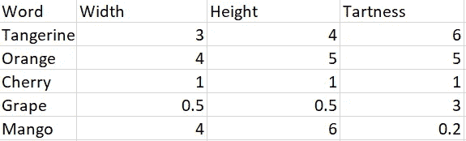
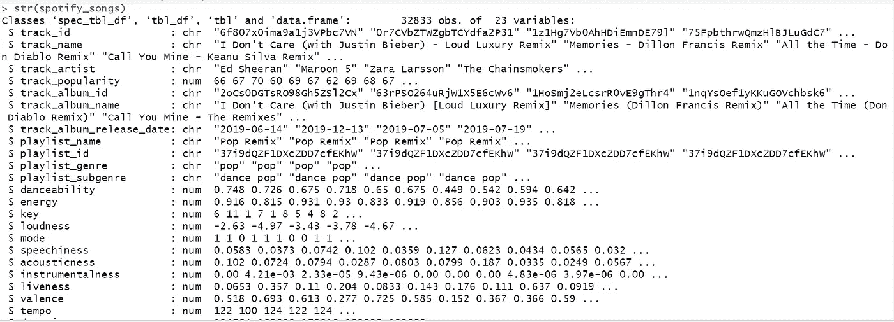
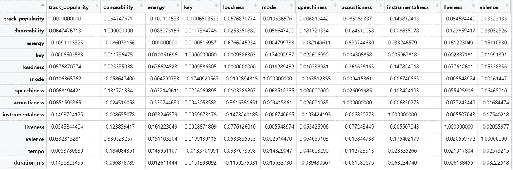
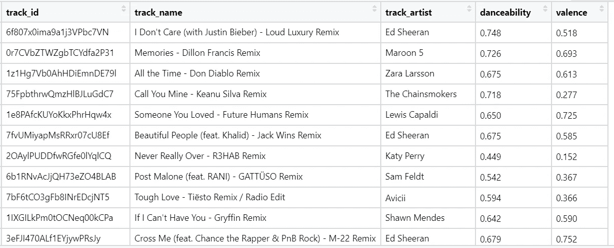
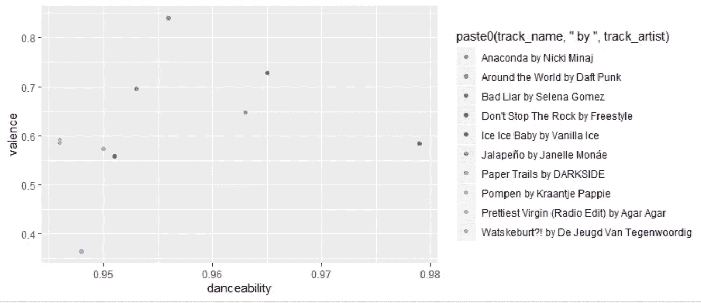
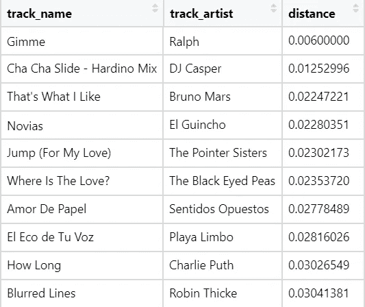
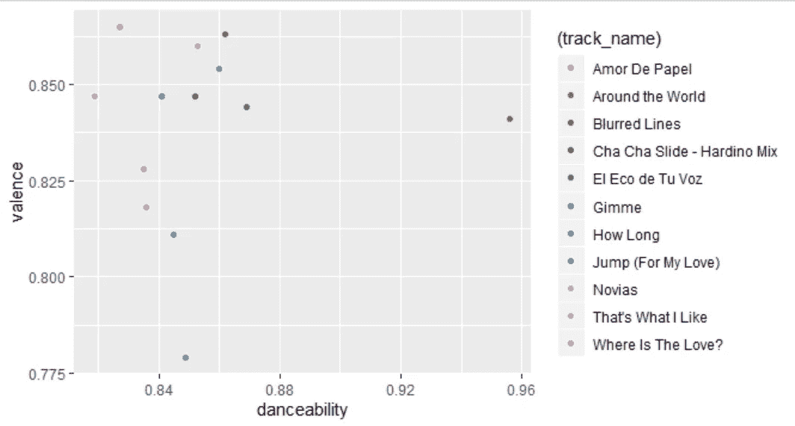
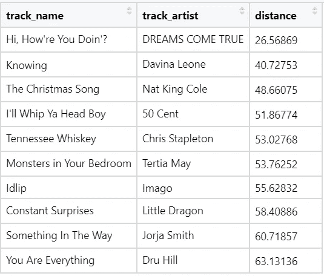

# 理解 Spotify 歌曲的词向量—第 1 部分

> 原文：<https://towardsdatascience.com/understanding-word-vectors-with-spotify-songs-part-1-7cc3e4a87c33?source=collection_archive---------57----------------------->


照片由 Natalie Cardona 在 Unsplash 上拍摄

## 开始用 Spotify 构建单词向量和一些有趣的数学东西。

假设你遇到两个向量，维数 A= {2，4}和 B={2，3}，你会怎么做？你可能会想象一个 2D 坐标空间，然后把它们画出来。

根据你对向量的了解，你可以得出这样的结论:这两个向量的大小和方向非常相似，它们之间的距离非常小。现在，假设你遇到两个词——“橘子”和“橙子”。你的大脑知道这两个词是水果，而且它们很相似(怎么相似？它们都有柑橘的味道和气味，它们都长在树上，它们看起来都是橙色的，等等)。

但我们谈论的是人脑。它理解语言，可以想象一个单词及其相关特征。因此，它可以得出逻辑结论，如“橙子和橘子有些相似”。现在，你如何训练一个算法来得出类似的结论？

单词矢量救援！单词向量是向量空间中表示该单词含义的一组数字。以水果为例，考虑一个简单的三维向量空间——宽度、高度和酸味。我们可以用这三个维度来表示任何水果的“意义”



你现在可以看到单词“tangerine”和“orange”在宽度、高度和辛辣程度上非常相似。将单词表示为一行数字或向量(对应于向量空间中的特定维度)使我们能够对它们进行各种有趣的计算，例如根据大小，哪种水果类似于樱桃，或者哪种水果介于橙子和芒果之间。这些向量和它们的维度捕捉了任何单词的“含义”，就像上面的例子一样。

如前所述，水果示例给出的单词向量和维度是标准单词向量的缩小/简化版本，例如 [GloVe](https://nlp.stanford.edu/projects/glove/) 或 [Word2vec](https://en.wikipedia.org/wiki/Word2vec) 。如何训练这些单词向量是我希望在本系列的第 2 部分讨论的内容。

关于水果已经说得够多了。让我们继续有趣的事情。给定一个以数字表示的歌曲及其属性(如能量、响度、可跳舞性)的数据集，让我们应用简单向量数学的概念来获得一些很酷的见解，并希望在此过程中发现一些新的音乐。

我从 [TidyTuesday 的](https://github.com/rfordatascience/tidytuesday) github 回购中提取了 Spotify 歌曲列表数据集(请查看他们的回购，获得一些非常非常酷的数据集)。

[https://raw . githubusercontent . com/rfordata science/tidytuesday/master/data/2020/2020-01-21/Spotify _ songs . CSV](https://raw.githubusercontent.com/rfordatascience/tidytuesday/master/data/2020/2020-01-21/spotify_songs.csv)

这个[链接](https://github.com/rfordatascience/tidytuesday/tree/master/data/2020/2020-01-21)拥有数据集的数据字典。这篇文章使用的代码可以在[这里](https://github.com/pawar30/spotifySongFinder)找到



让我们看看数字列之间的相关性。我对与“可舞性”正相关的专栏特别感兴趣，因为谁不喜欢好的舞曲呢:)



在所有列中,“化合价”列的相关性最高。让我们用 playlist_genre="pop "和列" danceability "和" valence "来划分歌曲的数据帧。这个数据帧的一个例子看起来像这样



这个数据帧类似于我们之前构建的水果数据帧。这里，可跳性和价是用来表示特定歌曲的两个维度(目前)。

绘制 10 首舞蹈性得分最高的歌曲给了我们



我们看到大多数曲目的可跳性值非常相似(范围从 0.95 到 0.98)，但我们看到沿着价维度，有相当多的差异。如果我们想根据歌曲的可跳性和价值找到与某首歌曲相似的歌曲，该怎么办？让我们看看能否在 Spotify 数据框架中找到与蠢朋克的《环游世界》最接近的歌曲。

```
#df - dataframe with track_name, track_artist and track_properties
#closest - character flag that determines whether to return songs 
#that match most/least
#song - string represeting the song being matched
#n - number of songs to return. Default value is 10
findSongs <- function(df,artist,closest,song,num=10){

  song.properties <- df[which(df$track_name==song & df$track_artist==artist),]$properties[[1]]
  if(closest=="N"){
    num = num
  }else{
    num= -num
  }
  dist.df <- df %>% mutate(distance = mapply(function(x, y){
    dist(rbind(x,y),method = "euclidean")
  }, properties, song.properties)) %>%
    top_n(num) %>%
    select(track_name,track_artist, distance) %>%
    arrange(distance) 

  dist.df
}closestMatches <- findSongs(popSongs_properties,artist="Daft Punk",closest="Y",song="Around the World")
closestMatches <- as.data.frame(closestMatches)
```

findSongs 函数获取歌曲的坐标，搜索数据帧，并根据欧几里德距离度量找到最接近的歌曲。对于“环游世界”，该函数返回



沿着可跳舞性和化合价维度绘制该图给出



好东西！！拉尔夫给我的似乎是最近的。我们可以看到，与之前的图相比，这些点是如何更紧密地聚集在一起的，以及化合价的变化减少了多少。

但是，请记住，这种相似性仅基于 2 个衡量标准/维度。您可以修改代码，更改尺寸以满足您的需要。想找高节奏的摇滚乐吗？子集输出 playlist_genre ="rock "以及列" instrumentalness "和" tempo "。选择是无穷无尽的，真的。说到无穷无尽，同一个 findSongs 函数可以用来匹配给定歌曲的所有数字属性(而不仅仅是可跳舞性和效价)，这就是单词 vector 最终要做的。

步骤是相同的——我们创建一个数据帧，该数据帧具有 track_name、track_artist 和一个“properties”列，该列表示一首歌曲的所有数字属性/特性组合成一个向量。让我们找出与西蒙和加芬克尔的《拳击手》相似的歌曲

```
closestMatchesAll <- findSongs(spotify_songs_properties,artist="Simon & Garfunkel",closest="Y",song="The Boxer")
closestMatchesAll <- as.data.frame(closestMatchesAll)
```

这给了



弹出的第一件事是距离列的比例与我们之前的距离度量相比大了多少。这是有意义的，因为列“速度”和“调”的比例比其他值大。

用数字表示单词的另一个很酷的功能是，你可以根据两个不同单词的欧几里得距离来计算它们之间的距离。在我们的 Spotify 世界里，

```
distance1 <- distanceBetween("Ironic - 2015 Remaster","Alanis Morissette","Hollaback Girl","Gwen Stefani",spotify_songs_properties)distance1
8.072921distance2 <- distanceBetween("Ironic - 2015 Remaster","Alanis Morissette","Ping Pong","Armin van Buuren",spotify_songs_properties)distance2
33.25089if(distance1 < distance2){
  print("Ironic by Alanis Morissette is more similar to Hollaback Girl by Gwen Stefani than it is to Ping Pong by Armin van Buuren")
}
```

在这里添加歌曲来获得新歌可能没有太大意义，但是像 [GloVe](https://nlp.stanford.edu/projects/glove/) 或 [Word2vec](https://en.wikipedia.org/wiki/Word2vec) 这样的词向量可以帮助你做到这一点。增加单词或减少单词可以给你一个新的向量，它非常接近向量空间中现有的单词。

这篇文章的灵感来自艾莉森·帕里什关于单词向量的文章[。](https://gist.github.com/aparrish/2f562e3737544cf29aaf1af30362f469)