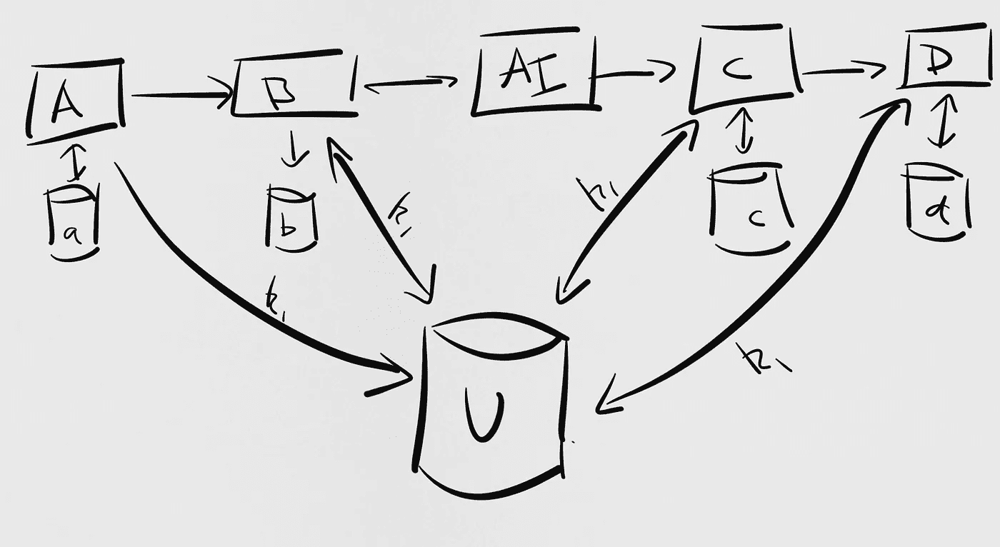
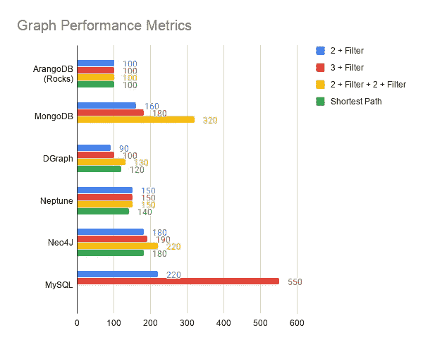
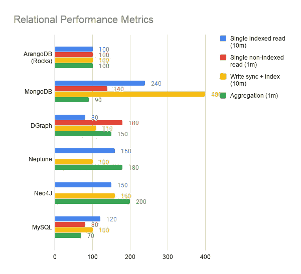

# MLOps 的统一元数据

> 原文：<https://towardsdatascience.com/unifying-metadata-for-mlops-9ba317f316c9?source=collection_archive---------50----------------------->

最近，我[写了关于](/removing-the-wall-in-ml-ops-44dac377b4c6?source=your_stories_page---------------------------)实现 MLOps 工作流的一些障碍。我现在将重点关注元数据，这是一个潜在障碍的例子，并说明统一研究人员和工程师之间的数据如何促进 MLOps 的采用。

正如 DevOps 运动得到了容器化、基础设施即代码和持续集成等工具的帮助一样，MLOps 将需要特定的工具来实现其广泛采用。我相信多模型数据库正在成为 MLOps 的重要工具之一，我将对 ArangoDB 进行评估。

# 为什么要分离数据？

思考各自团队的两个主要过程有助于我们准确理解为什么我们在这些系统中有数据分离。

## 研究团队

研究人员旨在利用大量带标签的数据，生成深度学习模型，这些模型现在是机器学习的同义词。这些数据需要尽可能接近业务用途，否则培训中的表现将与生产中的表现有很大不同。这意味着，从示意图的角度来看，训练集通常非常简单，通常利用单个或批量张量输入(无论是图像、数据值、音频……)以及模型在最佳条件下输出的一个或多个目标标签。

从数据的角度来看，输入和输出的简单性需要大量的数据来了解所需任务的复杂性。这通常是神经网络本身的工作，以确定导致输入和目标之间的联系的属性。

## 开发团队

运行业务应用程序或者将机器学习模型投入生产的团队通常对他们的数据有非常不同的要求。它们仍然具有相同的输入和输出类型，但是需要额外的属性，这些属性对于商业决策可能比机器学习输出本身更重要。同样，还涉及到其他流程，需要跟踪成本和客户需求，并且需要对系统有更深入的理解。这可以通过元数据来实现，通常在关系数据库中，位于服务、网站或系统之后。

# 人工验证

最近，公司已经在生产中使用机器学习和人工验证的结合，以获得实际上可以销售给客户的性能值。通常，机器学习本身不够准确，因此在结果发送给客户端之前，阈值被设置为发送给人工检查。

这些信息对于研究团队来说显然是有用的，可以提供进一步的标记数据，以及更早地检测数据偏移的能力，尤其是在生长阶段。这也允许团队检查来自 ML 解决方案的结果，以及其他业务过程，当与人类水平的结果比较时。通常，这些结果与生产数据库系统有关，这在研究人员和他们改进模型所需的数据之间建立了一堵墙。

## 统一数据库的要求

因此，为了统一这些数据，我们需要将训练深度学习模型所需的数据规模和业务应用所需的复杂性结合起来，并在生产服务(包括人工验证)和研究人员数据集之间建立简单的联系。

分离的数据库管道示例

在上图中，我们有许多不同的服务(A、B、C 和 D ),所有这些服务都通过管道推送元数据的公共键( *k1、k2* ),以便保留在以后阶段可能有用的信息。这意味着我们经常复制我们不需要的数据，只是简单地传递它，并且很难或不可能跨不同的数据库进行查询，这些数据库通常具有不同的格式、区域或体系结构。

通常，在上述架构中，很难通过工作流来跟踪资产或数据片段的过程，并从这种跟踪中获得洞察力。此外，研究人员很难将来自多个来源的信息组合成一个数据集，用于训练/微调现有模型。

# 解决办法

自 2010 年左右以来，多模型数据库越来越受欢迎，为传统关系数据库无法满足的复杂需求提供了一个良好的全面解决方案。Redis 就是一个例子，在扩展到文档(JSON)、属性图、流和时间序列数据之前，它最初提供一个键值存储。具体参考大规模计算机视觉任务，我最近测试了各种多模型数据库，因此将在本文的剩余部分集中讨论这些结果，但请注意，有几个[更多选项](https://en.wikipedia.org/wiki/Comparison_of_multi-model_databases)可用于不同的需求。

# 机器学习的 ArangoDB

ArangoDB 结合了文档存储和图形数据库，构建在 [RocksDB](https://rocksdb.org/) 之上，因此默认情况下也提供了键值存储。水平扩展是通过将连接的数据彼此移得更近来实现的，以尽可能避免昂贵的跨服务器查询。这使得该解决方案在大规模下非常有效，同时实现了文档存储和图形数据库的所有优势。

## 文档存储

生产系统通常使用文档存储来保存与其用途相关的数据，作为传统关系数据库的替代方案，在传统关系数据库中，每一行都可以有许多属性，通常只有几个索引或关联的属性。生产系统通常一次处理管道中单个对象的更新/插入，因此关系数据库和文档存储在这个用例中同样有效。

## GraphDB

图形数据库已经存在很长时间了，由于互联网的需求，它们的使用在 90 年代开始起飞。图在建模复杂的连接方面非常有效，在这种情况下，查询速度大大低于通常以关系格式进行的大量索引查找。这正是我们在 MLOps 中理解复杂数据格式所需要的，特别是那些通过多个系统，或者使用复杂 ML 管道的数据格式。

在 ArangoDB 中，文档存储在集合中。与任何文档存储一样，每个文档都由 _key 属性索引。然后，通过称为边缘集合的特殊类型的集合来添加图形功能，该集合索引 _from 和 _to 属性，引用同一数据库中的 collection/_key。这提供了上面两个团队给出的需求。

# 在实践中

统一存储管道示例

不像以前那样通过管道传递数据，我们可以创建一个统一的数据存储，在一个地方保存所有这些信息。然后，流程中的每个服务根据请求中传递的唯一标识符读取它需要的信息，然后将管道中稍后可能需要的更新写入统一存储。这既给了工程师一个整体系统的视角，也给了研究人员一个单一的数据库来创建数据集。

在多模型数据库出现之前，很难在一个解决方案中从两个角度利用这些信息。对于希望创建有趣的数据集来训练模型的研究人员来说，图形数据库技术使链接这些信息变得更快更容易。从他们的角度来看，人脉更重要。对于希望能够从性能指标方面理解和分析整个管道的工程师来说，元数据文档的唯一键允许在一个地方对其进行跟踪。从他们的角度来看，文档元数据和索引更重要。

# 表演

但是，它在这些任务中的表现如何呢？我们先把它比作一个图形数据库。在这个项目中，我主要是将 ArangoDB 与 DGraph 进行比较，因为 DGraph 似乎也满足了项目的许多伸缩性和复杂性需求。

以下摘自阿兰戈自己的性能页面，针对两个标准 graph db 性能指标:

来自 ArangoDB 的 2018 年绩效指标。

*注意:在我看来，忽略(ArangoDB MMFiles)指标是值得的，因为根据我的经验，我看不出你为什么不想使用 RocksDB，这是默认设置。我认为这些只是遗留下来的，因为这些是旧的图像。*

邻居的邻居+一个过滤器，计数不同。我还尝试了 2“跳”(即邻居的邻居)、3 和 4“跳)的测试，并在不同阶段添加了过滤器。

图表性能指标

现在让我们看看文档收集性能指标。一般来说，考虑到 ArangoDB 作为 GraphDB 的性能，您会认为它的性能相当差，但是上面显示了 ArangoDB 如何在读/写速度上大大优于 MongoDB，并且经常优于关系型竞争对手。聚合，据说是关系格式的优势之一，在 ArangoDB 上也有类似或更好的性能。

我的测试包括大型集合中的单一索引查找，以及写同步和聚合。

关系性能度量

正如您所看到的，这是一组令人印象深刻的结果，因为在这些标准关系测试中，ArangoDB 的表现几乎与 [MySQL](https://www.mysql.com/) (一个纯关系数据库)一样好，并且大大优于仅文档和图形存储。没有对其他关系格式进行比较，因为它们不能提供上面要求的全部功能，但是作为这些测试的一部分，与现有的 MySQL 实例进行比较对于基准测试是有用的。

# 缩放比例

正如我前面提到的，缩放一直是机器学习数据库中的一个问题。当数据通常是最重要的业务资产时，您必须确保您为存储数据而构建的解决方案在今年是正确的，并且根据预计的规模在接下来的几年是正确的。随着业务(希望数据)呈指数级增长，重复替换解决方案是一个成本高昂的过程，这也会影响构建解决方案的工程师以及必须不断构建新工具的研究人员的士气。

# 考虑

当考虑一个数据库解决方案时，一定要确保你已经考虑到了没有大规模测试潜在产品或解决方案的机会成本。同时，现实一点。未来 2 年内达到该规模的实际概率有多大？如果它相当低，那么最好考虑一个更容易用于当前规模的解决方案，而不是使用不适合当前业务规模的工具。这是一个困难的平衡行为，每个商业案例都不一样，所以要注意选择，要有测试和数据来支持你的决策。

# 结论

ArangoDB 显然是基于机器学习的管道背后的单一统一数据存储的最佳选择。多模型方法允许具有完全不同的需求和观点的用户使用和共享信息和知识库，试图将这些分离的团队聚集在一起。

从机器学习的角度来看，选择 ArangoDB 而不是其他选项的主要原因是不同团队复杂需求的易用性。ArangoDB 必须在多个用例中表现得令人难以置信的好，才能让我相信它是正确的选择，但它做到了这一点，并给出了一个我认为比任何其他选项都更好地涵盖了各种用例的解决方案。

我认为，多模型数据库在未来几年将对复杂和分散的数据集起到至关重要的作用，这是真正广泛采用 MLOps 所需要的。如果这将是一个广泛采用的工具，那么满足业务所有部分的需求并使每个团队能够实现其目标的功能将是成功的关键，同时也将开始弥合团队之间的差距并打破阻止 MLOps 的壁垒。