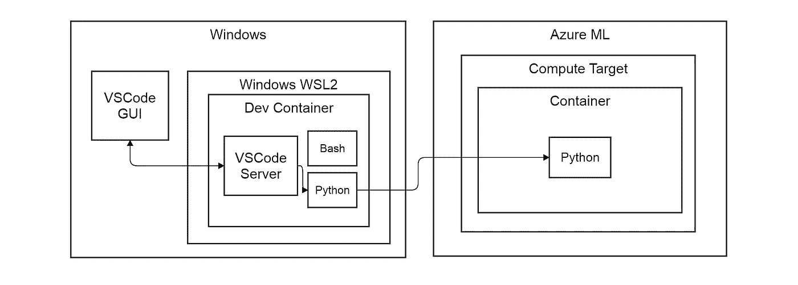

# 统一远程和本地 AzureML 环境

> 原文：<https://towardsdatascience.com/unifying-remote-and-local-azureml-environments-bcea1292e37f?source=collection_archive---------40----------------------->

## 微软和 Python 机器学习:现代爱情故事，第 2 部分，共 2 部分

微软 Azure 正在征服我们作为人工智能从业者的心，并通过对 PyTorch、Tensorflow 和 Scikit-learn 等开源框架的支持来吸引我们。在这里，我们围绕 MS 给我们的工具建立了一个工作流程，由我们来决定我们是否受到诱惑。在[第 1 部分](/vscode-devcontainers-and-the-python-azureml-sdk-323dec18a675)中，我们在我们的 AzureML 远程计算目标上启动了一个 Python 脚本，而我们的 VSCode devcontainer 对此毫不在意。这也意味着远程环境的大部分配置不在我们的掌控之中。这里我们将深入 AzureML 环境来配置 PyTorch GPU 工作负载。最后，我们努力统一开发和远程环境，使我们在 AzureML 上更有效地开发和测试 AI 模型。

# 1 计算目标环境

# 1.1 Docker 图像管理

在下图中，我们看到 Python 工作负载在计算目标上的远程 docker 容器中运行。如果我们创建一个 CPU 集群，并且除了指向计算目标的 RunConfiguration 之外没有指定任何东西(参见[第 1 部分](/vscode-devcontainers-and-the-python-azureml-sdk-323dec18a675)，那么 AzureML 将在第一次运行时选择一个 CPU 基础 docker 映像([https://github.com/Azure/AzureML-Containers](https://github.com/Azure/AzureML-Containers))。

在基础映像之上，创建了 conda 环境，并安装了默认的 python 依赖项，以创建支持 AzureML-SDK 的 Python 运行时。在构建映像之后，它被推送到链接到 AzureML 工作空间的 docker 存储库，其名称中有一个随机的 UUID(模式:azureml/azureml_ <uuid>)。在代码运行期间，计算实例将提取自定义图像。如果环境配置发生变化，运行开始时会触发重建。请注意，这些图像不是垃圾收集的，随着存储更多的图像，您的成本会增加。</uuid>



使用 VSCode devcontainer 的 Azure-ml 工作流(图片由作者提供)

# 1.2 环境等级

Environment 类是各种配置环境变量、编程语言、计算框架和 Docker 的类的组合。该环境由 Docker、Python、R 和 Spark 部分组成。例如，PythonSection 公开了多种方法来从现有的 conda 环境、conda 规范文件、pip 需求文件或以编程方式添加的依赖项创建 Python 环境。AzureML 环境可以注册到工作区供以后使用。目标是用 azure ml([how-to-environments](https://docs.microsoft.com/en-us/azure/machine-learning/how-to-use-environments))创建可重用的培训和部署环境。在我们的 DIY MLOps 中，这将类似于压缩你的整个 conda virtualenv，并将其上传到 artifactory 以供以后部署。Python SDK 中 MLOps API 的细节令人印象深刻，它们最近向环境驱动配置的转变为用户提供了透明性和灵活性。

# 2 使用 AzureML 在 GPU 上训练 PyTorch

在接下来的章节中，我们将使用 PyTorch 创建一个适合 GPU 计算的运行时环境。我们参考[第 1 部分](/vscode-devcontainers-and-the-python-azureml-sdk-323dec18a675)来创建计算集群。与第 1 部分的唯一变化是，我们使用“NC6_standard”虚拟机大小来获得一个带有一个 GPU 的虚拟机。选择一个带有 GPU 的虚拟机运行我们的带有 [nvidea_docker](https://github.com/NVIDIA/nvidia-docker) 的容器，而不是标准的 docker 引擎。这种自动检测相当新，我发现它是针对单个计算实例的( [msdn-post](https://social.msdn.microsoft.com/Forums/azure/en-US/4b52d8b9-e110-4ae7-8212-da75058a5c10/azure-ml-pipeline-estimator-gpu-support-broken?forum=AzureMachineLearningService) )。对于计算集群，GPU 自动检测运行良好。

# 2.1 使用 GPU 支持创建运行时 PyTorch 环境

出于我们的目的，我们在 Python 3.6 上运行 PyTorch >=1.4.0 和 Cuda 10.1。作为我们的基本 docker 映像，我们采用官方 AzureML 映像，基于 Ubuntu 18.04 ( [gpu-images](https://github.com/Azure/AzureML-Containers/tree/master/base/gpu) )，包含原生 gpu 库和其他框架。

为了在我们的远程 Conda 环境中管理 Python 包，我们操作一个 CondaDependencies 对象，并将其附加到我们的环境对象。我们在这个对象上调用“add_conda_package ”,它有一个包名和可选的版本和内部版本。在 PyTorch 的例子中，我们需要一个特定的构建来启用 GPU 后端。我们还需要添加“py torch”conda 通道和“add_channel”来安装这些包。虽然您可能更喜欢使用 conda 或 pip 需求文件，但我喜欢这种依赖管理的编程方法。

```
**# settings.py
from** **azureml.core** **import** Environment
**from** **azureml.core.conda_dependencies** **import** CondaDependenciesPYTORCH_VERSION = "1.4.0"
TORCH_ENVIRONMENT = Environment(name="torch-env")
TORCH_ENVIRONMENT.docker.base_image = (
    "mcr.microsoft.com/azureml/base-gpu:openmpi3.1.2-cuda10.1-cudnn7-ubuntu18.04"
)
TORCH_ENVIRONMENT.docker.enabled = **True**  *# forced to True on AMLcompute targets* TORCH_ENVIRONMENT.docker.gpu_support = **True**  *# deprecated as it is auto-detected* torch_conda_dep = CondaDependencies()
torch_conda_dep.add_channel("pytorch")
torch_conda_dep.add_conda_package(
    f"pytorch==**{**PYTORCH_VERSION**}**=py3.6_cuda10.1.243_cudnn7.6.3_0"
)
torch_conda_dep.add_conda_package("cudatoolkit==10.1.243")# add the conda dependencies to the environment
TORCH_ENVIRONMENT.python.conda_dependencies = torch_conda_dep
```

# 2.2 在环境中训练评估员

## 2.2.1 评估者类别

为了训练我们的 PyTorch 模型，我们使用了[估计器类](https://docs.microsoft.com/en-us/python/api/azureml-train-core/azureml.train.estimator.estimator)，它是机器学习模型的 AzureML 抽象。估计器可以提交给 AzureML 实验，该实验在计算目标上运行它。请注意，自 2019–2020 年起，PyTorch、Tensorflow 和 SKLearn 的预配置估值器已被弃用。这些对于配置运行时环境来说太含蓄了，这使得它们不灵活，难以维护，并且对用户来说很神奇。建议所有新用户将 vanilla Estimator 类与 Environment 类结合使用。

## 2.2.2 将评估者提交给实验

我们创建一个评估器，并把它传递给我们之前定义的环境。使用[第 1 部分](/vscode-devcontainers-and-the-python-azureml-sdk-323dec18a675)中所示的功能检索计算目标。我们创建(或检索)一个名为“estimator-test”的实验，并向它提交我们的评估器进行运行。

```
**from** **azureml.core** **import** Experiment, Workspace
**from** **azureml.train.estimator** **import** Estimator**import** **settings
from** **tools** **import** get_computeworkspace = Workspace.from_config()
script_params = {
     "--epochs": 10,
}
estimator = Estimator(
    source_directory=settings.SOURCE_DIRECTORY,
    compute_target=get_compute(workspace, settings.CLUSTER_NAME),
    entry_script="relative/path/to/train_model.py",
    script_param=script_params,
    environment_definition=settings.TORCH_ENVIRONMENT,
)
experiment = Experiment(workspace=workspace, name="estimator-test")
run = experiment.submit(estimator)
```

# 3 .本地开发与远程培训相结合

在我们的工作流程中，Docker 容器同时在本地和远程运行。Docker 的承诺之一是统一开发和生产之间的运行时环境。按照这些思路，我们希望针对远程环境在本地调试我们的训练代码。换句话说，我们希望使用相同的 Docker 映像进行本地开发和模型的远程训练。


弗朗切斯科·温加罗摄影

# 3.1 基于 AzureML 生成的图像的 VScode devcontainer

VSCode devcontainer 需要两个文件；一个 Dockerfile 和一个 devcontainer.json。devcontainer/"文件夹。Dockerfile 描述了我们的 Docker 映像，我们从它构造一个容器。devcontainer.json 文件特定于 VSCode，并配置与 Docker 容器的集成，如 Python 解释器路径、林挺可执行文件路径、VSCode 扩展和绑定挂载。

## 3.1.1 从 AzureML 映像派生的 Dockerfile

在我们的 Dockerfile(见下文)中，我们继承了 AzureML ContainerRepository 中的基本映像。我们可以通过用我们的 AzureML docker 注册中心对我们的本地 Docker 进行认证，在本地获取 AzureML 构建的 Docker 映像，并将其推送到我们的工作区。VSCode 的 docker 和 azure 帐户扩展可以简化这种身份验证和拉取。

我们希望在容器中安装 Python dev 依赖项，如 black、pylint 和 pytest。我们将它们安装在 AzureML 用来运行代码的同一个 Python 环境中，尽管也可以有其他选择。AzureML 生成的 Conda 环境位于映像上的“/azureml-envs/”中。Conda env 的名称包含另一个随机 UUID，其模式为:“azureml_ <uuid>”。在我们的 docker 文件中，我们使用与这个 env 相关联的 pip 来安装我们的 Python dev 依赖项，我们使用 apt-get 来安装 vim 和 git，同时确保在这些操作之后进行清理。</uuid>

```
FROM <DOCKER_LOGIN_SERVER>.azurecr.io/azureml/azureml_<UUID>:latest
LABEL maintainer="luuk@codebeez.nl"ARG DEFAULT_UTILS="\
  pylint \
  flake8 \
  autopep8 \
  pytest \
  mypy \
  pydocstyle"RUN /azureml-envs/azureml_<UUID>/bin/pip install --no-cache-dir ${DEFAULT_UTILS} \
  && apt-get update \
  && apt-get install -y \
  vim \
  git \
  && apt-get autoremove -y \
  && apt-get clean -y \
  && rm -rf /var/lib/apt/lists/*
```

## 3.1.2 将 VSCode 与容器集成

json 定义了 VSCode 和 Docker 容器之间的集成。我们为 devcontainer 定义一个名称，后跟 Dockerfile 的路径(您也可以直接设置一个图像)。接下来是 VSCode 设置，带有我们的 Python 解释器和各种 devtools 的路径。我们完成了我们想要安装在 devcontainer 中的 VSCode 扩展。

```
{
  "name": "unified-azureml",
  "dockerFile": "Dockerfile",
  // Set container specific VSCode settings
  "settings": {
    "terminal.integrated.shell.linux": "/bin/bash",
    "python.pythonPath": "/azureml-envs/azureml_<UUID>/bin/python",
    "python.linting.enabled": true,
    "python.linting.pylintEnabled": true,
    "python.linting.flake8Path": "/azureml-envs/azureml_<UUID>/bin flake8",
    "python.linting.pycodestylePath": "/azureml-envs/azureml_<UUID>/bin pycodestyle",
    "python.linting.pydocstylePath": "/azureml-envs/azureml_<UUID>/bin pydocstyle",
    "python.linting.pylintPath": "/azureml-envs/azureml_<UUID>/bin pylint",
    "python.testing.pytestPath": "/azureml-envs/azureml_<UUID>/bin pytest"
  },
  // Add the VSCode extensions you want installed
  "extensions": [
    "ms-python.python",
    "ms-azure-devops.azure-pipelines",
  ],
}
```

## 3.1.3 自动化的潜在断点

当在基础映像之上以 Docker 存储库的名义创建 Conda env 时，AzureML 生成的两个随机 UUIDs 是在我们的 AzureML 环境的迭代中自动化该工作流的潜在突破点。AzureML 生成的 docker 库的名称可以在 [AzureML studio](https://ml.azure.com) 中运行的实验的“20_image_build_log.txt”日志文件中找到，可以在 portal.azure.com 上与 AzureML 工作区关联的 Docker 注册表的接口中找到，也可以通过使用其 API 找到。通过运行以下命令，可以获得映像中的 Conda 环境列表。

```
docker run <DOCKER_LOGIN_SERVER>.azurecr.io/azureml/azureml_<UUID> /bin/bash -c "conda env list"
```

# 3.2 摘要:AzureML 统一的工作流

使用 AzureML 环境类，我们基于支持 GPU 的 docker 映像定义了远程计算目标的运行时配置。这个环境被 AzureML 整合为一个定制的 docker 映像，并被推送到 docker 注册中心。我们使用这个定制映像来创建一个 VSCode devcontainer，以统一我们的开发和远程环境。这允许我们在本地测试远程运行的相同环境。感谢您的关注，我期待着写更多与 Python、机器学习和数据工程相关的话题。

*最初发布于*[*https://codebeez . nl*](https://codebeez.nl/blogs/azureml-pytorch-gpu-enabled-compute-target-unifying-remote-and-local-environments/)*。*