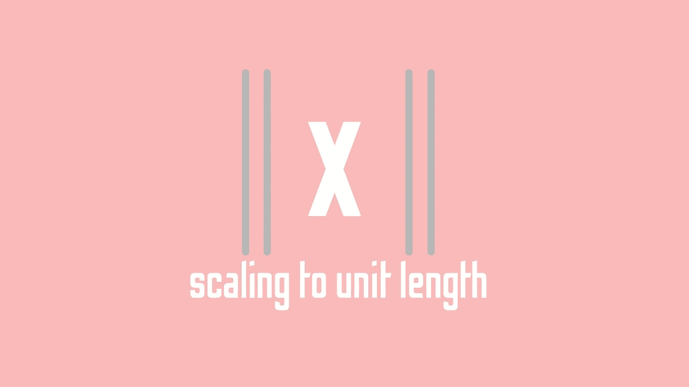

# 单位长度缩放:连续特征缩放的终极？

> 原文：<https://towardsdatascience.com/unit-length-scaling-the-ultimate-in-continuous-feature-scaling-c5db0b0dab57?source=collection_archive---------63----------------------->

## 奇妙的单位长度缩放会超越其他形式的缩放并在机器学习中取代它们吗？



当处理连续目标时，工程师可以使用很多很好的方法来提高训练精度。一些最受欢迎的选项包括限制数据以避免处理可能影响预测的异常值，或者移除在预测目标时不一致的不良特征。然而，在解决连续问题时，提高训练准确性的最常见、最简单的方法是首先缩放用于训练模型的特征。这是因为扩展特性带来的好处是开销很小，而且非常容易实现。通过简单地权衡这样做的好处，很容易理解为什么这么多人选择利用特征缩放器来解决他们的持续问题:

*   缩放器相对容易实现。
*   根据不同的数据和模型，你会发现使用一个定标器就能显著提高精度。
*   缩放器有助于使数据集中的值彼此更接近，消除异常值，并使数据更容易为您的模型读取。
*   可以将缩放器放入管线中，管线会自动为您缩放输入要素。

通常，每当我们讨论连续定标器时，我们都在讨论使用正态分布。也称为标准缩放器，这是一种相对简单而有效的生成简化数据的方法，通过公式传递样本，统计人员可以更好地理解这些数据。虽然标准定标器肯定是机器学习中使用最多的，但重要的是不要忘记，有几种不同的定标器在统计世界中都有它们的位置。缩放器列表中的其他缩放器包括任意缩放器和平均归一化缩放器。虽然这些都是缩放器的很好的例子，但它们通常不用于提高机器学习模型的准确性。

有这么多优秀的预处理方法、编码器和各种图像处理选项，几乎所有连续解决方案最终都是用完全相同的标准定标器产生的，这似乎有点奇怪。如果有一些定标器可以用在数据集上，那么还有其他值得投资的吗？有没有另一种缩放要素的方法可以进一步提高精度？

# 单位长度定标器

科学家、数据迷和机器学习爱好者；我给你介绍

> 单位长度缩放器。

单位长度缩放器是可以在机器学习中使用的另一个特征缩放器。虽然典型的重新标度器、任意重新标度器和均值规格化器需要向标准化倒退，但单位长度标度器在机器学习世界中独树一帜。虽然它可能不会像标准缩放器那样经常使用，但今天我想研究一下为什么会这样，以及我们是否应该更多地使用它。

单位长度缩放器缩放要素的矢量，使所述矢量的长度为 1。也就是说，典型的应用将包括欧几里德距离的使用。然而，在某些应用中，使用 L 下标 1 范数可能更实际。如果在接下来的学习步骤中，标量度量用作距离度量，这一点尤其重要。

# 可用库

一项技术成功与否的一个重要原因是它的实现。不幸的是，单位长度缩放器的实现并不常见，因此 Sklearn 令人惊讶地没有包含这样的实现。Sklearn 模块中的大多数(如果不是全部的话)特征定标器是方差、均值或标准定标器——它们在某种程度上是相同的，但略有不同。这些观察缺乏使用向量距离的固有不同的计算方法，而不是关于数据的信息统计。

正如你可能已经预料到的那样，事情并没有变得更好。在所有像 MLDataUtils 和 scaler 这样的预处理库中，甚至没有一点提到单位长度的 scaler。然而，对于基于 Julia 的科学家来说，幸运的是，Lathe 0.1.2 在 Lathe.preprocess 中实现了这个缩放器。然而，除了这个特定的实例，如果您想要使用这个缩放器，那么您很可能要从头开始。

# 自己创建缩放器

为了实现缩放器，我们首先需要创建一个函数来计算一个向量的欧几里德距离。为此，你只需取两个数组的范数，然后将它们相减。我将使用 Julia 的线性代数软件包中的 norm 方法来完成这项任务:

```
using LinearAlgebraeuclidian(a, b) = norm(a-b)
```

由于朱莉娅惊人的语法，我能够使用语法表达式。在 Python 中，你可以使用 numpy.linalg.norm 做同样的事情。

```
import numpy as npdef euclidian(a, b):
    return np.linalg.norm(a-b)
```

继续并遵循语法和对象组合的车床标准，我创建了一个小函数来处理我们类型的创建。

```
function UnitLengthScaler(data)
    ()->()
end
```

我们需要添加到这个函数中的第一件事是数组的 0。由于这个函数中的数组输入是一维的，并且是典型的常规列表而不是矩阵，我们可以通过编写 for 循环来实现这一点。

```
zeroes = [i = 0 for i in data]
```

接下来，我们将把零和数据插入欧几里德长度函数，如下所示:

```
euclidlen = euclidian(zeroes, data)
```

最后，单位长度的公式是

> x^i = x^i / ||x||

所以我们将它插入到 for 循环中，就像这样:

```
predict() = [i = i / euclidlen for i in data]
```

现在我们将把这个方法封装到一个对象中，得到一个完整的单位长度缩放器。

```
function UnitLengthScaler(data)
    zeroes = [i = 0 for i in data]
    euclidlen = euclidian(zeroes, data)
    predict() = [i = i / euclidlen for i in data]
    ()->(predict;euclidlen)
end
```

# 结论

要素缩放是数据科学中经常被忽略的重要内容之一，因为它在大多数情况下都是相对基础的。通常情况下，很容易陷入例行公事中，标准地衡量一切，继续你的一天。幸运的是，像该领域的大多数事情一样，甚至特征缩放也可以被开发、实验和改进。我已经测试了这个定标器一点点，但只有非常复杂的结果。有时会失去精度，偶尔会导致精度略高于我可能得到的标准定标器。据我所知，这似乎很偶然。不管怎样，我认为这的确是一件很酷的事情，应该让更多的人了解它！