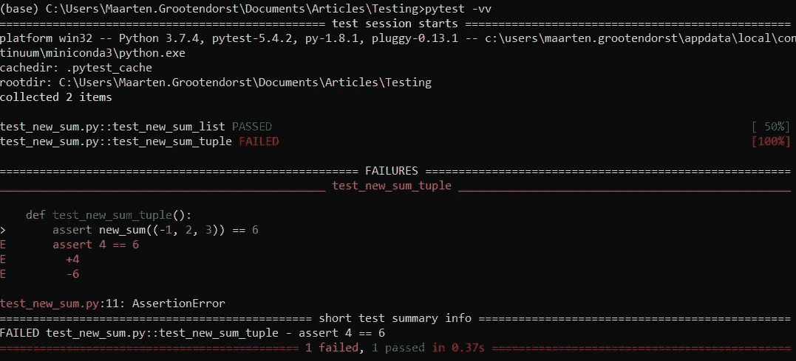
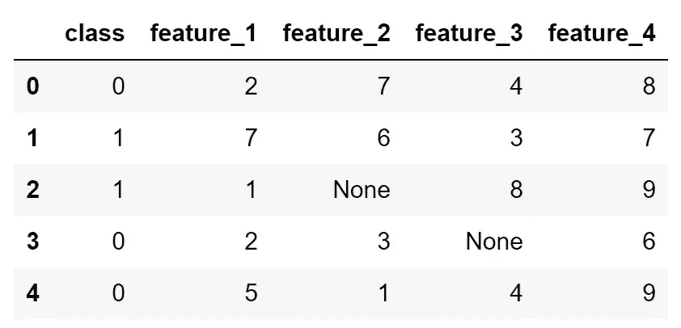
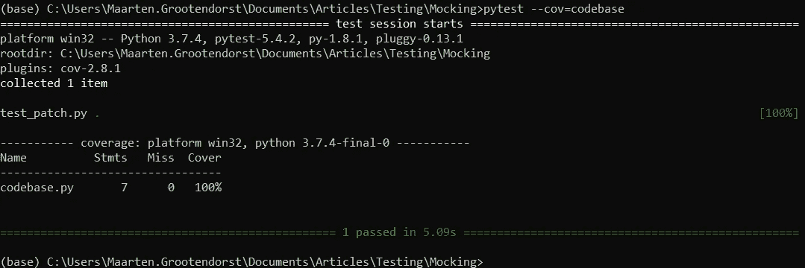

# 数据科学家的单元测试

> 原文：<https://towardsdatascience.com/unit-testing-for-data-scientists-dc5e0cd397fb?source=collection_archive---------6----------------------->

## 机器学习

## **使用 Pytest 提高管道的稳定性**


随着数据科学在大型组织中变得越来越重要，对代码进行适当的**测试的需求慢慢变得越来越集成到数据科学家的技能组合中。**

假设您正在创建一个预测组织中客户流失的渠道。在部署您的解决方案几个月后，有一些新的变量可能会提高它的性能。


不幸的是，在添加了那些变量之后，代码突然停止工作了！您不熟悉错误消息，并且您很难找到自己的错误。

这就是**测试**，特别是**单元测试**的用武之地！

为特定模块编写测试可以提高代码的稳定性，并使错误更容易被发现。尤其是在处理大型项目时，进行适当的测试是基本的需求。

> 没有某种形式的测试，任何数据解决方案都是不完整的

这篇文章将关注一个小的，但是非常重要的，也可以说是测试的基础，即**单元测试**。下面，我将详细讨论为什么测试是必要的，什么是单元测试，以及如何将它们集成到您的数据科学项目中。

# 1.你为什么要测试你的代码？

虽然这看起来是显而易见的，但实际上测试代码有很多原因:

*   防止意外输出
*   简化代码更新
*   提高开发代码的整体效率
*   有助于检测边缘情况
*   最重要的是**防止你将任何破损的代码投入生产！**

这只是我的一个想法！

即使对于那些编写产品代码的人，我也建议他们至少为代码中最重要的模块编写测试。

> 如果你运行一个深度学习管道，但在 3 个小时后，你本可以轻松测试的东西失败了，那该怎么办？


**注意**:我完全可以想象不想为只花了你两天时间编写的一次性分析编写专用测试。没关系。由你来决定什么时候测试是有帮助的。最重要的是要认识到，他们可以节省你很多工作。

# 2.单元测试

单元测试是一种软件测试方法，它检查哪些特定的单个代码单元适合使用。例如，如果您想在 python 中测试`sum`函数，您可以编写以下测试:

```
assert sum([1, 2, 3]) == 6
```

我们知道 1+2+3=6，所以应该没什么问题就通过了。

我们可以通过创建一个定制的 sum 函数来扩展这个例子，并对元组和列表进行测试:

当-1+2+3 不等于 6 时，`test_new_sum_tuple`的输出将是一个断言错误。


**单元测试**帮助你在许多不同的环境下测试代码。然而，有一件重要的事情**需要记住:**

> 单元测试并不完美，几乎不可能达到 100%的代码覆盖率

单元测试是捕捉 bug 的好方法，但是不会捕捉到所有的东西，因为测试容易出现与你要测试的代码相同的逻辑错误。

理想情况下，您会希望包括集成测试、代码审查、正式验证等。但是这超出了本文的范围。

# 3.Pytest

上面例子的问题是，它将在第一次面对`AssertionError`时停止运行。理想情况下，我们希望看到所有通过或失败的测试的概述。

这就是测试跑步者的用武之地，比如 [Pytest](https://github.com/pytest-dev/pytest) 。Pytest 是一个很好的工具，可以根据您定义的测试创建广泛的诊断。

我们从**安装 Pytest** 开始:

`pip install pytest`

这样做之后，创建一个`test_new_sum.py`文件，并用下面的代码填充它:

最后，将`cd`放入存放`test_new_sum.py`的文件夹，然后简单地运行`pytest -v`。结果应该是这样的:



你可以在上面的图片中看到，它显示了哪些测试通过了，哪些测试失败了。

令人惊奇的是 Pytest 向您展示了预期的值以及它失败的地方。这可以让你很快看到哪里出了问题！

# 4.数据科学家的单元测试

为了理解我们如何将 Pytest 用于数据科学解决方案，我将通过几个例子来说明。以下数据用于示例:



示例数据

在这些数据中，我们有一个目标类和几个可以用作预测器的特征。

## 基本用法

让我们从几个简单的预处理函数开始。我们想知道每个类的每个特征的平均值。为此，我们创建了以下基本函数，`aggregate_mean`:

太好了！我们放入一个数据框和列，它应该会产生一个字典，其中包含每个类的平均值。

为了测试这一点，我们编写了下面的`test_aggregate_mean.py`文件:

当我们运行`pytest -v`时，它应该不会给出错误！

## 用参数表示

> 使用参数化运行多个测试用例

如果我们想要测试许多不同的场景，那么创建一个测试的许多副本会很麻烦。为了防止这种情况，我们可以使用 Pytest 的参数化函数。

参数化通过允许我们测试**多个场景来扩展测试功能。**我们简单地添加参数化装饰器并陈述不同的场景。

例如，如果我们想测试功能 1 和 3 的 aggregate_mean 函数，我们采用如下代码:

运行`pytest -v`之后，特性 3 的结果似乎不是我们所期望的。原来，我们之前看到的 **None** 值其实是一个**字符串**！

如果我们没有进行测试，我们自己可能不会发现这个错误。

## 固定装置

> 用 Fixtures 防止单元测试中的重复代码

当创建这些测试用例时，我们通常希望在每个测试用例之前运行一些代码。我们创建**fixture**来为我们的测试建立基线代码，而不是在每个测试中重复相同的代码。

它们通常用于初始化数据库连接、加载数据或实例化类。

使用前面的例子，我们想把`load_data()`变成一个夹具。我们把它的名字改为`data()`，以便更好地代表这个夹具。然后，`@pytest.fixture(scope='module')`作为装饰器被添加到函数中。最后，我们将 fixture 作为参数添加到单元测试中:

如你所见，没有必要将`data()`设置为变量，因为它会自动调用并存储在输入参数中。

Fixtures 是增加可读性和减少测试函数中任何错误的好方法。

## 嘲弄的

> 我在你的管道中修改代码，通过模仿来加速测试

在许多数据驱动的解决方案中，您将需要处理大型文件，这会极大地降低您的管道速度。为这些代码创建测试是困难的，因为快速测试是首选。

假设您用`pd.read_csv`加载了一个 2GB 的 csv 文件，并且您想要测试管道的输出是否正确。有了 **unittest.mock.patch** ，我们可以用自己的输出替换`pd.read_csv`的输出，用更小的数据测试流水线。

假设您已经为管道创建了以下代码库:

现在，为了测试这个管道是否像预期的那样工作，我们想要使用一个更小的数据集，这样我们就可以更准确地测试用例。为此，我们用迄今为止一直使用的较小数据集来修补`pd.read_csv`:

当我们运行`pytest -v`时，大的。csv 将不被加载，取而代之的是我们的小数据集。测试运行迅速，我们可以很容易地测试新的情况！

## 新闻报道

> 你用单元测试覆盖了你的大部分代码吗？

单元测试无论如何都不是一个完美的方法，但是知道你测试了多少代码是非常有用的。特别是当你有复杂的管道时，知道你的测试是否覆盖了你的大部分代码是很好的。

为了检查这一点，我建议你安装 [Pytest-cov](https://github.com/pytest-dev/pytest-cov) ，它是 Pytest 的一个扩展，向你显示你的代码有多少被测试覆盖。

简单地安装 Pytest-cov，如下所示:

```
pip install pytest-cov
```

完成后，运行以下测试:

`pytest --cov=codebase`

这意味着我们正在运行 Pytest，并检查有多少测试覆盖了 codebase.py。



幸运的是，我们的测试覆盖了`codebase.py`中的所有代码！

如果我们注意到覆盖了任何行，那么该值将显示在`**Miss**` **下。**

# 感谢您的阅读！

如果你像我一样，对人工智能、数据科学或心理学充满热情，请随时在 [LinkedIn](https://www.linkedin.com/in/mgrootendorst/) 上添加我，或者在 [Twitter](https://twitter.com/MaartenGr) 上关注我。

本文中的所有示例和代码都可以在这里找到:

[](https://github.com/MaartenGr/UnitTesting) [## MaartenGr/单元测试

### 为数据驱动的解决方案创建单元测试的代码和说明相应的文章可以在这里找到:To…

github.com](https://github.com/MaartenGr/UnitTesting)