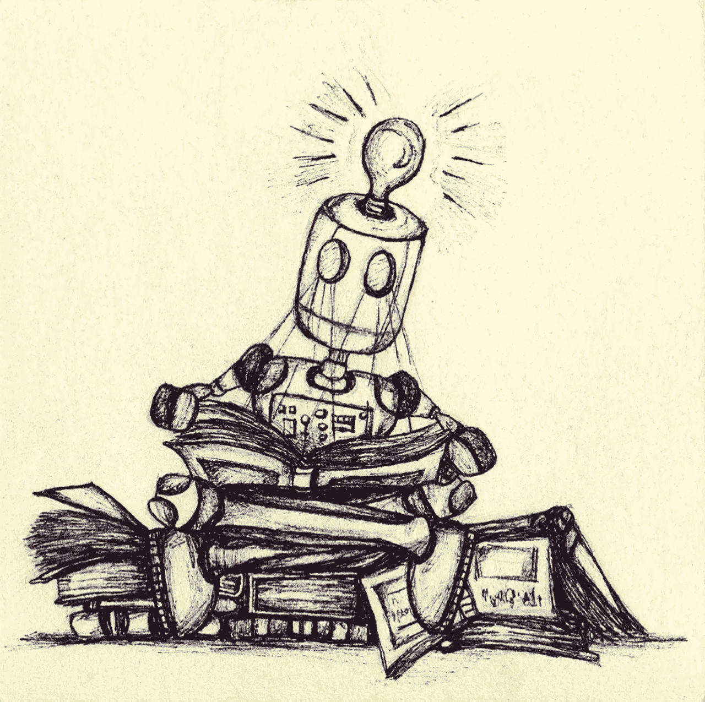
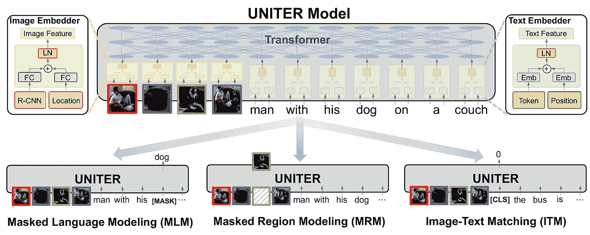
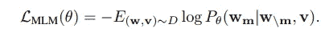
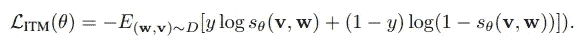
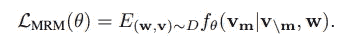
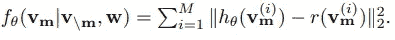
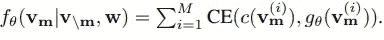
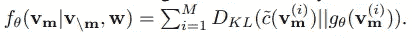

# 统一者:图像和文本的结合

> 原文：<https://towardsdatascience.com/uniter-d979e2d838f0?source=collection_archive---------21----------------------->

## 学习所有事物都可以使用的图像和文本的联合表示

图片由 Pixabay 的 Patricia Hébert 提供

多模态学习在我们的生活中无处不在。人类以不同的方式吸收内容，无论是通过图片(视觉)，文本，口头解释(音频)等等。这些知识来源中的每一个都被称为一种模式。事实上，我们经常通过这些模式的组合来学习，给每个人带来独特的学习体验。麦古尔效应——当看到一个人说话(嘎-嘎)但听到不同的声音(巴-巴)时，观察者会感知到第三种声音(哒-哒)——是不同模态相互作用的一个主要例子。受此启发，机器学习研究人员也开始编译数据集和任务，这些数据集和任务需要模型理解多种模式才能成功。

由于早期的多模态任务是受麦克格尔克效应的启发，其中许多只涉及音频和图像。随着时间的推移，任务模式的种类和数量变得更加多样化。如今，有些任务使用图像和文本(视觉问答、视觉常识推理、图像-文本检索)或图像、音频和文本(视频情感分析、CMU-摩西)。单峰任务已经得到了很好的探索，可以从每种模式中提取良好的表征。例如，GloVe 和 Word2Vec 等单词嵌入可用于生成文本嵌入，而 ResNet50 和 VGG16 等卷积神经网络通常用于从图像中提取特征。出现的挑战是组合和/或使用这些单峰特征来完成多峰任务。

组合这些特征提出了两个主要挑战:**如何**和**何时**融合它们。Baltrusaitis 等人确定了组合单峰特征的两种主要技术:联合表示(使用神经网络或一些其他体系结构将多种模态组合到同一表示空间中)和协调表示(使用一些度量，如余弦距离或相关性，使单峰表示更接近，同时仍然在不同的表示空间中)。这两种融合技术也可以在模型架构中的不同点发生:早期融合(在开始时组合特征，并让完整的模型架构处理组合的特征)或晚期融合(通过它们自己的架构运行各个模态，并在结束时组合它们)。

许多当代模型专注于学习适用于特定任务的好的多模态表示。结果，这些模型不能被推广到相同模态的稍微不同的使用。然而，为每个任务制作模型需要花费大量的时间和精力。在这项工作中，微软 Dynamics 365 AI Research 的 UNITER 模型专注于学习图像和文本的可推广联合嵌入。

统一模型架构(自顶向下)

UNITER 在大量数据上使用自我监督学习，如 BERT，以确保学习到的嵌入是通用的。该模型采用图像-文本对，并用来自 4 个不同数据集的大约 950 万对图像-文本对进行训练。

对于每一对，它首先提取文本特征(通过将单词位置信息与单词片段标记化的句子相结合)和图像区域特征(通过将更快的 R-CNN 特征与位置信息相结合)。一旦特征被提取出来，它们就要经过几层变换器，最终学习联合嵌入，

在联合嵌入的自我监督训练中使用了 3 个主要目标。对于这些任务，输入是( **w，v** )，其中 **v** 是输入图像区域， **w** 是成对文本，θ是可训练参数。

**蒙面语言建模(MLM)**

**MLM** 以 15%的概率用【屏蔽】令牌屏蔽输入文本的每个单词。目标是基于句子的其余部分和配对图像来预测被屏蔽的单词。这是通过最小化负对数似然来实现的，如下式所示。

MLM 目标

其中 **wm** 为屏蔽字， **w\m** 为包围字。

**图像文本匹配(ITM)**

对于 **ITM** ，一个额外的【CLS】标记被附加到输入文本的开头，并且很像伯特的【CLS】标记，它捕获输入文本的上下文，它捕获输入图像-文本对的联合上下文。这个令牌然后通过一个计分器 **sθ** 来测量图像和文本的匹配程度。因为每个输入对可以是正的或负的，所以使用二进制交叉熵损失来优化它。

ITM 目标

其中 **y** 对于负对为 0，对于正对为 1。

**掩蔽区域建模(MRM)**

**MRM** 类似于 **MLM** ，除了没有用[MASK]标记替换区域，而是用零填充。然而，图像特征是连续的，使得不可能最大化对数似然。因此，为了实现 **MRM** ，本文提出了符合以下一般等式的 3 个不同的目标函数。

MRM 目标

其中 **vm** 是被遮罩的图像区域，而 **v\m** 是周围区域。

1.*掩蔽区域特征回归*

*MRFR* 尝试将每个被掩蔽的图像区域的最终联合表示 **vm(i)** 与其预训练的图像嵌入相匹配，从而保留传递到模型中的信息。

MRFR 目标

其中 **hθ** 将联合图像嵌入转换为与输入图像嵌入相同的大小。

2.*掩蔽区域分类*

统一器试图将 **vm(i)** 识别为 *MRC* 中的对象类型。更快的 R-CNN 以一定概率预测每个区域是一类物体的概率。这被用作基础真实标签，并且预测的交叉熵损失被优化。

MRC 目标

其中 K 是由更快的 R-CNN 预测的对象类别的数量，gθ( **vm(i)** )将区域转换成 K 长向量，c( **vm(i)** )是真实标签的一个热点向量。

3.*利用 KL 散度的掩蔽区域分类(MRC-kl)*

*MRC-kl* 与 *MRC* 相同，只是使用了更快的 R-CNN 对每个对象类型的预测概率，而不是固定的标签(0 或 1)。使用 KL 散度损失而不是交叉熵来匹配所有概率，而不仅仅是地面真实类，如下所示。

MRC-kl 目标

其中 K 是由更快的 R-CNN 预测的对象类别的数量，gθ( **vm(i)** )将区域转换成 K 长向量，c( **vm(i)** )是更快的 R-CNN 的类别概率。

该团队尝试了这些预训练任务的几种组合，发现使用除 MRC 之外的所有任务可以产生最佳的嵌入效果。

最佳 UNITER 嵌入针对大量涉及图像和文本的下游任务进行了微调。这些任务中的一些是*视觉 QA* (回答关于图像的问题)*视觉推断*(确定图像是否包含一个句子)和*图像文本检索*(检索一个给定的另一个)。这些任务都在几个基准上进行了测试，UNITER 能够在 13 个不同的基准上实现最先进的性能，真正展示了 UNITER embedding 的通用性。

这里有一个[链接](https://arxiv.org/pdf/1909.11740.pdf)到我们的论文，如果你想了解更多关于 UNITER 的细节，点击[这里](http://aka.ms/mmai)查看更多我们的出版物和其他工作。

**参考文献**

1.  [塔达斯·巴尔特鲁·艾蒂斯](https://arxiv.org/search/cs?searchtype=author&query=Baltru%C5%A1aitis%2C+T)，[柴坦尼亚·阿胡贾](https://arxiv.org/search/cs?searchtype=author&query=Ahuja%2C+C)，[路易·菲利浦·莫伦西](https://arxiv.org/search/cs?searchtype=author&query=Morency%2C+L)，**多模态机器学习:综述与分类** (2018)，IEEE 模式分析与机器智能汇刊 41，第 2 期 PP:423–443。
2.  [日元-陈春](https://arxiv.org/search/cs?searchtype=author&query=Chen%2C+Y)、[李林杰](https://arxiv.org/search/cs?searchtype=author&query=Li%2C+L)、[李成玉](https://arxiv.org/search/cs?searchtype=author&query=Yu%2C+L)、[艾哈迈德·埃尔·科利](https://arxiv.org/search/cs?searchtype=author&query=Kholy%2C+A+E)、[费萨尔·艾哈迈德](https://arxiv.org/search/cs?searchtype=author&query=Ahmed%2C+F)、[哲干](https://arxiv.org/search/cs?searchtype=author&query=Gan%2C+Z)、[于成](https://arxiv.org/search/cs?searchtype=author&query=Cheng%2C+Y)、[刘晶晶](https://arxiv.org/search/cs?searchtype=author&query=Liu%2C+J)、**统一者:学习普遍的图像-文字表述** (2019)、arXiv 预印本 arXiv:1909