# Unity-ML 特工:玛雅冒险

> 原文：<https://towardsdatascience.com/unity-ml-agents-the-mayan-adventure-2e15510d653b?source=collection_archive---------14----------------------->

## [Unity-ML 代理课程](http://www.simoninithomas.com/unitymlagentscourse/)

## 训练一个特工在这种危险的环境下拿到金像。

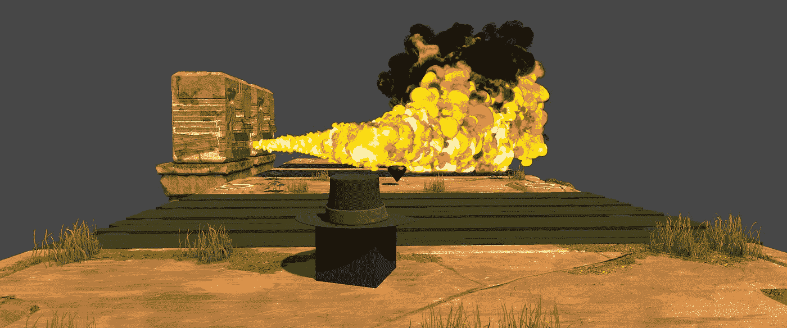

*本文是* [的第三章*全新免费课程关于深度强化学习与合一。*](http://www.simoninithomas.com/unitymlagentscourse) *我们将创建使用 Unity 游戏引擎🕹.学习玩视频游戏的代理查看教学大纲* [*此处*](http://www.simoninithomas.com/unitymlagentscourse/) *。*

*如果之前没有学习过深度强化学习，需要查看免费课程*[*tensor flow 深度强化学习。*](https://simoninithomas.github.io/Deep_reinforcement_learning_Course/)

在前两篇文章中，您学习了使用 ML-agent，并培训了两个 agent。第一个是[能够翻墙](/an-introduction-to-unity-ml-agents-6238452fcf4c)，第二个[学会摧毁金字塔以获得金砖](/diving-deeper-into-unity-ml-agents-e1667f869dc3)。是时候做些更难的事情了。

当我在考虑创建一个自定义环境时，我想起了印第安纳·琼斯中的一个著名场景，Indy 需要获得金像并避免大量的陷阱才能生存。

我在想:我的经纪人能像他一样好吗？**剧透警告:的确是，正如你在这个回放视频中看到的！**

这就是为什么在过去的两周里，我在 [Unity](https://unity.com/) 中开发了一个名为 Mayan Adventure 的开源强化学习环境。充满陷阱的危险模块化环境。为了训练代理人，我使用了一种叫做课程学习的学习策略。

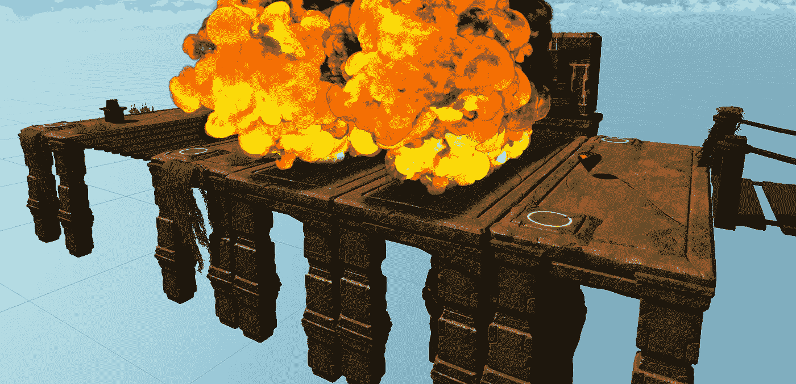

所以今天，你将学习**课程学习，**你将训练我们的代理人获得**金像并击败游戏**。

所以让我们开始吧！

# **介绍玛雅冒险**

## Hello Indie


正如我所说，玛雅冒险是一个针对 ML-agent 的开源强化学习环境。

在这种环境下，你训练你的代理人(Indie) **击败每一个危险的陷阱，得到金像。**


在学习过程中，我们的代理人启动**以避免掉下地面**并获得金像。**随着他变得越来越好，我们增加了一些难度**，感谢两个压力按钮，你的代理可以将自己变成岩石或木头。

他需要把自己变成木头才能通过木桥，否则，桥就会倒塌。

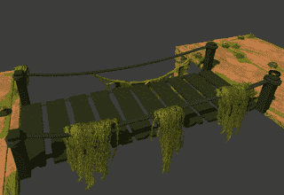

然后撞上一块岩石穿过火层。

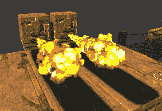

奖励制度是:


在观察方面，我们的代理**没有使用计算机视觉，而是使用光线感知张量**。可以把它们想象成激光，如果它穿过一个物体，它就会探测出来。

**我们用了其中的两个**探测安全平台，去岩钮、去木钮、火、木桥、球门和宝石。第二条射线也能探测到空洞(为了训练我们的特工避免从环境中掉下来)。

**此外，我们添加了 3 个观察值**:一个布尔型通知代理是否是岩石，以及代理的 x 和 z 速度。

动作空间是离散的，具有:


## 引擎盖背后:是怎么做到的？

玛雅人的冒险始于这个原型版本。

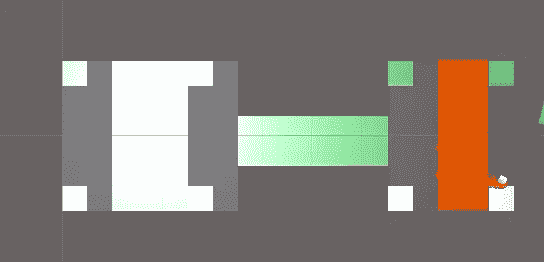

原型

但这并不吸引人，为了创造环境，我们使用了不同的免费软件包:

*   [3D 游戏套件](https://assetstore.unity.com/packages/templates/tutorials/3d-game-kit-115747):Unity 创造的梦幻环境，我使用了他们的岩石平台、按钮、植被和柱子元素。
*   [Unity 粒子包](https://assetstore.unity.com/packages/essentials/tutorial-projects/unity-particle-pack-127325):我用它做消防系统。
*   [创作工具包:拼图](https://assetstore.unity.com/packages/templates/tutorials/creator-kit-puzzle-149311):我只用它来做 win 粒子烟火。
*   其他元素，木桥，动画，石头头，金像，软呢帽等**都是在 Blender 中制作的。**


我把这个项目设计得尽可能模块化。这意味着你将能够创造新的水平和新的障碍。此外，这仍然是一项进行中的工作，它意味着**将进行纠正和改进，并将达到新的水平。**

为了帮助我在代码方面创建环境，我在 Unity Learn 上学习了 Immersive Limit 制作的非常好的[课程。](https://www.immersivelimit.com/tutorials/unity-ml-agents-penguins)

> 你现在可能会问的问题是**我们将如何培训这个代理？**

# 让我们训练独立音乐

为了培训 Indie，我们将使用 PPO 和课程学习策略。如果你不知道什么是 PPO，[可以查看我的文章](/proximal-policy-optimization-ppo-with-sonic-the-hedgehog-2-and-3-c9c21dbed5e)。

## 什么是课程学习？

课程学习是一种**强化学习技术，可以在代理需要学习复杂任务时更好地训练它。**

假设你 6 岁，我对你说我们要开始学习多元微积分。然后你会不知所措，无法做到。因为这对开始来说太难了:**你会失败的。**

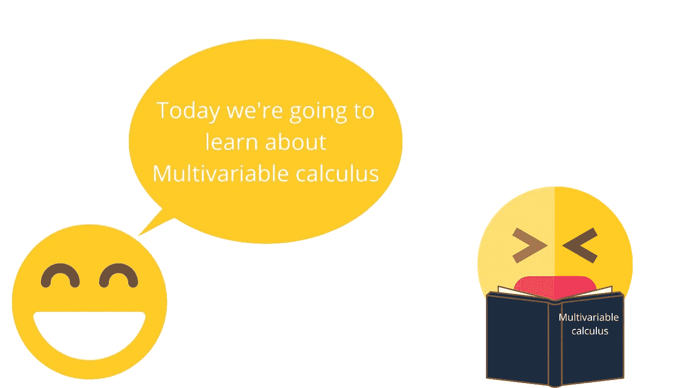

一个更好的策略是先学习简单的数学，然后随着你对基础知识的掌握越来越好，再增加复杂性，最终能够完成这门高级课程。

所以你从算术课开始，当你很好的时候，你继续上代数课，然后是复代数课，然后是微积分课，最后是多变量微积分课。多亏了这个策略，你将能够在多变量微积分中取得成功。

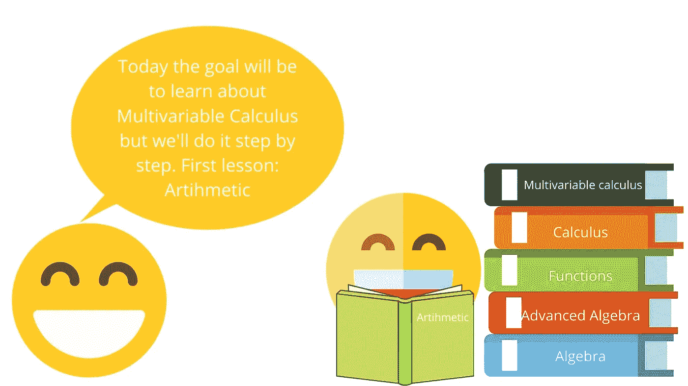

这也是我们用来训练特工的策略。我们不是一次给我们的代理整个环境，而是随着他变得更好，通过增加难度来训练它。

为了在 ML-Agents 中做到这一点，我们需要**指定我们的课程:**一个 YAML 配置文件，它将根据一些度量(平均累积奖励)指定何时改变环境参数(在我们的例子中，增加级别)。**将本课程视为我们的代理需要遵循的教学大纲。**

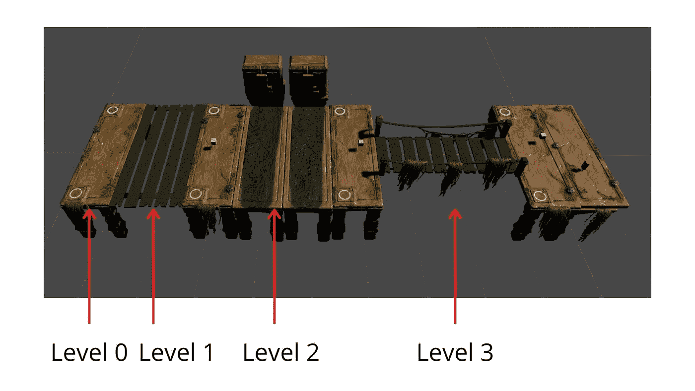

课程是这样的:

*   第一关，代理人需要**学会拿到金像**，避免掉下平台。
*   然后，在第二关中，代理需要**与物理按钮**进行交互，并将自己变成木头，以通过这座大木桥。
*   在第三关，为了穿越这团火，代理人需要把自己变成岩石。
*   最后，在最后一关，代理人需要**学会将自己变成木头，并通过一个更窄的桥**而不会从桥上掉下来。

## 我们去拿这个金像吧！

*你需要从* [*GitHub 库*](https://github.com/simoninithomas/the_mayan_adventure) *下载项目，按照 doc* *中定义的安装* [*流程进行。*](https://github.com/simoninithomas/the_mayan_adventure)

*如果不想训练金像，训练好的模型都在* [*Unity 项目*](https://github.com/simoninithomas/the_mayan_adventure) *文件夹中的“玛雅冒险拯救模型”。*

现在我们了解了玛雅冒险环境和课程学习是如何工作的，让我们来训练我们的代理人来打败这个游戏。

代码分为两个主要脚本:

*   *mayanadventurea。cs:控制关卡生成、代理和目标产卵。*
*   *mayanadventurent . cs*:它控制代理的移动，处理事件(当你在石头上和在木桥上时会发生什么等等)，以及奖励系统。

首先，我们需要**定义我们的课程，**

为此，您需要转到您的 *ML-Agents 文件夹/config/courses*文件夹，创建一个名为 *mayanAdventure* 的新文件夹，并在其中创建您的*mayanadventurelearning . YAML*文件。

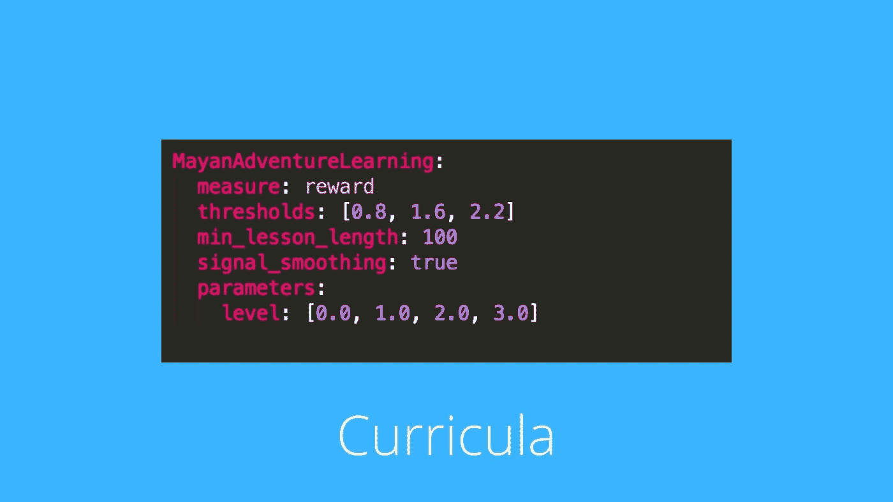

*   我们将用来衡量代理商的*进度*的关键指标是**奖励。**
*   然后，在*阈值*部分，**我们定义进入下一个级别**的平均奖励。例如，要达到第 1 级，我们的代理需要有 0.1 的平均累积奖励
*   *min_lesson_length* 指定代理在改变等级**之前必须完成的最少剧集数。这有助于我们避免我们的代理人在一集里运气好而改变级别太快的风险。**
*   最后，我们定义*参数*，这里是**级别号。**

现在我们已经定义了我们的课程，**我们可以配置我们的代理。我们的代理是一个预置的实例。因此，为了一次修改全部**我们将直接修改预设。****

在预设 *MayanAdventureArea* 中，你需要检查训练是真的。我们创建这个 bool 是为了**区分训练阶段和测试阶段**，在测试阶段我们添加了一些事件，比如激活获胜面板、木桥摧毁动画以及当你获胜时展示烟火。

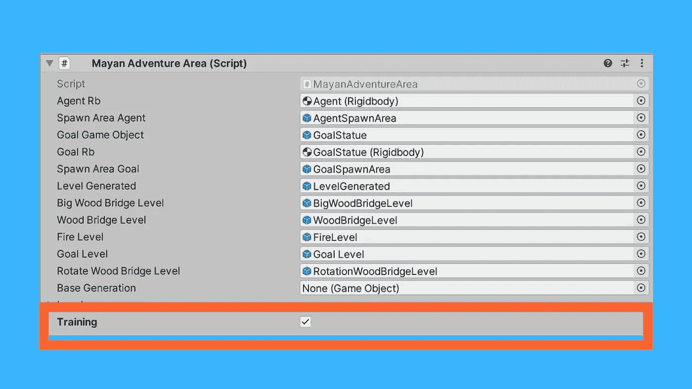

然后在预置中转到*代理*，先在*行为参数*中，如果有，移除模型。

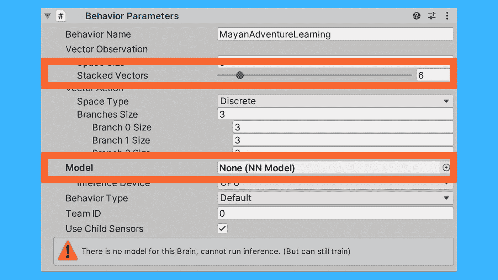

之后，你需要**来定义观察堆栈向量。**这将**取决于您是否使用循环存储器**(将在教练配置中定义)如果不使用，**您应该堆叠 4 到 6 帧。如果有，只有 3 个**。


重要的是，矢量观察和光线感知观察**具有相同的堆栈编号。**

现在我们可以定义超参数。这是我写的给我最好结果的配置。

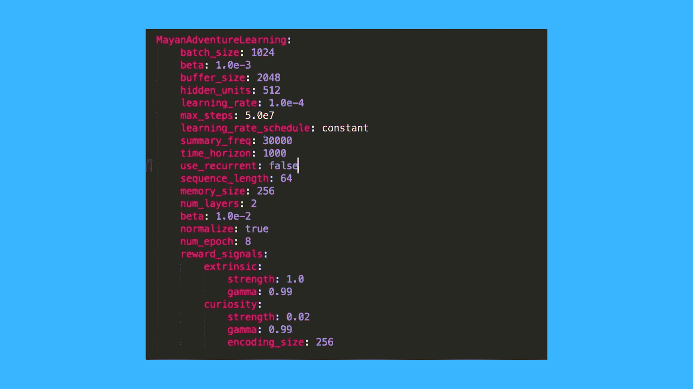

最后**不要忘记关闭主摄像头**，这里只是为了回放的目的。

我们现在**准备训练。**您需要打开您的终端，进入 ml-agents-master 所在的位置，键入以下内容:

```
mlagents-learn ./config/trainer_config.yaml --curriculum=config/curricula/mayanAdventure/MayanAdventureLearning.yaml --run-id TheMayanAdventure_beta_train --train
```

在这里，我们定义了:

*   其中培训师 _ 配置为:*。/config/trainer_config.yaml*
*   我们的课程:—课程=配置/课程/mayanAdventure/mayanadventurelearning . YAML
*   此培训的 id:—run-id themayandventure _ beta _ train
*   别忘了火车旗。

它会要求你运行 Unity 场景，

按下编辑器顶部的▶️按钮。

您可以使用以下命令启动 Tensorboard 来监控您的训练:

```
tensorboard — logdir=summaries
```

## 我的结果

在获得好的结果之前，我已经进行了大约 **20 次训练，以便找到一组好的超参数。**

我给你两个训练有素的保存模型，第一个有循环记忆，另一个没有。培训花了我大约 2 个小时，在 30 个**并行环境中，只有一个 MacBook Pro 英特尔酷睿 i5 处理器。**

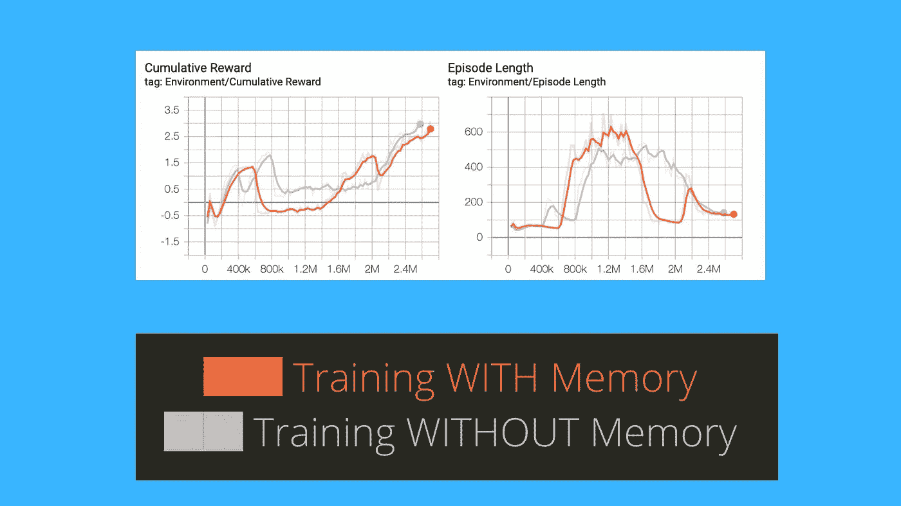

我们看到两个代理人**有着完全相同的结果**，没有记忆的训练要好得多。**这是我用来录像的。**

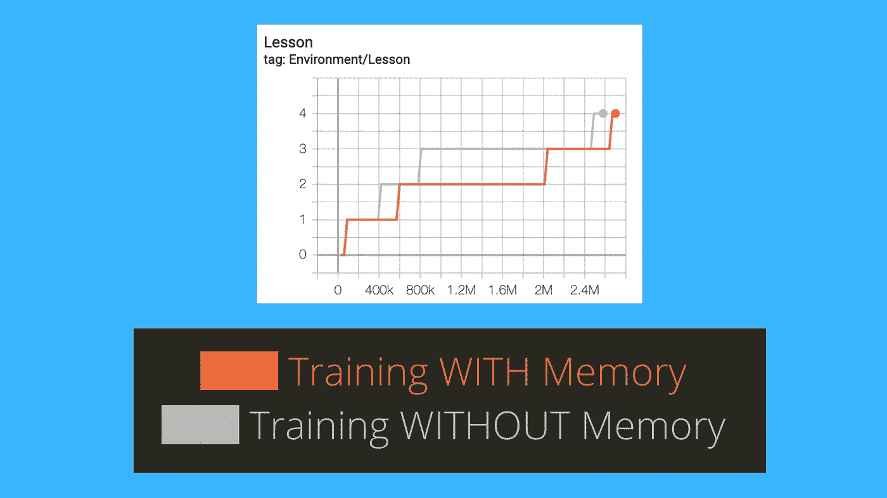

# 重播

既然你已经训练了特工。您需要将包含在*ml-agents-master/Models*中的保存模型文件移动到 Unity 项目的*Mayan Adventure 保存模型*中。

然后，您需要停用除 MayanAdventureArea (1)之外的 *MayanAdventureArea 的所有实例。*

事实上，正如我们在经典的深度强化学习中所做的那样，当我们启动一个游戏的多个实例(例如 128 个并行环境)时，我们在此复制并粘贴代理，以便有更多不同的状态。但是重播的时候我们只需要一个。

还有**别忘了激活主摄像头。**


现在，你需要回到**mayanadventurea 预设并取消选择 Training。**

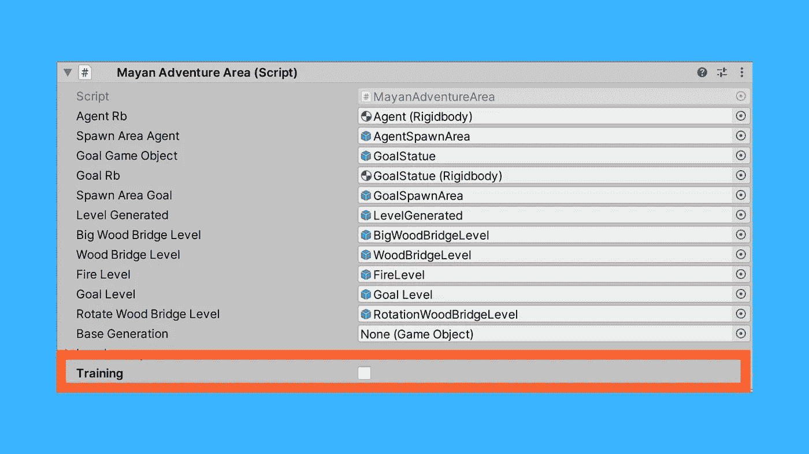

最后在代理*行为参数*中，拖动模型文件到模型占位符。

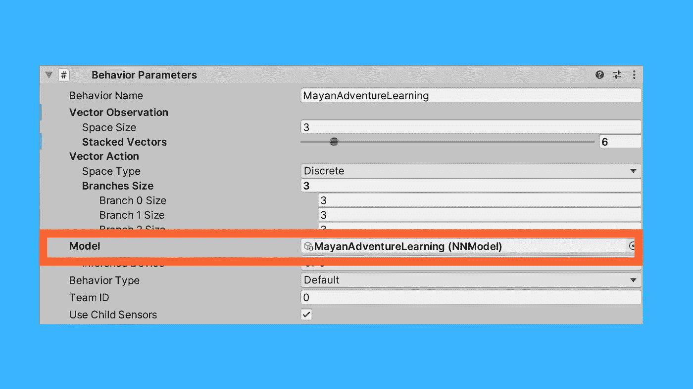

然后，按下编辑器顶部的▶️按钮，瞧！

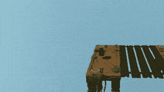

如果你想记录你的结果，你只需要进入窗口>常规>记录器>记录器窗口，点击开始记录这些参数:

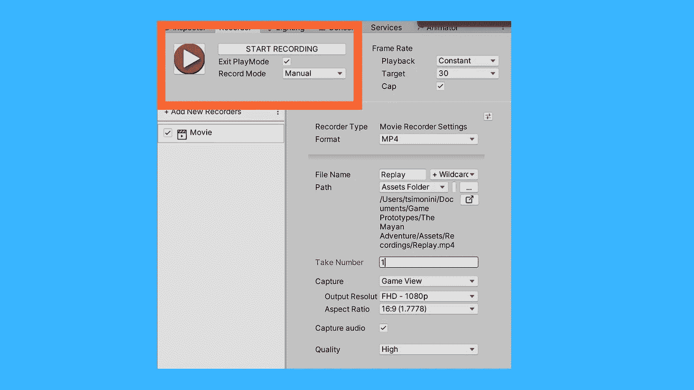

# 接下来的步骤

玛雅冒险**是一个进行中的项目**，它意味着修正和改进将会完成，新的水平将会出现。下面是我们将要采取的一些后续步骤。

## 光线投射可能不够:我们需要给他视觉能力

我们在培训中发现，我们的代理很优秀，但有些挑战绝对需要远见。

vision 的“问题”是它会以指数方式增加国家的规模。意味着下一个版本只会在 GPU 上训练，而不是 CPU。

这个想法可能是像 Unity 的 Gridworld 例子中一样，有一个环境的正交上视图作为输入。


来源: [ML-Agents 文档](https://github.com/Unity-Technologies/ml-agents/blob/master/docs/Learning-Environment-Examples.md)

## 行上的新级别和定时事件

因为玛雅环境是一个 RL 研究环境，所以我们想增加更复杂的关卡来训练我们的代理学习长期策略。

因此，除了视觉版本的工作，**我们目前正在增加更复杂的水平。**如滚球陷阱。

而且**还有一些定时事件，比如每 3 秒开关一次火候。**

## 增加了级别生成的随机性

目前，我们的生成器总是输出相同的级别顺序。我们希望通过在关卡生成过程中增加一些随机性来改善这一点。

今天到此为止，

你刚刚训练了独立游戏**，击败了所有的陷阱，到达了金像。你也学到了课程学习。**太牛逼了！

既然我们有了好的结果，我们可以尝试一些实验。记住，最好的学习方法是通过实验变得活跃。所以你要试着做一些假设，并验证它们。

下次见！

如果你有任何想法，评论，问题，欢迎在下面评论或者发邮件给我:hello@simoninithomas.com，或者发微博给我。

不断学习，保持牛逼！