# 单变量和多变量高斯分布:直观清晰的理解

> 原文：<https://towardsdatascience.com/univariate-and-multivariate-gaussian-distribution-clear-understanding-with-visuals-5b85e53ea76?source=collection_archive---------11----------------------->

约书亚·富勒在 [Unsplash](https://unsplash.com?utm_source=medium&utm_medium=referral) 上拍摄的照片

## 详细的高斯分布及其与均值、标准差和方差的关系

高斯分布是统计学中最重要的概率分布，在机器学习中也很重要。因为许多自然现象，如人口的身高、血压、鞋码、考试成绩等教育指标，以及自然界许多更重要的方面，都倾向于遵循高斯分布。

我敢肯定，你听说过这个术语，在某种程度上也知道它。如果没有，不要担心。这篇文章会解释清楚。我在 Coursera 的[吴恩达教授的机器学习课程中发现了一些令人惊叹的视觉效果。他知道如何把一个话题分成小块，让它变得更简单，并详细解释它。](https://www.coursera.org/learn/machine-learning)

他使用了一些视觉效果，使得理解高斯分布及其与均值、标准差和方差等相关参数的关系变得非常容易。

在这篇文章中，我从他的课程中截取了一些图像，并在这里用来详细解释高斯分布。

# 高斯分布

高斯分布是正态分布的同义词。它们是一回事。比方说，S 是一组随机值，其概率分布如下图所示。

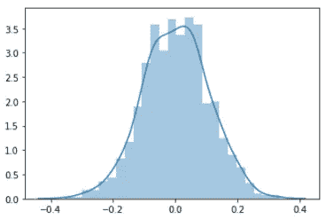

这是一条钟形曲线。如果概率分布图形成一个钟形曲线，如上图所示，并且样本的均值、中值和众数相同，则该分布称为**正态分布**或**高斯分布**。

高斯分布由两个参数参数化:

a.平均和

b.方差

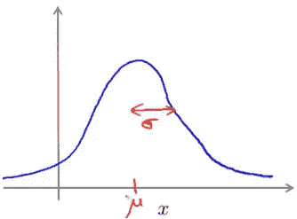

> 平均值μ是分布的中心，曲线的宽度是数据系列的标准差，表示为 sigma。

因此，高斯密度在μ点或均值点最高，从均值开始，高斯密度越来越低。

以下是高斯分布的公式:

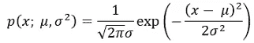

**该等式的左侧读作由 mu 和 sigma 平方参数化的 x 的概率。**这是钟形曲线的公式，其中 sigma 平方称为方差。

# 高斯分布如何与“均值”和标准差相关

在本节中，我将展示一些图片，让您清楚地了解 mu 和 sigma 与钟形曲线的关系。我将展示三张图片，其中 mu 将固定在零，sigma 将有所不同。

注意曲线的形状和范围是如何随着不同的σ而变化的。

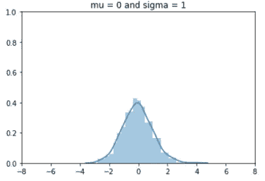

图:1

这是一组 mu 等于 0，sigma 为 1 的随机数的概率分布。

在此图中，μ为 0，这意味着最高概率密度约为 0，sigma 为 1。表示曲线的**宽度为 1。**

注意，曲线的高度大约是 0.5，范围是-4 到 4(看 x 轴)。方差 sigma 平方为 1。

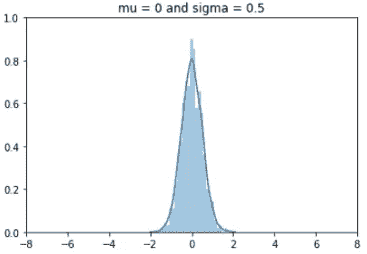

图:2

这是另一组随机数，阿木为 0，sigma 为 0.5。

因为 mu 是 0，像前面的图一样，最高概率密度在 0 左右，sigma 是 0.5。所以，**曲线的宽度为 0.5** 。**方差西格玛平方变为 0.25。**

> 由于曲线的宽度是前面曲线的一半，高度变成了两倍。范围更改为-2 到 2 (x 轴),是上一张图片的一半。

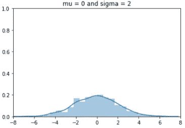

图:3

在这张图中，与前两张图一样，σ为 2，μ为 0。

将其与图 1 进行比较，图 1 中 sigma 为 1。**这次高度变成了图 1 的一半。**因为宽度随着西格玛的加倍而加倍。

**方差 sigma 平方是 4** ，比图 1 大四倍。**看 x 轴的范围，是-8 到 8。**

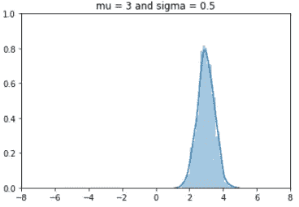

图:4

这个例子和前面的三个例子有点不同。

这里，我们将 mu 改为 3，sigma 为 0.5，如图 2 所示。因此，曲线的形状与图 2 完全相同，但**中心移到了 3** 。现在最高密度在 3 左右。

看看上面的四条曲线。它随着σ值的不同而改变形状，但曲线的面积保持不变。

> 概率分布的一个重要性质是，曲线下的面积积分为 1。

# 参数估计

假设，我们有一系列数据。如何估计 mu(均值)、sigma(标准差)和 sigma 平方(方差)？

计算 mu 很简单。简直就是一般。将所有数据求和，然后除以数据总数。

这里，xi 是数据集中的单个值，m 是数据的总数。

方差(sigma square)的公式为:

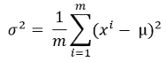

标准差σ就是方差的平方根。

# 多元高斯分布

如果我们有两组数据，而不是一组数据，我们需要一个多元高斯分布。假设我们有两组数据；x1 和 x2。

分别对 p(x1)和 p(x2)建模可能不是理解这两个数据集的组合效果的好主意。在这种情况下，您可能希望仅组合数据集和模型 p(x)。

下面是计算多元高斯分布概率的公式，

> 这个等式中的求和符号可能会引起混淆！它是 sigma 的[行列式，实际上是 sigma 的 n×n 矩阵。](https://en.wikipedia.org/wiki/Determinant)

# 多元高斯分布的可视化表示

在本节中，我们将看到多元高斯分布的直观表示，以及曲线形状如何随μ、σ和变量之间的相关性而变化。

> ***以标准正态分布开始***

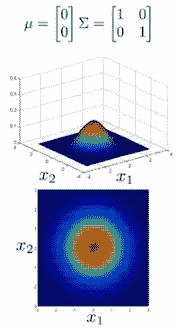

该图表示多元高斯分布的概率分布，其中 x1 和 x2 的μ都为零。

请不要被这里的**求和符号**搞糊涂了。这是一个包含 sigma 值作为对角线的单位矩阵。对角线上的 1 是 x1 和 x2 的σ。对角线外的零表示 x1 和 x2 之间的**相关性**。因此，在这种情况下，x1 和 x2 不相关。

这里的图片很简单。在 x1 和 x2 方向上，最高概率密度为 0，因为 mu 为零。

中间的暗红色区域显示最高概率密度区域。在较浅的红色、黄色、绿色和青色区域，概率密度不断降低。它是深蓝色区域中最低的。

> **改变标准偏差适马**

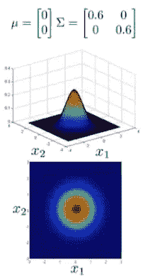

图 5

现在，让我们看看如果 sigma 值稍微缩小会发生什么。x1 和 x2 都是 0.6。

正如我之前提到的，曲线下的面积必须积分为 1。因此，当标准差σ缩小时，范围也会缩小。同时，曲线的高度变高以调整面积。

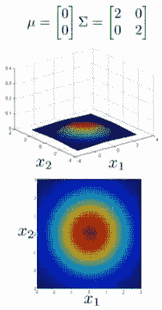

图 6

相反，当σ较大时，可变性变得更宽。所以，曲线的高度变低了。

请看图 6，曲线高度和范围的变化几乎与我之前在单变量高斯分布中展示的图相似。

**x1 和 x2 的西格玛值不会总是相同的。我们来查几个这样的案例。**

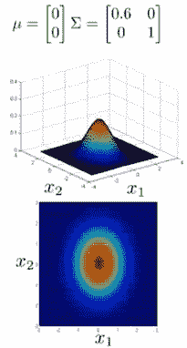

图 7

在图 7 中，x1 的σ为 0.6，x2 的σ为 1。

所以，这个范围看起来像日蚀。x1 缩小了，因为 sigma 的标准差 sigma 现在变小了。

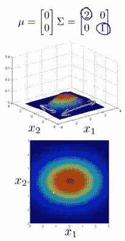

图 8

在图 8 中，它与上一张图相反。

x1 的σ是 x2 的σ的两倍。

x1 这次音域宽多了！所以日蚀改变了方向。

**改变变量之间的相关系数**

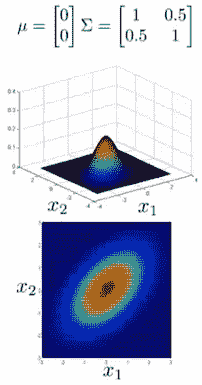

图 9

这是一个完全不同的场景。在图 9 中，非对角线值不再为零。是 0.5。它显示 x1 和 x2 的相关系数为 0.5。

日食现在有一个对角线方向。x1 和 x2 一起增长，因为它们正相关。

当 x1 大时，x2 也大，当 x1 小时，x2 也小。

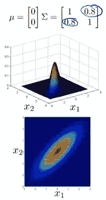

图 10

图 10 中，x1 和 x2 的相关性更大，0.8！

所以月食更陡！

所有的概率都在一个狭窄的区域内。分布也显得又高又瘦。

在上面的所有图片中，x1 和 x2 之间的相关性要么是正的，要么是零。让我们看一个负相关的例子。

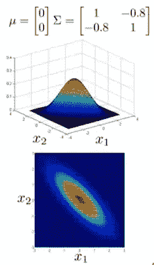

图 11

在图 11 中，x1 和 x2 之间的相关性为-0.8。

你可以看到概率又在一个很窄的范围内。但是当 x1 较大时，x2 较小，当 x1 较小时，x2 较大。

**最后，我们应该检查一些不同的平均值(mu)**

我们保持 mu 的值始终为 0。让我们看看不同管理部门的变化情况。

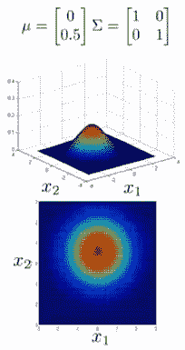

图 12

在图 12 中，x1 的μ为 0，x2 的μ为 0.5。

看图中的范围。现在 x2 的曲线中心从零开始移动。

中心位置或者最高概率分布区域现在应该在 0.5。

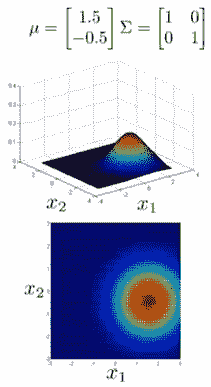

图 13

在图 13 中，x1 的 mu 为 1.5，x2 为-0.5。

x1 方向上最大概率的中心是 1.5。同时，对于 x2 方向，概率最高的中心为-0.5。

总的来说，整个曲线发生了变化。

# 结论

我希望这篇文章有助于清楚地理解高斯分布及其特征。我试图展示和解释不同参数的曲线之间的关系。希望，当你在统计学或机器学习中使用高斯分布时，现在会容易得多。

欢迎在[推特](https://twitter.com/rashida048)上关注我，并喜欢我的[脸书](https://www.facebook.com/rashida.smith.161)页面。

# 更多阅读:

 [## 熊猫时间序列分析终极指南

### 在 Pandas 中执行时间序列分析所需的所有 Pandas 功能。您也可以将此用作备忘单。

towardsdatascience.com](/an-ultimate-guide-to-time-series-analysis-in-pandas-76a0433621f3)  [## 熊猫数据可视化的终极备忘单

### 熊猫的所有基本视觉类型和一些非常高级的视觉…

towardsdatascience.com](/an-ultimate-cheat-sheet-for-data-visualization-in-pandas-4010e1b16b5c)  [## Python 中从头开始的完整逻辑回归算法:一步一步

### 使用真实世界的数据集开发算法

towardsdatascience.com](/a-complete-logistic-regression-algorithm-from-scratch-in-python-step-by-step-ce33eae7d703)  [## 描述统计学导论

### 对最基本和广泛使用的描述性统计方法有清晰和详细的理解

towardsdatascience.com](/introduction-to-the-descriptive-statistics-a050b5ec99fb)  [## 学习机器学习和深度学习的优质免费课程

### 顶级大学高质量免费课程的链接

towardsdatascience.com](/great-quality-free-courses-to-learn-machine-learning-and-deep-learning-1029048fd0fc)  [## 数据科学家使用 Python 进行假设检验的完整指南

### 用样本研究问题、解决步骤和完整代码清楚地解释

towardsdatascience.com](/a-complete-guide-to-hypothesis-testing-for-data-scientists-using-python-69f670e6779e)